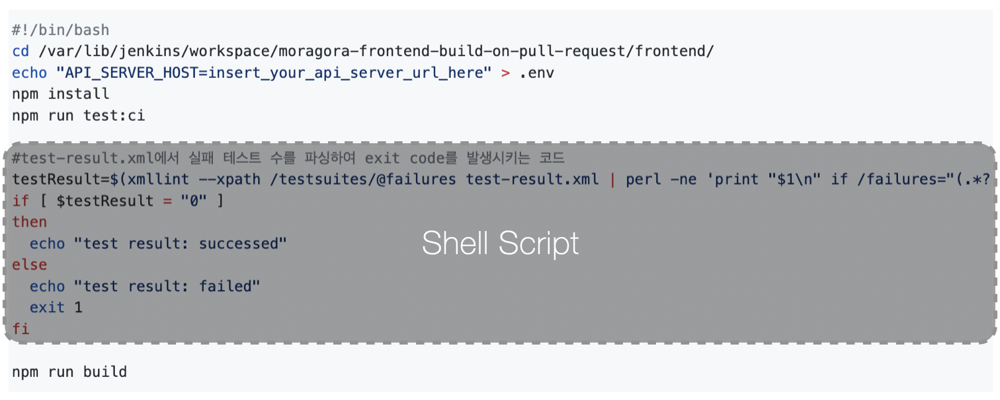
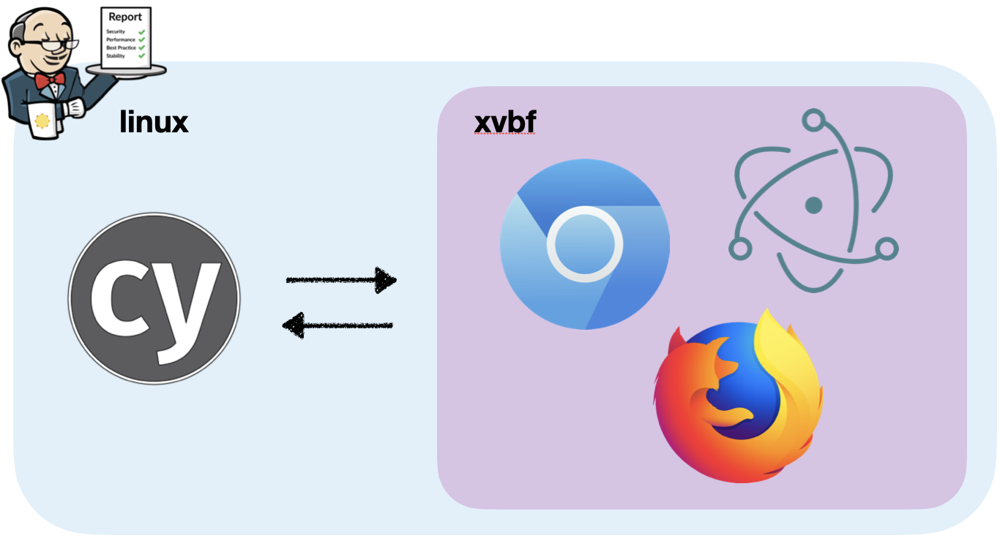
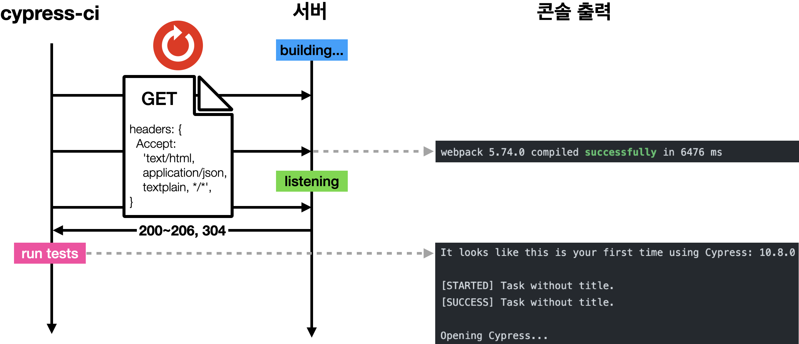
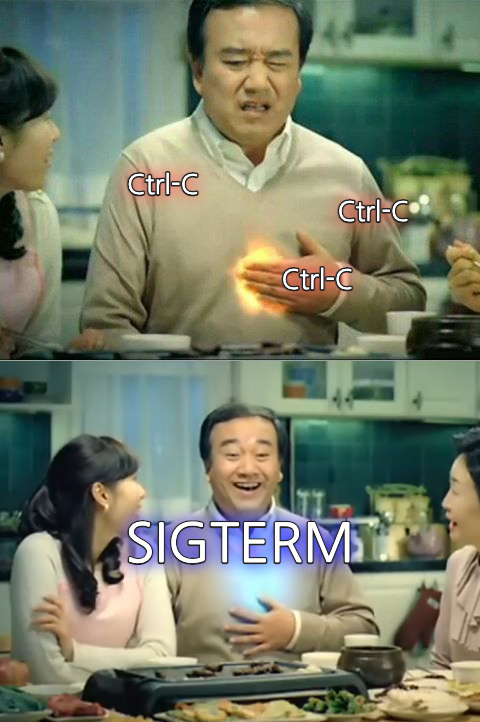

[cypress-ci](https://github.com/greenblues1190/cypress-ci)는 Cypress 테스트 자동화 라이브러리로, CI Provider에서 서버 실행과 테스트 실행을 자동화하기 위한 여러가지 기능을 지원하고 있습니다.

## 개발 배경

체크메이트 팀에서는 Jenkins와 Cypress로 빌드 전 E2E 테스트를 하고 있습니다. 그러나 기존 테스트 자동화 코드가 Shell Script로 짜여져 있어 Cypress의 모듈 API를 사용할 수 없어 멀티 리포트를 직접 구현하기 위해 라이브러리를 개발하게 되었습니다.

<figure>
  
  <figcaption>
    기존 스크립트
  </figcaption>
</figure>

## 요구사항

라이브러리 개발 시 다음과 같은 요구사항이 있었습니다.

- Node.js, TypeScript로 개발
- 기존 Jenkins 머신에 빠른 적용을 위한 non-docker 셋업
- 기존 Cypress configuration 파일을 읽어와 필요한 부분만 확장하여 적용할 수 있어야 함
- 서버 시작 후 통신 가능한 상태가 되면 테스트 실행
- 테스트 실패 혹은 에러 발생 시 빌드 실패 판정
- 멀티 리포트 (콘솔 출력 + 파일 출력)
- Graceful shutdown

## non-docker 셋업

Cypress는 headless 브라우저 테스트를 지원합니다. Headless 브라우저란 GUI 없이 백그라운드에서 실행되는 브라우저를 말합니다. CI에서는 렌더링을 하지 않아 얻는 성능상의 이점, 머신의 gpu 미지원 등의 이유로 headless 테스트가 필수적입니다.

<figure>
  
  <figcaption>
    Headless 브라우저 테스트
  </figcaption>
</figure>

Cypress는 headless 브라우저 테스트를 위해 여러가지 의존성을 요구합니다. 그 중 하나로 가상 메모리에서 그래픽 작업을 수행하는 in-memory 디스플레이 서버인 [xvfb](https://www.x.org/releases/X11R7.6/doc/man/man1/Xvfb.1.xhtml)가 있습니다. Cypress는 Cypress, OS, 브라우저 별 docker 이미지를 지원하지만 이를 사용하지 않는 경우 [공식 문서](https://docs.cypress.io/guides/continuous-integration/introduction.html#Dependencies)에서 필요로 하는 의존성을 설치할 수 있게 스크립트를 제공하고 있습니다.

## 기존 Cypress configuration 파일 사용

Cypress는 configuration 파일 확장자로 json(구버전에서 사용), js, ts을 지원합니다. 체크메이트 프론트엔드는 타입스크립트로 개발하고 있어 ts 파일로 설정 파일을 관리하고 있습니다. 그런데 빌드된 js 파일에서는 ts 파일을 불러올 수 없었습니다. 이를 위해 [ts-import](https://github.com/radarsu/ts-import) 라이브러리를 사용했습니다. ts-import는 `node_modules` 내 자신의 캐시 디렉토리에 트랜스파일한 js를 저장하여 js에서 ts를 import할 수 있게 합니다.

## Polling

처음에는 서버와 테스트 모두 동시에 시작하여 `Promise.race`를 통해 관리하는 방법을 사용했습니다. 하지만 서버와 Cypress의 콘솔 출력이 섞이고 서버 실행이 늦어지면 Cypress의 테스트가 timeout되는 문제가 있었습니다. 콘솔 출력이 순서대로 출력되게 하기 위해 서버가 통신 가능한 상태가 가능한지 알아낼 필요가 있었습니다.

<figure>
  
  <figcaption>
    서버 및 테스트 실행 시퀀스
  </figcaption>
</figure>

서버는 다른 프로세스에서 실행되기 때문에 Node.js적인 방법 대신 시스템 계층에서 접근해야 했습니다. 체크메이트에서는 일정한 간격으로 서버에 HTML GET 요청을 보내 응답(상태 코드 200~206, 304)을 검사하는 방식으로 선택했습니다. 이를 위해 CLI argument로 GET 요청을 보낼 url과 timeout 시간을 입력받도록 했습니다.

## Graceful shutdown

Graceful shutdown은 작업을 모두 처리한 후 종료되도록 하는 것을 말합니다. 서버 프로세스의 경우 다른 프로세스에서 실행되기 때문에 테스트 종료 후 혹은 어떤 에러 발생 시 종료하게끔 시그널을 보내야했습니다. 이를 위해 `SIGTERM`을 보내 서버를 종료시켰습니다. CI가 아닌 로컬 머신에서 사용할 경우 서버를 종료하기 위해 `Ctrl-C`로 인터럽트할 필요가 없는 장점도 있습니다.

<figure>
  
  <figcaption>
    더 이상의 Ctrl-C는 없다
  </figcaption>
</figure>

## CLI

CLI를 위한 라이브러리로는 [commander](https://github.com/tj/commander.js)를 사용했습니다. commander는 옵션, 기본값, 도움말, 버전 등의 argument를 파싱해 쉽고 빠르게 CLI 프로그램을 만들 수 있게 도와주는 Node.js 라이브러리입니다. 다음과 같은 형태로 사용할 수 있습니다.

```typescript
import { program } from 'commander';

program
  .option('-s, --serve <serve>', 'script to run server', 'start')
  .option('-u, --url <url>', 'url to test', 'http://localhost:3000')
  .option('-t, --timeout <timeout>', 'maximum time in ms to wait for a server response', '60000')
  .version('0.2.6')
  .parse();
```

`-s`로 입력받는 서버 시작 명령어는 npm 스크립트의 경우 `npm run`을 생략할 수 있게끔 정규화를 거치도록 했습니다. 이를 위해 `process` 객체의 `cwd` 함수로 현재 Node 프로세스가 동작하는 디렉토리를 찾아 `package.json`을 임포트해 `scripts` 객체에서 해당 명령어가 있는지 검사 후 있다면 `npm run`을 추가했습니다.

```shell

cypress-ci -s start
cypress-ci -s "npm run start" # normalized
```

## 마치며

라이브러리 개발이 불필요했다는 생각도 듭니다. 특히 기존 Jenkins 머신에 바로 올리기 위해 non-docker 셋업으로 구현했지만 결국 docker의 편리함을 더 느꼈습니다. 서버와 테스트 자동 실행은 [start-server-and-test](https://github.com/bahmutov/start-server-and-test) 라이브러리와 기능에서 큰 차이가 없고 해당 라이브러리의 경우 테스트 실행 명령어를 인자로 받아 테스트 라이브러리에 의존적이지 않은 장점이 있습니다. 만들며 Node.js, 프로세스, npm 등에 대해 많은 공부가 되었고 멀티 리포트가 가능해졌다는 것에 의의를 두고자 합니다. 본 라이브러리는 다음 링크에서 확인하실 수 있습니다.

https://github.com/greenblues1190/cypress-ci
