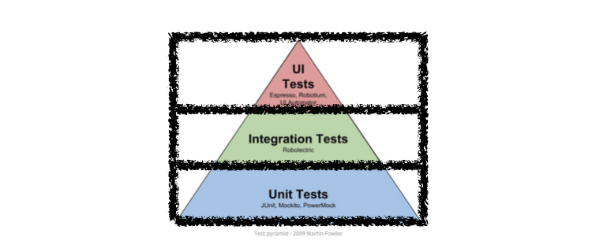
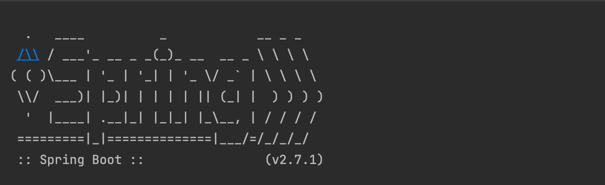

## 들어가며

> 코드를 수정하면, 검토 요청(PR) 과정의 첫 번째에 **전체 테스트 코드**가 잘 돌아가는지 확인하는 과정이 주기적으로 일어나고 있어요.


혼자 개발하며 테스트 코드를 접했을 때는 비지니스 로직의 안정성을 보장해주고, 문서화 기능도 있어 테스트는 무조건 많으면 좋은 것이라고 생각했었어요. 
그러나 프로젝트가 진행되면서 요구사항이 계속 추가되다보니 테스트 개수와 유지보수 포인트가 늘어났습니다. 이에따라 속도가 저하되어 개발 생산성이 낮아지는 경험을 했습니다.

'이것이 단순히 테스트 개수의 문제 일까?'하는 궁금증이 들었고, 속도를 개선을 진행하며 느꼈던 점을 공유하고자 합니다.

## 마틴 파울러의 테스트 피라미드에 맞춰서 테스트 비율 조정하기

> 테스트 피라미드는 상위 계층의 테스트일수록 비용이 높기 때문에 최대한 적은 비율로 유지하는 것이 좋다는 것을 나타내요.


### **인수 테스트(**UI Test**)**

> 인수 테스트는 사용자 스토리(시나리오)에 맞춰 수행하는 테스트이다. 시나리오에서 요구하는 것은 `누가, 어떤 목적으로, 무엇을 하는가`이다. 이는 API를 통해 드러난다.  인수 테스트는 소프트웨어 인수를 목적으로 하는 테스트이다. 소프트웨어를 인수하기 전에 명세한 요구사항(인수 조건)대로 잘 작동하는지 검증이 필요하다.


[저희 프로젝트](https://github.com/woowacourse-teams/2022-ternoko)에서는 `RestAssured` 를 사용하여 
실제 HTTP 요청을 보내 인수 테스트를 진행하고 있어요. 네트워크 응답 대기 시간이 소요되기 때문에 인수 테스트를 실행하는데 가장 오랜 시간이 걸렸어요.

왜그럴까 살펴보니 **인수테스트**에서 검증하는 대다수의 행위를 **통합테스트**에서 **중복해서 검증**하고 있었어요. 예외 케이스 까지도요. 
저희가 인수테스트를 진행한 목적은 서비스의 요구사항이 제대로 동작하는 가를 확인하기 위함이었는데 말이죠.

따라서 인수테스트에서는 API의 성공 사례들만 검증하고, **예외 처리에 대해서는 통합테스트로 내리면** 테스트 시간도 줄일 수 있고, 테스트 목적에도 더 부합하지 
않을까 생각되었습니다.

### **통합 테스트(Integration Test)**

> 통합 테스트는 단위 테스트보다 더 큰 동작을 달성하기 위해 여러 모듈들을 모아 이들이 의도대로 협력하는지 확인하는 테스트이다. @SpringBootTest 를 사용하여 
> 작성할 수 있다. 통합 테스트는 단위 테스트와 달리 개발자가 변경할 수 없는 부분(ex. 외부 라이브러리)까지 묶어 검증할 때 사용한다. 
> 이는 DB에 접근하거나 전체 코드와 다양한 환경이 제대로 작동하는지 확인하는데 필요한 모든 작업을 수행할 수 있다.

통합테스트는 @SpringBootTest 애너테이션을 사용하여 여러 객체들이 서로 잘 협력하는지, 협력하는 과정에서 side effect 가 발생하지는 않는지 확인하는 용도로 작성했어요.

그런데 코드를 살펴보니, 객체 간 협력이 아닌 도메인 로직의 검증이 Service 나 Controller 에 작성되어 있었습니다. 즉 여러 객체 사이의 상호 작용이 아니라 단일 객체에 대한 테스트가 진행되고 있었습니다.

해당 테스트 계층의 책임이 아니라고 판단되어 각 단위로 적절하게 책임을 내려주었습니다.

### **단위 테스트(Unit Test)**

> 단위 테스트는 응용 프로그램에서 테스트 가능한 가장 작은 소프트웨어를 실행하여 예상대로 동작하는지 확인하는 테스트이다.

단위 테스트는 테스트 피라미드 가장 아래에 위치하는 테스트 입니다. 독립적인 객체 테스트이기 때문에 테스트 비용이 가장 적습니다. 
비즈니스를 구성할 때 각 도메인이 유효성 검증에 대한 책임과 행위에 대한 책임 등 적절한 책임을 가지고 있으면 객체 끼리 메세지를 주고 받기 수월해지고 
객체지향적임에 한걸음 다가갈 수 있게 되는 것 같아요.

따라서 단위 테스트는 꼼꼼하게 작성해주면 좋아요.

### 테스트 피라미드에 맞춰서 테스트 비율 조정해보며

불필요한 테스트 비용을 제거하니 같은 로직을 더 빠르게 테스트 할 수 있게 되었어요. 😀여기서 주의할 점은 **모든 경우에 항상 피라미드형 테스트 비율을 
유지할 수는 없다**는 점이예요. 도메인이 간단해 필요한 테스트의 양이 많지 않은 경우에 API 개수만큼 인수테스트를 작성한다고 가정하면 야래처럼 인수 테스트의 
비율과 단위 테스트의 비율이 비슷할 수도 있겠죠? 따라서 현재 가지고 있는 도메인의 특성을 파악해서 테스트 비율을 조정하겠다는 유연한 사고를 한다면 더 좋겠네요.



## Application Context  를 살펴보자.

그 다음으로는 Application Context 에 대한 학습을 진행했어요. 전체 테스트를 돌리면 스프링 부트가 여러번 띄워지는 경우를 보셨을거예요. 
애플리케이션을 로드할 때 Application Context에 빈을 등록하기 위해서 @Bean 으로 선언된 객체들을 찾는 등의 작업이 진행되기 때문에 시간이 오래 걸려요. 
따라서 Application Context 재사용하면, 전체 테스트를 돌리는 시간도 줄겠다고 생각했어요.



현재 아래와 같은 항목에 대해서 Application Context를 사용하고 있어요.

- Acceptance Test
- Service Test
- DataJpa Test
- WebMvc Test

따라서 각 계층마다 한번씩만 Application Context가 띄워지는 것을 목표로 삼고 리팩터링을 진행해봤어요.

### @DirtiesContext 걷어내기

> Use this annotation if a test has modified the context — for example, by modifying the state of a singleton bean, modifying the state of an embedded database, etc. Subsequent tests that request the same context will be supplied a new context.

**데이터 격리**를 위해 사용했던 [@DirtiesContext](https://docs.spring.io/spring-framework/docs/current/javadoc-api/org/springframework/test/annotation/DirtiesContext.html) 
때문에 모든 테스트가 종료되고 Context 를 재생성하기 때문에 시간이 오래 걸렸어요.

**데이터 격리**라는 목적은 Bean 재생성 없이 DB를 수동으로  초기화 해주면 되겠다는 생각으로 이어졌고, DirtiesContext 를 걷어내고, 
DataBaseCleaner 를 사용해서 Context 재생성을 줄였습니다.

```java
public class DatabaseCleaner {

    private EntityManager entityManager;
    private List<String> tableNames;

....

@Transactional
    public void tableClear() {
        entityManager.flush();
        entityManager.clear();

        entityManager.createNativeQuery("SET REFERENTIAL_INTEGRITY FALSE").executeUpdate();

        for (String tableName : tableNames) {
            entityManager.createNativeQuery("TRUNCATE TABLE " + tableName + " RESTART IDENTITY ").executeUpdate();
        }

        entityManager.createNativeQuery("SET REFERENTIAL_INTEGRITY TRUE").executeUpdate();
    }
```

### ****Context Caching****

> Once the TestContext framework loads an ApplicationContext (or WebApplicationContext) for a test, that context is cached and reused for all subsequent tests that declare the same unique context configuration within the same test suite. To understand how caching works, it is important to understand what is meant by “unique” and “test suite.”

또한 SpringBootTest 를 사용하면서 [Context를 캐싱](https://docs.spring.io/spring-framework/docs/current/reference/html/testing.html#testcontext-ctx-management-caching)할 
수 있다는 점을 발견하게 되었어요.

'동일한 고유 컨텍스트 구성을 선언하는 모든 후속 테스트에 재사용 된다'는 부분에서 `고유 컨텍스트 구성`이 무엇을 의미하는지 살펴봤어요. 그중에서 아래 부분이 눈에 띄었어요.

- `contextCustomizers`(from `ContextCustomizerFactory`) – this includes `@DynamicPropertySource` methods as well as various features from Spring Boot’s testing support such as `@MockBean` and `@SpyBean`.

바로 테스트 격리를 위해서 사용했던 [MockBean, SpyBean](https://docs.spring.io/spring-boot/docs/current/reference/html/features.html#features.testing.spring-boot-applications.mocking-beans) 이 객체마다 다르게 선언되어 있었던 점이 문제였는데요.

### @MockBean , @SpyBean

> When you are using `@SpyBean` to spy on a bean that is proxied by Spring, you may need to remove Spring’s proxy in some situations, for example when setting expectations using `given` or `when`. Use `AopTestUtils.getTargetObject(yourProxiedSpy)`to do so.

해당 어노테이션을 사용하면 프록시 객체가 생성되어 실제 객체가 아니라, 대리 객체가 생성되고 있었어요. 따라서 당연하게 Context 에 생성되는 기존 객체가 아닌 대리 객체가 추가 되기 때문에 고유 컨텍스트 구성이 오염되었다고 판단해서 새로운 Context 를 띄우게 되는 것이었어요!

### 재사용 가능한 테스트 구조 🤔

처음부터 필요한 대리 객체가 무엇인지 파악한 뒤  Mock, Spy 한번에  선언하여 Context 에 올려두고, Test Class 들이 상속 받아 사용하는 형태로 구현한다면 컨텍스트 초기화를 한번만 하는 것이 가능해질 것 같았어요.

```java
@WebMvcTest
@Import({...})
public class WebMvcTestSupporter {

    protected MockMvc mockMvc;

    @Autowired
    protected Class realClassA;

    @MockBean
    protected Class classA;

   @MockBean
    protected Class classB;

   @SpyBean
    protected Class classC;
}

...

public class ControllerTestA extends WebMvcTestSupporter {
  @Test
	void testA() {}
}
```

구조를 변경했더니 정말 Context 초기화가 한번만 이뤄졌습니다. 여기서 그럼 격리하고 싶은 객체 전부 최상위 객체에 테스트 더블을 사용하면 생각하실 수도 있는데요. 실제 객체가 필요한 상태인데 테스트 더블을 사용하는 것이 아닌지 유의하여 객체를 설계해야 유의미한 테스트가 가능하다는 점을 주의 하셨으면 좋겠습니다.

## 결론

- 테스트 피라미드를 참고해서 계층별 테스트 비율을 조절하자
- 불필요한 설정을 제거하자 (ControllerTest → WebMvcTest 로 내린다든가) ✍🏻
- 데이터 격리 방식으로 DirtiesContext 걷어내자
- 재사용 가능한 테스트 구조를 고민해보자

테스트 코드 성능 개선을 하고자 했던 리팩토링을 통해 더욱 객체지향적인 코드 작성이 가능해지고, 전체 테스트가 돌아가는 속도가 향상되어 팀의 개발 생산성이 한층 좋아졌습니다. 제가 접근한 개선 방향이 정답이 아닐 수도 있지만, 해당 내용을 경험하며 재미를 느끼고, 팀에 생산성을 향상 시키는데 기여 했다는 느낌에 행복했습니다. 오늘도 즐거운 학습 하시길 바랍니다.  👏


### 참고자료

* [Spring API Docs](https://docs.spring.io/spring-framework/docs/current/javadoc-api/overview-summary.html)
