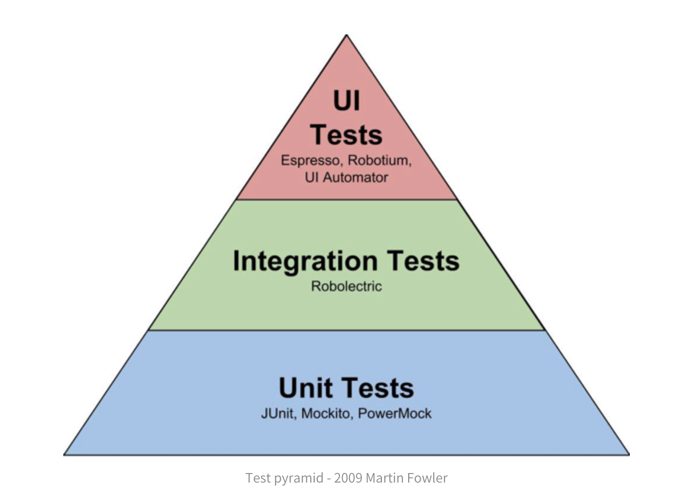

## 들어가며

프로젝트를 할 때 코드의 수정이 필요해질 경우, 검토 요청(PR) 단계의 제일 첫 번째에 **전체 테스트 코드**가 잘 돌아가는지 확인하는 과정이 주기적으로 일어나는데요.

테스트가 늘어나면서 속도가 저하되고, 개발 생산성이 낮아졌던 경험이 있습니다. 이 부분이 단순히 테스트 개수의 문제 일까? 궁금증이 들었고, 속도를 개선을 진행하며 느꼈던 점을 공유하고자 합니다.

우선 프로젝트를 하면서 테스트 목적에 따라서 인수테스트, 통합테스트, 단위 테스트를 진행했고, 계층별 테스트에 대한 내용을 서술하도록 하겠습니다.

### 목차
- 테스트 코드 속도가 느리면 느껴지는 불편함
- 마틴 파울러가 말하는 테스트 피라미드 형태에 대해서
- SpringBoot 환경에서 ApplicationContext 재활용하기
  - Integration Test 에서 재활용 방법
- 인수 테스트에서 init Data 재활용 하기
- Dirties Context 제거하기

---

## 마틴 파울러의 테스트 피라미드에 맞춰서 테스트 비율 조정하기

> 테스트 피라미드는 위로 올라가면 갈수록 비용이 많이 들고, 작은 비율로 존재하면 좋다는 의미에요.  

### **인수 테스트(UI Test)**

> 인수 테스트는 사용자 스토리(시나리오)에 맞춰 수행하는 테스트이다. 시나리오에서 요구하는 것은 `누가, 어떤 목적으로, 무엇을 하는가`이다. 이는 API를 통해 드러난다.  인수 테스트는 소프트웨어 인수를 목적으로 하는 테스트이다. 소프트웨어를 인수하기 전에 명세한 요구사항(인수 조건)대로 잘 작동하는지 검증이 필요하다.

초반에 테스트 코드 작성 당시에, **통합 테스트로** 인수테스트에서 하는 대다수의 행위를 **중복해서 검증**하고 있었어요. 테스트를 하기 위한 환경 조성을 위해 드는 비용도 꽤 크다고 느꼈고요. 그럼에도 유지했던 이유는  크게 두가지 였습니다. 첫번째는 실제 사용자와 유사한 환경에서 잘 작동하는 지 확인하고 싶다. 두번째는하나의 비지니스 로직을 수행하기 위한 과정이 전부 코드로 드러나기 때문에 문서화 관점에서 유리하다고 판단했어요.

그러나 비용 대비  큰 만큼 적은 비율로 유지하면 좋겠다고 마틴 파울러의 테스트 피라미드를 보고 생각이

따라서 인수테스트에서는 API의 성공사례들만 검증하고, 예외 처리에 대해서는 통합테스트에서 진행하는게 네트워크 타는 비용도 줄이고, 테스트 목적에 더 부합하지 않을까 생각되었습니다.

### **통합 테스트(Integration Test)**

> 통합 테스트는 단위 테스트보다 더 큰 동작을 달성하기 위해 여러 모듈들을 모아 이들이 의도대로 협력하는지 확인하는 테스트이다. @SpringBootTest 를 사용하여 작성할 수 있다. 통합 테스트는 단위 테스트와 달리 개발자가 변경할 수 없는 부분(ex. 외부 라이브러리)까지 묶어 검증할 때 사용한다. 이는 DB에 접근하거나 전체 코드와 다양한 환경이 제대로 작동하는지 확인하는데 필요한 모든 작업을 수행할 수 있다.

통합테스트에서 작업하지 않아도 되는 내용을 단위 테스트로 내려서 객체간 역할과 책임을 더욱 보강하자! 는 내용으로 ~~

### **단위 테스트(Unit Test)**

> 단위 테스트는 응용 프로그램에서 테스트 가능한 가장 작은 소프트웨어를 실행하여 예상대로 동작하는지 확인하는 테스트이다.

모든 케이스를 최대한 단위 테스트에서 검증하게 끔 해야함. ~~

## 설정 다이어트 ( )

1. controller Test → mvcTest
2. DirtiesContext 걷어내고, DataCleaner 만들기
3. Application Context 재사용하기

## 결론

테스트 계층별로 책임을 적절히 분리하고, 스프링 컨텍스트 재활용을 잘하자!
