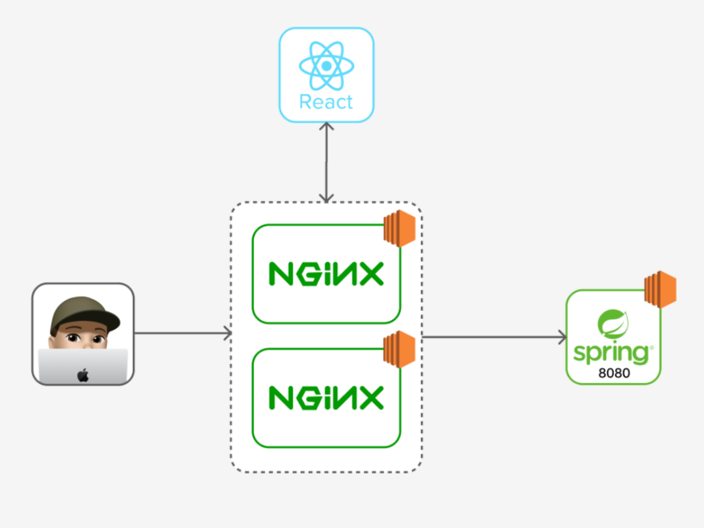
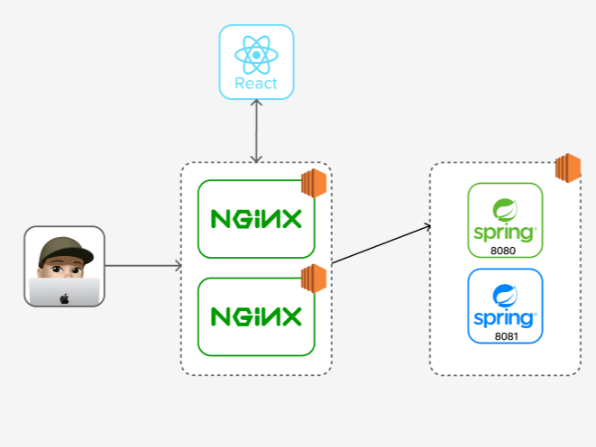

## 무중단 배포를 도입하게 된 계기
프로젝트를 릴리즈한 이후, 사용자 피드백을 반영하며 prod 환경으로의 배포가 잦아졌다. 문제는 배포를 할 때마다 기존 서버를 내리고 새롭게 띄우는 과정에서 평균 10초 이상의 다운타임이 발생한다는 것이었다. 사용자가 사용하는 운영 서버가 10초 이상 다운되는 것은 큰 문제라고 생각했다. 기능이 앞으로 계속 많아질 텐데 기능이 많아짐에 따라 다운타임도 비례해 증가할 것이라고 판단했고 따라서 운영 서버의 다운 타임을 개선하고자 무중단 배포에 대해 공부하고 이를 적용해보고자 다짐하였다.

## 무중단 배포란
배포 자동화를 통해 서비스를 운영중일 때, 새로운 서비스를 배포하기 위해서는 기존 서비스를 종료하고 새로운 서비스를 시작해야 한다. 이 두 행위 사이에 다운 타임이 발생하며 다운타임 동안 사용자들은 서비스를 이용할 수 없게 되는데 이 다운 타임을 해결해주는 방법이 무중단 배포이다. 즉, 말그대로 중단이 없는(없을 무) 배포를 무중단 배포라고 한다.

## 무중단 배포 방식
무중단 배포 방식에는 여러가지가 있다.

- AWS에서 Blue-Greem 무중단 배포
- 도커를 이용한 무중단 배포
- L4, L7 스위치를 이용한 무중단 배포
- Nginx를 이용한 무중단 배포
  
대표적으로 위와 같은 무중단 배포법들이 있는데 우리는 제일 마지막에 있는 Nginx를 이용한 무중단 배포법을 선택했다.

### 그럼 왜 Nginx를 이용한 무중단 배포법을 선택했을까?

1. Nginx 서버를 이미 이용하고 있어 환경구축을 따로 안해줘도 된다.
- 도메인 네임을 해당 서버의 IP주소와 포트로 포워딩해주는데 사용하고 있다.
- HTTP로 들어온 요청을 HTTPS로 변환해주는데 사용하고 있다.
2. 쉽고 저렴하다.

위와 같은 이유로 Nginx를 이용해 무중단 배포를 적용해 보기로 결정했다.

Nginx를 이용한 무중단 배포법에도 대표적으로 3가지 방법이 존재했다.
1. Rolling 배포
2. Canary 배포
3. Blue/Greem 배포

각 배포법에 대한 자세한 설명은 [Nginx 무중단 배포법]( https://github.com/woowacourse-teams/2022-teatime/wiki/%EB%AC%B4%EC%A4%91%EB%8B%A8-%EB%B0%B0%ED%8F%AC%EB%9E%80%3F )을 참고해보면 좋겠다.

위 세 가지 방법중 우리가 선택한 방법은 **Blue/Green 배포법**이었다.

## Blue/Green 배포를 선택한 이유

우선 롤링 배포와 비교해 봤을 때, 좀 더 신속하게 롤백이 가능하다고 생각했다. 또한 롤링 배포는 두 대 이상의 was서버를 이용해 로드 벨런싱을 이용했을 때 큰 이점이 있다고 판단했는데 우리는 더이상의 서버 증설에 제약이 있는 상황이다. 마지막으로 롤링배포에서는 구버전과 신버전의 공존으로 인한 호환성 문제도 발생할 수 있다.  

카나리 배포와 비교해 봤을 때는 카나리 방식의 최대 이점인 A/B 테스트가 현재 서비스에선 필요가 없었다.

추가적으로 신속하게 롤백이 가능하다는 점과 배포하는 속도가 다른 배포법들에 비해 빠르다는 이점이 있었다.

## Blue/Green 배포 적용
우선 무중단 배포 적용 전의 인프라 구조와 배포 스크립트를 살펴 보자.

### 무중단 배포 전, 인프라 구조와 배포 스프립트

**인프라 구조**  
  


**배포 스크립트**  

```bash
PID=$(pgrep -f teatime)

if [ -n $PID ]; then
        kill -9 $PID
	sleep 5
fi

nohup java -jar -Dspring.profiles.active=dev teatime-0.0.1-SNAPSHOT.jar 1>stdout.txt 2>err.txt &
```

nohup java -jar -Dspring.profiles.active=dev teatime-0.0.1-SNAPSHOT.jar 1>stdout.txt 2>err.txt &
적용 전 인프라 구조와 배포 스크립트에 대해 간략하게 알아보자면,
(main branch에 새로운 기능이 머지되었다는 전제)
1. 젠킨스에서 was 서버로 jar파일이 전송되고 배포 스크립트가 실행된다.
2. 배포 스크립트에 의해 현재 구동 중인 8080포트의 서버가 kill된다.
3. 새로운 jar파일로 8080포트에 새로운 서버를 띄운다.

❗️문제점
위의 2와 3사이에서 기존 서버가 죽고 새로운 서버가 띄워지는 사이에 다운타임이 발생하는 것이다.

## 무중단 배포 후, 인프라 구조와 배포 스프립트

**인프라 구조**  
  


**배포 스크립트**

```bash
# 현재 profile 찾기
function find_current_profile()
{
		RESPONSE_CODE=$(curl -o /dev/null -w "%{http_code}" http://{was ip주소}:8080)

    if [ ${RESPONSE_CODE} != 404 ] # 404가 아니면
    then
        CURRENT_PROFILE=prod2
    else
        CURRENT_PROFILE=prod1
    fi

		echo "${CURRENT_PROFILE}"
}

# 현재 port 찾기
function find_current_port()
{
    CURRENT_PROFILE=$(find_current_profile)

    if [ ${CURRENT_PROFILE} == prod1 ]
    then
      echo "8080"
    else
      echo "8081"
    fi
}

# 쉬고 있는 profile 찾기: dev1이 사용중이면 dev2가 쉬고 있고, 반대면 dev1이 쉬고 있음
function find_idle_profile()
{
    CURRENT_PROFILE=$(find_current_profile)

    if [ ${CURRENT_PROFILE} == prod1 ]
    then
      IDLE_PROFILE=prod2
    else
      IDLE_PROFILE=prod1
    fi
	
    echo "${IDLE_PROFILE}"
}

# 쉬고 있는 profile의 port 찾기
function find_idle_port()
{
    IDLE_PROFILE=$(find_idle_profile)

    if [ ${IDLE_PROFILE} == prod1 ]
    then
      echo "8080"
    else
      echo "8081"
    fi
}

# idle profile로 jar 파일 실행

REPOSITORY=/home/ubuntu/jar

echo "> Build 파일 복사"
echo "> cp $REPOSITORY/*.jar $REPOSITORY/"

cp $REPOSITORY/*.jar $REPOSITORY/

echo "> 새 어플리케이션 배포"
JAR_NAME=$(ls -tr $REPOSITORY/*.jar | tail -n 1)

echo "> JAR Name: $JAR_NAME"

echo "> $JAR_NAME 에 실행권한 추가"

chmod +x $JAR_NAME

echo "> $JAR_NAME 실행"

CURRENT_PORT=$(find_current_port)
IDLE_PROFILE=$(find_idle_profile)
IDLE_PORT=$(find_idle_port)

echo "> $JAR_NAME 를 profile=$IDLE_PROFILE 로 실행합니다."
nohup java -jar -Dspring.profiles.active=$IDLE_PROFILE $JAR_NAME 1>stdout.txt 2>err.txt &

# health check

echo "> Health Check Start!"
echo "> IDLE_PORT: $IDLE_PORT"
echo "> curl -s http://3.39.136.191:$IDLE_PORT "
sleep 10

for RETRY_COUNT in {1..10}
do
  RESPONSE=$(curl -s http://{was ip주소}:${IDLE_PORT})
  UP_COUNT=$(echo ${RESPONSE} | grep "timestamp" | wc -l)

  if [ ${UP_COUNT} -ge 1 ]
  then # $up_count >= 1 
      echo "> Health check 성공"

      # 기존 포트에서 idle port로 switch

			echo "> 전환할 Port: $IDLE_PORT"
			echo "> Port 전환"
			echo "set \$service_url http://{was ip주소}:${IDLE_PORT};" | ssh -i key-teatime.cer ubuntu@192.168.2.61 sudo tee /etc/nginx/conf.d/service-prod-url.inc
			echo "set \$service_url http://{was ip주소}:${IDLE_PORT};" | ssh -i key-teatime.cer ubuntu@192.168.4.79 sudo tee /etc/nginx/conf.d/service-prod-url.inc

			echo "> 엔진엑스 Reload"
			ssh -i key-teatime.cer ubuntu@{ngnix1 ip주소} sudo service nginx reload
			ssh -i key-teatime.cer ubuntu@{ngnix2 ip주소} sudo service nginx reload
      break

  else
      echo "> Health check의 응답을 알 수 없거나 혹은 실행 상태가 아닙니다."
      echo "> Health check: ${RESPONSE}"
  fi

  if [ ${RETRY_COUNT} -eq 10 ]
  then
    echo "> Health check 실패. "
    echo "> 엔진엑스에 연결하지 않고 배포를 종료합니다."
    exit 1
  fi

  echo "> Health check 연결 실패. 재시도..."
  sleep 10
done

# 기존 포트 stop

CURRENT_PID=$(lsof -ti tcp:${CURRENT_PORT}

if [ -z ${CURRENT_PID} ]
then
  echo "> 현재 구동중인 애플리케이션이 없으므로 종료하지 않습니다."
else
  echo "> kill -15 $CURRENT_PID"
  kill -15 ${CURRENT_PID}
  sleep 5
fi
```

Blue/Green 무중단 배포 적용 후 변경된 인프라 구조와 배포 스크립트다. 배포 스크립트가 약간 길어 보기 불편할 수 있어 간단하게 정리하면 다음과 같다.
(현재 8080포트로 서버가 구동 중이라는 전제)
**1. idle port를 찾는다. 즉 8081포트에 새롭게 배포될 서버가 띄워져야 한다는 사실을 인지한다.**
**2. idle port(8081포트)로 jar파일 실행한다.**
**3. health check를 통해 8081포트에 서버가 띄워 질 때까지 current port(8080포트)의 서버를 kill하지 않는다.**
**4. 8081포트에 서버가 잘 띄워졌으면 Nginx에서 가리키고 있는 was 포트를 current port(8080) -> idle port(8081)로 스위칭해준다.**
**5. current port(8080포트)를 kill한다.**

**<8081포트에 서버가 띄워진 후의 인프라 구조>**  


위와 같은 flow로 Blue/Green 배포를 적용하여 결론적으로 평균 10초이상의 다운 타임을 0.2초로 줄였다.(0.2초의 다운 타임이 존재하는 이유는 proxy switching을 하고 nginx를 reload하는 과정이 0.1초인데 nginx를 두 대 이용하기 때문에 0.2초이다.)

## 추후 고민해 볼 사항

**1. Health check**

```bash
 RESPONSE=$(curl -s http://{was ip주소}:${IDLE_PORT})
  UP_COUNT=$(echo ${RESPONSE} | grep "timestamp" | wc -l)

  if [ ${UP_COUNT} -ge 1 ]
  then # $up_count >= 1 
      echo "> Health check 성공"
      ...
  else
	   echo "> Health check 실패"
       ...
```

현재 Health check를 위와 같이 진행하고 있다. 신버전이 배포된 포트의 was ip주소:포트로 요청을 보내 응답에 timestamp라는 문자열이 존재하면 새로운 서버가 띄워졌다고 판단하고 있다.


이는 위와 같이 ubuntu os로 띄워진 ec2 서버의 해당 포트가 띄워졌을 때 보이는 화면에 너무 종속적인 health check가 될 수도 있다는 생각이 든다. 추후에 팀원들과 논의 끝에 더 좋은 방법으로 개선해야 할 수도 있을 것으로 보인다.

**2. Was 서버 증설**

현재 무중단 배포를 통해 운영 서버의 다운 타임 문제는 해결 됐으나, Was ec2 자체가 다운되면 서비스가 무한정 중단될 수 있는 상황이다. 따라서 Was 서버를 한 대 더 증설하는 것이 안전하다고 판단된다.
