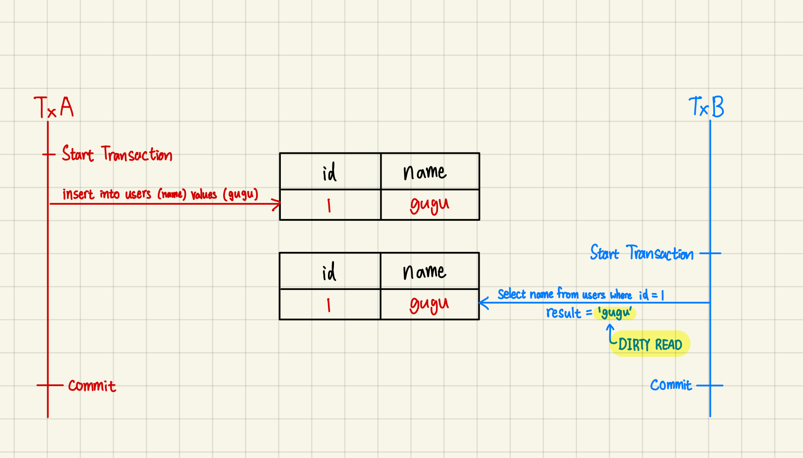
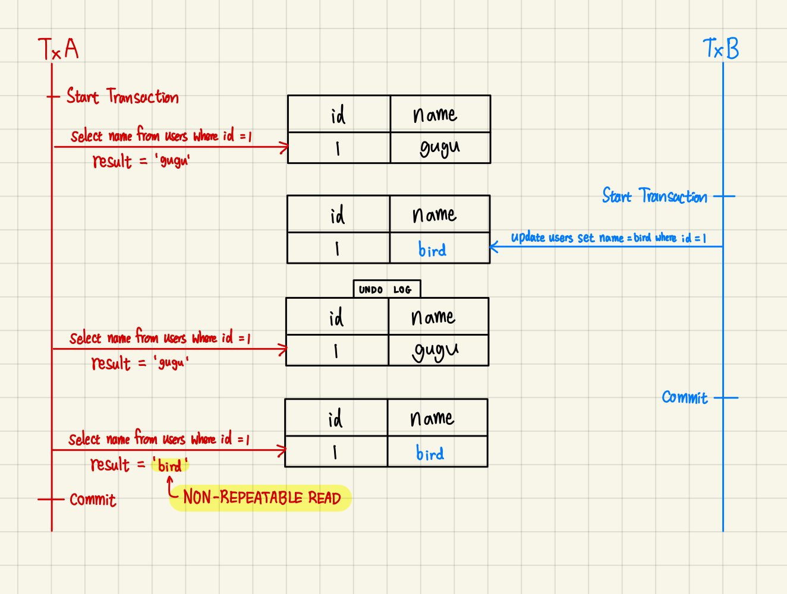
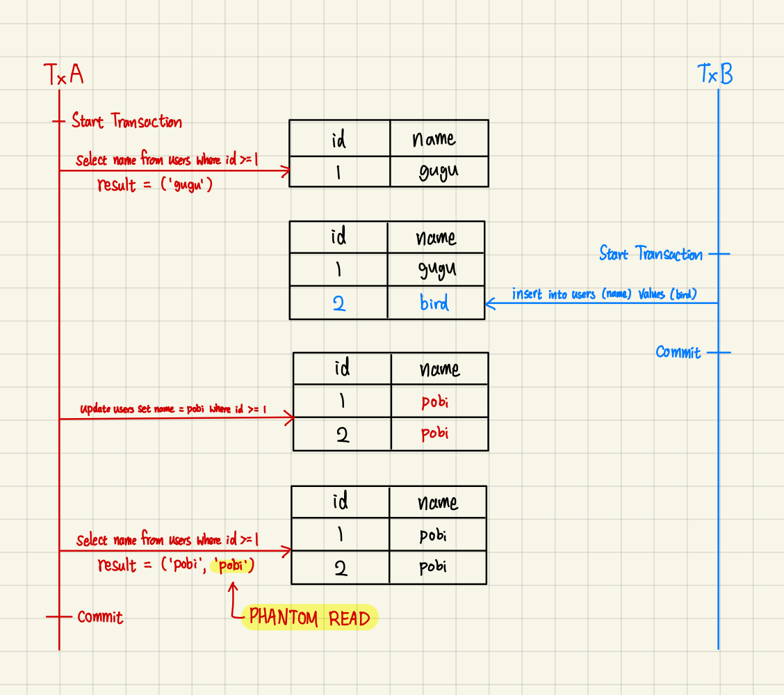
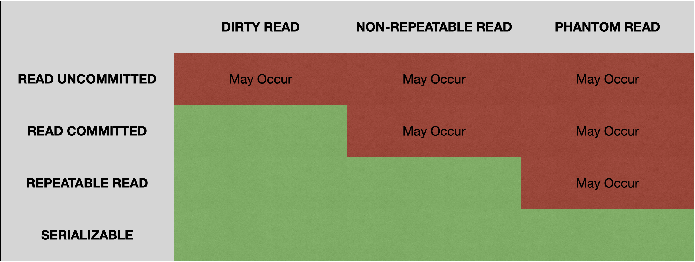

## **트랜잭션 격리 수준**

---

Transaction Isolation Level, 격리 수준은 트랜잭션이 얼마나 서로 독립적인지 나타내는 개념이다.

DB 는 동시에 여러 클라이언트가 데이터에 접근하고 수정하기 때문에 비정상적인 상태가 발생할 수 있다.

이 외에도 다양한 비정상 상태, 현상이 나타나는 것을 방지하기 위해 트랜잭션은 독립적이어야 한다.

### **READ UNCOMMITTED**

---

트랜잭션의 변경 내용이 커밋이나 롤백 여부에 상관 없이 다른 트랜잭션이 볼 수 있는 격리 레벨이다.

#### **Dirty Read**



```java
isolation level : READ_UNCOMMITTED, user : User{id=1, name='gugu'}
isolation level : READ_COMMITTED  , user : null
isolation level : REPEATABLE_READ , user : null
isolation level : SERIALIZABLE    , user : null
```

다른 트랜잭션이 커밋되지 않은 데이터를 읽을 수 있기 때문에 정확하지 않은 데이터를 읽을 수 있다는 문제가 발생한다. 이를 `DIRTY READ` 현상이라고 한다.

### **READ COMMITTED**

---

`READ COMMITTED` 부터 데이터의 정합성을 보장하기 위해 Multi Version Concurrency Control, MVCC 의 Consistent Read 를 사용한다.

Consistent Read 란 데이터의 Snapshot 을 `UNDO LOG` 에 백업해두어 필요 시 `UNDO LOG` 에서 레코드를 가져오는 방법을 의미한다.

`InnoDB` 는 잠금 읽기나 `UPDATE` `DELETE` 쿼리를 수행할 때 스캔한 모든 row 에 `X-LOCK` 을 적용하는데, `READ COMMITTED` 는 변경할 row 가 아닌 경우 `X-LOCK` 을 반환하는 `Record Lock` 을 사용한다.

#### **Non-Repeatable Read**



```java
expected : user : User{id=1, name='gugu'}

isolation level : READ_UNCOMMITTED, user : User{id=1, name='bird'}
isolation level : READ_COMMITTED  , user : User{id=1, name='bird'}
isolation level : REPEATABLE_READ , user : User{id=1, name='gugu'}
isolation level : SERIALIZABLE    , user : User{id=1, name='gugu'}
```

한 트랜잭션 내에서 다른 트랜잭션의 변경 내용이 커밋될 때, 매번 Snapshot 이 초기화되어 `SELECT` 쿼리에서 변경된 데이터가 읽히는 `NON-REPEATABLE READ` 현상이 발생할 수 있다.

다시 말해, 한 트랜잭션 내에서 동일한 `SELECT` 쿼리를 실행했을 때 항상 같은 결과를 보장하지 못한다.

뿐만 아니라, `Record Lock` 방식을 사용하기 때문에 특정 데이터 범위 중간에 새로운 데이터가 삽입 또는 삭제될 수 있기에 `PHANTOM READ` 현상이 발생할 수 있다.

### **REPEATABLE READ**

---

`InnoDB` 에서 기본값으로 제공하는 격리 레벨로, 처음 Snapshot 을 바탕으로 Consistent Read 를 제공한다. 이는, 변경사항 마다 트랜잭션 번호를 적용하여 해당 트랜잭션 이후의 변경사항은 반영하지 않게끔 설계되어 있어 가능하다.

`READ COMMITTED` 는 잠금 읽기나 `UPDATE` `DELETE` 쿼리를 수행할 때 스캔한 모든 row 중 변경할 row 가 아닌 경우 `X-LOCK` 을 반환하는 반면, `REPEATABLE READ` 는 스캔한 모든 row 에 대한 `X-LOCK` 을 트랜잭션이 종료될 때 까지 유지하기 위해 `Gap Lock` 또는 `Gap Lock` 과 `Record Lock` 을 합친 `Next-Key Lock` 을 사용한다.

한 편, 유니크한 검색 조건을 가지고 있는 경우 해당 레코드에 대한 `Record Lock` 만을 사용한다.

#### Phantom Read



```java
expected : user : [User{id=1, name='pobi'}]

isolation level : READ_UNCOMMITTED, user : [User{id=1, name='pobi'}, User{id=2, name='pobi'}]
isolation level : READ_COMMITTED. , user : [User{id=1, name='pobi'}, User{id=2, name='pobi'}]
isolation level : REPEATABLE_READ , user : [User{id=1, name='pobi'}, User{id=2, name='pobi'}]
isolation level : SERIALIZABLE    , user : [User{id=1, name='pobi'}]
```

여전히 `InnoDB` 에선 이런 구조에도 불구하고 `PHANTOM READ` 가 발생할 수 있는 상황이 있다.

예를 들어 다른 트랜잭션이 추가한 레코드에 대하여 `UPDATE` 쿼리를 수행하게 될 경우, 첫 `SELECT` 쿼리로 생성된 Snapshot 에는 존재하지 않지만 실제론 데이터가 존재하기 때문에 해당 레코드가 영향을 받아 이후 `SELECT` 쿼리를 수행할 때 Snapshot 이 초기화되는 시점에 해당 현상을 발견할 수 있다.

### **SERIALIZABLE**

---

`REPEATABLE READ` 와 비슷하지만 `InnoDB` 환경에선 트랜잭션을 열 때 `SELECT` 쿼리를 `SELECT … FOR SHARE` 쿼리로 변경한다. `SELECT … FOR SHARE` 쿼리는 `S-LOCK` 을 걸어 다른 트랜잭션을 접근하지 못하도록 하여 직렬화된 방식처럼 트랜잭션을 수행할 수 있다.

트랜잭션을 열지 않을 경우 `SELECT` 쿼리는 자체 트랜잭션으로 수행되기 때문에 읽기 전용으로 볼 수 있고,  비잠금 읽기로 수행되는 경우 직렬화된 방식처럼 동작하여 다른 트랜잭션에게 영향을 주지 않는다.

## 정리

---



### **격리 레벨의 종류**

SQL 표준에서 제공하는 격리 레벨은 총 4가지로 이루어져 있으며 이는 아래와 같다.

- `READ UNCOMMITTED`
  - 커밋되지 않은 데이터를 다른 트랜잭션에서 읽을 수 있다.
- `READ COMMITTED`
  - MVCC 의 `UNDO LOG` 를 통해 커밋된 데이터만을 읽을 수 있다.
  - 커밋 마다 Snapshot 이 초기화 되기 때문에 `NON-REPEATABLE READ` 가 발생할 수 있다.
  - `Record Lock` 을 걸기 때문에 `PHANTOM READ` 가 발생할 수 있다.
- `REPEATABLE READ`
  - 레코드 변경사항 마다 트랜잭션 번호를 적용하여 MVCC 를 수행한다.
  - Snapshot 이 최초 생성된 이후 변경되지 않는다.
  - `Next-Key Lock` 을 걸기 때문에 `PHANTOM READ` 가 발생할 수 없다.
- `SERIALIZABLE`
  - 모든 트랜잭션에 잠금을 사용하여 데이터 일관성을 보장한다.

### 읽기 현상의 종류

각 격리 레벨마다 발생할 수 있는 읽기 현상들은 아래와 같다.

- `DIRTY READ` - 커밋되지 않은 데이터를 다른 트랜잭션에서 읽는 현상
- `NON-REPEATABLE READ` - 트랜잭션 내에서 동일한 읽기 쿼리에 대한 일관성이 보장되지 않는 현상
- `PHANTOM READ` - 트랜잭션 내에서 동일한 읽기 쿼리를 수행했을 때 유령 레코드가 나타나는 현상

## **References**

---

- [MySQL Docs - Isolation Level](https://dev.mysql.com/doc/refman/8.0/en/innodb-transaction-isolation-levels.html)
- [MySQL Docs - Next Key Lock](https://dev.mysql.com/doc/refman/8.0/en/innodb-locking.html#innodb-next-key-locks)

