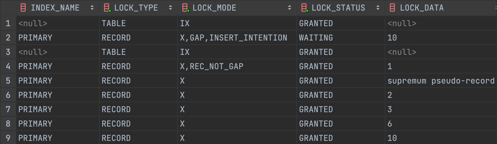
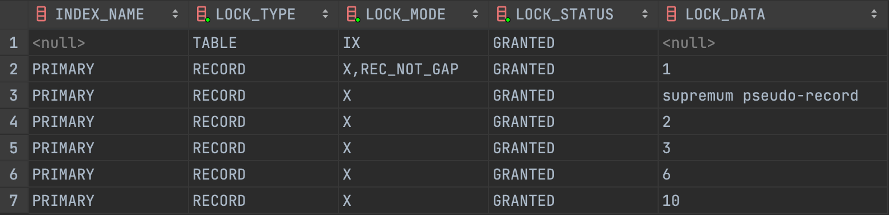
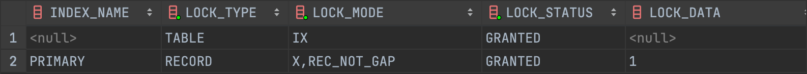
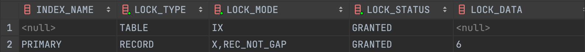
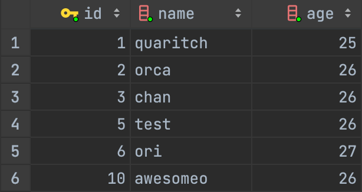
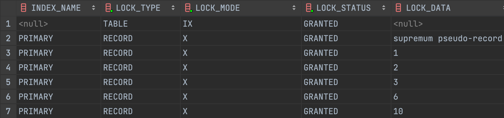
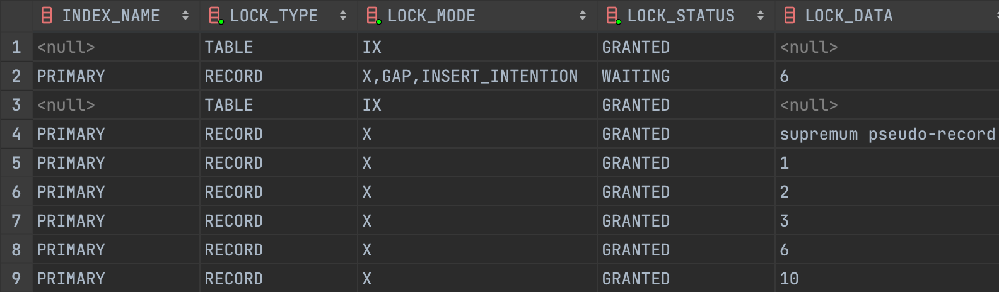
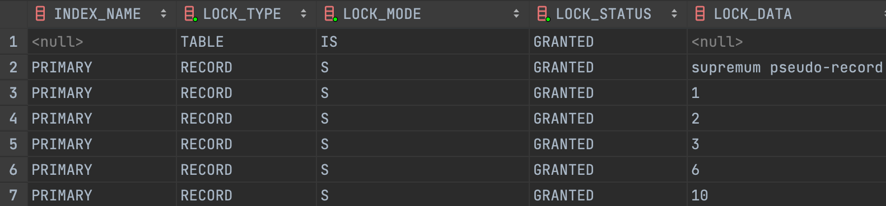

## **Transaction Isolation Level**

애플리케이션을 개발 중 데이터베이스를 도입하면 격리 수준에 대한 이해가 자연스럽게 요구됩니다. 격리 수준은 데이터베이스의 ACID 성질 중 Isolation 에 해당하며, 여러 트랜잭션이 동시에 변경을 수행할 때 성능과 안정성, 일관성 및 재현성 간의 규형을 미세하게 조정하는 설정입니다. SQL:1992 표준에서 제공하는 4가지 격리 수준의 종류는 아래와 같습니다.

- `READ UNCOMMITTED`
- `READ COMMITTED`
- `REPEATABLE READ`
- `SERIALIZABLE`

MySQL 의 `InnoDB` 는 MVCC 와 2-Phase Locking 의 장점을 적절히 조합하여 트랜잭션 모델을 구현하였는데요. 이를 이해하기 위해선 `InnoDB` 의 Locking, Consistent Non-Locking Read, Locking Read 등과 같은 개념이 선행되어야 합니다.

```sql
CREATE TABLE test (
  id BIGINT(20) NOT NULL AUTO_INCREMENT,
  name VARCHAR(255) NOT NULL,
  age BIGINT(20) NOT NULL,
  PRIMARY KEY (id)
);

insert into test (id, name, age) values (1, 'quaritch', 25);
insert into test (id, name, age) values (2, 'orca', 26);
insert into test (id, name, age) values (3, 'chan', 26);
insert into test (id, name, age) values (6, 'ori', 27);
insert into test (id, name, age) values (10, 'awesomeo', 26);
```

이 글에선 여러 예시들이 사용될 예정입니다. 모든 예시는 위 테이블을 바탕으로 진행되는 점을 참고하며 읽으시면 좀 더 원활한 이해가 가능할 것 같습니다.

## **InnoDB Locking**

MySQL 의 `InnoDB` 에선 다양한 Locking 기법을 사용합니다. 그 중 `InnoDB` 의 트랜잭션 격리 수준을 구현하기 위해 사용되는 대표적인 3가지 Lock 에 대해 우선 살펴보고자 합니다.

### **Record Lock**

`Record Lock` 은 인덱스 레코드에 설정되는 Lock 입니다. 테이블에 인덱스가 정의되지 않았어도 `InnoDB` 에선 숨겨진 Clustered Index 를 생성하기 때문에 이를 활용하여 `Record Lock` 을 적용할 수 있습니다.

예를 들어, `SELECT name FROM test WHERE id = 1 FOR UPDATE;` 라는 쿼리를 실행하면 `id` 가 1 에 해당하는 레코드에 `Record Lock` 이 설정되기 때문에 다른 트랜잭션이 `id` 가 1 인 레코드를 변경하는 작업을 수행할 수 없습니다.

아래는 해당 상황을 연출하고 `SHOW ENGINE INNODB STATUS` 를 통해 `Record Lock` 이 설정된 것을 확인한 로그입니다.

```sql
RECORD LOCKS space id 10 page no 4 n bits 72 index PRIMARY of table `transaction_test`.`test`
trx id 3162 lock_mode X locks rec but not gap waiting
Record lock, heap no 2 PHYSICAL RECORD: n_fields 5; compact format; info bits 0
 0: len 8; hex 8000000000000001; asc         ;;
 1: len 6; hex 000000000c4b; asc      K;;
 2: len 7; hex 820000008e0110; asc        ;;
 3: len 8; hex 7175617269746368; asc quaritch;;
 4: len 8; hex 8000000000000019; asc         ;;
```

### **Gap Lock**

`Gap Lock` 은 인덱스 레코드 간의 Gap 혹은 첫 번째 또는 마지막 인덱스 레코드 전/후의 Gap 에 설정되는 Lock 입니다. Gap 자체에 Lock 이 설정되었기 때문에 삽입하려는 곳의 값 존재 여부와 관계 없이 다른 트랜잭션에서 데이터를 삽입할 수 없습니다.

예를 들어, `SELECT name FROM test WHERE id >= 1 FOR UPDATE;` 라는 쿼리를 실행하고 다른 트랜잭션이 `id` 가 8 인 데이터를 삽입하려고 할 경우 해당 `id` 값은 `Gap Lock` 이 설정된 상태이기 때문에 삽입 작업을 수행할 수 없습니다.

아래는 해당 상황을 연출하고 `Gap Lock` 이 설정된 것을 확인한 결과입니다.



```sql
RECORD LOCKS space id 11 page no 4 n bits 72 index PRIMARY of table `transaction_test`.`test`
trx id 3194 lock_mode X locks gap before rec insert intention waiting
Record lock, heap no 5 PHYSICAL RECORD: n_fields 5; compact format; info bits 0
 0: len 8; hex 800000000000000a; asc         ;;
 1: len 6; hex 000000000c74; asc      t;;
 2: len 7; hex 82000000ab0110; asc        ;;
 3: len 4; hex 6f726361; asc orca;;
 4: len 8; hex 800000000000001a; asc         ;;
```

### **Next-Key Lock**

`Next-Key Lock` 은 `Record Lock` 과 해당 인덱스 레코드 앞의 Gap 에 대한 `Gap Lock` 이 조합된 Lock 입니다. 예시에 해당하는 `Next-Key Lock` 은 아래 명시된 것과 같이 적용됩니다.

```
(negative infinity, 1]
(1, 2]
(2, 3]
(3, 6]
(6, 10]
(10, positive infinity)
```

마지막 범위에 대한 `Next-Key Lock` 은 실제 인덱스의 가장 큰 값과 가장 높은 값을 갖는 허위 인덱스, `supremum pseudo-record` 를 통해 Lock 을 설정합니다.



실제로 `SELECT … FROM performance_schema.data_locks;` 를 통해 확인해보면 `supremum pseudo-record` 가 `LOCK_DATA` 로 잡혀있는 것을 확인할 수 있습니다.

## **Consistent Non-Locking Reads**

MySQL 의 `InnoDB` 는 동시성 성능을 최대화하기 위해 Multiversion Concurrency Control, MVCC 라는 개념을 도입했습니다. 이는 격리 수준에 따라 상이하지만, 특정 시점의 `Snapshot` 정보를 바탕으로 Locking 이 필요하지 않은 Consistent Read 를 제공한다는 공통점이 있습니다. 이를 MySQL 에선 `Consistent Non-Locking Read` 라고 합니다.

- `REPEATALBE READ` 격리 수준에선 최초 `SELECT` 문이 수행된 시점을 기준으로 `Snapshot` 이 생성되어 다른 트랜잭션에 의해 해당 데이터가 변경되어도 `Undo Log` 에 저장된 내용을 기반으로 기존 데이터를 재구성합니다.
- `READ COMMITTED` 격리 수준에선 각 `SELECT` 문 마다 `Snapshot` 이 초기화되기 때문에 다른 트랜잭션의 커밋에 의해 해당 데이터가 변경되면 같은 읽기 작업이라도 다른 결과를 반환할 수 있습니다.

## **Locking Reads**

기본적인 `SELECT` 문을 통해 조회한 데이터는 기본적으로 `Non-Locking Read` 입니다. 때문에 다른 트랜잭션에 의해 변경될 가능성이 높습니다. `InnoDB` 는 이를 해결하기 위해 두 가지 `Locking Read` 를 제공합니다.

- `SELECT … FOR SHARE` 는 읽은 Row 에 `S-Lock` 을 설정합니다. 다른 트랜잭션이 Row 를 읽을 순 있지만, `S-Lock` 을 설정한 트랜잭션이 커밋되기 전까지 Row 를 수정할 수 없습니다. 아직 커밋되지 않은 다른 트랜잭션에 의해 해당 Row 가 변경될 경우, 트랜잭션이 종료될 때까지 기다린 뒤 가장 최신화된 값을 사용하여 쿼리를 수행합니다.
- `SELECT … FOR UPDATE` 는 검색에서 발견한 인덱스 레코드에 대해 `UPDATE` 문을 실행한 것과 동일하게 Row 및 관련 인덱스에 Lock 을 설정합니다. 다른 트랜잭션은 해당 Row 를 `UPDATE` 또는 `SELECT ... FOR SHARE` 를 수행하는 것이 제한됩니다.

`FOR SHARE` 혹은 `FOR UPDATE` 로 설정된 모든 Lock 은 트랜잭션이 커밋 또는 롤백될 때 반환됩니다.

여기까지 `InnoDB` 의 Locking, Consistent Non-Locking Read, Locking Read 등에 대해 알아보았습니다. 이제 `InnoDB` 가 4가지 트랜잭션 격리 수준을 이를 통해 어떻게 구현했는지 살펴보겠습니다.

## **READ UNCOMMITTED**

먼저 `READ UNCOMMITTED` 입니다. 트랜잭션의 변경 내용이 커밋이나 롤백 여부와 관계 없이 다른 트랜잭션에 보이는 가장 낮은 수준의 격리 레벨입니다. `READ UNCOMMITTED` 격리 수준에서 일반적인 `SELECT` 문은 `Non-Locking Read` 로 수행되지만 MVCC 를 사용하지 않아 `Consistent Read` 를 보장하지않습니다.

### **Dirty Read**

`READ UNCOMMITTED` 격리 수준에서 발생할 수 있는 읽기 부정합 현상입니다. 다른 트랜잭션에 의해 영향 받은 Row 를 읽을 수 있기 때문에 발생하는 현상입니다. 커밋 또는 롤백에 관계 없이 보여지기 때문에 부정확한 데이터를 사용할 수 있는 위험한 상황이 발생할 수 있습니다.

이는 데이터베이스의 ACID 성질을 준수하지 못하기에 이를 해결하기 위해 `InnoDB` 에선 MVCC 를 통한 `Consistent Read` 를 제공합니다.

## **READ COMMITTED**

`READ COMMITTED` 격리 수준부터 MVCC 가 사용되어 `Consistent Read` 를 지원하지만 동일한 트랜잭션 내에서 각 `SELECT` 문은 자체적으로 새로운 `Snapshot` 을 생성하기 때문에 완전한 `Consistent Read` 를 보장하진 않습니다.

`Locking Read` `UPDATE` `DELETE` 문의 경우 `Record Lock` 만을 설정하고 `Gap Lock` 은 설정하지 않기에 다른 트랜잭션에서 자유롭게 Gap 에 접근할 수 있습니다. `Gap Lock` 을 설정하지 않기 때문에 범위 검색과 같은 쿼리에서 `Phantom Read` 현상 역시 발생할 수 있습니다.

```sql
SET TRANSACTION ISOLATION LEVEL READ COMMITTED;
START TRANSACTION;
UPDATE test SET name = 'meatsby' WHERE name = 'quaritch';
```



추가적으로 위 그럼처럼 `UPDATE` 쿼리를 위한 풀 테이블 스캔 시 `READ COMMITTED` 는 스캔 중 마주치는 모든 인덱스 레코드에 `X-Lock` 을 설정하고 `WHERE` 절이 수행될 때 조건에 부합하지 않는 인덱스 레코드의 `X-Lock` 을 반환하는 특징을 가지고 있습니다.

변경할 인덱스 레코드를 제외한 다른 인덱스 레코드의 Lock 을 반환하기 때문에 다른 트랜잭션과의 충돌로 인한 데드락 발생 확률을 현저히 줄였다고 MySQL 은 소개합니다.

```sql
SET TRANSACTION ISOLATION LEVEL REPEATABLE READ;
START TRANSACTION;
UPDATE test SET name = 'meatsby' WHERE name = 'quaritch';
```


반면 `REPEATABLE READ` 에선 스캔 중 마주치는 모든 인덱스 레코드에 `X-Lock` 을 설정하여 커밋 또는 롤백까지 Lock 을 반환하지 않습니다.

### **Non-Repeatable Read**

`READ COMMITTED` 격리 수준까지 발생할 수 있는 읽기 부정합 현상입니다. 앞서 설명한 것 처럼 `READ COMMITTED` 격리 수준에서 `SELECT` 문은 항상 `Snapshot` 을 초기화하기 때문에 한 트랜잭션에서 동일한 `SELECT` 문을 수행해도 일관된 데이터를 반환하지 않는 문제가 발생할 수 있습니다.

## **REPEATABLE READ**

`InnoDB` 에서 기본값으로 제공하는 격리 레벨로, `READ COMMITTED` 격리 수준과는 달리 처음 생성된 `Snapshot` 을 통해 `Consistent Read` 를 보장합니다. 즉, 동일한 트랜잭션 내의 일반적인 `SELECT` 문의 일관성을 보장합니다.

`Locking Read` `UPDATE` `DELETE` 문의 경우 검색 조건에 따라 사용하는 `Lock` 이 달라집니다.

- 고유한 검색 조건이 있는 고유 인덱스에 대한 쿼리는 `Record Lock` 이 적용됩니다.
- 범위 검색 조건과 같은 다른 검색 조건의 경우 스캔한 인덱스 범위에 `Gap Lock` 또는 `Next-Key Lock` 을 설정하여 다른 트랜잭션이 해당 범위에 접근하는 것을 제한합니다.

아래 예시를 통해 위 두 상황을 좀 더 자세히 살펴보겠습니다.

```sql
# Session A
SET TRANSACTION ISOLATION LEVEL REPEATABLE READ;
START TRANSACTION;
SELECT * FROM test WHERE id = 6 FOR UPDATE;
```



현재 예시에선 `id` 가 인덱스로 작용하고 있기 때문에 고유한 `id` 조건을 통해 `FOR UPDATE` 를 수행할 경우 해당하는 인덱스 레코드에만 `Record Lock` 이 설정됩니다.

```sql
# Session B
INSERT INTO test (id, name, age) VALUES (5, 'test', 26);
```



때문에 다른 트랜잭션이 Gap 에 데이터를 삽입할 때 아무 제한 없이 정상적으로 데이터가 삽입됩니다.

```sql
# Session A
SET TRANSACTION ISOLATION LEVEL REPEATABLE READ;
START TRANSACTION;
SELECT * FROM test WHERE age = 25 FOR UPDATE;
```



반면 `age` 와 같이 현재 테이블 상태에선 고유하지만 인덱스가 아닌 조건을 통해 `FOR UPDATE` 를 수행할 경우 풀 테이블 스캔을 통해 해당 인덱스 레코드를 탐색하기 때문에 그 과정에서 마주친 모든 인덱스 레코드에 `X-Lock` 이 적용됩니다.

```sql
# Session B
INSERT INTO test (id, name, age) VALUES (5, 'test', 26);
```



이 상태에서 다른 트랜잭션이 Gap 에 `id` 가 5 인 데이터를 삽입하려고 할 경우 `id` 가 6 인 인덱스 레코드의 `Gap Lock` 으로 인해 데이터 삽입이 제한됩니다. 이를 통해 `InnoDB` 에선 `REPEATABLE READ` 수준에서도 `Phantom Read` 현상을 방지할 수 있습니다.

### **Phantom Read**

```sql
A : START TRANSACTION;
A : SELECT * FROM test; # 최초 Snapshot 생성

B : INSERT INTO test (id, name, age) VALUES (5, 'test', 26); # Lock 이 걸려있지 않기 때문에 Gap 에 데이터 삽입 가능

A : SELECT * FROM test; # 최초 Snapshot 을 그대로 사용
A : UPDATE test SET name = 'twenty-six' WHERE age = 26; # Locking Read 를 통해 새롭게 읽은 후 UPDATE
A : SELECT * FROM test; # Snapshot 이 초기화되어 Phantom Read 발생
```

여전히 이런 구조에도 불구하고 `REPEATABLE READ` 에서 `Phantom Read` 가 발생할 수 있는 상황이 있습니다.

위 상황처럼 다른 트랜잭션이 추가한 레코드에 `UPDATE` 쿼리를 수행하게 될 경우, 첫 `SELECT` 쿼리로 생성된 `Snapshot` 에는 존재하지 않지만 실제 디스크에는 데이터가 존재하기 때문에 해당 레코드가 영향을 받아 이후 `SELECT` 쿼리를 수행할 때 `Snapshot` 이 초기화되는 시점에 해당 현상을 발견할 수 있습니다.

즉, `Consistent Non-Locking Read` 와 `Locking Read` 의 조합 때문에 발생할 수 있는 현상입니다.

앞서 설명한 것 처럼 일반적인 `SELECT` 문은 `Non-Locking Read` 를 기반으로 하기 때문에 `UPDATE` 를 위한 `SELECT` 는 `SELECT … FOR UPDATE` 와 같이 `Locking Read` 를 사용하는 것이 더 적합합니다.

따라서, 위 예시에서 연출하는 상황 자체가 부적절하다고 생각하지만, 여전히 발생할 수 있는 특정 상황이 존재한다는 사실을 알고있는 것이 좋을 것 같습니다.

## **SERIALIZABLE**

마지막 `SERIALIZABLE` 은 가장 높은 수준의 격리 레벨입니다. 이름처럼 직렬화된 방식처럼 작동해야합니다. `InnoDB` 에선 이를 구현하기 위해 일반적인 `SELECT` 문을 모두 `SELECT … FOR SHARE` 문으로 변환하여 `S-Lock` 을 통한 `Locking Read` 를 수행하게끔 합니다.

글 초반부 설명되어있듯이 `S-Lock` 은 다른 트랜잭션도 독립적으로 설정이 가능하여 `S-Lock` 이 설정된 레코드를 읽을 수 있지만 최초로 `S-Lock` 을 설정한 트랜잭션이 종료되기 전까진 변경을 가할 수 없습니다.

```sql
SET TRANSACTION ISOLATION LEVEL SERIALIZABLE;
START TRANSACTION;
SELECT * FROM test;
```



위 그림처럼 단순히 `SELECT` 문을 수행해도 모든 레코드에 `S-Lock` 이 설정된 것을 확인할 수 있습니다.

## **마무리**

여기까지 MySQL 의 `InnoDB` 가 4가지 격리 수준을 구현한 방법에 대해 알아보았습니다. 격리 수준은 동시성과 격리성의 Trade-Off 인 만큼 자세히 알고 사용하면 더 좋은 효과를 나타낼 수 있을 것 같습니다.

MySQL 은 다른 DBMS 벤더들과는 달리 `InnoDB` 를 통해 `REPEATABLE READ` 에서도 충분한 격리성을 보여주고 있습니다. 하지만 여러가지 Locking 기법을 활용하여 격리 수준을 구현했기 때문에 Locking 으로 인해 발생할 수 있는 여러 문제점 역시 충분히 이해하는 것이 중요하다고 생각합니다.

## **References**

- [MySQL Docs - InnoDB Locking](https://dev.mysql.com/doc/refman/8.0/en/innodb-locking.html)
- [MySQL Docs - Consistent Nonlocking Reads](https://dev.mysql.com/doc/refman/8.0/en/innodb-consistent-read.html)
- [MySQL Docs - Locking Reads](https://dev.mysql.com/doc/refman/8.0/en/innodb-locking-reads.html)
- [MySQL Docs - Transaction Isolation Levels](https://dev.mysql.com/doc/refman/8.0/en/innodb-transaction-isolation-levels.html)
- [MySQL Docs - Phantom Rows](https://dev.mysql.com/doc/refman/8.0/en/innodb-next-key-locking.html)
