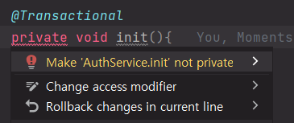
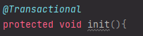
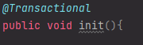
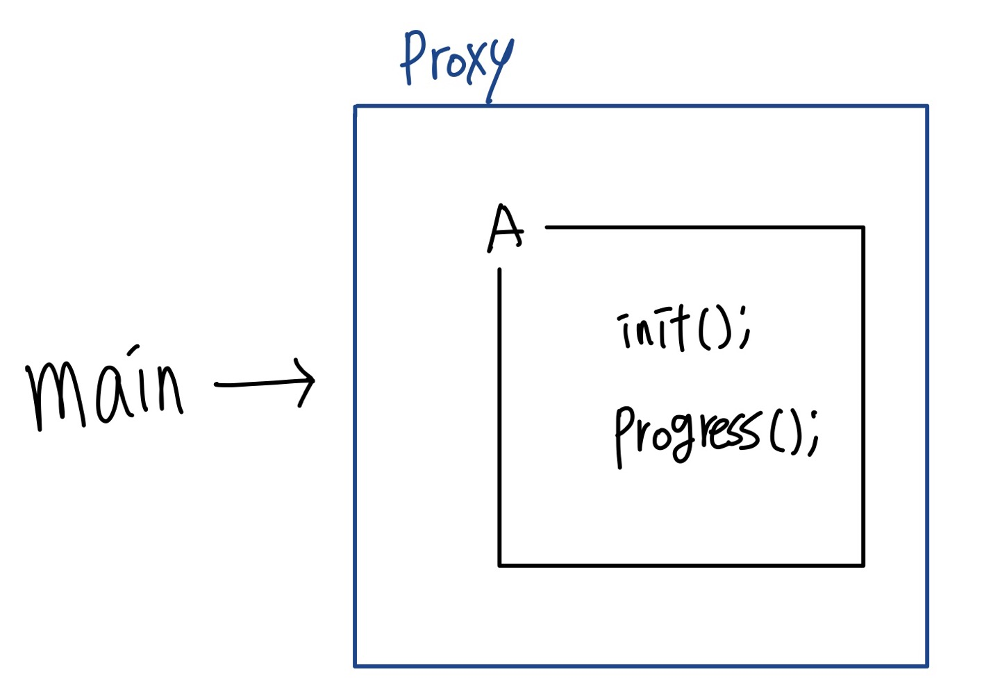
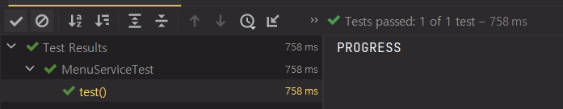
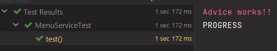
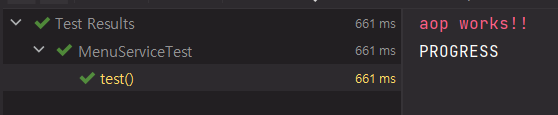

## 들어가며
트랜잭션을 공부하다보면서 자연스럽게 AOP에 대해 접하게 되었습니다.
제가 직접 경험하고 느꼈던 사실과 오해에 대해서 공유하려고 합니다.

## 첫 번째 사실: public이외의 메서드는 AOP가 걸리지 않는다.

실제 인텔리제이에서 `@Transactional` 어노테이션을 적용한 후 private 메서드를 선언하면 위와 같은 컴파일 에러를 띄워줍니다.
해석해보자면 private을 사용하지 말라는군요!

### 왜 private 메서드에는 `@Transactional`이 붙을 수 없을까요?🤔

해당 원인을 파악하려면 먼저 프록시에 대해서 알아봐야합니다. 
스프링 aop에서 프록시는 크게 `JDK Dynamic proxy`또는 `CGLIB`으로 작동합니다. 
그리고 spring 2.5버전 이후부터는 default로 `CGLIB`을 사용합니다.

CGLIB은 동적으로 상속을 통해 프록시를 생성합니다. 
따라서 private 메서드는 상속이 불가능하기 때문에 프록시로 만들어지지 않는것이죠!

그러면 아래처럼 `protected`나 `public`으로 메서드를 만들면 정상적으로 트랜잭션이 동작할까요? 
정답은 protected일 때 또한 정상 동작하지 않습니다🥲

 

분명히 인텔리제이로 확인을 해보면 컴파일 에러는 나오지 않는데 말이죠. 해당 이유는 앞서 말했던 JDK Dynamic proxy 가 원인이었기 때문입니다.
JDK Dynamic proxy는 인터페이스를 기반으로 동작합니다. 따라서 protected 메서드에서는 프록시가 동작할 수 없는 것이죠.
그래서 스프링에서는 일관된 AOP적용을 위해서 protected로 선언된 메서드 또한 트랜잭션이 걸리지 않도록 한 것입니다.
즉, 프록시 설정에 따라 트랜잭션이 적용되었다 안되었다 하는 변칙적인 결과를 막기 위함인거죠.

## 두 번째 사실: 같은 클래스내에서 트랜잭션이 걸린 메소드를 호출하면 트랜잭션이 작동하지 않는다.
```java
public class A {
    public void init() {
        this.progress();
    }

    @Transactional
    public void progress() {
    }
}
```
예를들어 다음과 같은 상황에서 `progress()`는 정상적으로 트랜잭션이 적용될까요?

이번에도 안됩니다.

Spring AOP에서 프록시의 동작 과정을 보면 프록시를 통해 들어오는 외부 메서드 호출을 인터셉트 하여 작동합니다. 바로 이러한 성격때문에 `self-invocation`이 라고 불리는 현상이 발생합니다.

프록시의 내부 빈에서 프록시를 호출 했다는 것이죠. 그림으로 보면 이해하는데 도움이 될것같아서 그려봤습니다.


main메서드에서 그림과 같이 A의 init()를 호출하고 init()에서 progress()를 호출하면 그림과 같이 프록시 내부에서 호출하게 됩니다.
따라서 proxy가 인터셉트하지 못해서 트랜잭션이 동작하지 않는것입니다.

## 오해: 그렇다면 내부 메서드에서 호출은 AOP적용이 불가능하다

해당 주장은 사실이 아닙니다. 공식문서를 잘 보면 해결 방법이 있습니다.
> self-invocation(in effect, a method within the target object calling another method of the target object) 
> does not lead to an actual transaction at runtime…

타겟 내에서 타겟의 다른 메서드를 호출할 때, 런타임에 실제 트랜잭션이 작동하지 않는다고 합니다. 즉, 런타임 시점에 작동은 안 하지만 이것을 컴파일 시점에 적용하면 된다는 것이죠.

그렇다면 어떻게 컴파일 시점에 프록시를 적용할 수 있을까요?

스프링에서 AOP를 구현하는 방식에는 스프링 AOP도 있지만 AspectJ라는 강력한 도구도 있습니다. AspectJ는 스프링AOP와 다르게 컴파일 시점에 위빙이 이루어집니다. 따라서 AspectJ를 사용하면 self-invocation문제를 해결할수 있는것이죠!

그런데 만약 Spring AOP를 쓰고있는 상황에서 이런 문제가 발생하면 어떡하죠? 이럴경우 다른 방법도 존재합니다!

### 첫번째 방법으로는 **`AopContext를 이용하는 방법`**입니다.

AopContext의 `currentProxy()` 메서드는 현재 AOP proxy를 반환합니다. 
이번엔 코드로 확인해봅시다.
```java
@Aspect
@Component
public class AopService {

    @Pointcut("execution(void kitchenpos.application.MenuService*.progress(..))")
    public void pointCut() {

    }

    @Before("pointCut()")
    public void before() {
        System.err.println("aop works!!");
    }
}
```
우선 aop를 적용해줍니다.
progress() 메서드가 동작하기 전에 `aop works!!` 라는 에러 메시지를 출력해주는 aop입니다.

```java
public void init(){
    this.progress();
}

public void progress(){
    System.out.println("PROGRESS");
}
```
그리고 다음과 같이 실행을 해주면 아래와 같이 적용되지 않습니다.

이번에는 AopContext를 활용하여 아래와 같이 수정해보겠습니다.
```java
public void init() {
    ((MenuService)AopContext.currentProxy()).progress();
}

public void progress() {
    System.out.println("PROGRESS");
}
```
그리고 `@EnableAspectJAutoProxy(exposeProxy = true)` 옵션을 적용해서 작동시켜 봅니다.

aop가 작동하는 것을 확인할 수 있습니다.

### 두 번째 방법으로는 `IoC 컨테이너 Bean을 활용한 방법`이 있습니다.

내부에서 빈을 호출하면 인터셉터가 작동하지 않으므로 외부에서 빈을 주입하는 방식으로 해결하는 것입니다.

- @Resource
- @Autowired
- @Inject

등 여러 방법이 있습니다.

모두 적용이 가능하지만 이번 예시에서는 `@Resource` 어노테이션을 사용하여 AOP를 적용해보겠습니다.

```java
public class MenuService {
    @Resource(name = "menuService")
    MenuService self;
    
    ...
}
```
위와 같이 `@Resuroce` 를 통해 빈 객체로 등록해주고 이번에는 `self.progress()`를 호출해줍니다.
```java
public void init(){
    self.progress();
}

public void progress(){
    System.out.println("PROGRESS");
}
```
해당 방법이 성공한 이유는 외부에서 내부 빈으로 호출을 하므로 아래와 같이 aop가 정상 동작합니다.


## 마무리

지금까지 트랜잭션과 AOP에 대한 사실과 오해를 잠깐 맛보았습니다.

트랜잭션을 공부하다보니 어쩌다가 AOP에 대해 공부하게 되었습니다.
AOP는 내용이 많고 어렵기도 해서 추가적인 학습들이 필요합니다.

AOP를 사용하면 부가 기능을 따로 추출하여 비즈니스 로직에만 집중할 수 있는 장점이 생기지만 
잘못 사용하면 그만큼 side-effect가 생깁니다.

이 글을 읽고 낯설었던 aop에 대해 한걸음 가까워졌으면 좋겠습니다!

## References

- [공식 문서](https://docs.spring.io/spring-framework/docs/current/reference/html/data-access.html#transaction-declarative-annotations)
- [stack-overflow](https://stackoverflow.com/questions/34197964/why-doesnt-springs-transactional-work-on-protected-methods)
