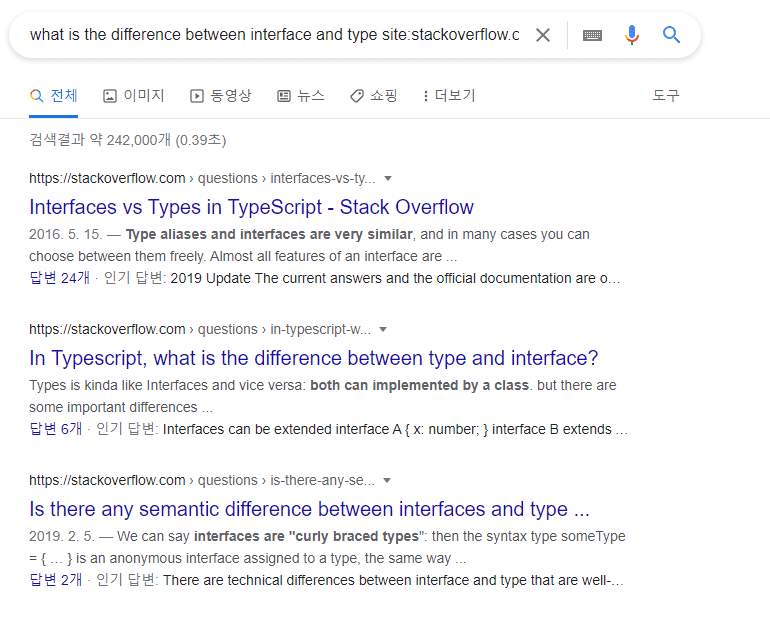
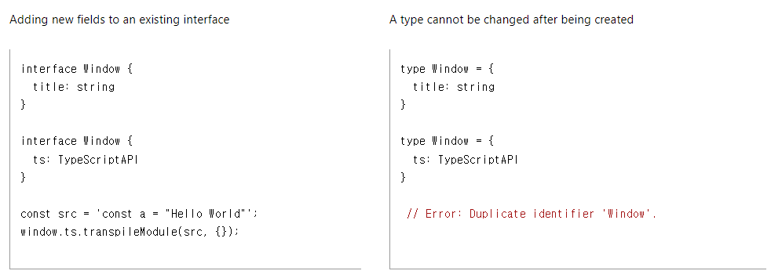

## what is the difference between interface and type alias?

typescript를 공부해본 사람이라면 위의 키워드를 사용해서 구글링을 해본 적이 있을 것이다. <br />
(최소한, 나는 그렇다…🙄)

실제로, 아래와 같이 단순히 interface와 type alias의 차이가 무엇인지에 대해 물어보는 전세계 개발자들을 찾을 수 있다.



이런 질문들을 할 수밖에 없는 게, type alias는 interface가 하는 것을 거의 다 대체 할 수 있는 것처럼 보이기 때문이다. 예를 들어, 아래와 같은 Person이라는 interface가 있는 데, 이는 객체에 대한 타입을 설정해준 것이다.

```typescript
interface Person = {
	name: string;
	age: number;
}

interface Person extends
```

똑같은 타입을 type alias를 활용해서도 똑같이 만들 수 있다.

```typescript
type Person = {
  name: string;
  age: number;
};
```

하지만, interface는 type alias이라면 가능한 generic type을 구현할 수는 없다. 이렇게만 본다면, 왜 굳이 interface라는 것을 typescript가 제공하고 있을까??라는 의문이 들 수밖에 없다. 오늘은, type alias와 interface가 각각 왜 존재하는 지 살펴보는 시간을 가져보려한다.

## type alias와 interface의 정의

먼저, 둘의 정의를 보면 무엇이 다른 지 알 수 있지 않을까해서 공식문서에서 정의를 찾아보았다.

> A type alias is exactly that - a name for any type. An interface declaration is another way to name an object type

즉, 둘 다 타입에 이름을 부여해주는 것이지만 type alias는 모든(any) 타입에 이름을 달아줄 수 있지만, interface는 오직 객체 타입에만 가능하다는 것이다. 이것이, type alias와 interface에 가장 명확한 차이가 아닐까한다.

하지만, 이렇다고 의문점이 해결된 것은 아니다. 위의 정의만 보더라도, type alias가 object에 대한 type을 선언해주는 interface를 대체할 수 있는 것처럼 보이기 때문이다.

interface의 존재의 의의에 대한 의문이 생기는 상황이다. 그래서, 많은 사람들이 혼란을 겪는 것 같다. 자세히 말하면, object에 대한 타입을 선언하는 데 type alias와 interface 중에 무엇을 사용해야하나에 대한 혼란이다.

## Differences Between Type Aliases and Interfaces (typescript 공식문서)

typescript 공식문서에 type alias와 interface의 차이에 관한 내용이 있다.

> Type aliases and interfaces are very similar, and in many cases you can choose between them freely. Almost all features of an interface are available in type, the key distinction is that a type cannot be re-opened to add new properties vs an interface which is always extendable.

해석을 해보면, interface의 대부분의 기능들은 type에서도 가능하고, 중요한 차이점이라고 한다면 type alias는 새로운 프로퍼티에 열려있지 않다는 것이고, interface는 항상 열려있다는 점이라는 것이다.

## type cannot be re-opened to add new properties vs an interface which is always extendable??

typescript 공식문서의 설명(type alias와 interface의 차이점)에서 중요한 키워드를 발견한 것 같다.

type alias는 새로운 프로퍼티에 열려있지 않다는 것이고, interface는 항상 열려있다

아래의 예시를 봐보자



왼쪽은 interface로 타입을 선언 했을 때의 코드이다.

interface 키워드를 통해서 선언된 Window라는 타입을 선언한 후, 바로 아래에서 다시 다른 프로퍼티를 가진 Window 타입을 선언해주었다. 선언된 타입의 이름과 같은 이름으로 새로운 타입을 선언했지만, 에러가 나지 않고 나중에 선언된 타입의 프로퍼티를 가지고 있는 것을 볼 수 있다. 그래서, interface는 확장 가능하다라고 설명하는 것 같다. (이를, 선언 병합이라고 한다.)

이에 반해, 오른쪽 코드를 보면 type alias를 통해서 Window 타입을 선언해주고, 다시 아래에서 Window 타입을 재선언 해주고 있다. interface에서는 에러가 나지 않앗지만, 여기서는 식별자 ‘Window’가 중복된다라는 에러를 보여주고 있다. 그래서, type은 새로운 프로퍼티를 추가할 수 없다고 하는 것 같다.

이제, interface와 type alias가 object에 대한 타입을 선언하는 과정에서 어떻게 다른 지는 알 것 같다. 근데, 왜 굳이 확장 가능한 방법과 확장 가능하지 않은 방법으로 나눠놓았을까?라는 의문이 강하게 들었다.

## 왜 굳이 확장 가능한 방법과 확장 가능하지 않은 방법으로 나눠놓았을까?

typescript 개발자들이 두 가지 방법을 모두 제공했다는 것은 각각 필요하기 때문에 만들 것이라고 추론이 가능하다. (개발자들은 중복을 싫어함😀)

확장 가능하지 않도록 타입을 선언할 수 있는(type alias) 방법이 존재하는 이유는 조금 명확한 것 같다. 타입의 속성들이 추후에 추가될 수도 있다면, 개발자들은 타입이 변할 수도 있다는 생각을 하면서 개발을 해야하기 때문이다. (마치 let보다는 const를 활용하여 상수로 선언해주는 게 좋은 이유가 비슷한 맥락이 아닐까 한다.)

그렇다면, 확장 가능한 방법은 어느 상황에서 필요할까?

먼저, interface를 활용하면 선언 병합(Declaration merging)이라는 것이 가능하다. 아래의 코드처럼, 기존에 선언된 타입을 확장해서 다른 속성을 추가로 선언할 수 있는 것이다.

```typescript
interface Person {
  name: string;
}

interface Person {
  age: number;
}

const user: Person = {
  name: 'al-bur',
  age: 21,
};
```

이는, 라이브러리를 사용하는 상황에서 추가적으로 타입의 속성들을 선언할 때 유용하다.

```typescript
// @emotion/react/types
export interface Theme {}

// emotion.d.ts
import '@emotion/react';

declare module '@emotion/react' {
  export interface Theme {
    colors: typeof Colors;
  }
}
```

emotion의 types를 보면 interface 키워드를 통해 Theme이라는 타입을 제공해준다. emotion 라이브러리를 사용하는 개발자는 해당 타입에 선언 병합을 활용해 본인들이 원하는 속성들을 선언해 사용해줄 수 있다.

## 결론

type-alias는 모든 타입을 선언할 때 사용될 수 있고, interface는 객체에 대한 타입을 선언할 때 사용될 수 있다. 둘 다 객체에 대한 타입을 선언하는 데 사용될 수 있는데, 확장 측면에서 사용 용도가 달라진다. 확장이 불가능한 타입을 선언하려면 type-alias를 사용하면 되고, 확장이 가능한 타입을 선언하려면 선언 병합이 가능한 interface를 사용하면 된다.

이외에도 여러 차이점들이 있을 텐데, 꾸준히 탐구해보려고한다

## Reference

https://www.typescriptlang.org/docs/handbook/2/everyday-types.html#differences-between-type-aliases-and-interfaces
