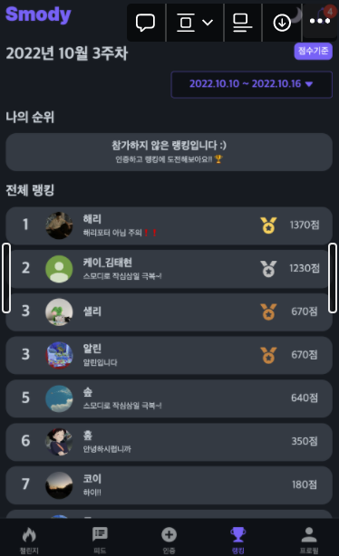

## 상황



스모디 프로젝트를 하면서 랭킹 기능을 도입하기로 했습니다. 랭킹 기능은 유저가 활동을 했을 때, 활동에 따라 랭킹 점수를 부여해야 합니다. 저희 서비스는 챌린지에 도전하고 매일 챌린지에 해당하는 활동을 인증하여 총 3회 인증 시 성공하는 사이클로 이루어져 있습니다. 위 기능을 추가하기 위해선 기존 인증을 하는 서비스 로직에 랭킹 점수를 올리는 기능을 추가해야 합니다. 더즈와 페어로 구현하면서 이벤트 적용, 트랜잭션 분리, 비동기 처리 등 활동과 랭킹 관련 로직을 분리하는 과정을 글로 정리했습니다.

## 용어 정리

- 인증: 사용자가 챌린지에 관련된 글과 이미지로 인증
- 사이클(Cycle): 총 3번의 인증으로 이루어져 있으며 3번의 인증을 마치면 챌린지에 대해 한 번의 사이클을 성공(NOTHING -> FIRST -> SECOND -> SUCCESS)
- 랭킹 정책: 3번의 인증에 따라 점수를 부여한다. (FIRST:10점, SECOND:30점, SUCCESS:60점)

인증을 하면 해당 사용자의 랭킹 점수를 올려주어야 합니다.

```java
@Transactional
public ProgressResponse increaseProgress(TokenPayload tokenPayload, ProgressRequest progressRequest) {
    // 인증
    Cycle cycle = cycleService.increaseProgress(
        tokenPayload.getId(),
        progressRequest.getCycleId(),
        progressRequest.getProgressTime(),
        new Image(progressRequest.getProgressImage(), imageStrategy),
        progressRequest.getDescription()
    );
	// 랭킹 관련 로직
    return new ProgressResponse(cycle); // response dto 반환
}
```

사용자가 글과 이미지로 인증을 하면 위 서비스 메서드가 호출됩니다. 기존 활동 로직이 끝나면 랭킹 로직 관련 로직 부분에 구현해주어야 합니다.

## 인증과 랭킹 로직은 같은 트랜잭션인가?

페어인 더즈와 이에 대해 많은 이야기를 했습니다. 2가지 의견이 있었습니다.

> 같은 트랜잭션이다!
> 

트랜잭션을 합치게 되면 랭킹 관련 로직에서 에러가 발생했을 때 인증한 기록들도 롤백됩니다. 랭킹 점수에는 정합성이 맞지만, 트랜잭션의 전파가 넓어지고 랭킹 점수를 올릴 때 에러가 발생했는데 인증했던 기록도 롤백된다는 것이 맞는가라는 의문이 있습니다.

> 다른 트랜잭션이다!
> 

트랜잭션을 분리하면 랭킹 관련 로직에서 에러가 발생하더라도 인증했던 기록에는 영향을 주지 않습니다. 하지만, 인증을 하고 랭킹 점수가 올라가지 않아 점수가 누락되는 상황이 생길 수 있습니다.

> 트랜잭션은 분리하되 점수가 누락되는 상황을 예방하자!
> 

트랜잭션을 분리했을 때 문제가 되는 상황은 점수가 누락되는 것 입니다. 점수가 누락되는 문제만 해결된다면 트랜잭션을 분리하는 것이 좋겠다고 결정했습니다.

## 이벤트를 적용하여 결합도 낮추기

### Spring에서 이벤트 사용 방법

> • Event publication, namely to beans that implement the `ApplicationListener` interface, through the use of the `ApplicationEventPublisher` interface. -spring docs-
> 

Spring의 `ApplicationContext` 는 이벤트를 활용할 수 있습니다. `BeanFactory` 에서 향상된 기능 중 하나입니다. `ApplicationEventPublisher` 인터페이스로 이벤트를 `ApplicationContext` 에 넘겨주고 이를 `Listener` 가 받아서 처리하는 구조로 되어있습니다. 여기선 어노테이션 기반의 `Listener` 로 설명하겠습니다.

### ApplicationEventPublisher

```java
@FunctionalInterface
public interface ApplicationEventPublisher {

	default void publishEvent(ApplicationEvent event) {
		publishEvent((Object) event);
	}

	void publishEvent(Object event);
}
```

`ApplicationContext` 에 이벤트를 발행해주는 인터페이스입니다. `publishEvent(Object event)`  메서드의 `event` 는 `ApplicationEvent` 추상 클래스를 상속한 객체여도 되지만, 직접 구현한 POJO로도 동작을 합니다. 이 객체에는 이벤트에 필요한 데이터를 저장할 수 있습니다.

### @EventListener

`ApplicationContext` 에서 이벤트가 발행되면 `@EventListener` 가 붙은 적합한 메서드를 찾아 실행합니다. `publicEvent(Object event)` 로 발행했던 `event` 를 파라미터로 받는 메서드를 모두 실행합니다. 이 때 반드시 이벤트를 받을 메서드의 파라미터는 `event` 만 가지고 있어야 합니다.

### 이벤트로 랭킹 로직 분리

```java
@Transactional
public ProgressResponse increaseProgress(TokenPayload tokenPayload, ProgressRequest progressRequest) {
    // 인증
    Cycle cycle = cycleService.increaseProgress(
        tokenPayload.getId(),
        progressRequest.getCycleId(),
        progressRequest.getProgressTime(),
        new Image(progressRequest.getProgressImage(), imageStrategy),
        progressRequest.getDescription()
    );
	// 이벤트 발행
    applicationEventPublisher.publishEvent(new CycleProgressEvent(cycle));
    return new ProgressResponse(cycle);
}
```

```java
@EventListener
public void handle(CycleProgressEvent event) {
		Cycle cycle = event.getCycle();
    // 1~2번 과정
    List<RankingActivity> activities = findTargetActivities(cycle);
	// 3번
    updateActivities(cycle.getLatestCycleDetail(), activities);
}

private List<RankingActivity> findTargetActivities(Cycle cycle) {
	// 1번
    LocalDateTime latestProgressTime = cycle.getLatestProgressTime();
    List<RankingPeriod> inProgressPeriods = rankingService.findInProgressPeriod(latestProgressTime);
    addPeriodIfAbsent(inProgressPeriods, latestProgressTime);
    Member member = cycle.getMember();
	// 2번
    List<RankingActivity> myActivities = rankingService.findAllActivity(inProgressPeriods, member);
    addActivityIfAbsent(inProgressPeriods, member, myActivities);
    return myActivities;
}
```

인증 로직에서 `CycleProgressEvent(cycle)` 을 발행하면 위 이벤트 메서드가 실행됩니다.

1. 인증한 사이클의 최근 인증한 시간 즉 방금 인증한 시간을 조회하고 이에 맞는 주간 랭킹 기간(`RankingPeriod`)을 조회한다.
    - 만약 랭킹 기간이 없다면 그 주의 랭킹 기간을 생성한다.
2. 랭킹 기간들을 순회하면서 사용자가 참여중인 랭킹 활동을 조회한다.
    - 만약 랭킹 기간에 참여중이지 않는다면 랭킹 활동을 생성한다.
3. 인증한 활동에 대한 점수를 랭킹 활동에 추가한다.

## 트랜잭션 분리

이벤트를 활용하여 로직을 분리했지만, 위 로직은 활동과 랭킹이 같은 트랜잭션으로 묶여있습니다. 그리고 로직은 분리했지만, 동기적으로 실행하게 됩니다.

```java
@Transactional
public ProgressResponse increaseProgress(TokenPayload tokenPayload, ProgressRequest progressRequest) {
    // 인증
	Cycle cycle = cycleService.increaseProgress(
        tokenPayload.getId(),
        progressRequest.getCycleId(),
        progressRequest.getProgressTime(),
        new Image(progressRequest.getProgressImage(), imageStrategy),
        progressRequest.getDescription()
    );
	// 이벤트 발행 (랭킹 로직 처리)
    applicationEventPublisher.publishEvent(new CycleProgressEvent(cycle));
	// 이벤트 처리가 끝나면 이어서 실행
    return new ProgressResponse(cycle);
}
```

`@EventListener` 는 발행되자마자 실행됩니다. 하나의 스레드에서 실행되기 때문에 이벤트 처리가 끝나야 이벤트를 발행한 곳의 남은 로직을 처리하고 트랜잭션을 커밋할지 롤백할지 결정하게 됩니다.

### `@TransactionalEventListener`를 사용하여 이벤트 발행 시점 결정하기

이 어노테이션을 사용하면 이벤트 발행 시점을 결정할 수 있습니다.

```java
@TransactionalEventListener(phase = TransactionPhase.AFTER_COMMIT)
public void afterCommit(Event event) {
	// 이벤트 발행 주체가 커밋되면 실행 (default)
}

@TransactionalEventListener(phase = TransactionPhase.AFTER_ROLLBACK)
public void afterRollBack(Event event) {
	// 이벤트 발행 주체가 롤백되면 실행
}

@TransactionalEventListener(phase = TransactionPhase.AFTER_COMPLETION)
public void afterCompletion(Event event) {
	// 이벤트 발행 주체가 끝나면 실행 (롤백, 커밋)
}

@TransactionalEventListener(phase = TransactionPhase.BEFORE_COMMIT)
public void beforeCommit(Event event){
	// 이벤트 발행 주체가 커밋되기 전에 실행
}
```

`phase` 를 적어주지 않으면 default로 커밋 후에 실행하게 됩니다.

> 그럼 `@TransactionalEventListener(phase = TransactionPhase.AFTER_COMMIT)` 을 사용해서 이벤트 발행 주체가 커밋하고 실행하도록 하면 되겠네요?
> 

커밋 후에 이벤트를 발행해서 이벤트에서 에러가 발생하더라도 이벤트를 발행한 주체는 이미 커밋이 됐기 때문에 영향을 주지 못합니다. 하지만, 같은 트랜잭션으로 묶여있는 상황에서 이벤트를 발행하기 전에 커밋이 됐기 때문에 조회는 가능하지만, 쓰기는 불가능합니다. 트랜잭션이 사라진 것이 아니라 이벤트가 이미 커밋된 트랜잭션에 참여한 상황이 발생한 것 입니다.

```java
@TransactionalEventListener // default = TransactionPhase.AFTER_COMMIT
public void handle(CycleProgressEvent event) {
	Cycle cycle = event.getCycle();
    // 1~2번 과정
    List<RankingActivity> activities = findTargetActivities(cycle); // insert 쿼리 발생
	// 3번
    updateActivities(cycle.getLatestCycleDetail(), activities); // update 쿼리 발생
}
```

1~3번 과정에서 랭킹 활동과 기간이 없다면 생성하는 로직도 포함되어 있고 활동의 점수들을 추가도 하여 insert, update 쿼리문을 사용해야 합니다. 만약 위 처럼 작성되어 있고 랭킹 관련 서비스 로직이 `@Transactional` 로 되어 있으면 insert와 update 쿼리문을 실행하지 못하게 됩니다.

```java
private List<RankingActivity> findTargetActivities(Cycle cycle) {
		// 1번
    LocalDateTime latestProgressTime = cycle.getLatestProgressTime();
    List<RankingPeriod> inProgressPeriods = rankingService.findInProgressPeriod(latestProgressTime);
    addPeriodIfAbsent(inProgressPeriods, latestProgressTime); // insert 쿼리 발생
    Member member = cycle.getMember();
		// 2번
    List<RankingActivity> myActivities = rankingService.findAllActivity(inProgressPeriods, member);
    addActivityIfAbsent(inProgressPeriods, member, myActivities); // insert 쿼리 발생
    return myActivities;
}

// 만약 이번주 랭킹 기간이 없다면 생성한다. -> Insert 쿼리 발생
private void addPeriodIfAbsent(List<RankingPeriod> periods, LocalDateTime progressTime) {
    if (periods.isEmpty()) {
        periods.add(rankingService.createWeeklyPeriod(getMonday(progressTime)));
    }
}

// 만약 이번주 랭킹 활동이 없다면 생성한다. -> Insert 쿼리 발생
private void addActivity(Member member,
                         List<RankingActivity> myActivities,
                         List<RankingPeriod> myPeriods,
                         RankingPeriod inProgressPeriod) {
    if (!myPeriods.contains(inProgressPeriod)) {
        myActivities.add(rankingService.createFirstActivity(member, inProgressPeriod));
    }
}

// 활동 점수들을 업데이트 한다. -> Update 쿼리 발생
private void updateActivities(CycleDetail cycleDetail, List<RankingActivity> activities) {
    Progress progress = cycleDetail.getProgress();
    for (RankingActivity activity : activities) {
        activity.plusPoint(progress);
    }
}
```

- `RankingService.createWeeklyPeriod()` → insert 쿼리
- `RankingService.createFirstActivity()` → insert 쿼리
- RankingActivity의 상태 변경으로 인한 변경 감지 -> update 쿼리

### Propagation.REQUIRES_NEW

트랜잭션 전파 속성을 `REQUIRES_NEW` 로 바꾸면 트랜잭션을 분리할 수 있습니다.

```java
@Transactional(propagation = Propagation.REQUIRES_NEW)
@TransactionalEventListener // default = TransactionPhase.AFTER_COMMIT
public void handle(CycleProgressEvent event) {
		Cycle cycle = event.getCycle();
    // 1~2번 과정
    List<RankingActivity> activities = findTargetActivities(cycle);
		// 3번
    updateActivities(cycle.getLatestCycleDetail(), activities);
}
```

## 비동기

앞서 말한 트랜잭션 전파 레벨을 수정하는 것으로 트랜잭션도 분리도 할 수 있었습니다. 그런데 만약 이벤트를 발행했을 때 해당 이벤트를 여러번 처리하게 된다면 어떻게 될까요?

1. 활동을 인증한다.
2. 인증을 했다는 이벤트를 발행한다.
    1. 인증을 했다는 푸시 알림을 사용자에게 보낸다.
    2. 인증에 맞는 랭킹 점수를 올린다.

위 상황은 하나의 스레드에서 실행하게 됩니다. 따라서 인증, 푸시 알림, 랭킹 중 하나라도 예상치 못한 에러가 발생하면 순서에 따라 서로 영향을 줄 수 있는 것이죠.

- 인증한다.
- 푸시 알림을 보낸다. (에러)
- 랭킹 점수를 올린다. (무시)

트랜잭션 분리와 더불어 더 확실하게 이벤트가 서로 영향을 주지 않으려면 비동기를 사용해야 합니다.

```java
@Async
@TransactionalEventListener // default = TransactionPhase.AFTER_COMMIT
public void handle(CycleProgressEvent event) {
		Cycle cycle = event.getCycle();
    // 1~2번 과정
    List<RankingActivity> activities = findTargetActivities(cycle);
		// 3번
    updateActivities(cycle.getLatestCycleDetail(), activities);
}
```

```java
@SpringBootApplication
@EnableAsync
public class SmodyApplication {

    public static void main(String[] args) {
        SpringApplication.run(SmodyApplication.class, args);
    }
}
```

메서드에 `@Async` 를 붙이고 `@SpringBootApplication` 이 붙은 main 메서드가 있는 클래스에 `@EnableAsync` 를 붙여주면 쉽게 비동기로 처리할 수 있습니다.

> Event listeners are encouraged to be as efficient as possible, individually using asynchronous execution for longer-running and potentially blocking operations.
>

`@EventListener` 의 설명에 보면 비동기로 사용할 것을 권장하고 있습니다. 그래도 이벤트를 적용하게 된다면 무조건 비동기를 사용하는 것 보다 비즈니스 정책을 고려하여 적절하게 비동기, 트랜잭션 분리를 하는 것이 좋을 것 같습니다.

## 참고
- https://docs.spring.io/spring-framework/docs/current/reference/html/core.html#context-introduction
- https://www.baeldung.com/spring-events
