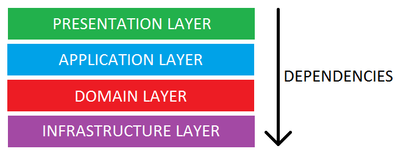

미션을 진행하며 많은 크루들이 DAO 클래스를 사용해서 DB에 접근했습니다. 대부분의 크루가 DAO 클래스에 Spring의 @Repository를 사용하는 것을 봤습니다.
_왜 DAO를 Repository라고 하지? DAO가 Repository의 일종인가?_ 싶었는데, DAO와 Repository라는 클래스를 함께 사용하는 크루도 있어서 매우 혼란스러웠습니다.

<br>

조금 찾아보니, Spring 공식 문서의 @Repository에 대한 설명은 다음과 같습니다.

> Teams implementing traditional Jakarta EE patterns such as “Data Access Object” may also apply this stereotype to DAO
> classes, though care should be taken to understand the distinction between Data Access Object and DDD-style
> repositories
> before doing so.

위의 설명에 따르면 DAO 클래스에 @Repository를 사용할 수 있지만, **DAO와 DDD에서 정의된 Repository의 차이**를 잘 알고
조심해서 사용해야 한다고 합니다.  
그러면 두 개념이 어떻게 다를까요? 나름대로 이해한 바를 아래의 차례로 정리해보겠습니다.

1. DAO Pattern과 Repository Pattern의 등장배경
2. DAO Pattern
3. Repository Pattern


<br>

## DAO와 Repository의 등장배경

Application을 구현할 때, [영속성(Data Persistence)](https://www.mongodb.com/databases/data-persistence)을 가진 영구저장소를 필요로 하는 경우가
많습니다. Application에서 영구저장소에 접근하기 위해서는 각 영구저장소 벤더가 제공하는 API를 사용합니다.   
이 때, 만약 영구저장소의 API가 다른 비즈니스 로직들과 함께 존재한다면 어떤 문제들이 발생할까요?  


1. **구현체와 로직이 너무 강한 결합을 가진다.**<br> 만약 기존의 영구저장소와 다른 벤더의 영구저장소를 사용하게 된다면, 비즈니스 로직들 내부에서 기존 영구저장소의 API를 사용한 모든 부분을 변경해야 합니다. 즉, 객체지향의 5원칙 중 확장에 대해서는 열려있고 수정에는 닫혀 있어야 한다는 OCP(개방-폐쇄 원칙)를 위반하게 됩니다.
   
2. **계층화가 깨진다.** <br>
   보통 웹 Application의 구조는 아래와 같은 [layered architecture](https://www.baeldung.com/cs/layered-architecture)로 되어있습니다.
   
   영구저장소는 infrastructure 계층에 속하고, 비즈니스 로직들은 Application 계층에 속하는데, 영구저장소에 대한 API가 application 계층에 속하게 되면 계층화가 깨지게 됩니다.
   그 결과, Layered architecture의 이점인 모듈화, 유연성 등이 사라지게 되는 문제가 발생합니다.

그러므로 비즈니스 로직과 영구저장소의 API를 분리할 필요가 있습니다.   
즉, 데이터에 접근하는 행위를 추상화, 캡슐화해서 비즈니스 로직과 데이터 접근 로직을 분리해야 합니다. 이를 구현하기 위한 Pattern으로 DAO
Pattern과 Repository Pattern이 등장했습니다.

<br>

## DAO Pattern

DAO(Data Access Object)는 이름 그대로 데이터에 접근하기 위한 객체입니다. 이름부터 자신이 영속성 계층과 연관이 있음을 버젓이 나타내고 있습니다. 그 자체가 영속성의 추상화이기 때문에 도메인 계층이 아닌
**영속성 계층에 속합니다**. (도메인 패키지에 DAO가 있으면 어색한 느낌...) 따라서 일반적으로 DAO는 DB의 테이블과 일치합니다. 즉, 테이블 중심이라고 할 수 있습니다.
필연적으로, DAO와 매핑되는 엔티티는 테이블의 칼럼과 (거의) 동일한 필드를 가지게 됩니다. 

```java
public class Car {
    
    private final Long id;
    private final String name;
    private final int position;

    public Car(String name, int position) {
        this.id = null;
        this.name = name;
        this.position = position;
    }
    
    //...
  
}
```
위와 같이 Car 클래스가 존재한다고 하겠습니다. <br>
이제 Car 객체의 데이터를 DAO를 사용하여 영속성 계층에 CRUD를 해보겠습니다.  
이 때, 일반적이지는 않지만 MySQL과 MongoDB 모두 사용하는 Application이라고 가정하겠습니다. 각 영구저장소의 벤더에 따라서 DAO를 만들어야 하므로 저는 DAO 인터페이스를 하나 만들어서 추상화하려고 합니다. 그리고 각 영구저장소의 벤더에 따라 DAO 인터페이스의 구현체를 만듭니다. 각 구현체에서는 해당하는 영구저장소의 API들을 사용합니다.

```java
public interface CarDao {
    void create(Car car);

    Car read(Long id);

    void update(Car car);

    void delete(Long id);
}
```

```java
public class MySQLCarDao implements CarDao {

    //DB connection etc...

    @Override
    public void create(Car car) {
        String sql = "INSERT INTO CARS(id, name, position) VALUES(?, ?, ?)";
        //parameter binding etc...
    }

    @Override
    public Car read(Long id) {
        String sql = "SELECT * FROM CARS WHERE id = ?";
        //parameter binding etc...
    }

    //...
  
}
```

```java
public class MongoDBCarDao implements CarDao {

    //DB connection etc...

    @Override
    public void create(Car car) {
        //doc -> Document 인스턴스
        doc.put(car.getName(), car.getPosition());
        //etc...
    }

    @Override
    public Car read(Long id) {
        //MongoCollection의 find() 메서드 이용
        Document doc = collection.find(eq("id", id));
        //etc...
    }

    //...
}
```

이처럼, 직접적인 DB와의 상호작용을 추상화하고 쿼리를 실행하는 객체를 DAO라고 하고, DAO를 이용하여 데이터에 접근하는 Pattern을 DAO Pattern이라고 합니다.

<br>

## Repository Pattern

네이버 사전에 등록된 repository의 의미는 아래와 같습니다.


저장소라는 뜻이네요.
Spring 공식 문서에 있는 @Repository에 대한 설명도 다음과 같습니다.

> Indicates that an annotated class is a “Repository”, originally defined by Domain-Driven Design (Evans, 2003) as “a
> mechanism for encapsulating storage, retrieval, and search behavior which emulates a collection of objects”.

즉, Repository는 단순히 저장소라는 의미입니다. 이름에서는 전혀 영속성 계층과 연관이 있음을 알 수 없습니다. (그리고 실제로 연관이 없을 수도 있습니다!) 그저 객체들의 집합(collection)의 관리를 추상화한 메커니즘일 뿐입니다.
도메인과 아주 밀접한 관계가 있고, 영속성 계층과의 연관이 불확실하므로 **Repository의 인터페이스는 도메인 계층에 속해야합니다**. 무슨 말인지 감이 오시나요?  

조금 더 명확한 설명을 위해 코드를 한번 작성해보겠습니다.

```java
public class Cars {

    private final List<Car> cars = new ArrayList<>();
    
    public void save(Car car) {
        cars.add(car);
    }
    
    public Car read(int index) {
        return cars.get(index);
    }
    
    public void delete(int index) {
        cars.remove(index);
    }
}
```
Car의 일급컬렉션인 Cars는 필드로 Car의 리스트를 가지고 있습니다. 그리고 이 리스트에 Car를 저장하고, 가져오고, 삭제하는 메서드를 제공하고 있습니다.  
그러면 우리는 이 Cars를 Car의 in-memory repository라고 부를 수 있습니다. 말 그대로 저장소(Car 리스트)의 관리 역할을 하니까요!  
그러면 이 Cars라는 클래스는 어디에 위치해야 할까요? Car가 존재하는 도메인 패키지에 있는 것이 자연스럽겠죠?  

이처럼, `객체의 정보를 가진 저장소에 대한 관리`에 대한 책임을 위임받은 인터페이스인 Repository를 사용한 Pattern을 Repository Pattern이라고 합니다.  
저장소는 in-memory에 위치할 수도 있고, application 외부의 어떤 file이 될 수도 있습니다. 어디에 저장하는지가 중요한 것이 아니라, 그냥 어떤 저장소에 데이터를 넣고, 읽어오고, 삭제하는 역할을 해주는 것이 repository의 역할이니까요.  

마찬가지로, Car의 데이터를 영속성 계층에 저장할 때에도 repository pattern을 사용할 수 있습니다.
```java
public class CarDatabaseRepository {
    
    public void save(Car car) {
        // Database에 Car를 저장
    }
    
    public Car find(Long id) {
        // Database에서 Car를 조회
    }
    
    public void delete(Long id) {
        // Database에서 Car를 삭제
    }
}
```
여기서, DAO와 repository가 혼동이 생깁니다. repository가 관리하는 저장소가 영속성 계층에 위치할 때, 이 repository는 DAO와 동일하게 보이거든요. CarDao와 CarDatabaseRepository가 비슷하게 보이지 않나요?  
그러나 "_영속성 계층에 위치한 저장소를 관리하는 repository는 DAO다!_"라고 하기 어려운 개념적인 이유가 있습니다. 

혹시 CarDao와 CarDatabaseRepository의 차이를 눈치채셨나요?  
네, CarDatabaseRepository에는 update에 관한 메서드가 존재하지 않습니다. 왜 그럴까요? 아래의 코드로 해당 개념을 설명하겠습니다.

```java
public void whyNoUpdateInRepository() {
    Car car1 = new Car("머스탱", 3);
    Car car2 = new Car("박스터", 1);
  
    Cars cars = new Cars();
  
    cars.save(car1);
    cars.save(car2);
  
    car1.setName("리오의 머스탱");
    car2.setName("박스터의 박스터");
  
    Car savedCar1 = cars.read(0);
    Car savedCar2 = cars.read(1);
  
    System.out.println(savedCar1.getName()); // 리오의 머스탱
    System.out.println(savedCar2.getName()); // 박스터의 박스터
}
```
위의 코드에서 마지막 출력 때 주석에 달린 대로 각 Car들의 변경된 이름이 나오는 것이 너무나 자연스러워보입니다. savedCar1이 Car1과 동일하고, savedCar2가 Car2와 동일할테니까요.
이게 바로 repository에는 update 메서드가 없는 이유입니다. 

[StackOverFlow의 글](https://stackoverflow.com/questions/8550124/what-is-the-difference-between-dao-and-repository-patterns)
에 이런 내용이 있습니다.

> A method like Update is appropriate on a DAO, but not a Repository. When using a Repository, changes to entities are
> usually tracked by a separate UnitOfWork.

CRUD는 DB의 가장 기본적인 기능이고, DAO는 DB의 테이블과 밀접하게 연관되어 있습니다. 그러므로 DAO에 update 메서드가 존재하는 것이 너무나 당연합니다.  
그러나 repository는 다릅니다. 위의 코드에서처럼 Car1과 Car2가 Cars 내부의 Car리스트에 담긴다고 해서 새로운 객체가 되는 것이 아니기 때문에, 이름을 변경하면 당연히 변경된 이름이 나올 겁니다.  
그런데 저장소가 영속성 계층에 위치한다면 어떨까요? application에서 Car1과 Car2의 이름을 바꾸면 자동으로 Database의 row 내용도 변할까요? 당연히 바뀌지 않을 겁니다. 그치만 repository pattern을 사용한다면 DB의 내용도 당연하게 바뀌어야 합니다. 저장소가 어디에 위치하냐에 따라서 repository의 책임이 달라지면 안되니까요. 그러므로 외부 저장소(database나 file 등)에 대한 repository는 update 메서드 없이 객체의 변경이 저장소에 반영되도록하는 기능을 지원해야합니다.      
이것이 repository가 update 메서드를 지원하지 않는 이유이고, JPA의 영속성 컨텍스트에서 `변경 감지`가 이루어지는 이유입니다. 인용한 문장에 있는 [UnitOfWork](https://zetlos.tistory.com/1179902868)라는 디자인 패턴의 개념을 간단하게 설명해봤습니다. 더 자세히 알고 싶으시다면 링크된 블로그를 참고해주세요! 

---
### 마치며

이상으로 DAO와 Repository에 대해 알아봤습니다.  
앞으로도, 간단한 어노테이션이라도도 정확하게 개념을 알아서 적절하게 사용할 수 있도록 노력하려고 합니다.
긴 글 읽어주셔서 감사합니다!

### 참고

- [스프링 공식문서](https://docs.spring.io/spring-framework/docs/current/javadoc-api/org/springframework/stereotype/Repository.html)
- [StackOverFlow](https://stackoverflow.com/questions/8550124/what-is-the-difference-between-dao-and-repository-patterns)
- [Baeldung](https://www.baeldung.com/java-dao-vs-repository)
