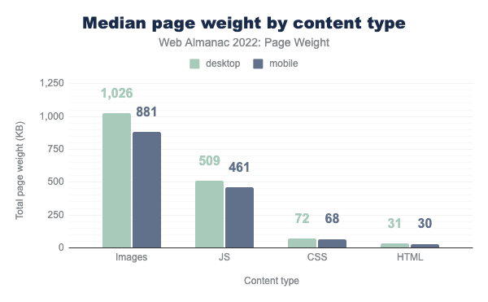
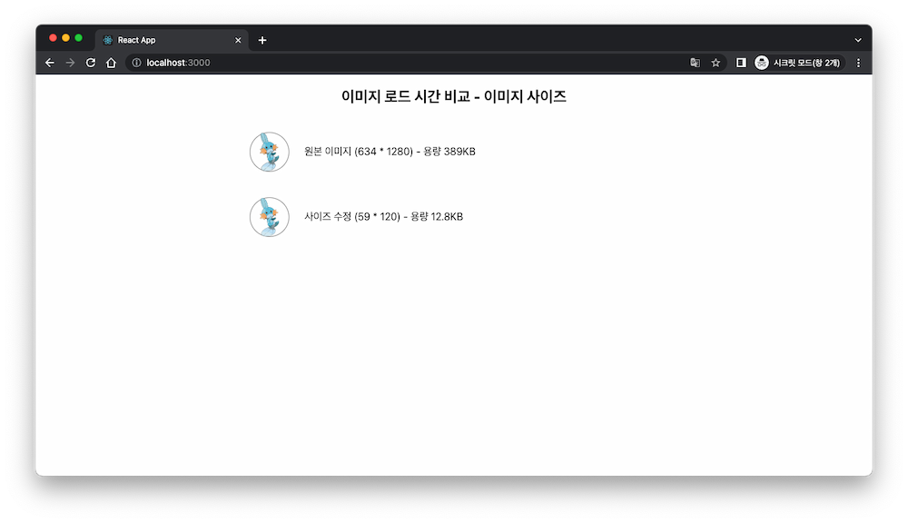
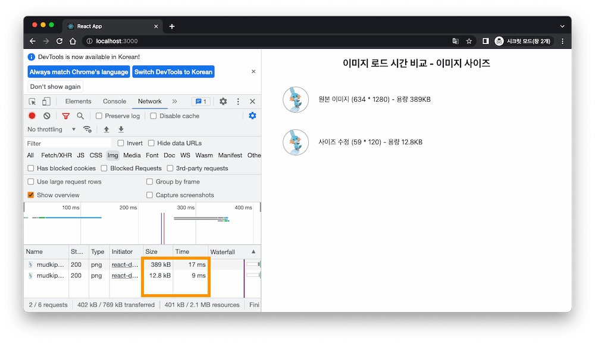
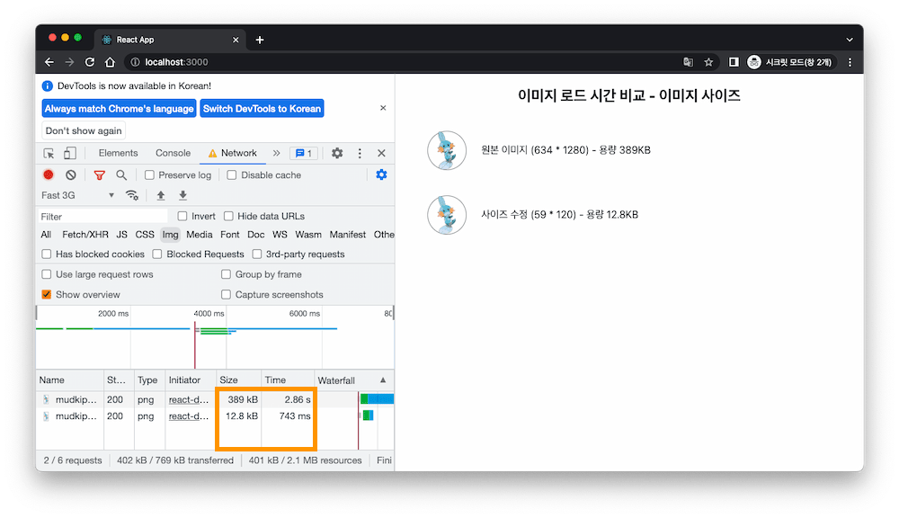
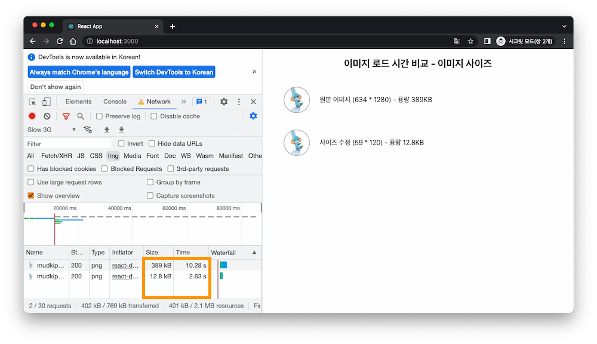
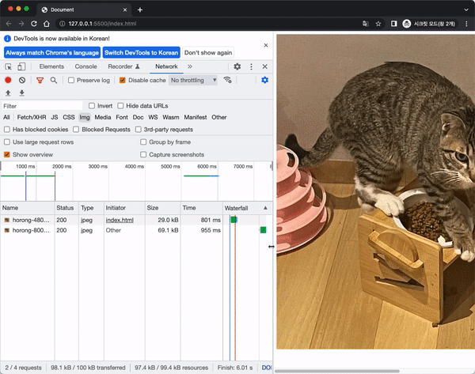

## 들어가며

사용하고자 하는 서비스의 기능은 잘 구현되어 있지만, 사용자에게 제공하는 시간이 느리다면 좋은 서비스라고 할 수 있을까? 사용자의 경험을 고려해 봤을 때, 기능적인 측면도 중요하지만 다양한 기기와 네트워크 환경에서도 원활하게 제공하기 위해서 속도는 중요한 요소이다. 실제로, BBC는 페이지 로드 시간이 `1초` 추가될 때마다 사용자 수가 추가로 `10%` 감소한다는 것을 발견했다. 속도 향상을 위해 최적화에 관심을 가지게 되었고, 이 중 이미지를 최적화하는 간단한 방법을 작성해 본다.

## 웹 페이지 용량에서 이미지가 차지하는 비중

웹 페이지를 보여주기 위해 서버에 리소스(HTML, CSS, Javascript, 이미지, 동영상, 폰트 등)를 요청해 받아온다. 그렇다면 웹 페이지 용량에서 이미지가 차지하는 비중은 얼마일까?

<figure align="center">
  
  <figurecaption>출처: Web Almanac</figurecaption>
</figure>

<br>

위의 통계에서 이미지가 웹 페이지 용량의 가장 큰 비중을 차지하는 것을 볼 수 있다. 이미지가 많은 페이지라면 이 용량을 줄이는 것만으로 성능 향상을 가져올 수 있을 것이다. 이미지의 용량을 줄이는 여러 가지 방법 중, 이미지 사이즈 설정을 통한 방법에 대해 알아보자.

## 렌더링 사이즈에 맞추기

특정 크기로 보이는 이미지에서 이미지 사이즈 설정 전후 웹페이지 로딩 속도 차이를 비교해 보았다.
(아래의 내용은 리액트 개발 환경에서 진행했다.)



직경 60px 크기의 원에 이미지를 넣는다고 가정해 보자. 상단의 이미지는 원본 이미지로 용량이 `389kb`이고, 하단의 이미지는 크기를 축소한 이미지로 용량이 `12.8kb`이다. 보이는 크기에 맞게 축소했을 뿐인데 용량을 `97%`나 줄일 수 있다. 이번엔, 여러 네트워크 상황에서 두 이미지를 받아오는 시간을 비교해 보자.





원본 이미지가 현재 사용하는 네트워크 속도에서 `2배`, Fast 3G 환경에서 `4배`, Slow 3G 환경에서 `4배` 더 오래 걸리는 것을 확인할 수 있다.

## 반응형 이미지

이번에는 데스크톱과 모바일 환경에서 이미지를 생각해 보자. 두 환경은 화면의 크기가 다르므로, 보이는 이미지의 크기도 다르다. 데스크톱의 큰 화면과 모바일의 작은 화면을 비교했을 때, 데스크톱의 큰 이미지는 모바일에서 필요하지 않을 수 있다. 이런 상황에서 반응형 이미지를 사용할 수 있다. 반응형 이미지는 환경에 맞게 적절한 사이즈를 제공해 용량을 줄이는 방법이다.

반응형 이미지는 아래와 같이 사용할 수 있다.

```html

```

- srcset: 브라우저에 제시할 이미지 목록과 크기를 정의한다. 480w, 800w는 이미지의 고유 픽셀 너비로 단위는 w를 사용한다.
- sizes: 화면 크기 조건을 정의한다. 특정 크기일 때 이미지를 크기를 나타낸다.

위와 같이 작성하면 브라우저는 다음과 같이 확인한다.

- 기기 너비 확인
- sizes 목록에서 조건 확인
- 해당 조건에서 이미지 크기 확인
- 크기에 근접한 srcset에 작성한 이미지를 불러온다.



`69.1kb`의 이미지를 모바일 환경에서 `29kb`로 용량을 `58%` 줄였다!

## 실전 적용

테코블에 글을 올리기 전 프로필을 만들었다. 프로필 배경에 적용하고 싶은 사진이 있는데 사진의 크기가 `3.7mb`이다..! 용량을 줄이기 위해 위에서 작성한 내용을 적용해 보았다.

- 렌더링 사이즈에 맞추기

  - 이미지 자르기: 2,560x2,560 -> 2,560x1,280, `3.7mb -> 2.2mb`
  - 이미지 사이즈 축소: 2,560x1,280 -> 1240x620, `2.2mb -> 1.3mb`

- 이미지 압축: 75%, `1.3mb -> 227kb`

이미지 압축을 하면 불필요한 용량을 줄일 수 있다. 보통 75% 정도(이미지 내용과 용도에 따라 다를 수 있다)의 압축은 사용자가 차이를 인지하지 못해 동일하게 보인다. 비슷한 품질로 용량을 줄일 수 있는 방법이다.

위의 과정을 거쳐 이미지의 용량이 `98%` 감소했다!

## 나오며

리소스의 용량은 페이지 로드 속도에 큰 영향을 준다. 그중 이미지는 가장 큰 비율을 차지하고 있다. 이미지 최적화 방법 중에 이미지 사이즈를 줄이는 방법을 정리해 보면 다음과 같다.

- 렌더링 사이즈에 맞추기: 원본 이미지를 렌더링 되는 사이즈에 맞게 축소하여 용량을 줄인다.
- 반응형 이미지: 스크린 크기에 맞게 이미지를 제공해 용량을 줄인다.

이외에도 알맞은 이미지 포맷 사용하기, 이미지 압축 등을 통해 이미지의 용량을 줄일 수 있다. 간단한 방법으로 속도와 성능을 높이고 사용자 경험을 개선해 보자!

## 참고

- [Web Almanac - Page Weight](https://almanac.httparchive.org/en/2022/page-weight)
- [web.dev - 올바른 크기의 이미지 제공](https://web.dev/serve-images-with-correct-dimensions/)
- [MDN - 반응형 이미지](https://developer.mozilla.org/ko/docs/Learn/HTML/Multimedia_and_embedding/Responsive_images)
- [Creative Bloq - How the BBC builds websites that scale](https://www.creativebloq.com/features/how-the-bbc-builds-websites-that-scale)
