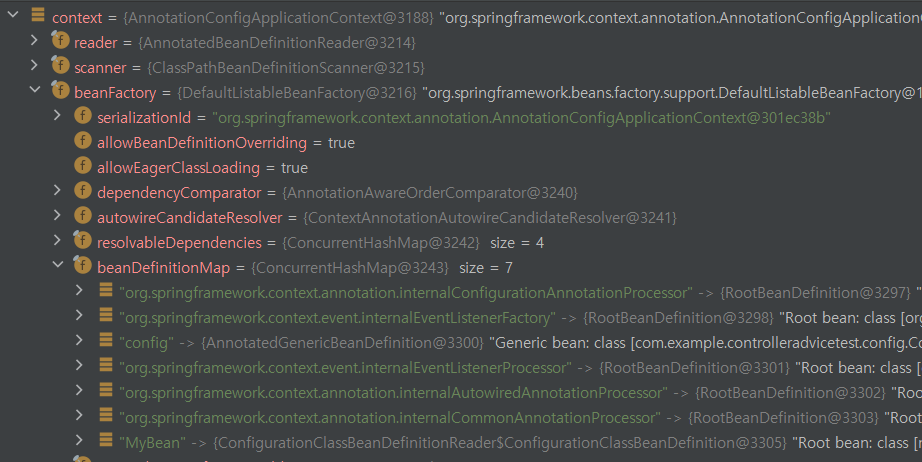
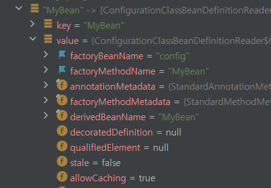
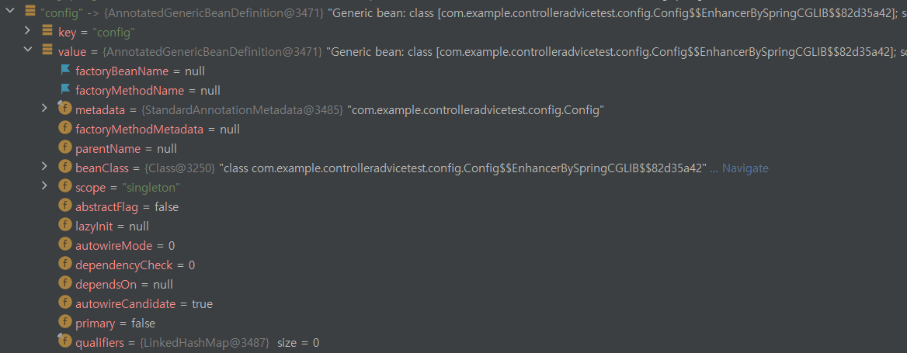
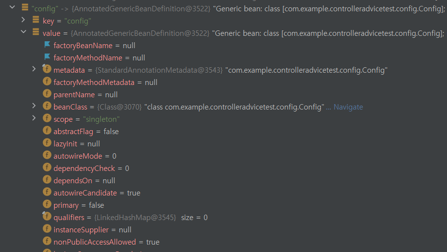
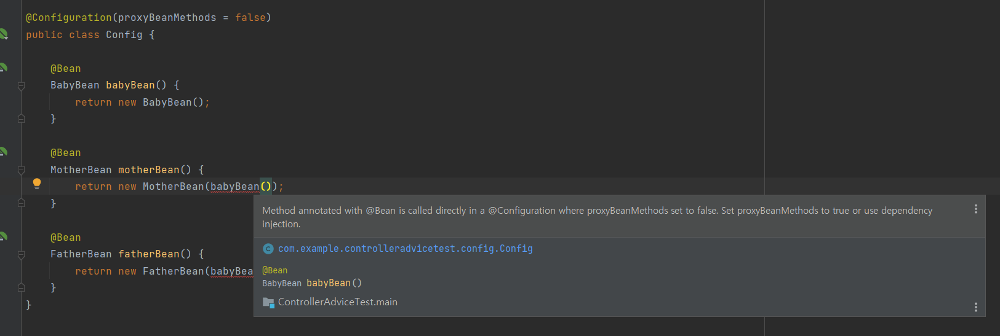

## @Configuration이란?

`@Configuration`은 빈을 등록할 수 있는 어노테이션 중 하나이다.

[Spring 공식문서](https://docs.spring.io/spring-framework/docs/current/javadoc-api/org/springframework/context/annotation/Configuration.html)에서는 다음과 같이 설명하고 있다.

> Indicates that a class declares one or more [`@Bean`](https://docs.spring.io/spring-framework/docs/current/javadoc-api/org/springframework/context/annotation/Bean.html) methods and may be processed by the Spring container to generate bean definitions and service requests for those beans at runtime

- `@Configuration` 어노테이션을 사용하면, 하나 이상의 `@Bean`메서드가 포함된 빈 설정용 클래스를 만들 수 있다.
- 스프링 컨테이너는 `@Bean` 메서드를 통해 빈을 생성한다.

`@Configuration`으로 어떻게 빈을 등록하는지 자세히 살펴보자!

### @Configuration 사용 예시

```java
// 빈으로 등록할 클래스
public class MyBean {

    public void sayHello() {
        System.out.println("안녕하세요, MyBean입니다.");
    }
}
```

```java
@Configuration
public class Config {

    @Bean
    MyBean MyBean() {
        return new MyBean();
    }
}
```

`ApplicationContext`는 `@Configuration`이 붙은 클래스 내부에서 `@Bean`이 붙은 메서드들을 찾는다.

- `@Bean` 이 붙은 메서드들은 자바 객체를 반환하는 메서드이다.
- 반환된 자바 객체는 스프링 컨테이너에 빈으로 등록된다.
- 빈의 이름은 `@Bean`이 붙은 메서드 이름이 된다. (이 코드의 경우 메서드명과 같은 `MyBean` 빈이 생성된다.)

## 등록한 빈 가져오기 - getBean()

앞서 말했듯이, `ApplicationContext`는 `@Configuration` 클래스가 정의한 빈에 대한 정보를 전부 읽어서 등록한다.

`ApplicationContext`의 `getBean()`메서드를 통해 빈에 대한 정보를 가져올 수 있다.

`getBean()`에 들어가는 인자는 다음과 같다.

- `getBean(빈의 이름, 빈의 타입);`

> getBean(빈의 이름)만으로도 빈을 가져올 수 있긴 하지만 Object 타입으로 반환되기 때문에 타입변환이 필요하다. 빈의 타입을 안다면 명시해주는게 좋을 것 같다.

### getBean() 사용 예시

```java
// 빈으로 등록할 클래스
public class MyBean {

    public void sayHello() {
        System.out.println("안녕하세요, MyBean입니다.");
    }
}
```

```java
// @Configuration을 사용해서 ApplicationContext에 빈 설정 정보 제공
@Configuration
public class Config {

    @Bean
    MyBean MyBean() {
        return new MyBean();
    }
}
```

```java
// getBean()을 사용해서 빈 객체를 불러올 수 있음
@SpringBootTest
public class ConfigTest {
    @Autowired
    ApplicationContext applicationContext;

    @Test
    public void test(){
        MyBean bean = applicationContext.getBean("MyBean", MyBean.class);
        bean.sayHello();
    }
}
```

```
// 실행 결과
안녕하세요, MyBean입니다.
```

## 빈의 `factoryBeanName`, `factoryMethodName` 필드

어떤 빈 객체가 `@Configuration`의 `@Bean`메서드로 등록되었다면, `factoryBeanName`, `factoryMethodName` 필드를 통해 `@Configuration` 빈 정보와 `@Bean` 메서드 정보를 확인할 수 있다.

- `factoryMethodName` : 해당 빈 객체를 생성한 `@Bean` 메서드의 이름
- `factoryBeanName` : 해당 빈 객체를 등록한 `@Configuration` 빈 객체의 이름

#### context -> beanFactory



- `ApplicationContext`는 `beanFactory` 객체를 가지고 있다. `beanFactory`의 `beanDefinitionMap`에는 `ApplicationContext`가 등록한 모든 빈에 대한 정보가 들어있다.

#### `@Bean` 메서드로 등록한 빈의 필드

`beanDefinitionMap`에 있는 `MyBean`에 대한 정보를 봐보자.



- `factoryBeanName`, `factoryMethodName` 필드에 `@Configuration` 빈 객체의 이름과 `MyBean`을 생성한 `@Bean`메서드의 이름이 들어가있는 것을 볼 수 있다.

#### `@Bean` 메서드로 등록하지 않은 빈의 필드



- `config`는 `@Bean`메서드에 의해 생성된 빈이 아니기에 `factoryBeanName`, `factoryMethodName` 가 비어있는 것을 볼 수 있다.

## Configuration의 속성

```java
@Target(ElementType.TYPE)
@Retention(RetentionPolicy.RUNTIME)
@Documented
@Component
public @interface Configuration {

	@AliasFor(annotation = Component.class)
	String value() default "";

	boolean proxyBeanMethods() default true;

}

```

### 📌 value

`@Configuration`이 붙은 클래스의 빈 이름 설정

```java
@Configuration("MyConfig") // MyConfig라는 이름으로 빈이 생성된다
public class Config {

    @Bean
    MyBean MyBean() {
        return new MyBean();
    }
}
```

value를 설정하지 않으면 자동으로 클래스 이름이 빈의 이름이 된다.

- 한 가지 주의할 점은 앞 글자가 소문자로 등록된다. 클래스 이름이 `Config`이고 value가 설정되지 않았을 때, 빈의 이름은 `config`가 된다.

### 📌 proxyBeanMethods

빈에 대한 프록시 객체를 생성할지 여부를 결정한다.

- 디폴트 값은 true이다. 빈 프록시 객체 생성이 디폴트라는 뜻

### 왜 프록시 객체를 생성할까?

[Spring 공식문서 - Configuration : proxyBeanMethods](https://docs.spring.io/spring-framework/docs/current/javadoc-api/org/springframework/context/annotation/Configuration.html)

> Specify whether `@Bean` methods should get proxied in order to enforce bean lifecycle behavior, e.g. to return shared singleton bean instances even in case of direct `@Bean` method calls in user code. This feature requires method interception, implemented through a runtime-generated CGLIB subclass which comes with limitations such as the configuration class and its methods not being allowed to declare `final`.

- 싱글톤 타입인 빈을 만들기 위해 프록시 객체를 생성한다.
- 프록시 객체는 `CGLIB`를 사용해 원본 객체를 상속해서 만든다.
- 상속할 수 있어야 하기에 원본 클래스와 그 내부 메소드는 final로 선언될 수 없다.

#### CGLIB?

> cglib is a powerful, high performance and quality Code Generation Library. It is used to extend Java classes and implements interfaces at runtime.

> Byte Code Generation Library is high level API to generate and transform JAVA byte code. It is used by AOP, testing, data access frameworks to generate dynamic proxy objects and intercept field access.

바이트 코드를 가지고 프록시 객체를 만들어주는 라이브러리이다. 런타임에 **자바 클래스를 extend**하고 인터페이스를 구현하는 데 사용한다.

동적 프록시 객체를 만든다. 바이트 코드를 가지고 프록시 객체를 만들어주는 라이브러리라고 알고 넘어가자!

#### `proxyBeanMethods = true`일 때의 config빈의 상태


#### `proxyBeanMethods = false`일 때의 config빈의 상태



두 `config`의 차이가 보이는가? 프록시 객체로 생성한 빈의 클래스 이름을 보면 `$$EnhancerBySpringCGLIB&&` 라는 게 추가된 것을 알 수 있다.

즉, `proxyBeanMethods`가 true인 상태에서 사용되는 `config` 빈은 우리가 직접 생성한 객체가 아니라 `CGLIB` 라이브러리에서 생성해준 프록시 객체임을 의미한다.

#### 프록시 객체를 만들어서 싱글톤으로 관리하기

프록시 객체로 어떻게 싱글톤타입의 빈을 만드는 걸까?

스프링은 `CGLIB`라이브러리를 사용해 `Configuration` 클래스를 그대로 사용하지 않고, `Configuration`을 상속한 프록시 객체를 새로 만들어서 사용한다. 기존 클래스를 상속해야하므로, `Configuration`은 final 클래스로 생성할 수 없다고 한다.

```java
@Configuration
public class Config { // 정의한 Configuration 클래스

    @Bean
    MyBean MyBean() {
        return new MyBean();
    }
}
```

```java
public class ConfigExt extends Config { // 실제로 빈을 반환하는데 사용되는 클래스
	private Map<String, Object> beans = ...;

    @Override
    MyBean MyBean() {
        if(!beans.containsKey("MyBean")) {
            beans.put("MyBean", super.MyBean());
        }

        return (MyBean) beans.get("MyBean")
    }
}
```

물론 실제 코드는 이보다 더욱 복잡하다고 한다. 예시용으로 참고만 하자.

### proxyBeanMethods 적용 예시

#### proxyBeanMethods가 true 일 때

사용 예시를 위해 빈으로 등록할 세 개의 클래스를 생성했다. (`BabyBean`, `MotherBean`, `FatherBean`)

세 클래스는 모두 생성이 될 때, `BabyBean`을 출력한다.

```java
public class BabyBean {

    public BabyBean(){
        System.out.println("애기빈 : " + this);
    }

}
```

```java
public class MotherBean {

    public MotherBean(BabyBean babyBean) {
        System.out.println("엄마빈 : " + babyBean);
    }

}
```

```java
public class FatherBean {

    public FatherBean(BabyBean babyBean) {
        System.out.println("아빠빈 : " + babyBean);
    }

}
```

<br/>

세 클래스를 `@Configuration`을 사용해 빈으로 등록해보자.

```java
@Configuration
public class Config {

    @Bean
    BabyBean babyBean() {
        return new BabyBean();
    }

    @Bean
    MotherBean motherBean() {
        return new MotherBean(babyBean());
    }

    @Bean
    FatherBean fatherBean() {
        return new FatherBean(babyBean());
    }
}
```

```
// 실행 결과

애기빈 : com.example.controlleradvicetest.config.BabyBean@2d0566ba
엄마빈 : com.example.controlleradvicetest.config.BabyBean@2d0566ba
아빠빈 : com.example.controlleradvicetest.config.BabyBean@2d0566ba
```

- 실행 결과를 보면, `FatherBean`, `MotherBean`, `BabyBean` 생성자로 출력된 `BabyBean` 객체가 전부 같은 것을 확인할 수 있다.
- 이는 `BabyBean` 객체는 한 번 생성된다는 것을 의미한다. (싱글톤)

#### proxyBeanMethods를 false 일 때



- 동일한 `@Configuration` 클래스 내에서는 `proxyBeanMethod`가 false 이면 아예 할당이 안 되는 것을 볼 수 있다.

`@Cofiguration` 클래스를 두 개로 분리해서 의존성을 주입해 주면 작동하지 않을까?

```java
@Configuration(proxyBeanMethods = false) // babyBean 프록시 객체를 생성하지 않는 @Configuration 클래스
public class Config {

    @Bean
    BabyBean babyBean() {
        return new BabyBean();
    }
}
```

```java
@Configuration
public class ParentConfig {
    @Autowired
    Config config; // babyBean을 생성하는 @Configuration 빈 객체를 주입받는다

    @Bean
    MotherBean motherBean() {
        return new MotherBean(config.babyBean()); // babyBean 주입
    }

    @Bean
    FatherBean fatherBean() {
        return new FatherBean(config.babyBean()); // babyBean 주입
    }
}

```

```java
public class ConfigTest {

    @Test
    public void test(){
        AnnotationConfigApplicationContext context = new AnnotationConfigApplicationContext(Config.class, ParentConfig.class);
        BabyBean babyBean = context.getBean("babyBean", BabyBean.class);
        System.out.println(babyBean);

        MotherBean motherBean = context.getBean("motherBean", MotherBean.class);
        FatherBean fatherBean = context.getBean("fatherBean", FatherBean.class);
    }
}
```

```
// 실행 결과

애기빈 : com.example.controlleradvicetest.config.BabyBean@c8b96ec

애기빈 : com.example.controlleradvicetest.config.BabyBean@2fa7ae9
엄마빈 : com.example.controlleradvicetest.config.BabyBean@2fa7ae9

애기빈 : com.example.controlleradvicetest.config.BabyBean@7577b641
아빠빈 : com.example.controlleradvicetest.config.BabyBean@7577b641
```

- `proxyBeanMethods = false`로 설정하니, `babyBean`이 싱글톤으로 생성되지 않는 것을 볼 수 있다.
- `motherBean`과 `fatherBean`에 `babyBean`을 주입할 때, `config`에서 새로운 `babyBean`객체를 생성해 주입해 주는 것을 알 수 있다.

### ApplicationContext에 Configuration 등록

스프링이 `@Configuration`이 붙은 클래스들을 찾기 위해선, 스프링 컨테이너를 초기화해야 한다. SpringBoot Context가 로딩되는 환경이라면, 개발자가 IoC컨테이너를 초기화해줄 필요가 없지만, SpringBoot Context가 로드 되지 않는 환경에서 빈을 테스트해보고 싶다면, `ApplicationContext` 를 직접 생성해서 `@Configuration`클래스를 등록해 줘야 한다.

```java
//@SpringBootTest <- SpringBoot Context 환경 로딩 X
public class ConfigTest {

    @Test
    public void test(){
        AnnotationConfigApplicationContext context = new AnnotationConfigApplicationContext(Config.class);

        MyBean bean1 = context.getBean("MyBean", MyBean.class);
        MyBean bean2 = context.getBean("MyBean", MyBean.class);
        System.out.println(bean1);
        System.out.println(bean2);
    }
}

```

여러 개의 `Configuration` 클래스를 등록하고 싶다면, `ApplicationContext`의 생성자로 인자를 추가하면 된다.

```java
AnnotationConfigApplicationContext context = new AnnotationConfigApplicationContext(Config1.class, Config2.class);
```

### @Configuration vs @Component

`@Configuration`은 내부적으로 `@Component`를 상속받고 있다.

```java
@Target(ElementType.TYPE)
@Retention(RetentionPolicy.RUNTIME)
@Documented
@Component
public @interface Configuration {
    ...
}
```

`@Component`를 사용해서 원하는 클래스를 빈으로 등록할 수 있는데 `@Configuration`이 왜 필요한 걸까?

포인트는 `@Component`는 구현한 클래스 위에 선언해야 하지만, `@Configuration`은 `@Bean`메서드 내부에서 생성한 객체를 빈으로 등록할 수 있다는 점이다.

- 여러 개를 동시에 빈으로 등록하기 vs 하나를 빈으로 등록하기

외부에서 구현한 클래스를 빈으로 등록하고 싶은데, 이 클래스가 read-only로 쓰였다면 `@Component`를 클래스 위에 선언할 수 없다. `@Configuration`을 사용하면, 메서드 내부에서 해당 클래스를 호출해 반환함으로써 빈으로 등록할 수 있다.

또, 한곳에서 관리하고 싶은 빈들의 경우, 특정 패키지 내부에 있는 빈들만 스프링 컨테이너에 등록하고 싶은 경우는 `@Configuration`을 사용하면 편리하게 관리할 수 있다.

## 참고

- 최범균 지음, 스프링5 프로그래밍 입문
- https://docs.spring.io/spring-framework/docs/current/javadoc-api/org/springframework/context/annotation/Configuration.html
- https://github.com/cglib/cglib/wiki
