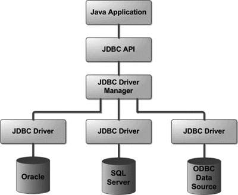
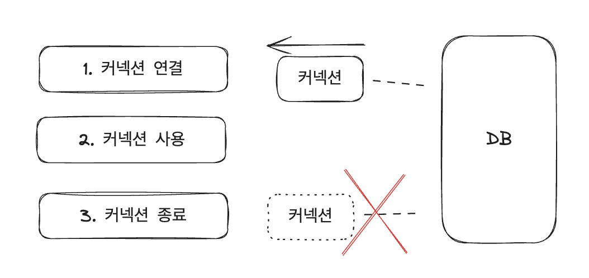
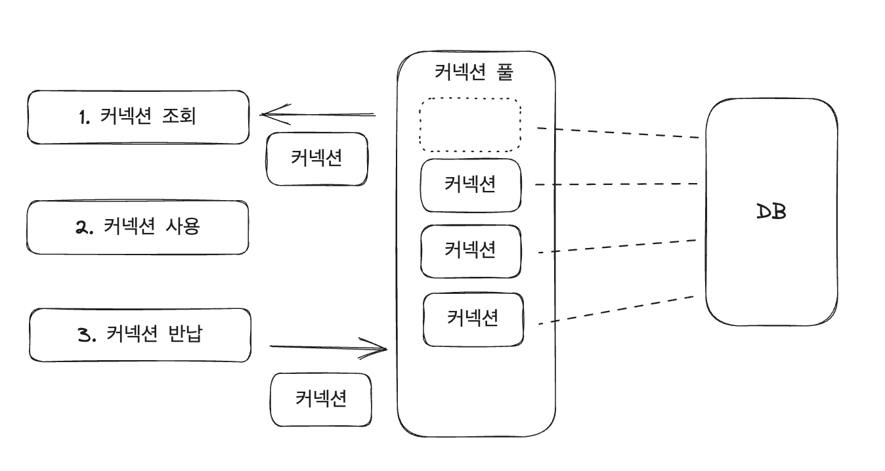

## JDBC란?

JDBC(Java Database Connectivity)는 자바 프로그래밍 언어를 사용해 데이터베이스에 접근할 수 있도록 하는 자바 API이다.  
이를 통해서 우리는 데이터베이스에 접속하고, SQL을 실행하고, 이를 통해 데이터를 가져오거나 삭제하는 등 데이터를 다룰 수 있게 된다.  
단순하게 데이터베이스와 통신할 수 있는 기술이구나! 라고 생각할 수도 있지만 그보다 더 중요하게 이해해야 할 것이 있다.

## JDBC가 등장하게 된 배경

JDBC가 등장하게 된 이유는 무엇일까? 바로 결론부터 말하자면 데이터베이스 접근의 표준화를 위해서다.  
데이터베이스에는 Oracle Database, MySQL, PostgreSQL 와 같이 여러 종류의 데이터베이스가 있다는 사실을 알고 있을 것이다.  
각각 데이터베이스마다 SQL를 전달하거나 결과를 응답받는 방법들이 다 다르고 데이터베이스의 종류는 수십 개가 존재한다.  
JDBC가 존재하기 전에는 이런 데이터베이스마다 존재하는 고유한 API를 직접 사용했었다.  
이에 따라 개발자는 기존의 데이터베이스를 다른 데이터베이스로 교체해야 하는 경우에는 데이터베이스에 맞게 기존의 코드를 모두 수정해야 했으며 심지어 각각의 데이터베이스를 사용하는 방법도 새로 학습해야 했다.  
따라서 표준이라는 게 필요했으며 JDBC의 표준 인터페이스 덕분에 개발자는 데이터베이스를 쉽게 변경할 수 있게 되었고 변경에 유연하게 대처할 수 있게 되었다.

## JDBC를 알아야 하는 이유

JDBC는 JDK 1.1 버전에 출시된 매우 오래된 기술이며 사용하는 방법도 많이 복잡하다.  
그래서 JDBC를 직접 사용하기보다는 데이터베이스 접근을 더 편리하게 하고 개발 생산성을 높이기 위한 기술인 SQL Mapper와 ORM(Object-Relational Mapping)을 주로 사용하게 된다.  
응?? 그렇다면 JDBC를 굳이 알아야 하나? 라는 의문점이 들 수도 있다.  
사실 SQL Mapper나 ORM은 JDBC를 기반으로 동작한다. 이들의 기술은 JDBC의 기능과 개념을 내부적으로 활용하여 데이터베이스와의 상호작용을 처리한다.  
따라서 JDBC를 이해하면 SQL Mapper나 ORM이 어떻게 동작하는지 더 잘 이해할 수 있는 베이스가 되며 또한 문제가 발생했을 때 근본적인 문제를 해결할 수 있다.

## JDBC 동작 흐름

그러면 이제 JDBC가 어떤 식으로 구성되어 있고 흐름은 어떻게 흘러가는지 알아보자.



먼저 JDBC API를 사용하기 위해서는 JDBC 드라이버를 먼저 로딩한 후 데이터베이스와 연결해야 한다.  
JDBC 드라이버는 JDBC 인터페이스를 구현한 구현체라고 생각할 수 있으며  
특정 데이터베이스 벤더(Oracle, MySQL, PostgreSQL 등)에 대한 연결과 데이터베이스에 대한 작업을 가능하게 해준다.  
(JDBC 드라이버의 구현체를 이용해서 특정 벤더의 데이터베이스에 접근할 수 있음)  
JDBC가 제공하는 DriverManager가 드라이버들을 관리하고 Connection을 획득하는 기능을 제공한다.  
이 획득한 Connection을 통해서 데이터베이스에 SQL을 실행하고 결과를 응답받을 수 있다.


위의 과정을 코드로 간단하게 살펴보자.

1. DriverManager를 통해 Connection 획득
2. Connection을 통해 Statement 생성
3. 질의 수행 및 Statement를 통해 ResultSet 생성
4. ResultSet을 통해 데이터 획득
5. 리소스 정리

```java
import java.sql.*;

public class Jdbc {
    public static void main(String[] args) {
        // 0. 데이터베이스 연결 정보 설정
        String url = "jdbc:mysql://localhost:3306/mydatabase";
        String username = "myusername";
        String password = "mypassword";

        Connection connection = null;
        Statement statement = null;
        ResultSet resultSet = null;

        try {
            // 1. DriverManger를 통해 Connection 획득
            connection = DriverManager.getConnection(url, username, password);

            // 2. Connection을 통해 Statement 생성
            statement = connection.createStatement();
            String sql = "SELECT * FROM users";

            // 3. 질의 수행 및 Statement를 통해 ResultSet 생성
            resultSet = statement.executeQuery(sql);

            // 4. ResultSet을 통해 데이터 획득
            while (resultSet.next()) {
                int id = resultSet.getInt("id");
                String name = resultSet.getString("name");
                int age = resultSet.getInt("age");

                System.out.println("ID: " + id + ", Name: " + name + ", Age: " + age);
            }
        } catch (SQLException e) {
            e.printStackTrace();
        } finally {
            // 5. 리소스 정리
            try {
                if (resultSet != null) {
                    resultSet.close();
                }
                if (statement != null) {
                    statement.close();
                }
                if (connection != null) {
                    connection.close();
                }
            } catch (SQLException e) {
                e.printStackTrace();
            }
        }
    }
}

```

참고로 DriverManager를 사용하기 전에 `Class.forName("com.mysql.jdbc.Driver");` 을 통해 해당 드라이버를 불러와야 하는데  
JDBC 4.0 버전 이후부터는 JDBC 드라이버 자동 로딩이 도입되어 생략이 가능하다.  
해당 코드에 관한 자세한 설명은 생략하기로 하고 다음으로 넘어가 보자.

## 커넥션 풀과 DataSource

위의 과정에서 우리는 DriverManager를 통해 데이터베이스 커넥션을 획득했다.  
JDBC 드라이버가 데이터베이스와 연결을 맺고 부가 정보를 데이터베이스에 전달한 후 연결 응답을 받으면 커넥션를 생성해 넘겨준다.  
커넥션을 사용하고 나면 해당 커넥션을 종료시킨다.

- DriverManger 사용시 ▼  
  

하지만 이렇게 매번 커넥션을 생성하기 위해서는 네트워크와 연결하고 서버의 자원을 사용해야 한다.  
SQL을 실행할 때마다 커넥션을 획득해야 하므로 연결하는 데에 추가적인 시간이 걸리며 매번 리소스를 사용하게 된다.  
그래서 이러한 문제점을 해결하기 위해 커넥션 풀(Connection Pool)을 사용하게 된다.

- 커넥션 풀 사용시 ▼  
  

데이터베이스와의 연결이 필요할 때마다 매번 새로운 커넥션을 생성하는 대신 미리 생성된 커넥션을 커넥션풀에 보관하고 필요할 때마다 커넥션을 꺼내서 사용하는 것이다.  
커넥션 풀을 통해 커넥션을 사용하고 나면 커넥션을 종료하지 않고 커넥션 풀에 반납한다.  
이와 같은 방법으로 커넥션을 재사용하게 되면 리소스를 효율적으로 활용할 수 있으며 성능을 높일 수 있다.

이처럼 커넥션을 획득할 때 DriverManager를 통해서 커넥션을 획득하거나 커넥션풀을 통해서 커넥션을 획득하는 등 여러 방법이 존재한다.  
그래서 DataSource 인터페이스를 통해서 커넥션을 획득하는 방법을 추상화한다.  
어떤 방식으로 커넥션을 획득하는지 상관없이 DataSource 인터페이스를 통해 일관된 방식으로 데이터베이스와 통신할 수 있는 것이다.  
또한 인터페이스를 구현한 구현체를 쉽게 교체할 수 있어 애플리케이션의 유연성을 높일 수 있다.  
스프링과 스프링 부트에서는 DataSource 인터페이스를 구현한 여러 구현체를 제공하는데  
대표적으로 JDBC DriverManager 기반으로 한 DriverManagerDataSource와 HikariCP 커넥션 풀을 기반으로 한 HikariDataSource가 있다.  
그래서 만약에 DB에 연결할 때마다 커넥션을 생성해서 획득하는 게 아닌 미리 커넥션을 생성해 놓은 커넥션풀을 사용해서 커넥션을 획득하고 싶은 경우  
DataSource의 구현체 DriverManagerDataSource를 HikariDataSource로 바꾸어 끼기만 하면 되는 것이다..!
이로써 커넥션을 획득할 때 리소스를 효율적으로 활용할 수 있고 빠른 속도로 커넥션을 획득할 수 있다.

## 마치며

지금까지 JDBC와 DataSource에 대해서 알아보았다.  
개발을 하면서 데이터 접근 기술을 처음 사용할 때 대부분 JDBC가 아닌 SQL Mapper와 ORM을 먼저 접하게 된다.  
그래서 JDBC의 전체적인 동작 흐름에 대한 이해가 부족한 채로 다른 기술을 사용하는 경우가 있으며  
또한 JDBC를 직접 사용하지 않는다고 해서 JDBC에 대한 학습을 넘어가는 경우가 있다.  
필자 역시 그랬으며 필자와 비슷한 다른 분들에게도 많은 도움이 되기를 바라며 글을 마치도록 하겠다.

---

## 참고

[What is JDBC? - JDBC 개념](https://www.tutorialspoint.com/jdbc/jdbc-introduction.htm)  
[JDBC Programming by Examples with MySQL - JDBC 사용법](https://www3.ntu.edu.sg/home/ehchua/programming/java/JDBC_Basic.html)  
[JDBC와 커넥션풀](https://ittrue.tistory.com/250)
