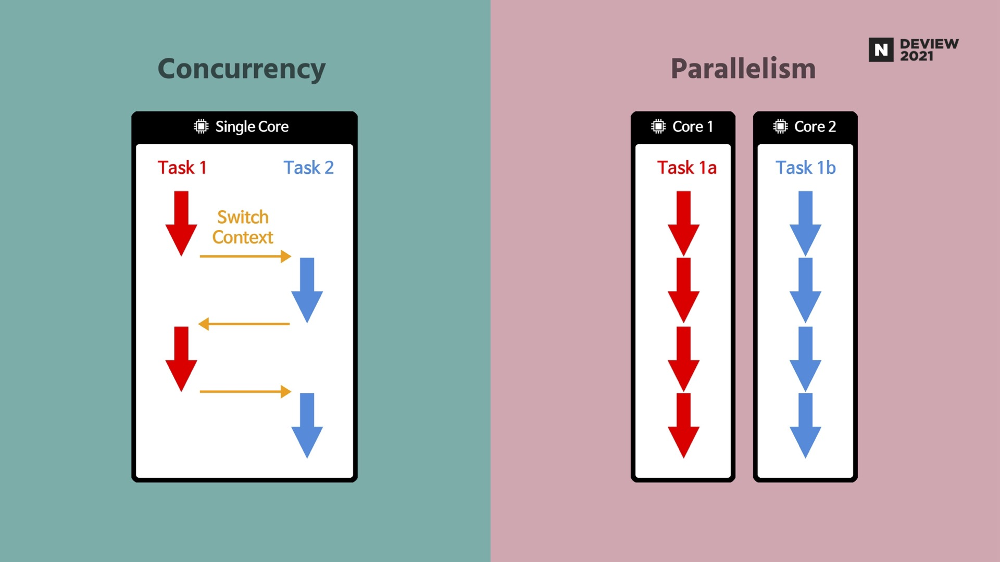
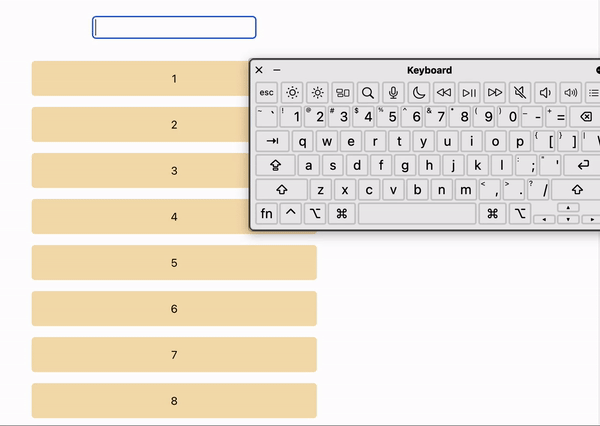

## 들어가며

2022년 3월, React 18이 발표되었습니다.

여러 변경 사항이 있었지만 그 중 핵심은 동시성(Concurrent)입니다.

기존 experimental 버전에서만 동작하던 `concurrent mode`를 공식 지원하게 되었고, 따라서 명칭도 `concurrent features`가 되었습니다.

> 즉, 동시 모드는 없고 동시 기능만 있습니다. - [React 블로그](https://react.dev/blog/2021/12/17/react-conf-2021-recap#react-18-and-concurrent-features)

이 글에선 React의 동시성에 대해 가볍게 살펴보고, 이를 사용하기 위해 추가된 hooks, `useTransition`과 `useDeferredValue`에 대해 알아보겠습니다.

## Concurrent?

[React 공식 문서](https://react.dev/blog/2022/03/29/react-v18)에선 Concurrent를 다음과 같이 설명하고 있습니다.

> React가 여러 버전의 UI를 동시에 준비할 수 있도록 하는 새로운 비하인드 메커니즘입니다. 동시성을 구현 세부 사항으로 생각할 수 있습니다. 이는 그 기능 때문에 유용합니다.

이것만 봐서는 동시성이 정확히 어떤 건지 잘 모르겠네요.

주로 같이 언급되는 병렬성(Parallelism)과 비교해 보면 이해가 쉬울 것 같습니다.



개발자 컨퍼런스인 [DEVIEW 2021](https://deview.kr/2021)에서 가져온 사진입니다.

위에서 설명하고자 하는 것을 간단히 표로 만들어 보겠습니다.

| 동시성                      | 병렬성                |
| --------------------------- | --------------------- |
| 싱글 코어에서도 작동        | 멀티 코어에서만 작동  |
| 동시에 실행되는 것처럼 보임 | 실제로 동시에 실행 됨 |
| 논리적 개념                 | 물리적 개념           |

요약하자면, 실제론 동시에 실행하지는 않지만, CPU가 작업을 context switching 해가며 '동시에 실행되는 것처럼 보이게 하는 것'이 동시성이라고 할 수 있겠습니다.

그렇다면 왜 React에서 동시성이 필요하게 된 걸까요? 🤔

## Blocking Rendering

React 18 이전까지는 렌더링 시 발생하는 문제점이 하나 있었습니다.

브라우저의 메인 스레드는 싱글 스레드이기 때문에 한 번에 한 가지의 작업만 할 수 있습니다.

HTML을 파싱하거나 JS를 실행하거나 화면에 렌더링하는 등, 모든 작업을 하나씩 처리해 나갑니다.

그런데 만약, 연산이 오래 걸리는 화면을 렌더링해야 한다면?

페이지 지연이 발생하여 사용자가 불편을 겪는 Blocking Rendering 문제가 발생하게 됩니다.

다음은 이를 보여주기 위한 예시 코드입니다.

```js
const App = () => {
  const [text, setText] = useState('');

  const filteredItems = filterItems(text);

  const updateFilter = e => {
    setText(e.target.value);
  };

  return (
    <div className="container">
      <input type="text" onChange={updateFilter} />
      <List items={filteredItems} />
    </div>
  );
};
```

`List`는 1부터 10000까지의 숫자를 리스트로 출력하는 컴포넌트입니다.

숫자를 입력받을 수 있고, 입력한 숫자를 포함한 것만 필터링하여 출력합니다.

따라서 입력값이 바뀔 때마다 리스트가 바뀌어 새로 렌더링해야 합니다.

차이점을 확인하기 쉬운 무거운 작업으로 만들기 위해, 크롬 개발자 도구로 CPU 성능 제한을 걸고 테스트해 보았습니다.



숫자를 입력하거나, 백스페이스를 계속 눌러도 인풋 창은 매우 느리게 응답하는 것을 확인할 수 있습니다.

누가 보더라도 바람직하지 못한 UX인 것 같습니다.

이러한 문제를 해결하기 위해 추가된 기능이 바로 `useTransition` hook입니다.

## `useTransition`과 `useDeferredValue`

바로 예시코드부터 살펴봅시다.

```js
const App = () => {
  const [isPending, startTransition] = useTransition();
  const [text, setText] = useState('');

  const filteredItems = filterItems(text);

  const updateFilter = e => {
    startTransition(() => {
      setText(e.target.value);
    });
  };

  return (
    <div className="container">
      <input type="text" onChange={updateFilter} />
      {isPending && <p>pending...</p>}
      <List items={filteredItems} />
    </div>
  );
};
```

`useTransition`은 2개의 원소를 가진 배열을 반환합니다.

`isPending`이라는 boolean 값과, `startTransition` 함수입니다.

간단하게 코드를 설명하자면, 우선 `startTransition`으로 `setText`를 래핑하여 상태 업데이트를 낮은 우선순위로 설정합니다.

그러면 더 우선순위가 높은 이벤트(input값 변경)가 있는 경우 `setText`는 지연 시키고 이전 값을 보여주게 됩니다.

또한 `isPending`을 이용하여 현재 지연된 상태라는 것도 보여주고 있습니다.


`useTransition`을 적용하니 리스트 렌더링과는 별개로, 인풋 창 반응이 빨라졌습니다!

이로써 조금 더 나은 사용자 경험을 제공할 수 있을 것 같습니다.

그런데 비슷한 기능을 하는 또 다른 hook이 있습니다.

바로 `useDeferredValue`입니다.

이 함수는 `useTransition`과 비슷하게 우선순위를 낮춰서 동시성 기능을 사용하는 hook입니다.

차이점으론 '상태를 업데이트하는 코드'를 래핑하여 우선순위를 낮추는 `useTransition`과 달리 `useDeferredValue`는 '값'의 업데이트 우선순위를 낮춘다는 것입니다.

또한 React 팀원인 Dan Abramov의 말에 따르면


> ・・・ 이 기능은 값이 "위에서" 오고 해당 setState 호출을 실제로 제어할 수 없는 경우에 유용합니다.

`useDeferredValue`는 상태를 props로 받는 등 제어할 수 없을 때 사용하는 것을 권장하는 것 같습니다.

바로 예제 코드에 적용해 보겠습니다.

사실 현재 코드에선 상태를 `App`에서 제어할 수 있지만, 그렇게 하지 않고 하위 컴포넌트인 `List`에서 `useDeferredValue`를 사용해 보겠습니다.

```js
const List = ({ items }) => {
  return (
    <ul>
      {items.map(item => (
        <li>{item}</li>
      ))}
    </ul>
  );
};
```

```js
const List = ({ items }) => {
  const deferredItems = useDeferredValue(items);

  return (
    <ul>
      {deferredItems.map(item => (
        <li>{item}</li>
      ))}
    </ul>
  );
};
```

위에는 기존 `List` 컴포넌트 코드고, 아래가 바꾼 코드입니다.

기존에 props로 받던 `items`를 `useDeferredValue`로 래핑하였습니다.

이후 `App`에서 `useTransition`을 사용하지 않도록 바꾸고 실행해도,

결과적으로 `startTransition`을 사용했을 때와 유사한 결과를 얻을 수 있었습니다.

## 🤔 어디서 본 것 같은데?

hook을 살펴보다 보니 비슷한 기능을 봤던 것 같습니다.

바로 debounce와 throttle입니다.

다만 두 방법 Blocking Rendering을 해결하기엔 아쉬운 점이 있습니다.

여러 번 발생하는 이벤트에서 가장 마지막 또는 제일 처음 이벤트만을 실행하도록 하는 debounce와,

여러 번 발생하는 이벤트를 일정 시간 동안 한 번만 실행되도록 만드는 throttle 모두 개발자가 timeout을 지정해 줘야 합니다.

그 말인즉슨, 만약 사용자의 기기 성능은 뛰어난데 timeout이 길게 설정되어 오래 기다리게 되거나,

반대로 오래된 기기를 사용하는데 너무 자주 이벤트가 실행되어 화면이 버벅대면, 사용자는 매우 불쾌한 경험을 하게 된다는 것입니다.

그러므로 동시성 기능을 잘 활용한다면, debounce와 throttle을 대체하거나, 혹은 함께 사용하여 더 좋은 사용자 경험을 제공할 수 있을 것입니다.

## 마무리

지금까지 React 18에 동시성 기능이 추가된 배경과, 관련 hooks를 알아보았습니다.

물론 언제나 `useTransition`, `useDeferredValue`를 사용하는 것이 좋은 최적화 방법은 아닐 것입니다.

lazy loading, pagination 등의 기법을 사용하거나, 서버 사이드에서 연산하는 등 여러 방법이 존재합니다.

따라서 무작정 남용하지 않고, 최적화할 수 있는 다른 방법은 없는지 충분히 고민한 후, 적용해야 하겠습니다.

어쨌든 프론트엔드 개발을 하다보면 UX를 우선하여 생각하게 되는 경우가 많은 만큼,

멋진 UX를 위해 고려할 수 있는 수단이 늘어나는 것은 언제나 환영입니다! 😆

## 참고 자료

- https://react.dev/
- https://tecoble.techcourse.co.kr/post/2021-07-24-concurrent-mode/
- https://github.com/reactjs/rfcs/pull/212
- https://tv.naver.com/v/23652451
