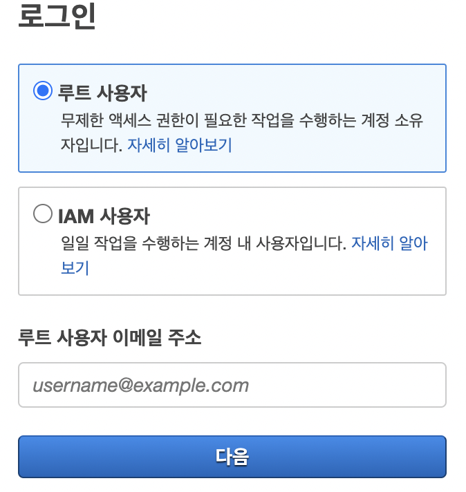
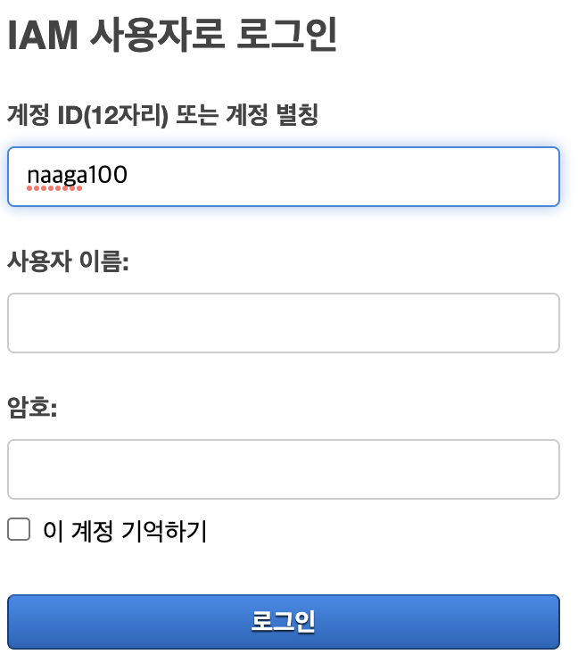
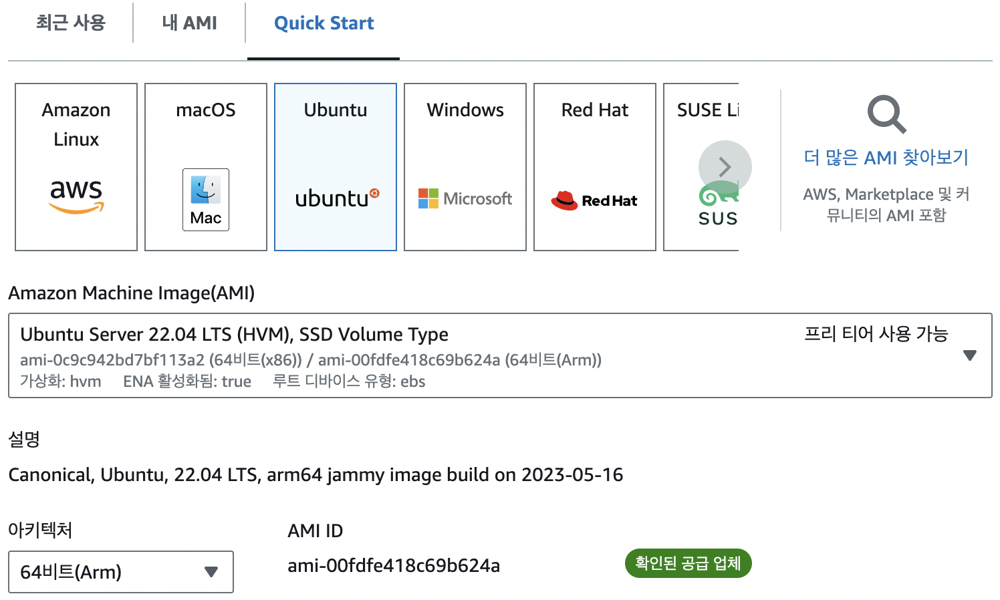
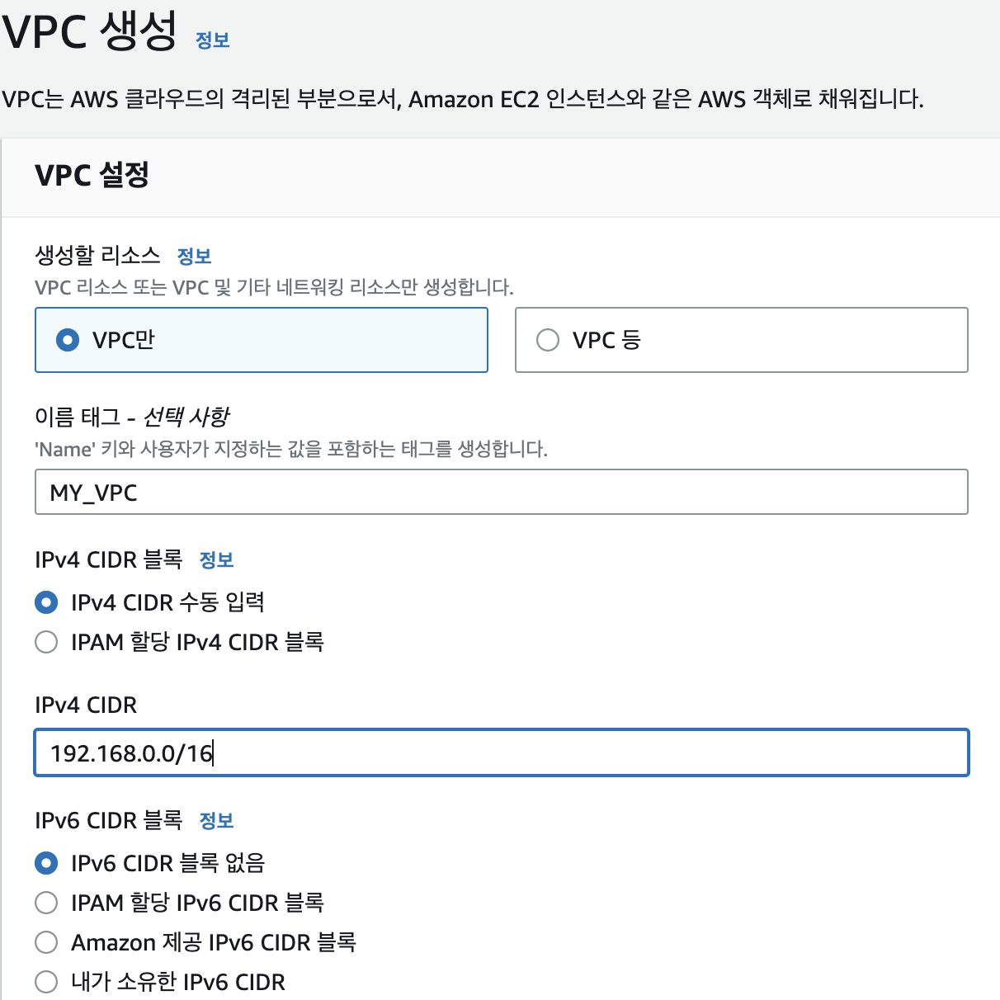
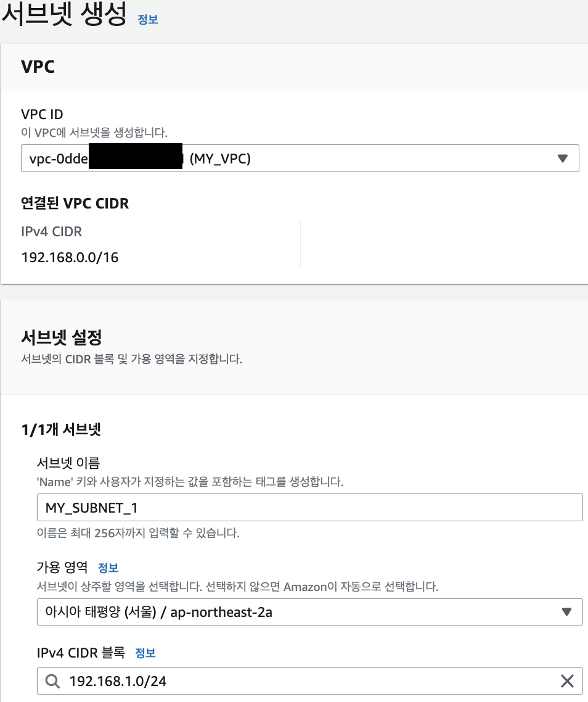

# 로그인부터 시작하는 AWS로 인프라 구축하기

AWS를 처음 접한다면, 아래의 사진(인스턴스 생성 설정)에 나온 이야기들은 별나라 이야기 같을  것입니다. 


IAM 사용자 로그인이 뭔지, EC2 인스턴스 생성 시 설정하는 VPC, 서브넷, 보안그룹 뭔지 온통 낯선 단어들에 한숨이 푹 나왔을지도요.  하지만 일단 필요하니 블로그에 잘 설명된 대로 EC2 만드는 법을 따라해보지만 문득, 마치 알 수 없는 언어로 된 설명서를 읽는 기분이 들었을 것입니다. 

IAM 로그인 부터, EC2 인스턴스, 인스턴스 생성에 필요한 VPC, 서브넷과 보안그룹들, 그리고 최종적으로 내가 생성한 EC2 인스턴스가 어떻게 인터넷과 통신하는 지까지.  이해에 앞서 단순히 블로그를 보며 따라했던 것들을 하나하나 되짚어보며 알아보도록 합시다.

```
1. AWS 로그인 이해하기 : 루트사용자? vs IAM사용자?
2. EC2 이해하기 : AMI와 인스턴스 유형은 뭘까?
3. VPC 이해하기 : 가상 사설 네트워크(VPC) 생성에 필요한 Region과 IPv4 CIDR블록이 뭘까?
4. 서브넷 이해하기 : 서브넷 생성에 필요한 가용영역(AZ)와 CDIR 블록이 뭘까?
5. 보안그룹 이해하기 : EC2 인스턴스의 인바운드 아웃바운드 규칙이 뭐지?
6. EC2 생성 완료하기 : public IP 활성화 vs 비활성화? 
7. 라우팅 테이블과 인터넷 게이트웨이 이해하기 : 가상 네트워크 속에 들어있는 EC2 인스턴스와 실제 인터넷은 어떻게 통신하는 걸까?
```

---

## 1. AWS 로그인 이해하기 : 루트사용자? vs IAM사용자?



루트 사용자는, 처음 AWS계정을 생성하고, 단일 로그인을 통해 모든 AWS 서비스 및 리소스에 대한 완전한 접근 권한을 가진 사용자를 말합니다. 한편 IAM 사용자는 이러한 루트사용자 계정의 리소스를 관리하고 사용할 수 있는 권한을 가진 “가상의 사용자”를 말합니다. 

좀 더 자세히 말하자면, 루트사용자가 IAM 사용자를 생성 하면, IAM 사용자가 사용할 ID와 비밀번호가 만들어집니다. 루트 사용자 계정에 접근 할 가상의 사용자를 만드는 것이죠. 이때, 루트 사용자는 IAM사용자가 어디까지 접근할 수 있는지 적절하게 권한을 부여할 수 있습니다. 

IAM 사용자들은 부여받은 권한 정도에 따라, 인스턴스를 생성하거나 종료하고, 데이터베이스를 관리하고, 스토리지를 사용하고, 네트워크를 설정하는 등 다양한 작업을 수행할 수 있습니다.

즉, **루트 사용자의 계정의 리소스를 권한에 맞게 이용하는 “가상의 신분”을 IAM 사용자**라고 할 수 있습니다.
<br/><br/><br/><br/>

---
## 2. EC2 이해하기 : AMI와 인스턴스 유형은 뭘까?

IAM 사용자라는 가상의 신분으로 루트 사용자의 계정에 접속했습니다. 루트 사용자의 EC2 서비스를 이용해봅시다. 

EC2 서비스란, 우리가 PC방에서 돈을 내고 컴퓨터를 이용하듯 사용할 만큼 AWS PC방의 컴퓨터를 빌리는 것을 말합니다. 대신 우리가 빌리는 컴퓨터는 가상 컴퓨터로 제공되고, 각각의 컴퓨터는 인스턴스로 부르기로 한 것일 뿐입니다.

PC방은 대체로 게임을 하러가는데, 게임에는 윈도우 기반의 고사양의 컴퓨터가 필요하죠?

우리도 필요한 목적에 따라 가상의 컴퓨터인 EC2 인스턴스의 운영체제와 사양을 설정해야 합니다.<br/><br/>

첫째, 애플리케이션 및 OS 이미지(Amazon Machine Image)를 설정해야하는데요.



우리 컴퓨터에 윈도우 OS가 설정되어 있으면, 우리는 그 기본 설정과 소프트웨어, 데이터를 가지고 있는 컴퓨터를 사용할 수 있습니다. 

이와 비슷하게, ****AMI****는 가상 컴퓨터를 실행하기 위해 어떤 운영 체제(OS)를 사용하고, 어떤 소프트웨어들을 설치해 놓을 것인지 등을 담고 있는 이미지(자원을 생성, 구성하는 데 사용되는 설정과 값을 포함하는 파일) 입니다. 

커스텀 PC처럼 AWS에서 제공하는 공식 AMI뿐만 아니라 사용자가 직접 사용자 정의 AMI를 생성할 수도 있습니다.<br/><br/>

둘째, 인스턴스 유형 (서버의 사양) 설정해야합니다.

사용할 목적에 따라 컴퓨터의 사양도 달라야겠죠? 

인스턴스 유형을 설정을 통해 CPU, 메모리, 스토리지 및 네트워킹 용량 등 컴퓨터 사양을 선택할 수 있습니다.

예) Amazon EC2 T4g 인스턴스<br/>

<br/><br/><br/><br/>

---

### 3. VPC 이해하기 : 가상 사설 네트워크(VPC) 생성에 필요한 Region과 IPv4 CIDR블록이 뭘까?

인스턴스를 생성하기 위해서는 VPC를 설정해야 합니다. VPC란 뭘까요?

5단계를 거쳐 VPC의 개념, VPC 생성에 필요한 것들을 배우고 서브넷과 CIDR에 대해서도 가볍게 익혀봅시다.

- 1단계 : 사전 지식 이해하기. 리전(Region)과 가용 영역(AZ: ****Availability Zone****)
    
    AWS 서비스들을 제공하기 위해서는 실제 데이터를 저장할 데이터 센터가 필요하겠죠?
    
    - 물리적인 데이터 센터의 집합을 'Region'이라고 하고, 국가/도시 단위 별로 서비스를 제공하는 단위로 쓰입니다.
    - 가용 영역(Availability Zone)은 같은 지역 내에서 물리적으로 독립된 데이터 센터들의 그룹을 말합니다.
    
    다시말해, 가용 영역들을 논리적인 묶음을 리전이라고 하는 것이지요!
    
    예를 들어, AWS 서울 리전 (ap-northeast-2)은 현재 3개의 가용 영역(서울에 위치해 있는 데이터 센터 그룹)을 보유하고 있는데요. 이렇게 지역별로 서비스를 제공함으로써 네트워크 속도를 높이고, 데이터 지역성을 고려한 서비스를 제공할 수 있습니다.
  <br/><br/><br/>

- 2단계 : VPC 개념 이해하기
    
    VPC(Virtual Private Cloud)는 가상 사설 네트워크입니다. 쉽게 말하자면, AWS클라우드에서 독립된 “**나만의 개인 네트워크 망**”을 만드는 것이지요.
    
    나만의 네트워크 망을 만들기 위해서는 
    
    첫째, 내 네트워크 망이 어느 지역에 속할지 설정해야겠죠. 즉, 하나의 “리전”을 선택해야 합니다. 
    
    둘째, 내 네트워크 망이 사용 할 IP 주소 범위를 설정해야 합니다. 후술할 “IPv4 CIDR 블록” 설정을 통해 IP주소 대역을 설정하면, 이 VPC 내에서 사용되는 모든 IP 주소들은 사용자가 지정한 IP 주소 범위 내에서 할당됩니다.
    
  <br/><br/><br/>

- 3단계 : 네트워크 망에 IP 주소 범위를 정해야하는 이유?
    만약 우테코라는 기업 네트워크가 있다고 가정해봅시다. 이 기업 네트워크에 연결될 장치들(컴퓨터, 휴대폰 등)의 수가 최대 50개라면, IP주소 개수가 50개면 되겠죠? 
    
    IP주소는 소중한 자원이기 때문에 이를 효율적으로 할당하고 관리하기 위해 IP주소가 50개만 나올 수있는 네트워크 주소 범위를 정하는 것입니다.
    
    즉, 주소 범위를 정하면, 그 주소 범위 내에서 IP주소들이 할당됩니다.
  <br/><br/><br/>
    
- 4단계 : IPv4 CIDR 블록 이해하기
    
    IPv4 CIDR 블록은 **“IP 주소를 할당하는 데 사용되는 네트워크 주소 범위”**를 나타냅니다.
    
    CIDR는 IP주소를 유연하게 할당하기 위해 만들어진 방식입니다. 좀더 자세히 설명하자면,
  <br/><br/>
    1. IP 주소란? 
        - 우선 IP주소의 구조는 192.168.1.0 과 같이 .을 구분자로 한 4자리 숫자로 이루어져 있고, 네트워크 ID와 호스트 ID로 구성됩니다.
        - IP주소는 네트워크 내의 내 네트워크 장치(예: 선릉 캠퍼스 내의 내 노트북)을 구분하는 데 쓰이는 식별자 입니다.
        - IP주소는 마치 택배 주소와도 같지요. 데이터는 택배처럼  Ip주소를 통해, 선릉 캠퍼스 중 이레라는 사람을 찾아와야 합니다. “네트워크 ID는 집 주소 = 서울시 강남구 선릉역 성담빌딩 13층”, “호스트 ID는 내 이름 = 이레”로 이루어진 꼴입니다.
          <br/><br/>
    2. 그래서 어떻게 네트워크 내에서 IP주소를 할당 했는데? (old.ver) <br/>
        이전에는 고정된 크기의 IP 주소 블록(A,B,C 클래스)을 사용하여 네트워크를 구성했습니다.<br/>
        
        무슨 소리냐구요?
        
        IP주소 네 개의 숫자(**192.0.0**.0 ~ **223.255.255**.255) 중 세 개를 네트워크 식별자로 사용하면, 호스트 식별자는 (0~255)로 256개가 됩니다. 
        
        네 개중 세 개를 네트워크 식별자로 쓰는 클래스를 c클래스라고 불렀는데, 해당 클래스의 네트워크는 호스트 수(네트워크에 연결될 수 있는 장치 수)가 256개로 고정되어 있었죠.
        
        그럼 다음과 같은 문제가 발생하게 됩니다
        
        우테코 회사에서는 IP주소가 50개만 필요한데, 106개의 소중한 IP주소 자원은 쓰이지 않고 버려지는 거죠!
       <br/><br/>
    3. IP주소를 효율적으로 할당하는 새로운 방식 (new.ver)
        
        그래서 등장한 것이 CIDR라는 클래스 없는 IP주소 할당 방식입니다.
        
        IP를 사용하는 네트워크 장치 수(호스트 수)에 따라 효율적으로 사용할 수 있는 **서브넷(Subnet)**을 만드는 것이죠. (서브넷의 자세한 내용은 후술할 것이니 간단히 이해하고 넘어가주세요.)
       <br/><br/>
    4. IP를 효율적으로 할당하기 위해 서브넷을 만든다!
        
        서브넷을 만든다는 것은 호스트ID 영역을 더 잘게 **쪼개어 네트워크ID 영역을 늘리는 작업(서브네팅)**을 의미하는데요.
        
        예를들어, 우테코가 할당받은 IP주소 범위가 **192.167.10.**0~ **192.167.10.**255 라면
        
        호스트 id 범위인(0~255)를 1/4로 쪼개면 될 것입니다. 
        
        그럼, 호스트 수가 256개이던 우테코 네트워크는, 64개의 호스트 수를 가지게 되겠죠? 각각 64개의 호스트 수를 가진, 나머지 네트워크 3개는 다른 회사가 쓸 수 있을 것입니다!
        
        IP 주소 낭비가 획기적으로 줄어들었습니다!
       <br/><br/>
    5. 그래서 CIDR가 뭐야?
        
        이렇게 IP클래스에 국한되지 않고 더욱더 IP 주소를 쪼개어 할당하는 기법을 CIDR이라고 합니다.
        
        예를 들어, 줄어든 우테코의 네트워크 IP 주소 범위는 **192.167.10.**0~ **192.167.10.**63(64개)인데요. 
        
        이를  IPv4 CIDR 블록 형식으로 나타내면, “**192.167.10.**0/26” 으로 표현할 수 있습니다.
        
        CIDR 주소의 "/26"는 네트워크 주소를 나타내는 비트 수를 의미합니다. 앞에서부터 26비트가 네트워크 주소를 나타내고 나머지 6비트가 호스트 주소라는 말 입니다.<br/><br/>

        

        하나의 숫자는 8비트인데요, 호스트ID(0~255)를 4등분하느라 2비트를 네트워크 아이디 값으로 줘버렸기 때문에, 네트워크ID의 수는 8*3 =24 에서 → 8*3+2 =26 비트가 됩니다.
        
        다시말해, “**192.167.10.**0” 이라는 네트워크 시작 주소에서 “네트워크ID 영역이 26비트” 인 것 입니다. 
        
        (이 계산법에 대해 좀더 자세히 공부하고 싶으신 분들은 서브넷 마스크와 서브네팅 계산법을 공부하시면 됩니다.)
       <br/><br/><br/>
    
- 5단계 : VPC 생성하기
    
    VPC를 생성하기 위해서는 
    
    첫째, 리전을 적용해야하는데, 사용자가 선택한 리전으로 자동 적용됩니다. 
    
    둘째, IPv4 CIDR 블록으로 VPC의 IP 대역(네트워크 주소범위) 설정해야 합니다. 

    

    참고로, IPv4 CIDR 블록이 10.0.0.0/16으로, 네트워크 ID가 10.0, 이 네트워크에서 IP 주소 할당 가능한 호스트 수는 2의 16승(숫자 1개당 8비트) = 65,536개가 됩니다!
  <br/> <br/>
    이를 통해, 생성된 VPC 입니다. <br/>
    

 <br/> <br/>  <br/>

---

### 4. 서브넷 이해하기 : 서브넷 생성에 필요한 가용영역(AZ)와 CIDR 블록이 뭘까?

인스턴스를 생성할 때, 설정한 VPC에 따라 선택할 수 있는 서브넷 목록이 바뀌는 것을 볼 수 있습니다. 서브넷은 VPC에 종속되는 것일까요? 앞서, 네트워크 내의 IP주소를 효율적으로 할당하기 위해 서브넷이라는 용어가 나왔는데요. 이에 이어서, 3단계를 통해 네트워크에서의 서브넷, AWS에서의 서브넷 개념을 이해하고, AWS에서 서브넷을 만들어봅시다.

- 1단계 : 네트워크에서 서브넷 이해하기
    
    **네트워크에서 서브넷이란, 큰 네트워크를 더 작은 네트워크로 분할한 것**을 말합니다. 
    
    - **3-4단계. IPv4 CIDR 블록 이해하기**에서 설명한대로, 낭비되는 IP주소가 없도록, 원래의 IP대역에서 호스트ID 수를 줄여서 더 작은 네트워크(호스트 수가 더 적은)로 분할해 생긴 **작은 네트워크 대역**을 서브넷이라고 하는 것이죠.
    - 서브넷은 독립적인 네트워크로 간주되며, 각 서브넷은 자체적으로 라우팅과 보안 설정을 가지고 있습니다. 좀 더 자세히 설명하자면,
      ```
      1. 자체적인 라우팅을 가진다. 
        = 서브넷은 독립적인 작은 네트워크이므로, 자신의 네트워크 주소범위를 가지고 있습니다. 
          따라서, 자체적인 라우팅 테이블을 사용해, 서브넷 내부의 호스트(네트워크 장치)들 사이에서 통신과 다른 서브넷으로의 통신을 처리합니다.
          (*라우팅 테이블 = 다른 호스트(네트워크장비)로 데이터 전송할 때 어떤 경로 선택해야 하는지 지시하는 목록)
            
      2. 자체적인 보안설정을 가진다
        = 서브넷은 독립적인 보안그룹을 구성하여, 원하는 트래픽을 허용하거나 차단합니다. 
          즉, 특정 포트나 프로토콜 통신을 제한하거나 허용할 수 있습니다.
      ```
      <br/>
- 2단계 : AWS에서 서브넷 이해하기

    
    
    VPC는 가상 네트워크이고 논리적인 IP대역을 의미한다면, 
    
    서브넷은 VPC의 IP주소 범위를 나누어 **실제 리소스(예: EC2 인스턴스, S3가 서브넷에 설치됨)가 배치되는 물리적인 주소 범위**를 말합니다.
    
    - 하나의 VPC에 여러개의 서브넷이 생길 수 있으며, VPC를 잘게 나눈 것이기 때문에 **VPC보다 대역폭(IP주소범위)이 낮아야 합니다**.
    - 서브넷 한 개는 하나의 가용영역(Availability Zone: 데이터 센터 그룹)에만 속합니다. (하나의 가용영역에 여러개의 서브넷은 가능합니다)
      <br/><br/>
  
  *참고로, VPC를 생성할 때 사용할 가용영역(AZ)의 개수 설정하고 서브넷은 생성될 때, 어느 가용영역에 생성할지 선택하면 됩니다.<br/>
   
  
  
- 3단계 : 실제로 서브넷 생성하기
  
  - 첫째, 어떤 VPC의 서브넷인지 설정합니다.
  - 둘째, 서브넷이 상주할 데이터베이스 센터 그룹인 가용영역을 설정합니다.
    </br>(예시 : 서울 리전의 -2a)<br/>
    
    <br/><br/>
  - 마지막으로, VPC의 IP주소 범위를 분할한, 서브넷 IPv4 CIDR 블록 설정하면 됩니다.
    
    - 설정한 VPC의 주소 범위가 192.168.0.0/16이기 때문에, 서브넷의 대역폭은 VPC의 대역폭보다 좁은 CIDR블록을 설정해야 합니다.
더 좁은 대역폭이란 IP 주소 범위에서 사용 가능한 IP 주소의 개수가 적다는 것을 의미합니다.
    
    - "/16" 대역폭은 65,536개의 IP 주소를 가지므로, 이보다 개수가 더 적은 “/17” 대역폭부터 아마존의 정책에 따라 “/28”대역폭까지 필요한 IP 개수에 따라 서브넷의 CIDR 블록을 설정할 수 있습니다.
    <br/><br/>
  - 생성 완료된 서브넷을 확인해봅시다!
  -
    - 생성한 VPC(vpc-0dde~ = 192.168.0.0/16)의 서브넷임을 확인할 수 있습니다.
    - 서브넷 IPv4 CIDR 블록은 192.168.0.0/**24**로, VPC의 대역폭보다 좁은 CIDR블록이 잘 생성되어있음을 볼 수 있습니다. 네트워크ID의 길이가 늘어남(16->24bit)에 따라 호스트ID의 수가 줄어들은 것이죠!
    - 가용영역(리전 내의 데이터 센터)도 우리가 설정한 ap-northeast-2a로 잘 생성 된 것을 볼 수 있습니다.

    <br/><br/><br/>

---

### 5. 보안그룹 이해하기 : EC2 인스턴스의 인바운드 아웃바운드 규칙이 뭐지?

어떤 서브넷(네트워크, IP주소범위)에 인스턴스를 생성할지 결정하고 나면, 인스턴스의 보안 규칙을 설정해야하는데요. *보안 그룹*은 연결된 리소스(인스턴스)에 도달하고 나갈 수 있는 트래픽을 제어하는 방화벽 규칙 세트라고 할 수 있습니다. 예를 들어, 보안 그룹을 EC2 인스턴스와 연결하면 인스턴스에 대한 인바운드(도달하는 트래픽) 및 아웃바운드(나가는 트래픽) 트래픽을 제어하는 것입니다.

즉,

- 인바운드 규칙은 외부에서 - > 인스턴스로 오는 트래픽
- 아웃바운드 규칙은 인스턴스에서 - > 외부로 가는 트래픽

에 관한 규칙을 설정하는 것입니다. 이를 통해 어떤 IP 주소, 포트 또는 프로토콜로부터 허용할지 또는 차단할지를 설정할 수 있겠죠?
<br/><br/><br/>
또, 하나의 보안 그룹을 생성할 때는 어떤 VPC에 생성될 것인지 지정하는데요. VPC에 여러 보안그룹을 생성하고, 하나의 서브넷은 VPC에 생성된 여러 보안 그룹을 사용할 수 있습니다.

여러 보안 그룹을 사용하면 서로 다른 리소스 또는 그룹에 대해 다른 보안 규칙을 적용할 수 있는데요. 예를 들어, **같은 서브넷 내에** 웹 서버 그룹과 데이터베이스 서버 그룹이 있다면, 웹 서버 그룹에는 웹 트래픽을 허용하는 규칙을 설정하고 데이터베이스 서버 그룹에는 특정한 IP 주소만 데이터베이스 접근을 허용하는 규칙을 설정할 수 있습니다.
<br/><br/><br/>
이렇게 여러 보안 그룹을 사용함으로써, 네트워크 리소스를 보다 세부적으로 제어하고 보호할 수 있는 것이죠.<br/>
(*아래 왼쪽 사진을 보면, 각각의 서브넷 내에서 웹서버와 데이터베이스가 다른 보안그룹을 가지고 있음을 확인할 수 있습니다)<br/>
(*아래 오른쪽 사진을 보면, VPC(vpc-0dde~)에 보안그룹이 생성되었음을 확인할 수 있습니다)


<br/><br/><br/>

---

### 6. EC2 생성 완료하기 : public IP 활성화 vs 비활성화? 그리고 private IP란?

인스턴스의 마지막 네트워크 설정입니다. 바로 인스턴스에 퍼블릭 IP 주소를 줄 것인가 인데요.

퍼블릭 IP 주소란 외부 인터넷과 통신할 수 있는 공인 IP 주소입니다. EC2 인스턴스가 퍼블릭 IP 주소를 갖게 되면, 이 주소를 사용하여 외부에서 인스턴스에 접근할 수 있게 됩니다.

"퍼블릭 IP 주소 활성화" 옵션을 선택하면 **해당 지역(Region) 내에서 사용 가능한 퍼블릭 IP 주소 풀에서 하나의 퍼블릭 IP 주소를 할당**받는데요. 이 주소는 EC2 인스턴스와 통신하는 외부 클라이언트들이 사용할 수 있게 됩니다. 주의해야 할 점은 퍼블릭 IP 주소는 고정되지 않고 인스턴스를 중지하고 다시 시작하면 변경될 수 있다는 것입니다.

- 퍼블릭 인스턴스가 생성된 예시!</br>
  

<br/>
반면, "퍼블릭 IP 주소 비활성화" 옵션을 썬택하면, 해당 인스턴스는 인터넷에 직접 노출되지 않게 됩니다. 따라서, 인터넷에서 직접 접근을 할 수 없는데요.

다만, 같은 VPC(내부 네트워크)에서는 프라이빗 IP 주소를 통해 해당 인스턴스에 접근 할 수 있습니다.

- 프라이빗 인스턴스가 생성된 예시</br>
  

<br/><br/>
여기서 잠깐, 퍼블릭IP주소와 프라이빗IP주소를 정리해봅시다.

**프라이빗 IP 주소**:

- 프라이빗 IP주소는 서브넷의 ip주소 범위 내에서 자동으로 할당됩니다.
- 인터넷과 직접 연결되지 않아 외부에서 직접 접근할 수 없지만,
- VPC 내의 리소스 간에 내부 네트워크 통신을 위해 사용됩니다. (목적)

**퍼블릭 IP 주소**:

- 퍼블릭 IP 주소는 **해당 지역(리전)의 AWS에서 관리되는 IP 주소 풀**에서 무작위로 선택됩니다.
- 퍼블릭 IP 주소는 인스턴스가 중지되고 다시 시작될 때마다 변경되는데요. 이를 통해, 인스턴스 간의 IP 주소 충돌을 방지하고 보안을 유지할 수 있습니다.
- 외부 인터넷과 통신하는데 사용됩니다. (목적)
<br/><br/><br/>

```
인스턴스의 스토리지 용량까지 결정하고 나면 인스턴스 생성이 완료됩니다. 이렇게 생성된 인스턴스를 사용하면서 아래와 같은 궁금점이 들지 않으셨나요?

  1. 같은 VPC 내의 서브넷들 사이에서 통신(= 각 서브넷에 배치된 인스턴스 간 통신)은 왜 프라이빗 IP주소로 실행되는 걸까요?
  
  2. VPC는 나만의, 내가 설정한 가상 네트워킹 환경(VPC)입니다. 
     VPC는 기본적으로 private 환경인데, 어떻게 인스턴스들이 인터넷에 접속할 수 있는 걸까요?
```

<br/><br/><br/>

---
### 7. 라우팅 테이블과 인터넷 게이트웨이 이해하기 : 가상 네트워크 속에 들어있는 EC2 인스턴스와 실제 인터넷은 어떻게 통신하는 걸까?

설명에 앞서, 결론부터 말하자면, 

- 첫째, VPC에 **인터넷 게이트웨이**라는 것을 생성해**,** VPC 내의 리소스가 인터넷에 액세스할 수 있게 됩니다.<br/><br/>
- 둘째, 서브넷에 연결된 라우팅 테이블에 "0.0.0.0/0" 대상을 인터넷 게이트웨이로 설정합니다. 
여기서, "0.0.0.0/0"은 모든 IP 주소, 대상은 목적지로 아웃바운드 트래픽에 대한 설정이라고 이해하면 됩니다. 즉, 모든 내부 리소스(인스턴스 같은)에서 어떤 목적지 IP 주소로의 트래픽도 인터넷 게이트웨이를 통해 라우팅하도록 설정하는 것을 의미합니다. 이는 모든 내부 리소스가 외부 인터넷에 접속할 수 있게 됩니다.<br/><br/>
- 셋째, 이로써 퍼블릭 서브넷 내의 모든 퍼블릭 인스턴스들이 외부 인터넷과 통신할 수 있게 되는 것입니다.<br/>
  (*아래 사진을 보면, 두 개의 서브넷에 연결된 각각의 EC2들은 자신이 소속된 서브넷이 아닌 다른 네트워크로 요쳥을 보낼 때,<br/> 1) VPC의 라우터를 거치고<br/>2) 라우팅 테이블에 적힌 규칙에 따라 트래픽을 특정경로로 이동시키는데, <br/>3) VPC 내부에서 일어나는 통신은 내부적으로 통신하고<br/>4) VPC 외부와의 통신은 인터넷 게이트웨이를 통해 인터넷과 연결한다)<br/>
  <br/>
  <br/>
퍼블릭 IP만 있으면 되는 것 아닌가? 퍼블릭 서브넷은 뭐고, 라우팅 테이블, 인터넷 게이트웨이는 뭘까? 하는 생각이 들 것입니다. 4단계를 거치며 퍼블릭 서브넷의 개념과 라우팅 테이블, 게이트웨이에 대해 이해해 봅시다. <br/><br/>
  <br/>
- 1단계: 퍼블릭 서브넷 vs 프라이빗 서브넷
    
    처음 서브넷을 생성할 때, 프라이빗 서브넷인지 퍼블릿 서브넷인지 설정하는 칸이 없지 않았나요?
    
    맞습니다. 따라서, 처음 서브넷을 생성하면 모두 프라이빗 서브넷이 됩니다.
    
    - **프라이빗 서브넷이란**,
        
        생성되는 인스턴스들이 기본적으로 퍼블릭 IP주소를 갖지 않고, 외부와 통신할 수 없는 서브넷을 말합니다. 오직 퍼블릭 서브넷에 있는 인스턴스들이 외부 인터넷과 직접 통신할 수 있는 퍼블릭 IP주소를 갖게 되는 것이죠.
        
        정리하자면, 처음 서브넷을 생성하면 프라이빗 서브넷이 생성됩니다. 
        
        이를 퍼블릭 서브넷으로 만들기 위해서는 인터넷 게이트웨이라는 것을 생성하고, 라우팅 테이블에 모든 IP주소로의 통신을 인터넷 게이트 웨이로 라우팅하는 설정을 해야합니다. 이에 대해서는 뒤에 자세히 설명하겠습니다.
      <br/><br/>
    - **퍼블릭 서브넷이란,**
        
        생성되는 인스턴스들이 외부 인터넷과 직접 통신할 수 있는 서브넷을 말합니다. 퍼블릭 서브넷에서 인스턴스를 생성하면 해당 인스턴스에는 퍼블릭 IP 주소를 할당할 수 있기 때문이지요.
        
        그런데 퍼블릭 서브넷은 어떻게 만드는 걸까요? 분명 서브넷을 생성할 때, 프라이빗 서브넷인지 퍼블릭 서브넷인지 고르는 옵션이 없었는데 말이지요.
        
        바로, 앞서 말했던 라우팅 테이블에 인터넷 게이트웨이를 설정해줌으로써, 프라이빗 서브넷은 퍼블릭 서브넷이 되는 것입니다.<br/> 

  <br/><br/>
- 2단계: 라우팅 테이블이란?
    
    서브넷은 **서로 다른 네트워크 영역**을 가지고 있으므로 한 서브넷에서 다른 서브넷으로 데이터를 전송하려면( = 다른 네트워크로 데이터를 전송하려면) 라우팅을 해야합니다.

  (*라우팅: 네트워크에서 데이터를 출발지에서 목적지로 이동시키는 것)<br/><br/>
    
    즉, VPC 안에서 네트워크 요청이 발생하면, **어떤 네트워크 경로를 통해 트래픽을 전송할지** 결정해야하는데요.
    
    라우팅 테이블에는 데이터의 이동 경로 규칙이 적혀져 있습니다. 네트워크 대역별로 어느 인터페이스로 데이터를 보낼 지에 대한 정보가 저장되어, 일종의 표지판 역할을 하는 것이지요.
  <br/><br/>
    서브넷에 이러한 라우팅 규칙이 적혀진 라우팅 테이블을 연결함으로써, 서브넷 인스턴스에서 발생한 트래픽을 특정 경로로 전송할 수 있게 되는 겁니다.<br/>
   (* 라우팅테이블에 0.0.0.0/0에 대한 인터넷 게이트웨이 규칙 추가)<br/>
  <br/><br/>
   이 라우팅 테이블의 규칙들을 해석하자면, 
    
  - 첫째 줄은, 대상(Destination)이 “0.0.0.0/0” 에 대해서 대상(Target, 트래픽을 전송할 때 사용할 게이트웨이, 네트워크 인터페이스)을 인터넷 게이트웨이로 설정한다는 말인데요.
        
      서브넷에서 모든 퍼블릭 IP주소를 대상(Destination)으로 하는 통신에 대해 인터넷 게이트웨이라는 특정 경로로 라우팅하게 하는 것 입니다. 이로써 VPC 내의 모든 인스턴스가 외부 인터넷과 통신할 수 있게 됩니다. 즉, 이 설정을 통해 퍼블릭 서브넷이 되는 것이죠!
    <br/><br/>
  - 둘째 줄은, VPC 내부(192.168.0.0/16) 모든 서브넷에 대해서 로컬 라우팅이 자동으로 설정된 것인데요.
        
      로컬 라우팅이란, VPC 내부 통신이 발생했을 때, 서브넷 간의 트래픽을 라우팅하는 것을 의미합니다. 
        
      모든 서브넷에 동일한 로컬 라우팅이 적용됨으로써, VPC내의 자유로운 내부통신이 가능해진 것이죠!
    <br/><br/>
  - 특정 IP 대역을 대상(Destination)으로 설정한 것에 우선순위가 있으므로, **로컬 라우팅에 의해 우리가 같은 VPC 내의 서브넷들 사이에서 통신(= 각 서브넷에 배치된 인스턴스 간 통신)은 왜 프라이빗 IP주소로 실행되게 됩니다.**

<br/>

- 3단계: 인터넷 게이트웨이란?
    
    VPC는 나만의, 내가 설정한 가상 네트워킹 환경(VPC)입니다. 
    
    VPC는 기본적으로 private한 환경인데, 어떻게 인스턴스들이 인터넷에 접속할 수 있는 걸까요?
  <br/><br/>
    바로, **라우팅 테이블에 규칙으로 설정해 놓은 “모든 IP주소에 대해서 인터넷 게이트 웨이로 연결한다”는 설정 때문입니다.**
    
    인터넷 게이트 웨이란, VPC에서 호스팅하는 리소스와 **인터넷 간의 통신을 가능하게 해주는** AWS 컴포넌트인데요. 
    VPC의 **리소스와 인터넷 간의 통신을 활성화**하기 VPC에 연결된 통로라고 할 수 있습니다.<br/><br/>

     

    위의 그림 처럼 VPC 내부의 리소스(인스턴스 등)는 VPC에 연결된 인터넷 게이트웨이를 통해 외부 인터넷과 통신할 수 있는데요. 
    
    - 이때, 리소스는 퍼블릭 IP주소를 가지고 있어야 합니다. 인터넷 상에서 퍼블릭 IP주소가 고유한 식별자 역할을 해주기 때문이죠.
    - 또, 리소스(인스턴스)가 배치된 서브넷의 라우팅 테이블에 '0.0.0.0/0' 목적지는 인터넷 게이트 웨이로 라우팅한다는 설정이 있어야 합니다.

  <br/><br/>
- 4단계 : 인스턴스의 네트워크 연결 총 정리하기<br/>
  
  <br/>1) MY_VPC에는 
  - 인터넷 게이트 웨이에 대한 라우팅 규칙이 있는 퍼블릭 서브넷과 
  - VPC 내부 통신에 대한 규칙만 있는 프라이빗 서브넷이 존재하고

  2)퍼블릭 서브넷 내에서 생성한 리소스(예: 인스턴스) 중 퍼블릭 IP를 가지고 있는 리소스만 외부 인터넷과 통신할 수 있습니다
  
  3)맵 상에는 나오지 않았지만 각각의 인스턴스들은 MY_VPC에 등록된 보안그룹을 선택해 설정합니다.
  <br/><br/><br/><br/><br/>


---

  ## 정리
  지금까지 AWS의 인스턴스 생성을 위해서 아래와 같은 절차를 거쳤습니다.
    
    1. ami(os, 소프트웨어 설치 이미지)와 컴퓨서 사양 결정
    2. 네트워크 설정 
        1. vpc 설정 : vpc의 리전 설정, ip 주소 범위 설정, 가용영역(리전 내의 데이터 센터) 개수 설정
        2. subnet설정 : vpc 설정, 가용영역 선택, IPv4 CIDR(서브넷 네트워크 주소 범위) 설정
        3. 보안 그룹 추가 : 어떤 VPC에 생성될 것인지 설정, 인바운드-아웃바운드 규칙 추가
        4. 퍼블릭 IP주소 활성화/ 비활성화 옵션 설정 : 퍼블릭 서브넷 내에서만 가능하고 퍼블릭 인스턴스가 됨
    3. 스토리지 설정
    
    그리고 한 서브넷 내의 인스턴스가 어떻게 다른 서브넷의 인스턴스와, 또는 외부 인터넷과 통신하는지 알아보았습니다.
    
    1. 프라이빗 서브넷 생성 : 동일 VPC 내부통신(인스턴스의 프라이빗 IP를 통한)의 로컬라우팅만 가능한 상태
    2. 로컬 라우팅 : VPC 내부 통신이 발생했을 때, VPC 내부에서 서브넷 간의 트래픽을 라우팅하는 것
    3. 퍼블릭 서브넷 생성 : 서브넷의 라우팅 테이블에 모든 IP주소(목적지)에 대해 인터넷 게이트웨이로의 라우팅 설정
    4. 인터넷 게이트웨이를 통해, 퍼블릭 서브넷의 퍼블릭 인스턴스가 인터넷과 통신할 수 있다.
