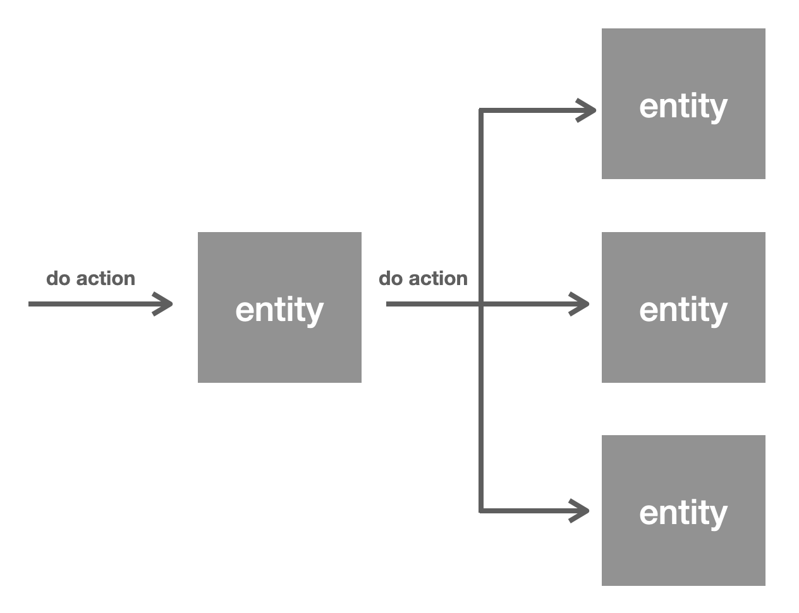

## 들어가면서

`하루스터디` 서비스 개발을 진행하면서 가장 많이 들었던 고민 중 하나는 `JPA Cascade를 언제 사용해야 하는가` 였습니다. **‘Cascde는 위험하니 조심해서 사용해야 한다!’**  와 같은 이야기도 많이 들었을뿐더러, 언제 어떻게 사용해야 할지 명확한 가이드라인을 찾기도 어려웠기 때문입니다. 따라서 이번 아티클에서 JPA Cascade에 대한 개념을 알아보고, 어떤 부분에서 위험하다고 일컬어지는 것인지까지 확인해보도록 하겠습니다.

## JPA Cascade란?

어떤 JPA 엔티티는 다른 엔티티의 존재에 깊게 연관되어 있기도 합니다. 가장 대표적인 예시로는 ‘댓글’과 ‘게시물’의 관계가 있습니다. ‘댓글’ 엔티티는 ‘게시글’ 엔티티가 없다면 존재 의의가 없기 때문입니다. 

가령 게시판 어플리케이션을 만들어본다고 가정해 봅시다. 게시물을 삭제하는 비즈니스 로직은 어떻게 작성할 수 있을까요?

```java
// PostService.java
@Transactional
public void deletePost(Long postId) {
    Post post = postRepository.findById(postId);
    List<Comment> comments = post.getComments();

    commentRepository.deleteAll(comments);
    postRepository.delete(post);
}
```

위와 같이 비즈니스 로직을 작성할 수 있을 것 같습니다. 그런데 여기서 몇 가지 의문점이 생깁니다.

- 게시물을 삭제할 때 댓글을 삭제하는 로직을 번거롭게 항상 작성해줘야 할까?
- 실수로 댓글 삭제 로직을 빼먹을 수도 있지 않을까?
- 보다 좋은 방법이 없을까?

이런 문제점들을 해결하기 위해 JPA Cascade가 등장했습니다. JPA Cascade를 활용하면 ‘어떤 엔티티와 다른 엔티티가 밀접한 연관성이 있을 때’에 대한 관리가 매우 수월해집니다. 즉, A라는 엔티티에 어떤 작업을 수행했을 때, 그 작업이 연관된 B라는 엔티티에게도 이루어져야 한다면 JPA Cascade는 유용하게 사용될 수 있다는 의미입니다.



> Cascade는 ‘폭포수가 흐르다’ 라는 사전적 의미를 갖고 있습니다.
> 

그리고 JPA에서는 총 6개의 Cascade Type을 지원하는데, 예제코드와 함께 하나씩 살펴보겠습니다. 

편의를 위해 예제 코드에서 등장하는 Post, Comment 엔티티는 **1. 양방향 일대일(`@OneToOne`) 매핑으로 구성**되어 있고 **2. Post 엔티티에서 Cascade 옵션을 지정**하고 있다고 가정합니다.

- **PERSIST**

엔티티를 영속화할 때, 연관된 엔티티도 함께 영속화합니다.

```java
Post post = new Post();
Comment comment = new Comment();

post.addComment(comment);

entityManger.persist(post); // post, comment 둘 다 영속화
```

- **MERGE**

엔티티 상태를 병합할 때, 연관된 엔티티도 함께 병합합니다. 쉽게 말해서 수정사항을 반영하는 작업을 전파하겠다는 의미입니다.

```java
Post post = new Post("this is post");
Comment comment = new Comment("this is comment");

post.addComment(comment);

entityManager.persist(post);
entityManager.persist(comment);

entityManger.flush(); 
entityManger.clear();

post.setTitle("this is changed post");
comment.setValue("this is changed comment");

entityManager.merge(post); // post, comment 모두 변경사항 반영
```

- **REMOVE**

엔티티를 제거할 때, 연관된 엔티티들도 함께 제거합니다. 

```java
Post post = new Post("this is post");
Comment comment = new Comment("this is comment");

entityManager.persist(post);
entityManager.persist(comment);

entityManager.remove(post); // post, comment 모두 삭제
```

- **REFRESH**

엔티티를 새로고침할 때, 연관된 엔티티들도 함께 새로고침합니다. 여기서 ‘새로고침’한다는 말의 의미는 데이터베이스로부터 실제 튜플의 값을 즉시 로딩해 덮어씌운다는 의미입니다. 

```java
Post post = new Post("this is post");
Comment comment = new Comment("this is comment");

post.addComment(comment);

entityManager.persist(post);
entityManager.persist(comment);

entityManager.flush(); // 데이터베이스에 반영

post.setTitle("this is changed post");
comment.setValue("this is changed comment");

entityManager.refresh(post); // 데이터베이스로부터 post, comment의 원본 값 즉시 로딩

System.out.println(post.getTitle()); // this is post
System.out.println(comment.getValue()); // this is comment
```

- **DETACH**

엔티티를 영속성 컨텍스트로부터 분리하면 연관된 엔티티들도 분리됩니다. 

```java
Post post = new Post("this is post");
Comment comment = new Comment("this is comment");

post.addComment(comment);

entityManager.persist(post);
entityManager.persist(comment);

entityManager.detach(post); // post, comment 모두 영속성 컨텍스트로부터 분리됨
```

- **ALL**

위에서 언급한 모든 Cascade Type들이 적용됩니다.

> JPA의 구현체인 Hibernate의 경우에는 추가적으로 3개의 Cascade Types(REPLICATE, SAVE_UPDATE, LOCK)을 지원하는데, 이번 아티클에서는 다루지 않겠습니다.
> 

## 연관관계 매핑과 Cascade

보시다시피 Cascade의 개념 자체는 어렵지 않습니다. 단순히 EntityManager의 어떤 작업이 수행되면 해당하는 작업을 연관된 엔티티들에게 전파하겠다는 의미입니다. 그렇다면 ‘Cascade는 위험하다’라고 일컬어지는 이유는 무엇일까요?

연관관계 매핑과 함께 Cascade를 잘못 사용하게 되면 의도치 못한 결과를 불러올 수 있기 때문입니다. 

### 1. 참조 무결성 제약조건 위반 가능성

CascadeType.REMOVE 혹은 CascadeType.ALL 옵션을 잘못 사용하면 엔티티 삭제 시 연관된 엔티티들이 전부 삭제가 되기 때문에 참조 무결성 제약조건을 위반할 수도 있습니다. 

> 참조 무결성 제약조건이란, 관계형 데이터베이스(RDB)에서 릴레이션(relation)은 참조할 수 없는 외래 키(foreign key)를 가져서는 안 된다는 조건을 의미합니다.

이를 위반하는 경우 데이터의 모순이 발생하게 됩니다.
> 

예를 들어 아래와 같이 Comment와 Post가 다대일로 매핑이 된 상태이고 Comment 엔티티의 필드 post에 CascadeType.REMOVE를 지정한 상태라고 가정해보겠습니다.

```java
// Comment.java
@Entity
public class Comment {

    @ManyToOne(cascade = CascadeType.REMOVE)
    @JoinColumn(name = "post_id")
    private Post post;
    // ...생략
}
```

그렇다면 다음과 같은 문제가 발생할 수 있습니다.

```java
@Test
void ManyToOne_REMOVE() {
    Post post = new Post();
    Comment comment1 = new Comment();
    Comment comment2 = new Comment();

    comment1.setPost(post);
    comment2.setPost(post);

    postRepository.save(post);
    commentRepository.save(comment1);
    commentRepository.save(comment2);

    commentRepository.delete(comment1); // 관련된 엔티티(post)도 삭제

    assertThatThrownBy(() -> entityManager.flush()) 
            .isInstanceOf(PersistenceException.class);
    // comment2 가 참조하는 post 엔티티가 삭제되었으므로 외래키 관련 예외 발생
    // 만약 외래키 제약조건이 없다면 예외가 발생하지 않음
}
```

comment1을 삭제했을 뿐이지만, 연관된 엔티티인 post까지 삭제되었고 기존에 post를 참조하고 있던 comment2는 참조하고 있는 값이 사라져 참조 무결성 제약조건 위반 예외가 발생합니다.

> flush 시점에 참조 무결성 제약조건 위반 예외가 발생하는 이유는 ‘영속성 컨텍스트’에서는 외래키 제약조건이 존재하지 않기 때문입니다.  데이터베이스에 직접 쿼리를 날리고 나서야 예외가 발생하게 됩니다.
> 

실제 운영 환경에서는 개발 편의성을 위해 외래키 제약조건을 사용하지 않는 경우도 많은데, 그런 경우에는 예외도 발생하지 않아서 데이터 정합성에 문제가 생길 가능성이 큽니다. 

### 2. 양방향 연관관계 매핑 시 충돌 가능성

양방향 연관관계 매핑을 하는 경우에도 유의해야 합니다. Comment, Post가 다대일 관계로 구성되어 있고 연관관계의 주인은 Comment라고 가정하겠습니다. 이 경우 아래와 같이 Post의 comments 필드에 CascadeType.PERSIST를 지정하는 경우 문제가 생길 수 있습니다.

```java
// Post.java
@Entity
public class Post {

    @OneToMany(mappedBy = "post", cascade = CascadeType.PERSIST)
    private List<Comment> comments = new ArrayList<>();
```

테스트 코드를 통해 문제 상황을 보여드리면 다음과 같습니다.

```java
@Test
void bidirectional_bad_case() {
    Post post = new Post();
    Comment comment1 = new Comment();
    Comment comment2 = new Comment();

    post.addComment(comment1);
    post.addComment(comment2);

    commentRepository.delete(comment1);
    postRepository.save(post);

    assertThat(entityManager.contains(comment1)).isTrue();
}
```

이상하게 `commentRepository.delete(comment1)` 을 호출했음에도 삭제가 되지 않는 모습을 확인할 수 있습니다. `delete` 를 호출해 comment1이 삭제된 상태에서 post를 `save` 하니 다시 comment1 값이 복원된 것입니다. 

이와 같이 영속화에 대한 관리 지점이 두 곳이면 데이터 값을 예측할 수 없는 문제가 발생합니다. **‘영속성 전이(cascade)는 관리하는 부모가 단 하나일 때 사용해야 한다’** 라는 주장이 나온 배경도 비슷한 맥락입니다. 

이를 해결하기 위해서는 다음과 같이 post에서도 comment를 제거하도록 편의 메소드를 구현해야 합니다.

```java
// Post.java
public void deleteComment(Comment comment) {
    comments.remove(comment);
}
```

```java
@Test
void bidirectional_good_case() {
    Post post = new Post();
    Comment comment1 = new Comment();
    Comment comment2 = new Comment();

    post.addComment(comment1);
    post.addComment(comment2);

    post.deleteComment(comment1);
    commentRepository.delete(comment1);
    postRepository.save(post);

    assertThat(entityManager.contains(comment1)).isFalse();
}
```

이는 비단 CascadeType.PERSIST 만의 문제는 아니며, 다른 CascadeType을 사용하면서 양방향 연관관계 매핑을 적용하는 경우에는 항상 염두에 둬야 하는 부분입니다.

## 언제 사용해야 할까?

Cascade는 엔티티 간 관계가 명확할 때 사용하는 것을 추천드립니다. 단순히 편해서, 비즈니스 로직이 깔끔해진다고 해서 Cascade를 사용하는 것은 추후 큰 문제를 야기할 수도 있습니다. 특히 Cascade 오용으로 인한 문제가 발생하는 경우, 앞서 설명한 예시처럼 예외가 터지지 않는 경우도 있기 때문에 운영 환경에 오랫동안 잠식할 확률이 높습니다.

‘게시물’과 ‘댓글’의 관계처럼 부모 - 자식 구조가 명확하다면 Cascade를 사용하는 것은 괜찮은 선택입니다. 하지만 하나의 자식에 여러 부모가 대응되는 경우(‘학생’과 ‘수강 중인 수업’의 관계 등)에는 사용하지 않는 것이 좋습니다. 

추가로, ‘이 엔티티들이 유일한 부모 - 자식 관계인가?’ 를 고민할 때에는 미래의 상황까지 고려해야 합니다.  현재는 단 하나의 부모에 속하는 엔티티라고 해도 이후에 여러 부모에 속하도록 변경될 수도 있기 때문입니다. 

Cascade는 개발편의성을 높일 수 있는 기술입니다. 하지만 이를 오용하는 경우 데이터 정합성을 깨뜨릴 수 있을 뿐더러 최악의 경우에는 데이터 손실까지 발생하게 됩니다. 따라서 비즈니스, 도메인에 맞춰 유의해서 사용하시는 것을 권장드립니다. 

## 참고 자료

[https://www.baeldung.com/jpa-cascade-types](https://www.baeldung.com/jpa-cascade-types)

자바 ORM 표준 JPA 프로그래밍 - 김영한

[정보통신용어사전 - 참조 무결성 제약조건](http://terms.tta.or.kr/dictionary/dictionaryView.do?subject=%EC%B0%B8%EC%A1%B0%20%EB%AC%B4%EA%B2%B0%EC%84%B1)
