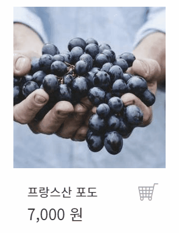
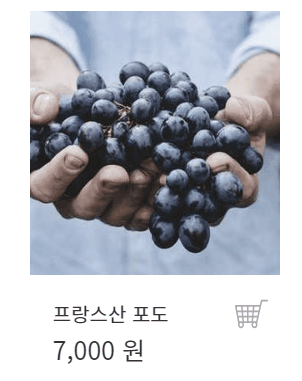
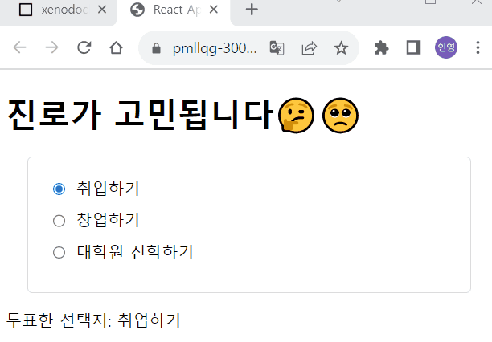
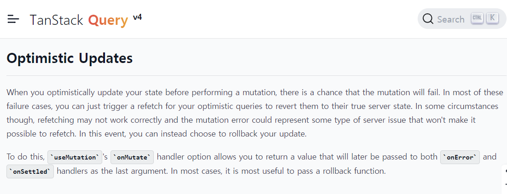
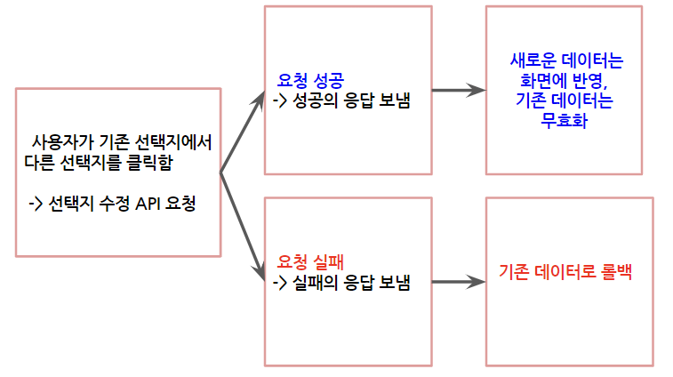
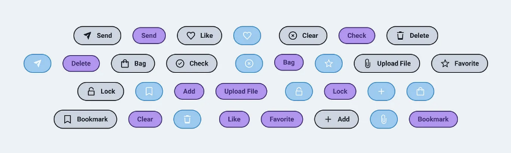
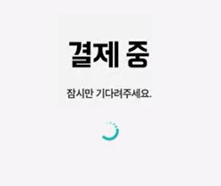

## 들어가며: 낙관적 업데이트, 왜 필요할까?

> 장바구니에 상품을 추가했는데, 왜 화면에는 바로 반영되지 않을까?

낙관적 업데이트의 필요성을 처음 느낀 순간은, `장바구니에 상품 추가하기` 기능을 만들 때였습니다.



‘장바구니 상품 추가’를 위해 POST 요청을 보내고, 이에 대한 **응답이 오기까지 3초의 지연 시간**이 있다고 해봅시다. 그리고 개발자 네로 씨는 이 응답을 기다렸다가, 응답에 따라 상태를 업데이트하여 UI를 변경하려고 합니다.

이러한 로직이라면, 화면을 보고 있는 사용자들은 위 그림처럼 3초를 기다렸다가, 3초 뒤에야 해당 상품이 장바구니에 담긴 것을 볼 수 있습니다.

사용자들은 이러한 기다림에 대해 불편함을 느꼈고, 네로 씨는 `서버와의 통신과 상관없이, 화면(또는 UI) 먼저 바꿔줄 수는 없을까?` 라는 생각을 하게 됩니다.



따라서 네로 씨는 서버의 응답이 오기 전에 상태를 먼저 바꿔서, 업데이트된 상태를 화면에 반영해 주기로 했습니다.

사용자들은 이제 위 그림처럼, 장바구니 아이콘을 누른 순간 즉시 ‘아 장바구니에 상품이 추가되었네!’ 라고 느끼게 됩니다. 

바로 '낙관적 업데이트'를 통해 지연 시간에 대한 불편을 해소한 것이죠!

## 낙관적 업데이트는 무엇인가?

### 낙관적 업데이트가 등장하기 이전에는…

`낙관적 업데이트(Optimistic Update)`는 웹 애플리케이션에서 **사용자 경험을 향상**시키기 위해 사용되는 개념입니다. 주로 네트워크 요청이나 데이터 업데이트와 관련하여 사용됩니다.

프론트엔드의 일반적인 상태 업데이트 방식은 다음과 같습니다.

1. 사용자가 어떤 동작(예: 게시글 작성, 댓글 수정, 북마크)을 수행합니다.
2. 서버에 해당 변경 사항(mutation)을 요청하고 응답을 기다립니다.
3. 서버의 응답에 따라 UI를 업데이트합니다.

하지만 이 접근 방식은, 장바구니 예시처럼 사용자가 서버의 응답을 기다려야 하므로 네트워크 지연이나 서버 응답 속도가 느릴 경우에는 사용자 경험이 저하될 수 있습니다.

### 사용자 경험 향상을 위한 방법, 낙관적 업데이트

`낙관적 업데이트`는 이러한 문제를 해결하기 위한 방법으로, **사용자의 동작에 대한 응답을 기다리지 않고 미리 UI를 업데이트하는 것**입니다.

사용자가 어떤 동작을 수행했을 때, 서버 요청을 보내기 전에 먼저 UI를 업데이트합니다. 서버 응답 성공 시 새로운(업데이트된) 상태를 화면에 그리고, 실패 시에는 오류 메시지를 보여주고 기존의 상태를 유지합니다.

그 결과, 사용자는 동작에 대한 빠른 피드백을 받으므로 애플리케이션이 더 빠르게 반응한다고 느끼게 됩니다.

혹자는 아래와 같은 의문을 가질 수도 있습니다.

> 요청에 대한 응답이 빠르게 오도록, 서버의 성능을 높이면 되지 않나요? 🤔

서버의 응답이 아무리 빠르더라도, **사용자가 어떤 네트워크 환경에 처해 있느냐**에 따라 애플리케이션의 응답 속도가 달라집니다. 예를 들어 지하철의 공공 와이파이로 접속한 경우, 어떨 때는 네트워크가 불안정할 수도 있죠.

따라서 서버의 응답에만 의존하여 상태(또는 UI)를 업데이트하는 것이 아니라, `낙관적 업데이트` 와 같은 로직을 통해 각기 다른 사용자들의 환경에 대비하는 것이 좀 더 바람직해 보입니다.

### 커뮤니티/SNS 서비스 속 낙관적 업데이트

VoTogether(보투게더)라는 투표 중심의 커뮤니티 서비스를 만들면서, **투표 선택지 수정 기능과 댓글 수정** **기능**을 구현해야 했습니다.

그런데 투표 선택지 수정 및 댓글 수정 API 요청을 한 뒤, 이에 대한 응답이 성공적으로 오기 전까지는 사용자가 바라보는 UI가 즉각적으로 수정되지 않았습니다.

사용자는 UI가 업데이트되기를 몇 초간 기다려야 하는데, 이러한 기다림은 사용자 경험을 저하할 수 있다고 생각했습니다.

VoTogether 팀은 서버 데이터로 UI를 업데이트하는 경우가 많았기 때문에 `tanstack-query`나 `swr` 같은 서버 상태 관리 라이브러리를 도입하였고, `tanstack-query`가 제공하는 메서드 중 `useMutation`(onMutate, onError, onSettled)을 이용하여 '낙관적 업데이트'를 구현하기로 하였습니다.

`tanstack-query`를 사용하지 않고도 낙관적 업데이트를 구현할 수는 있지만, VoTogether 팀은 서버 상태에 대한 관리를 `tanstack-query`를 이용하고 있기에 [공식 문서](https://tanstack.com/query/v4/docs/react/guides/optimistic-updates)의 설명을 참고하여 낙관적 업데이트를 구현해 보았습니다!

## 상태 관리 라이브러리 없이 구현하기

먼저 `tanstack-query` 를 사용하지 않고, react의 `setState(useState)`으로만 투표 선택지 수정 기능을 구현해 봅시다.

- 투표 선택지 컴포넌트(VoteOptionList.tsx, styled-components 코드는 생략됨)

```tsx
import React from 'react';
import styled from 'styled-components';

interface Props {
  options: string[];
  selectedOption: string;
  onChange: (option: string) => void;
}

const updateSelectedOptionApi = async (newOption: string) => {
  try {
    const response = await fetch('/api/updateSelectedOption', {
      method: 'PUT',
      headers: { 'Content-Type': 'application/json' },
      body: JSON.stringify({ newOption }),
    });
    if (!response.ok) {
      throw new Error('투표 선택지 수정 오류 발생');
    }
    alert(`투표한 선택지는 : ${newOption}`);
  } catch (error) {
    console.error('API error:', error);
    alert('투표 선택지 수정 중 오류가 발생했어요');
    throw error;
  }
};

export default function VoteOptionList({ options, selectedOption, onChange }: Props) {
  const handleOptionClick = async (option: string) => {
    onChange(option); // 선택한 선택지 바로 반영

    try {
      await updateSelectedOptionApi(option); // 선택한 선택지 수정 API 요청 호출
    } catch (error) {
      console.error('투표 선택지 수정 오류:', error);
      onChange(selectedOption); // 업데이트 실패 시 선택지 원래대로 돌리기
    }
  };

  return (
    <VoteListContainer>
      {options.map((option, index) => (
        <VoteItem key={index} onClick={() => handleOptionClick(option)}>
          <OptionRadio
            type="radio"
            name="voteOption"
            value={option}
            checked={selectedOption === option}
            onChange={() => handleOptionClick(option)}
          />
          <OptionLabel>{option}</OptionLabel>
        </VoteItem>
      ))}
    </VoteListContainer>
  );
}
```

- App.tsx (VoteOptionList 컴포넌트의 상위 요소)

```tsx
import React, { useState } from 'react';
import styled from 'styled-components';
import VoteOptionList from './VoteOptionList';

function App() {
  const options = ['취업하기', '창업하기', '대학원 진학하기'];
  const [selectedOption, setSelectedOption] = useState<string>(options[0]);

  const handleOptionChange = (option: string) => {
    setSelectedOption(option); // 선택한 선택지를 수정
  };

  return (
    <div>
      <h1>진로가 고민됩니다🤔🥺</h1>
      <VoteOptionList
        options={options}
        selectedOption={selectedOption}
        onChange={handleOptionChange}
      />
      <p>투표한 선택지: {selectedOption}</p>
    </div>
  );
}

export default App;
```

위의 코드로 구현한 결과물은 아래와 같습니다.



처음에는 ‘취업하기’라는 선택지였고, ‘창업하기’라는 선택지로 먼저 낙관적 업데이트를 진행합니다. 그 후 API 요청을 보내고, 응답을 기다리다가 오류가 발생하여 원래의 선택지(’취업하기’)로 되돌리는 모습입니다.

```tsx
const handleOptionClick = async (option: string) => {
  onChange(option); // 선택한 선택지 바로 반영

  try {
    await updateSelectedOptionApi(option); // 선택한 선택지 수정 API 요청 호출
  } catch (error) {
    console.error('투표 선택지 수정 오류:', error);
    onChange(selectedOption); // 업데이트 실패 시 선택지 원래대로 돌리기
  }
};
```

자세한 코드는 [링크](https://codesandbox.io/p/sandbox/xenodochial-hertz-pmllqg?file=%2Fsrc%2FApp.tsx%3A7%2C35)에서 참고할 수 있습니다.

## tanstack-query로 구현하기

이제 `tanstack-query`를 이용하여 선택지 수정 기능에 대한 낙관적 업데이트를 구현해 봅시다.

- useEditVote.ts

```tsx
import { useMutation, useQueryClient } from '@tanstack/react-query';
// 선택지 수정 API 요청에 쓰이는 fetch 메서드
export async function updateSelectedOptionApi(newOption: string): Promise<void> {
  const response = await fetch('/api/updateSelectedOption', {
    method: 'PUT',
    headers: {
      'Content-Type': 'application/json',
    },
    body: JSON.stringify({ newOption }),
  });

  if (!response.ok) {
    throw new Error('Failed to update selected option');
  }
}
// 선택지 수정 쿼리
export const useEditVote = (postId: string) => {
  const queryClient = useQueryClient();
  const queryKey = ['posts', postId, 'option'];

  const { mutate, isLoading, isError, error } = useMutation(
    (newOption: string) => updateSelectedOptionApi(newOption),
    {
      onMutate: async () => {
        // 선택지 데이터에 대한 모든 퀴리요청을 취소하여 이전 서버 데이터가 낙관적 업데이트를 덮어쓰지 않도록 함 -> refetch 취소시킴
        await queryClient.cancelQueries(queryKey);

        const prevOption = queryClient.getQueryData(queryKey); // 기존 선택지 데이터의 snapshot
        queryClient.setQueryData(queryKey, prevOption); // 낙관적 업데이트 실시

        return { prevOption }; // context를 return, context 예시에는 이전 스냅샷, 새로운 값(또는 롤백하는 함수)이 있음
      },
      onError: (error, _, context) => {
        // 캐시를 저장된 값으로 롤백
        queryClient.setQueryData(queryKey, context?.prevOption);
        window.console.log('선택지 수정에 실패했습니다. 다시 시도해주세요.', error);
      },
      onSuccess: () => {
        // 쿼리 함수의 성공하면 -> 기존 선택지 데이터 무효화
        queryClient.invalidateQueries(queryKey);
      },
    },
  );

  return { mutate, isLoading, isError, error };
};
```

- VoteOptionList.tsx

```tsx
export default function VoteOptionList({
  options,
  selectedOption,
  onChange,
}: Props) {
  const postIdExample = "1234";
  const { mutate } = useEditVote(postIdExample);

  const handleOptionClick = (option: string) => {
    onChange(option);
    mutate(option);
  };
// .. 중략
```

자세한 코드는 [링크](https://codesandbox.io/p/sandbox/intelligent-gates-f999p3?file=%2Fsrc%2FVoteOptionList.tsx%3A26%2C1)에서 참고할 수 있습니다.



`tanstack-query`의 [공식 문서](https://tanstack.com/query/v4/docs/react/guides/optimistic-updates)는 어떠한 매커니즘으로 낙관적 업데이트를 구현하는지, 예시 코드와 함께 상세히 설명하고 있습니다.

### 서버의 응답이 성공한 경우

```tsx
 onSuccess: () => {
      // 쿼리 함수의 성공하면 -> 기존 선택지 데이터 무효화
      queryClient.invalidateQueries(queryKey);
 },
```

### 서버의 응답이 실패한 경우

```tsx
onError: (error, _, context) => {
      // 캐시를 저장된 값으로 롤백
      queryClient.setQueryData(queryKey, context?.prevOption);
      window.console.log(
        "선택지 수정에 실패했습니다. 다시 시도해주세요.",
        error
      );
},
```

`tanstack-query`에서 진행되는 낙관적 업데이트는 흐름도는 아래와 같습니다.



## 낙관적 업데이트는 언제 필요할까?

### 낙관적 업데이트가 필요한 경우



위 이미지의 **메시지 전송, 좋아요, 찜, 투두리스트 체크, 장바구니 담기, 게시글 비공개, 파일 업로드, 북마크** 등은 모두, 낙관적 업데이트가 필요한 기능들입니다.

이러한 기능들의 공통점은, 모두 **기존의 데이터에 업데이트(mutate)를 일으킨다**는 점입니다. 사용자의 동작에 따라 발생한 데이터 업데이트는, 지연 시간(latency) 없이 즉각적인 피드백을 화면에 띄워야 사용자 만족도를 높일 수 있습니다.

> 낙관적 업데이트가 굳이 필요한가요? 사용자가 기다리게 하는 것 역시 사용자 경험이 될 수 있지 않나요?

위와 같은 궁금증이 들 수도 있습니다. 사실 지연 시간 또한 사용자 경험이 될 수 있습니다. 웹 애플리케이션 개념이 등장한 지 얼마 되지 않은 시절에는, 사용자들은 기다림이 문제가 된다는 것을 인지조차 하지 않았습니다.

그러나 세월이 흘러 지금처럼 매일 새로운 콘텐츠가 쏟아져 나오고, 데이터를 업데이트하는 기능들이 다양해지면서 피드백 없는 기다림은 불편 사항이 될 수밖에 없었죠.

### 낙관적 업데이트를 지양해야 하는 경우

물론 낙관적 업데이트가 모든 상태의 업데이트에 필요한 것은 아닙니다. 낙관적 업데이트가 필요하지 않거나, 심지어 사용을 지양해야 하는 경우도 존재합니다.

예를 들어 **장바구니에 상품을 담고 결제를 진행**한다고 해봅시다.

사용자가 결제 버튼을 클릭하면 어떻게 될까요? 일반적으로 결제 요청이 서버로 전송되고, ‘로딩 중’ 같은 문구나 로딩 스피너가 보일 것입니다.



만약 결제 기능에 낙관적 업데이트를 적용한다면, 결제 응답과 상관없이 장바구니의 상품을 먼저 제거하는 등 UI 먼저 업데이트하게 됩니다. 그 결과는 사용자는 결제했음에도 장바구니에 아직 상품들이 남아 있는 것을 발견합니다.

장바구니의 상품들 상태는 서버의 데이터를 GET 요청하여 보여주는데, 아직 서버의 데이터는 완전하게 업데이트를 끝내지 못했기 때문입니다.

이렇듯 서버 데이터와 화면의 상태 간 일관성이 중요한 경우, 낙관적 업데이트를 지양해야 합니다. 결제나 계정 정보 관리 등의 기능들은 일정 시간의 지연 시간이 필연적이라는 사실을, 많은 사용자가 그동안의 사용자 경험으로 인지하고 있는 부분입니다. 따라서 이러한 상황에는 낙관적 업데이트를 하여 사용자 경험을 저하하기보다는, 중요한 작업의 신뢰성을 유지하기 위해 ‘로딩 중’처럼 서버 응답을 기다리도록 하는 것이 안전합니다.

## 마치며

낙관적 업데이트는 사용자 경험을 개선하고 더 빠른 애플리케이션 응답을 제공하기 위한 좋은 전략 중 하나입니다.

`tanstack-query`는 낙관적 업데이트 기능을 제공하고 있고, 이러한 기능을 라이브러리 없이 직접 구현해 보는 것도 좋은 학습이 될 것이라 생각합니다!

나아가 낙관적 업데이트는 데이터의 종류를 고려해 보고 신중하게 구현해야 합니다. 만약 꼭 필요한 경우라면, 서버 응답 실패의 경우에도 오류 메시지를 사용자에게 보여주는 등 적절한 대처가 필요합니다.

---

## 참고 자료

https://tanstack.com/query/v4/docs/react/guides/optimistic-updates

https://ilxanlar.medium.com/better-ux-with-optimistic-ui-b72665e1afdf

https://uxplanet.org/faster-user-experience-optimistic-ui-41b151feaa28

https://uncertainty.oopy.io/optimistic-ui-with-react-query
