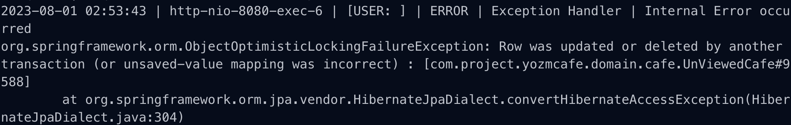
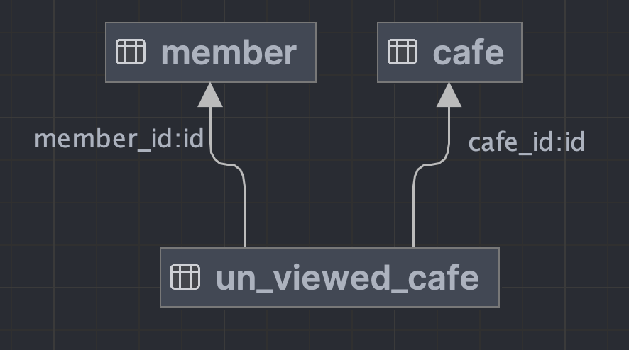

안녕하세요. 우아한테크코스 5기 BE 연어입니다.
팀 프로젝트에서 열심히 `요즘카페`라는 서비스를 만들고 있습니다.

[요즘카페](https://yozm.cafe)는 스크롤 내리면서 성수동의 카페들을 하나씩 볼 수 있는 **숏폼** 형식의 서비스입니다.
최근에 무한 스크롤 기능을 추가하면서 예상치 못한 동시성 문제를 맞닥뜨렸는데요.

이 글에서는 `ObjectOptimisticLockingFailureException`이 왜 발생했고, 관련 개념들과 해결 방법에 대해서 다뤄보고자 합니다.

목차는 아래의 순서와 같습니다.

- 문제 발생
- 배경 설명
- Entity Manager
- DB Isolation Level
- 문제 원인
- 해결 방안
- 정리

## 문제 발생

평소처럼 선릉 캠퍼스에 도착해서 로그를 보고 있었습니다.

그런데 처음 보는 예외가 발생해 있었고, **어떤 행동을 하면 발생하는지** 알기 위해 이런저런 행동을 해봤습니다.

### 기대했던 동작

- 회원이 스크롤을 엄청 빠르게 내려도
- 로그에는 예외가 발생하지 않고
- 새 카페가 중복 없이 나온다

### 문제가 발생하는 행동

- 회원이 스크롤을 엄청 빠르게 내리면
- 로그에는 위와 같이 `ObjectOptimisticLockingFailureException`이 발생해 있고
- 스크롤을 내려도 계속 똑같은 카페 화면이 보인다

**왜 문제가 발생했을까요…?**

## 배경 설명

[요즘카페](https://yozm.cafe)에서는 회원에게 `아직 보여주지 않은 카페`들을 우선으로 보여주는 로직이 존재합니다.

회원마다 아직 보지 않은 카페 목록 `UnViewedCafe`를 가지고 있습니다.
이는 `Member:Cafe = N:M` 인 다대다 관계를 중간에서 `1:N, M:1` 로 해결해 주는 테이블입니다.

회원이 스크롤을 내릴 때마다 새로운 카페들을 보여주게 되는데 이때 아래의 두 API가 필요합니다.

#### A. 회원이 아직 보지 않은 카페 목록을 조회하는 API

회원이 다음 카페를 보기 위해 스크롤을 내리면, 아직 보지 않은 카페들 중 랜덤으로 **5**개를 응답으로 보내줍니다.
해당 회원의 `UnViewedCafe` 테이블에서 5개를 조회해 와서 그대로 리턴하는 방식입니다.

#### B. 회원이 해당 카페를 봤다는 처리를 하기 위한 API

회원이 다음 카페를 보기 위해 스크롤을 내리면, 해당 카페 ID를 서버로 보내서 `UnViewedCafe` 테이블에서 제거합니다
`UnViewedCafe` 테이블에서 (memberId, cafeId) 조합의 데이터를 삭제하는 방식입니다.
또한 해당 회원의 `UnViewedCafe`가 0개가 됐을 때는 전체 카페들을 가져와서 다시 채워줍니다. 따라서 무한 스크롤이 가능해지게 됩니다.

위의 두 API를 가지고 **프론트엔드**에서는 아래와 같은 방식으로 동작합니다.

- **카페 목록에서 스크롤을 내려 추가로 볼 수 있는 남은 카페가 3개 이하**일 때마다 **A**를 요청합니다.
- 스크롤을 내려 다음 카페를 볼 때마다 **B**를 요청합니다.

대체 왜 `ObjectOptimisticLockingFailureException`이 발생했고, 스크롤을 내려도 똑같은 카페 화면만 보였을까요?
이유를 알기 위해서 먼저 `JPA의 Entity Manager`, `DB Isolation Level`에 대해 알아야 합니다.
아래에서 하나씩 간단히 살펴보겠습니다.

## Entity Manager

JPA를 쓰신다면 다들 들어보셨을 용어입니다.

Spring Data JPA를 사용하신다면 보통 아래의 방법들로 DB와 소통할 것입니다.

- JPA Repository Interface
- JPQL
- Native Query
- Entity Manager

위의 방법들은 공통점이 있습니다.
Spring Container에서 관리되는 `Entity Manager`를 통해 쿼리를 수행한다는 점인데요.

그럼 이제부터 이 `Entity Manager`의 특징에 대해서 하나씩 살펴봅시다.

#### `Entity Manager`는 항상 트랜잭션 내에서 동작합니다.

보통 서비스 레이어에서 `@Transactional`으로 메서드를 하나의 작업 단위로 관리하는데요.
이때 내부적으로 하나의 `Entity Manager`가 할당되고 이 `Entity Manager`가 영속성 컨텍스트, 실제 DB와 소통하게 됩니다.

#### `Entity Manager`는 싱글톤이 아닙니다.

기본적으로 멀티 스레드 방식으로 동작하는 스프링을 사용할 때 여러 요청을 동시에 처리합니다.
이때 실제 DB와 소통하는 `Entity Manager`를 싱글톤으로 쓴다면 여러 동시성 문제가 발생할 수 있겠죠?

따라서 Spring에서는 DB와 연결을 관리하는 객체인 `Entity Manager Factory`를 싱글톤으로 관리합니다.
그리고 `Entity Manager`가 필요할 때마다 `Entity Manager Factory`가 생성하는 방식으로 다수의 `Entity Manager` 인스턴스를 관리합니다.

#### `Entity Manager`는 자신만의 1차 캐시를 관리합니다.

JPA를 쓸 때 변경 감지를 사용하시나요?
**쓰기 트랜잭션** 범위 내에서 **영속 상태의 인스턴스**는 스냅샷이 관리됩니다.
`Entity Manager`는 이 스냅샷을 관리하다가 최종적으로 트랜잭션이 커밋될 때 DB로 Flush 해줍니다.

#### 정리해 보면,

`Entity Manager Factory`에서 관리하는 `Entity Manager`는 트랜잭션별로 생성되고 소멸합니다.
또한 1차 캐시를 각각 생성해서 관리합니다.
따라서 한 엔티티를 여러 스레드에서 동시에 수정해도 자신들만의 캐시에서 관리하기 때문에 서로 간섭이 없습니다.

그렇다면 동시에 아무리 요청이 많이 들어와도 동시성 이슈가 없지 않나요?

#### 문제는 1차 캐시에서 DB로 Flush될 때 발생합니다.

Spring Data JPA의 기본 구현체인 Hibernate는 Flush를 한 이후 실제 DB에서 영향 받은 데이터의 수를 리턴 받습니다.

이때, 기존 상태에서 예상되는 **변경할 데이터의 수**와 **실제 변경된 데이터의 수**가 다르면 `StaleObjectStateException`이 Hibernate에서 발생합니다.
그리고 위 런타임 예외가 JPA 레벨로 올라오면, **더 일반적인 예외인 `ObjectOptimisitcLockingFailureException`으로 Wrapping** 됩니다.

**동시에 여러 요청이 동일한 데이터를 변경하려고 할 때**, Application 레벨에서는 문제가 없지만 DB로 Flush될 때 발생하게 되겠죠?

## DB Isolation Level

데이터베이스에는 **격리 수준(Isolation Level)**이라는 개념이 존재합니다.
이는 트랜잭션의 작업이 다른 트랜잭션의 작업과 어떤 관계를 맺는지 정의합니다.

간단히 살펴보면 크게 4가지 단계가 있습니다. (더 자세한 설명은 [트랜잭션 격리 수준](https://tecoble.techcourse.co.kr/post/2022-11-07-mysql-isolation/)에서 보실 수 있습니다.)

- **Uncommitted Read**
  - 다른 트랜잭션에서 현재 수정 중인 내용도 볼 수 있습니다.
- **Committed Read**
  - 다른 트랜잭션에서 커밋을 하면, 그 내용도 볼 수 있습니다.
- **Repeatable Read**
  - 한 번 읽어온 정보에 대해서는, 다른 트랜잭션에서 수정하더라도 이전에 읽었던 상태로 보입니다.
- **Serializable**
  - 읽어온 정보에 대해서 현재 트랜잭션이 끝날 때까지, 다른 트랜잭션에서는 읽기조차 불가능합니다.

저희는 어떤 격리 수준을 사용하고 있을까요?
이를 위해 저희가 사용하는 MySQL에 대해서도 간단하게 살펴봅시다.

MySQL은 **MySQL 엔진**과 **스토리지 엔진**으로 구현돼 있습니다.
간단히 **MySQL 엔진은 핵심 본체**이고, **스토리지 엔진은 주로 읽기, 쓰기 등의 작업을 처리하는 일꾼**입니다.

스토리지 엔진은 여러 종류가 있고, MySQL에서도 여러 가지를 기본으로 제공하는데요.
**테이블 별로 어떤 스토리지 엔진**을 사용할지 설정할 수 있습니다.
**MySQL에서는 기본적으로** 테이블을 만들 때 스토리지 엔진을 지정하지 않으면, **InnoDB 스토리지 엔진**을 사용하게 됩니다.

그리고 **격리 수준은 각 트랜잭션별로 설정**할 수 있습니다.
**InnoDB에서는** 트랜잭션을 수행할 때 격리 수준을 따로 지정하지 않으면, **Repeatable Read** 수준을 사용하게 됩니다.

결론은 **Repeatable Read** 특성상 **최초 조회한 시점 이후**로 어떤 수정이 발생해도 똑같은 결과만 보이게 되겠죠?

## 드디어 살펴보는 문제 원인

여기까지 먼 길 오시느라 고생하셨습니다!

다시 문제를 리마인드 해봅시다.

> 회원이 스크롤을 엄청 빠르게 내리면
> **ObjectOptimisticLockingFailureException** 예외가 발생해 있고
> 스크롤을 내려도 **계속 똑같은 카페 화면**이 보인다

먼저 **프론트엔드**에서는 아래와 같은 방식으로 동작합니다.

- 회원이 스크롤을 내려서 다음 카페를 조회할 때마다 서버에게 해당 카페를 봤다는 요청을 합니다.
- 스크롤을 내려 추가로 볼 수 있는 남은 카페가 3개 이하일 때마다 서버에게 다음 카페 5개를 요청합니다.

#### 그리고 서버의 `UnViewedCafe` 테이블에 해당 회원의 남은 카페가 3개일 경우를 생각해 봅시다.

- 스크롤을 내릴 때, 추가로 볼 수 있는 남은 카페 목록이 3개 이하라면 다음 카페 조회 요청을 보냅니다.
  - 이때 스크롤 속도가 빠르다면 남은 카페 목록이 3개, 2개, 1개일 때 다음 카페 요청을 동시에 3번 보내게 됩니다.
  - 또한 스크롤을 내리면서 조회한 카페를 봤다는 요청을 동시에 3번 보냅니다.

위의 상황에서

- 서버는 봤다는 요청이 들어올 때마다 해당 카페를 회원의 `UnViewedCafe` 테이블에서 제거합니다.
  - 마지막 1개의 카페가 제거되어 0개가 됐을 때, 새로 전체 카페 목록을 회원의 `UnViewedCafe`에 채웁니다.
- 서버는 다음 카페 조회 요청이 들어올 때, 남아 있는 카페들을 보냅니다.
  - 봤다는 요청이 처리되는 시점에 따라 동일한 3개를 3번 보냈을 수도 있고 3개, 2개, 2개를 보냈을 수도 있고 2개, 2개, 1개를 보냈을 수도 있습니다.

#### 위의 행동들이 어떠한 순서로 처리될지는 매번 다릅니다.

결론적으로 발생하는 문제는 아래와 같습니다.

- 회원이 스크롤을 움직일 때마다 동일한 카페에 대해서 봤다는 요청이 동시에 발생할 수 있습니다.
  - `ObjectOptimisticLockingFailureException`이 발생합니다.
- 스크롤을 내려도 새로 카페가 채워지지 않은 시점이라면 2개, 1개의 카페만 계속해서 보일 수 있습니다.
  - 서버에서 회원의 `UnViewedCafe` 목록에 새 카페가 채워질 때까지(해당 **트랜잭션이 커밋되기 전**까지) 계속해서 동일한 카페들만 응답하게 됩니다.

## 해결 방안

문제를 해결하기 위한 두 선택지가 있었습니다.

1. Serializable 격리 수준 사용하기
2. 조회 요청 때 `UnViewedCafe`에서 다음 카페들을 제거하고 응답하기

#### 1. Serializable 격리 수준 사용하기

Serializable 격리 수준을 사용한다면, 제일 먼저 도착한 첫 요청만 처리되고 나머지 요청은 기다렸다가 처리될 수 있습니다.
하지만 이는 매우 비효율적인 방안입니다.

한 가지 극단적 예시를 보자면 아래와 같습니다.
카페를 제거하려고 할 때, 해당 카페를 조회하고 있는 회원이 있거나 새로 카페 목록이 채워지는 회원이 존재하면 평생 제거가 불가능합니다.

#### 2. 조회 요청 때 `UnViewedCafe`에서 다음 카페들을 제거하고 응답하기

이 글을 보시는 여러분은 아래와 같은 의문이 들었을 수 있을 것 같습니다.

> 왜 저런 식으로 카페를 봤다는 처리를 하지…?
> 그냥 조회 요청 때 `UnViewedCafe`에서 제거하면서 응답하면 되지 않았나?

이렇게 구현했다면,
조회 요청이 동시에 들어와도 가장 먼저 도착한 요청이 남은 카페 목록을 제거하고 응답받았을 것입니다.
그리고 다른 요청들은 예외가 발생하고 500으로 응답받게 됩니다.
사용자 입장에서는 첫 요청의 응답으로 카페들을 잘 받았기 때문에 예외가 발생해도 지장이 없습니다.

하지만 사용 도중에 브라우저를 종료하면 아직 보지 않은 카페는 `UnviewedCafe`가 새로 채워질 때까지 볼 수 없습니다.
이러한 상황이 반복되면 불행하게도 평생 못 보는 카페가 생길 수도 있습니다.

`무한 스크롤` 기능을 구현할 때 이 방식을 먼저 고려했으나 회원이 특정 카페를 못 보게 되는 경험은 막아야 한다고 생각했기 때문에 선택하지 않았습니다.

#### 선택과 근거

각 해결 방안의 트레이드 오프를 고려해 본 결과, 2번 방안(조회 요청 때 `UnViewedCafe`에서 다음 카페들을 제거하고 응답하기)을 선택하게 되었습니다.

회원이 특정 카페를 평생 보지 못할 수도 있다는 단점이 존재하나, 스크롤을 내릴 때 계속 같은 카페만 보이는 상황이 더 문제 된다고 판단했습니다. 회원 스스로는 특정 카페를 보지 못했다는 사실을 인지하기 어렵지만, 같은 카페만 보이는 경험은 사용자가 인지할 수 있는 단점이기에 사용자 이탈률로 직결됩니다.

따라서 2번 방안인 **조회 요청 때 `UnViewedCafe`에서 다음 카페들을 제거하고 응답하는 방식**으로 로직을 개선했습니다.

- 봤다는 요청 API를 제거하고 조회 요청 때 삭제하고 응답하도록 변경했습니다.
  - 더 이상 중복된 카페 화면이 나오지 않습니다.
- 남은 `UnViewedCafe`가 0개일 때 새로 채우지 않고, 20개 이하일 때 채웁니다.
  - 카페를 다시 채울 때까지 기다려야 하는 경우가 줄어듭니다.
- 새로 카페를 채울 때 `UnViewedCafe`에 남아 있는 카페는 중복해서 추가하지 않습니다.
  - 새로 채웠을 때 기존 리스트와 중복된 카페가 연속으로 보일 수 있는 상황이 발생하지 않습니다.

하지만 `StaleObjectStateException`에 대해 깔끔하게 해결하지 못한 상황입니다.
여전히 조회 요청이 동시에 온다면 이후 트랜잭션들은 예외가 발생하고 롤백 됩니다.
`UnViewedCafe` 테이블의 동일한 데이터를 동시에 제거하려고 했기 때문입니다.

#### 위의 남은 문제를 해결하려면 어떤 방법이 있을까요?

DB의 처리 속도를 개선해서 문제 발생 확률을 줄일 수도 있고, 격리 수준을 조정하거나 비관적 락, 낙관적 락 등을 사용할 수도 있습니다.

하지만 동시성 문제를 해결하는 방법은 간단하지 않습니다.
제시한 방법들을 사용해도 완벽히 해결하지 못할 수도 있고, 다른 문제들이 발생할 수 있습니다.

저희는 회원의 경험을 최우선시하는 방향으로 아래의 대안을 생각해 봤습니다.

- 엔티티에 버전을 매기는 낙관적 락을 사용해서 충돌을 감지합니다.
- 충돌이 감지되면 해당 트랜잭션을 재시도 합니다.

이제 `StaleObjectStateException`이 발생해도 재시도하므로 롤백 문제를 해결할 수 있게 됐군요.
회원 입장에서는 요청의 재시도 여부와 관계없이 항상 카페를 조회할 수 있습니다. 👍

## 정리

지금까지 무한 스크롤 기능에서 발생한 동시성 이슈를 살펴봤습니다.
DB에서 동일한 데이터를 제거하려고 할 때 `StaleObjectStateException`이 발생하는 것이 원인이었습니다.

서버 측에서 이를 해결하기 위해 아래의 방법들을 살펴봤습니다.

1. `Serializable` 격리 수준 사용
2. 비즈니스 로직 변경

2번을 선택해서 예외가 발생하는 확률을 훨씬 줄이고 성능은 그대로 유지할 수 있었습니다.
그러나 근본적인 문제인 `StaleObjectStateExcpetion`은 해결되지 않았고, 추가로 낙관적 잠금을 사용하게 됐습니다.

위의 방법이 모든 상황에서 정답은 아닙니다.

각자가 Trade-Off 사이에서 고민한 선택이 결과적으로도 최고의 선택이었기를 바랍니다.
지금까지 긴 글 읽어주셔서 정말 감사합니다😃
다 같이 힘내서 더 성장해 보아요🤍

## 참고

- 백은빈, 이성욱 지음, Real MySQL 8.0
- [Managing Entities](https://docs.oracle.com/javaee/7/tutorial/persistence-intro003.htm#BNBQW)
- [Hibernate Caching](https://www.digitalocean.com/community/tutorials/hibernate-caching-first-level-cache)
