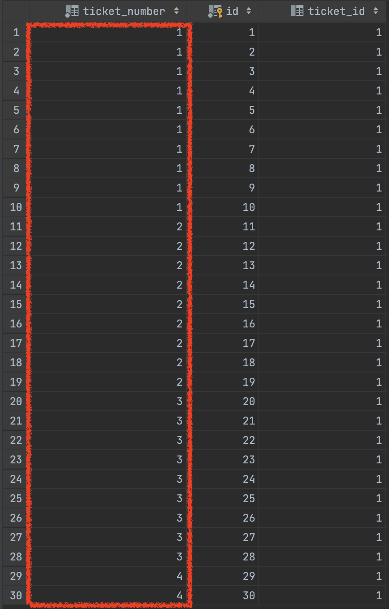
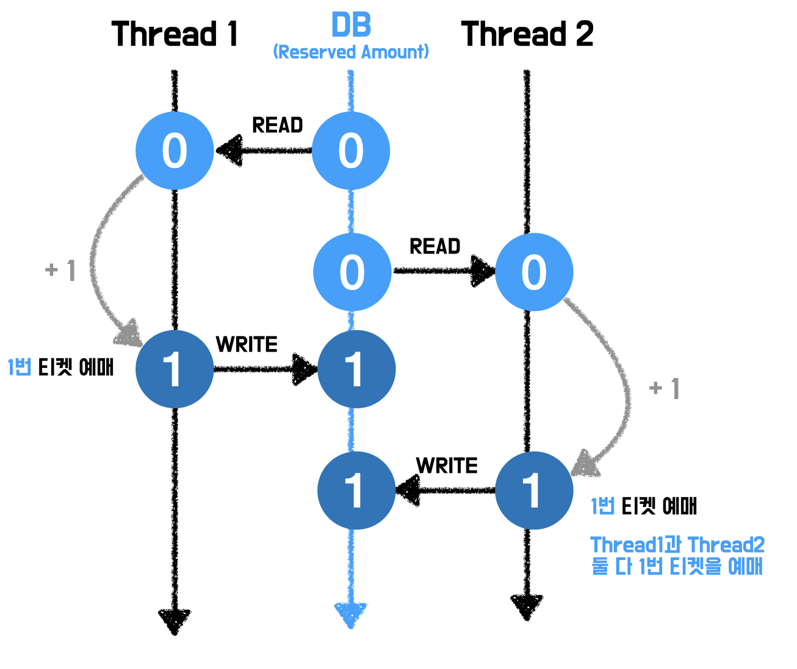
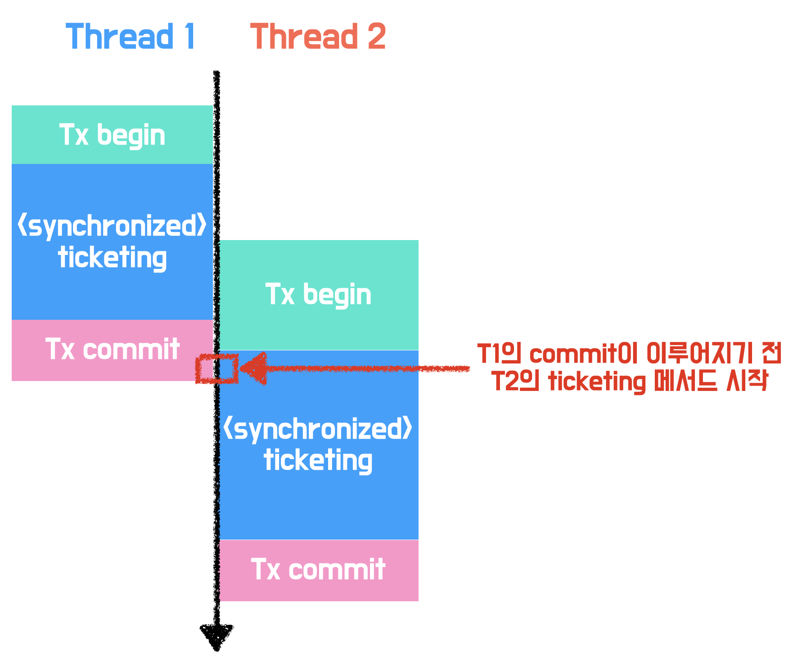

# 들어가며

대학 축제 티케팅 서비스 [페스타고](https://github.com/woowacourse-teams/2023-festa-go)를 개발하면서 아래와 같은 고민을 하게 되었다.

티켓 오픈 시간에 많은 사용자가 동시에 티켓 예매를 요청하면 어떠한 문제가 발생할까? 그리고 그 문제를 어떻게 해결할 수 있을까?

여기서 가장 중요한 것은 요청 순서에 따라 티켓을 발급하되, 준비된 수량만큼만 발급하는 것이다.

<br>

이번 글에서는 위와 같이 ‘동시성’에 대한 고민을 한 경험을 공유하고자 한다.

참고로, 이번 글에서는 개념에 대한 깊은 설명은 따로 하지 않는다. 모르는 개념이 있다면 아래 참고자료에서 개념을 익히도록 하자.

# 예제 코드

아래는 티켓 예매 상황을 간략하게 구현한 예제 코드이다. (실제로는 더 복잡한 요구사항이 존재하나, 이를 단순화하여 작성하였다.)

아래 예제 코드는 MySQL 8.0 innoDB 스토리지 엔진 기반으로 동작한다.

먼저 사용자가 “티켓 예매” 요청 시 호출되는 TicketingService의 ticketing 메서드이다.

```java
@Transactional
public void ticketing(long ticketId) {
    Ticket ticket = ticketRepository.findById(ticketId)
        .orElseThrow(() -> new IllegalArgumentException("Ticket Not Found."));
    ticket.increaseReservedAmount();
    int ticketNumber = ticket.getReservedAmount();
    reservationRepository.save(new Reservation(ticket, ticketNumber));
}
```

아래는 Ticket 도메인 코드 중 일부이다. increaseReservedAmount 메서드 호출 시 예매 수량과 총수량을 비교해 예매 가능 여부를 판단하고, 불가능할 시 예외가 발생한다.

```java
@Entity
@Getter
@NoArgsConstructor(access = AccessLevel.PROTECTED)
public class Ticket {

    @Id
    @GeneratedValue(strategy = GenerationType.IDENTITY)
    private Long id;

    private int totalAmount;

    private int reservedAmount = 0;

		/***/

    public void increaseReservedAmount() {
        if (reservedAmount >= totalAmount) {
            throw new IllegalArgumentException("Sold out.");
        }
        reservedAmount++;
    }
}
```

# 순차적 예매

모든 사용자가 순차적으로 요청한다고 가정하자.

해당 테스트에서는 10장의 티켓을 30명의 사용자가 예매하는 상황을 가정했다.

```java
@Test
void 티켓_순차적_예매_테스트() {
    // given
    int memberCount = 30;
    int ticketAmount = 10;
    Ticket ticket = ticketRepository.save(new Ticket(ticketAmount));

    AtomicInteger successCount = new AtomicInteger();
    AtomicInteger failCount = new AtomicInteger();

    // when
    for (int i = 0; i < memberCount; i++) {
        try {
            ticketingService.ticketing(ticket.getId());
            successCount.incrementAndGet();
        } catch (Exception e) {
            failCount.incrementAndGet();
        }
    }

    System.out.println("successCount = " + successCount);
    System.out.println("failCount = " + failCount);

    // then
    long reservationCount = reservationRepository.count();
    assertThat(reservationCount)
        .isEqualTo(Math.min(memberCount, ticketAmount));
}
```

## 실행 결과


해당 테스트는 당연하게도 성공했다. 예상한 수량인 10장만 정확하게 예매되었다.

티켓 예매 내역을 기록하는 Reservation 테이블을 조회해보니, 1~10번 티켓이 각각 한 장씩 예매된 것을 확인할 수 있었다.


아주 성공적이다.

하지만, 티케팅 상황에서는 다수의 사용자가 순차적으로 요청하기보다, 동시에 요청을 하는 상황이 더 일반적이다.

# 동시 예매

동시에 여러 요청이 발생한 상황을 테스트한 코드는 아래와 같다.

순차 요청 테스트와 같이 10장의 티켓을 30명의 사용자가 예매하는 상황을 가정했다.

```java
@Test
void 티켓_동시_예매_테스트() throws InterruptedException {
    // given
    int memberCount = 30;
    int ticketAmount = 10;
    Ticket ticket = ticketRepository.save(new Ticket(ticketAmount));

    ExecutorService executorService = Executors.newFixedThreadPool(30);
    CountDownLatch latch = new CountDownLatch(memberCount);

    AtomicInteger successCount = new AtomicInteger();
    AtomicInteger failCount = new AtomicInteger();

    // when
    for (int i = 0; i < memberCount; i++) {
        executorService.submit(() -> {
            try {
                ticketingService.ticketing(ticket.getId());
                successCount.incrementAndGet();
            } catch (Exception e) {
                System.out.println(e.getMessage());
                failCount.incrementAndGet();
            } finally {
                latch.countDown();
            }
        });
    }

    latch.await();

    System.out.println("successCount = " + successCount);
    System.out.println("failCount = " + failCount);

    // then
    long reservationCount = reservationRepository.count();
    assertThat(reservationCount)
        .isEqualTo(Math.min(memberCount, ticketAmount));
}
```

## 실행 결과

정확히 10장의 티켓이 예매되는 것을 기대했으나, 테스트 결과는 그렇지 않았다.


10장보다 적은 6장만 예매되었음을 확인할 수 있었다.

티켓의 수량보다 많은 요청이 있었는데, 왜 더 적게 예매되었을까?

<br>

출력문을 보니 아래와 같이 `Deadlock found when trying to get lock; try restarting transaction`이라는 문구와 함께 SQL Error가 발생했음을 확인할 수 있었다.


lock을 얻어오는 과정에서 Deadlock 즉, 교착 상태가 발생했다. lock을 얻어오는 행위를 따로 하지 않았는데 왜 교착 상태가 발생했을까?

### 교착 상태가 발생한 이유

티켓 예매 내역을 의미하는 Reservation 엔티티를 보자.

```java
@Entity
@Getter
@NoArgsConstructor(access = AccessLevel.PROTECTED)
public class Reservation {

    @Id
    @GeneratedValue(strategy = GenerationType.IDENTITY)
    private Long id;

    @ManyToOne(fetch = FetchType.LAZY)
    private Ticket ticket;

    private int ticketNumber;
}
```


Reservation 엔티티에 Ticket 엔티티와의 연관관계를 설정해 줌으로써, DB의 reservation 테이블에 외래 키 칼럼 ticketId가 추가되었다.

<br>

[MySQL 공식문서](https://dev.mysql.com/doc/refman/8.0/en/innodb-locks-set.html)에 아래와 같은 내용이 있다.

> If a `FOREIGN KEY` constraint is defined on a table, any insert, update, or delete that requires the constraint condition to be checked sets shared record-level locks on the records that it looks at to check the constraint. `InnoDB` also sets these locks in the case where the constraint fails.

즉, 외래 키 제약 조건이 있는 테이블에서 레코드를 삽입, 갱신, 삭제할 때 해당 제약 조건을 위반하는지 확인하기 위해 관련된 레코드들에 공유 잠금(S lock)을 설정한다는 뜻이다.

공유 잠금이란 다른 트랜잭션의 데이터 변경을 막고 데이터 일관성을 유지하는 잠금 유형이다. 여러 트랜잭션이 동시에 공유 잠금을 얻을 수 있다. 그러나 공유 잠금을 설정한 트랜잭션이 있을 때, 다른 트랜잭션은 해당 데이터에 대해 배타적 잠금(X lock)을 얻지 못한다.

배타적 잠금은 한 번에 하나의 트랜잭션만이 특정 데이터에 대한 쓰기 작업을 수행할 수 있도록 하는 잠금 유형이다. 다른 트랜잭션들은 쓰기 작업이 끝날 때까지 대기해야 하며, 이를 통해 데이터 충돌 문제를 방지한다.

<br>

실제로 innodb의 로그를 확인해보니, 여러 트랜잭션에서 데이터에 잠금을 거는 과정에서 교착 상태가 발생했음을 알 수 있었다. 아래는 로그 내용을 간략화한 것이다.

```
LATEST DETECTED DEADLOCK
------------------------
Transaction 1 (ID 20238):
- Holding S Lock on data ID 1 in table `ticket`, Waiting for X Lock
Transaction 2 (ID 20240):
- Holding S Lock on data ID 1 in table `ticket`, Waiting for X Lock
Transaction 2 Rolled Back
```

로그를 토대로 아래와 같이 교착 상태가 걸리는 과정을 알 수 있었다.


1. 트랜잭션 1이 id=1인 데이터에 공유 잠금을 얻었다.
2. 트랜잭션 2가 id=1인 데이터에 공유 잠금을 얻었다.
3. 트랜잭션 1이 id=1인 데이터에 배타적 잠금을 얻고싶지만, 트랜잭션 2에서 해당 데이터에 공유 잠금을 걸어두었기 때문에 대기한다.
4. 트랜잭션 2가 id=1인 데이터에 배타적 잠금을 얻고싶지만, 트랜잭션 1에서 해당 데이터에 공유 잠금을 걸어두었기 때문에 대기한다.
5. 무한 대기상태에 빠진다. 즉, 교착 상태가 발생한다.

## 연관관계 제거

실제로 교착 상태의 위험성 때문에 외래 키를 사용할 때는 신중해야 한다.

교착 상태의 문제를 해결하기 위해 Ticket과 Reservation간의 외래 키 관계를 제거했다.

```java
@Entity
@Getter
@NoArgsConstructor(access = AccessLevel.PROTECTED)
public class Reservation {

    @Id
    @GeneratedValue(strategy = GenerationType.IDENTITY)
    private Long id;

    private Long ticketId;

    private int ticketNumber;

    public Reservation(Ticket ticket, int ticketNumber) {
        this.ticketId = ticket.getId();
        this.ticketNumber = ticketNumber;
    }
}
```

연관관계 제거 후 다시 동시 예매 테스트를 실행하니, 교착 상태는 발생하지 않았다.

하지만 총 수량은 10장뿐이지만, 30명의 사용자 모두 예매에 성공하는 결과가 발생했다.


어떻게 티켓의 수량보다 많은 사용자가 티켓을 예매할 수 있었을까?

<br>

DB의 reservation 테이블을 확인하니 그 이유를 알 수 있었다.



1~10번 티켓이 각각 한 장씩 예매된게 아니라 1번 티켓 10장, 2번 티켓 9장, 3번 티켓 9장, 4번 티켓 2장이 예매되었다. 즉, 하나의 티켓이 여러 사용자에게 발급되는 문제가 발생했다.

<br>

순차적으로 예매를 요청할 때는 발생하지 않았던 문제였는데, 동시에 예매를 요청하는 상황에서는 왜 이와 같은 문제가 발생했을까?

### 순차적 예매 실행 흐름


순차적 예매 시 위 그림과 같이 한 스레드의 작업이 끝난 후 다음 스레드에서의 작업이 시작되기 때문에 충돌이 일어나지 않는다.

### 동시 예매 실행 흐름



순차적 예매와 달리, 동시 예매 시 위 그림과 같이 한 스레드가 데이터를 읽고 이를 갱신하기 전, 다른 스레드에서 데이터를 읽기 때문에 충돌이 발생한다. 이 이유로 여러 개의 트랜잭션에서 동일한 티켓을 예매할 수 있었다.

<br>

이제부터 위 문제 상황에 대한 해결책을 알아보자.

## 해결책

### synchronized

java에서 한 자원에 synchronized 키워드를 붙이면, 멀티 스레드 환경에서 단일 스레드만이 해당 자원에 접근가능하도록 보장한다.

그렇다면 ticketing 메서드에 synchronized 키워드를 붙임으로써, 동시에 들어오는 요청들을 순차적으로 처리할 수 있지 않을까?

한 번 실험해보자.

<br>

아래와 같이 ticketing 메서드에 synchronized 키워드를 붙여주고, 동시 예매 테스트를 실행하였다.

```java
@Transactional
public synchronized void ticketing(long ticketId) {
    Ticket ticket = ticketRepository.findById(ticketId)
        .orElseThrow(() -> new IllegalArgumentException("Ticket Not Found."));
    ticket.increaseReservedAmount();
    int ticketNumber = ticket.getReservedAmount();
    reservationRepository.save(new Reservation(ticket, ticketNumber));
}
```


여전히 결과는 옳지 않았다. 요청이 순차적으로 진행되지 않고, 병렬적으로 진행되었다.

@Transactional 키워드와 synchronized 키워드를 동시에 사용하면 어떤 문제가 발생하는 것일까?

<br>

@Transactional이 붙은 메서드가 호출되면, Spring은 프록시 객체를 생성한다.

해당 프록시 객체는 원본 객체를 감싸며, 메서드 호출 전 후로 transaction begin, commit을 수행한다.



여기서 프록시 객체에서 수행되는 transaction begin, commit 코드는 synchronized의 영향을 받지 않는다.

즉, 위 그림과 같이 T1 스레드에서 commit 되기 전 T2 스레드는 메서드를 시작할 수 있다.

<br>

이와 별개로 synchronized 키워드에는 몇 가지 단점이 존재한다.

한 스레드가 메서드 작업을 완료할 때까지 다른 스레드들은 대기해야 한다. 이로 인해 프로그램의 성능이 저하될 수 있다.

또한 이는 하나의 프로세스 안에서만 보장이 되기 때문에, 서버가 여러 대인 분산 환경에서는 데이터의 정합성을 보장할 수 없다.

<br>

따라서, synchronized 키워드는 우리 문제 상황의 해결책으로 적절하지 않다.

### 잠금

**잠금(Locking)** 은 데이터가 읽힌 후 사용될 때까지 데이터가 변경되는 것을 방지하기 위한 조치이다.

잠금 전략으로는 여러 트랜잭션 간 충돌이 일어나지 않을 것이라 가정하는 **낙관적 잠금(Optimistic Lock)** , 여러 트랜잭션 간 충돌이 일어날 것이라 가정하는 **비관적 잠금(Pessimistic Lock)** 이 있다.

<br>

낙관적 잠금과 비관적 잠금을 통해 문제상황 해결을 시도해 보자.

#### 낙관적 잠금

우선 우리의 코드에 낙관적 잠금을 적용해 보자.

낙관적 잠금은 아래와 같이 @Version 어노테이션을 통해 처리할 수 있다.

```java
@Entity
@Getter
@NoArgsConstructor(access = AccessLevel.PROTECTED)
public class Ticket {

    @Id
    @GeneratedValue(strategy = GenerationType.IDENTITY)
    private Long id;

    private int totalAmount;

    private int reservedAmount = 0;

    @Version
    private Integer version;

		/***/
}
```

DB의 Ticket 테이블에는 아래와 같이 version 칼럼이 추가되었다.


이제 동시 예매 테스트를 실행해 보자.


결과는 여전히 실패이다. 10장이 아닌 5장만 예매되었다.

reservation 테이블을 조회하니, 잠금을 걸지 않은 코드와 차이점을 발견할 수 있었다.


한 티켓이 여러 번 발급된 이전과 달리, 1~5번 티켓이 각각 한 장씩만 발급되었다.


사용자 수를 100명으로 늘리고 다시 테스트를 실행하니 10장이 다 발급되었다.

<br>

위와 같은 상황이 발생한 이유에 대해 알아보자.

낙관적 잠금을 사용하면 아래와 같이 버전 정보가 update문의 조건으로 포함된다.


일부 요청에서 데이터를 읽어왔을 때의 버전 정보와 현재 DB의 버전 정보가 일치하지 않아 요청에 실패한 것이다.


위 그림과 같이 트랜잭션 1과 트랜잭션 3은 버전 충돌이 없어 티켓 예매에 성공하였지만, 트랜잭션 2는 트랜잭션 1에서 업데이트한 버전과 충돌이 생겨 update문이 성공적으로 수행되지 못하였다.

<br>

낙관적 잠금은 버전 불일치 시 처리를 어플리케이션 레벨에서 담당하게 된다. 이는 티켓 예매 요청이 버전 충돌로 인해 실패할 경우, 직접 예외를 처리하여 재시도하는 로직을 구현해야 함을 뜻한다.

이러한 재시도 로직을 AOP를 통해 구현해보자.

먼저 @Retry 어노테이션을 정의한다.

```java
@Retention(RetentionPolicy.RUNTIME)
@Target(ElementType.METHOD)
public @interface Retry { }
```

다음은 낙관적 잠금 재시도 로직을 구현한 Aspect이다. 최대 1000번까지 0.1초 간격으로 재시도하도록 했다.

```java
@Order(Ordered.LOWEST_PRECEDENCE - 1)
@Aspect
public class OptimisticLockRetryAspect {

    private static final int MAX_RETRIES = 1000;
    private static final int RETRY_DELAY_MS = 100;

    @Pointcut("@annotation(Retry)")
    public void retry() {
    }

    @Around("retry()")
    public Object retryOptimisticLock(ProceedingJoinPoint joinPoint) throws Throwable {
        Exception exceptionHolder = null;
        for (int attempt = 0; attempt < MAX_RETRIES; attempt++) {
            try {
                return joinPoint.proceed();
            } catch (OptimisticLockException | ObjectOptimisticLockingFailureException | StaleObjectStateException e) {
                exceptionHolder = e;
                Thread.sleep(RETRY_DELAY_MS);
            }
        }
        throw exceptionHolder;
    }
}
```

다음과 같이 ticketing 메서드에 @Retry 어노테이션을 적용하면 낙관적 잠금에서 버전이 맞지 않을 때 재시도한다.

```java
@Retry
@Transactional
public void ticketing(long ticketId, long memberId) {
    Ticket ticket = ticketRepository.findByIdForUpdate(ticketId)
        .orElseThrow(() -> new IllegalArgumentException("Ticket Not Found."));
    ticket.increaseReservedAmount();
    int sequence = ticket.getReservedAmount();
    reservationRepository.save(new Reservation(ticket, sequence, memberId));
}
```


테스트 실행 결과 성공적으로 10장의 티켓이 예매되었지만, 이때 주의할 점이 있다.

그것은 요청이 들어온 순서대로 처리되는 것이 아니라, 재시도의 타이밍에 따라 결정된다는 점이다.

이는 요청의 순서에 따라 티켓 번호를 할당해야하는 상황에서는 적절하지 않다.

#### 비관적 잠금

그러면 이제 비관적 잠금을 통해 해결해 보자.

아래와 같은 방법으로 비관적 잠금을 적용해 보았다. 우리는 Ticket의 reservedAmount를 갱신해줘야 하기 때문에 PESSIMISTIC_WRITE 즉, 배타적 잠금을 걸었다.

```java
public interface TicketRepository extends JpaRepository<Ticket, Long> {

    @Lock(LockModeType.PESSIMISTIC_WRITE)
    @Query("select t from Ticket t where t.id = :id")
    Optional<Ticket> findByIdForUpdate(@Param("id") Long id);
}
```

```java
@Transactional
public void ticketing(long ticketId) {
    Ticket ticket = ticketRepository.findByIdForUpdate(ticketId)
        .orElseThrow(() -> new IllegalArgumentException("Ticket Not Found."));
    ticket.increaseReservedAmount();
    int sequence = ticket.getReservedAmount();
    reservationRepository.save(new Reservation(ticket, sequence));
}
```

테스트 실행 결과 정확히 10장만 발급하는 데 성공했다.


또한 출력 쿼리문에서 select for update문을 통해서 DB의 특정 row에 잠금을 거는 것을 확인할 수 있었다.


이렇게 비관적 잠금을 통해 동시 예매에서 발생하는 문제상황을 해결할 수 있었다.

<br>

하지만 모든 상황에서 비관적 잠금이 효율적인 해결책인 건 아니다.

비관적 잠금은 단일 DB 환경에만 적용 가능하다. 분산 DB 환경에서는 동시성 제어의 효력을 잃는다.

또한, 많은 대기 시간이 발생한다는 단점도 존재한다. 한 트랜잭션이 완료되기 전까지 다른 트랜잭션들은 대기상태에 빠진다. 동시에 많은 요청이 들어왔을 때, 사실상 하나의 요청씩만 작업할 수 있으므로 요청의 수가 많아지면 대기 시간이 길어진다.

<br>

우리는 단일 DB 환경이고, 몇만 건의 동시 요청이 예상되는 상황은 아니므로 위의 단점들이 치명적이진 않다고 판단했다. 따라서 간단하게 적용할 수 있고 데이터의 정합성을 보장하는 비관적 잠금을 통한 해결책을 채택했다.

# 마무리

티켓 예매 예제를 통해 동시 예매 상황에서 발생할 수 있는 문제 상황과 그에 대한 해결책들을 알아봤다.

메세지큐 도입이나 분산 잠금 등의 다른 해결책들도 많이 존재하지만, 우선 가장 간단하게 해결할 수 있는 방법인 비관적 잠금을 통해 해결했다.

서비스가 커지며 분산 DB 환경이 되거나, 현 상황에서 발생할 수 있는 문제가 발견된다면 그때 다른 구조를 도입하도록 하자.

---

#### 참고 자료

- [15.7.3 Locks Set by Different SQL Statements in InnoDB | Mysql](https://dev.mysql.com/doc/refman/8.0/en/innodb-locks-set.html)
- [데이터베이스 트랜잭션 | 테코블](https://tecoble.techcourse.co.kr/post/2021-07-11-database-transaction/)
- [낙관적 잠금과 비관적 잠금 | Baeldung](https://www.baeldung.com/jpa-pessimistic-locking)
- [공유 잠금(S lock)과 배타적 잠금(X lock) | Mysql](https://dev.mysql.com/doc/refman/8.0/en/innodb-locking.html)
