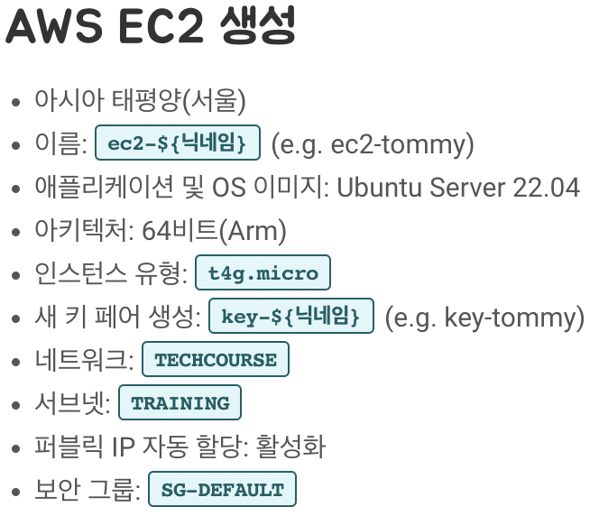
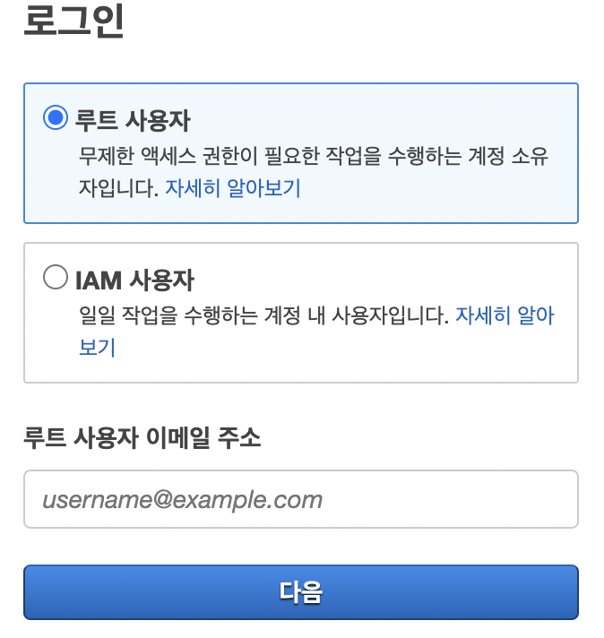
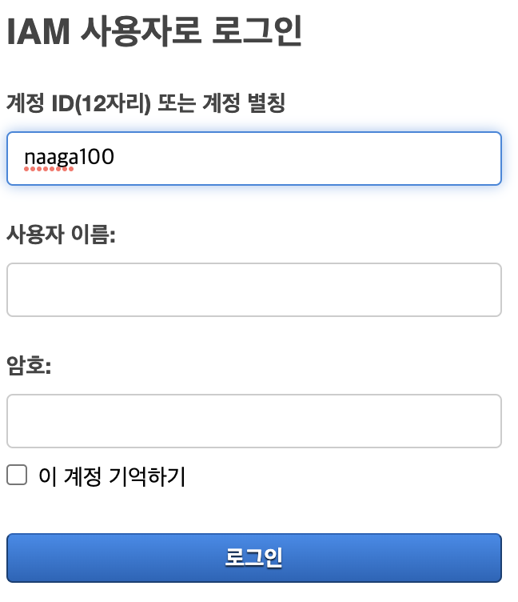
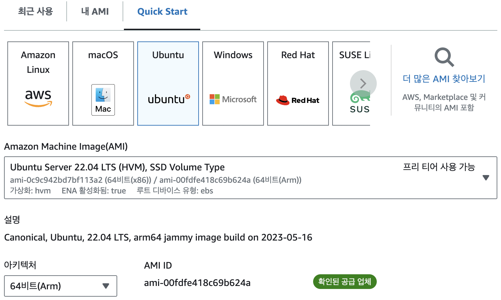
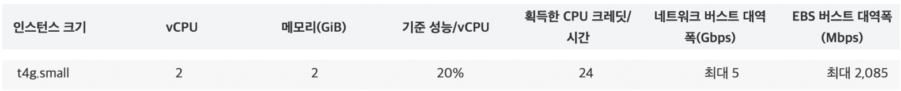
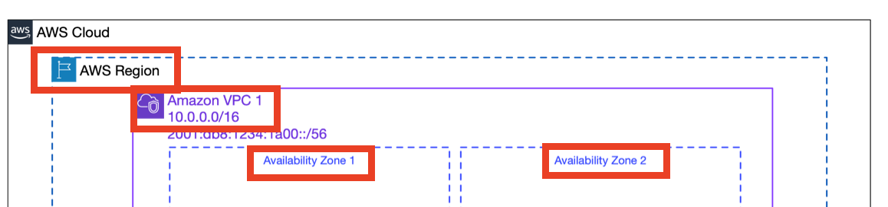
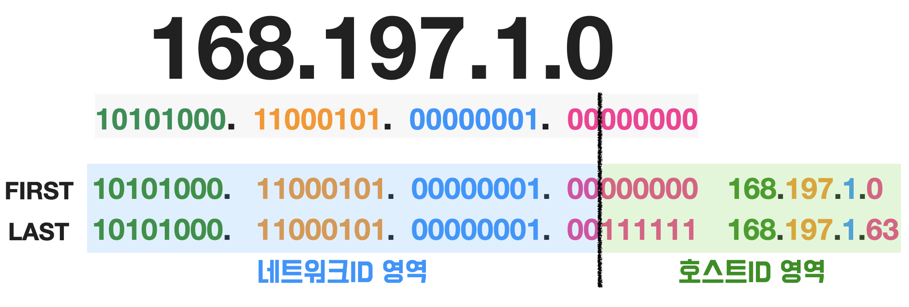
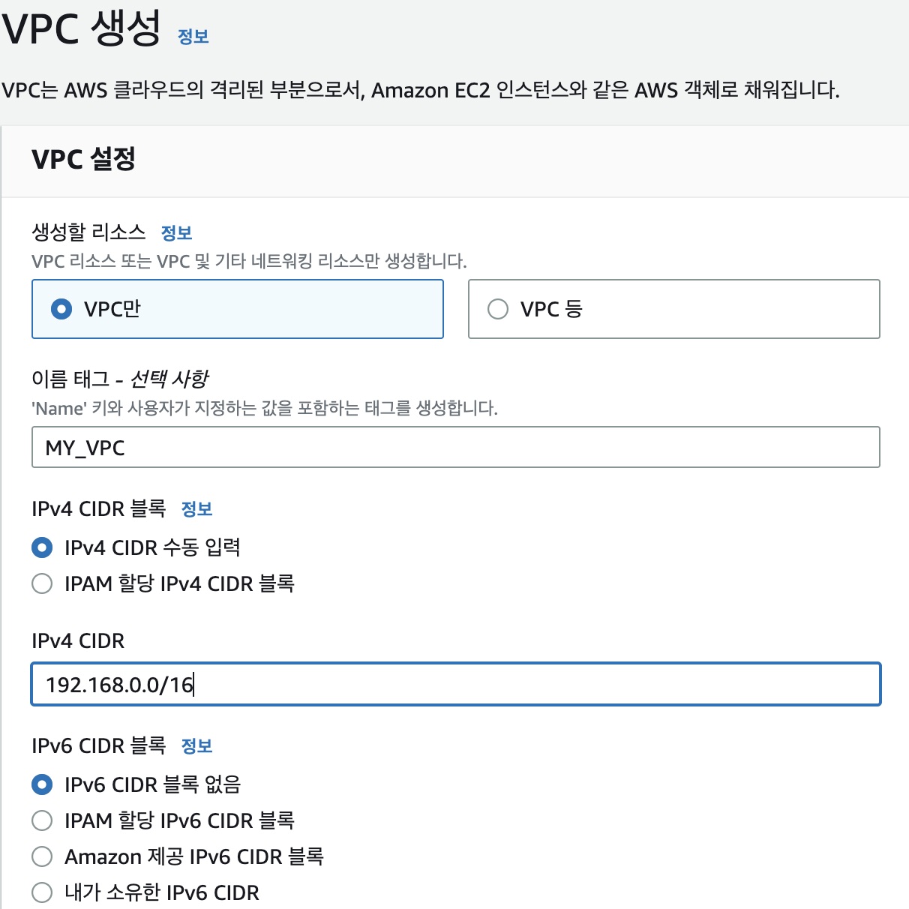
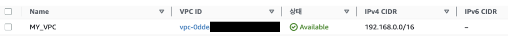
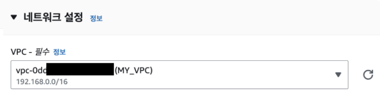

# AWS 로그인부터 시작하는 인프라 구축하기 1편 :
## AWS 로그인 / EC2 / VPC 이해하기 

<br>

## 0. 들어가기
AWS를 처음 접한다면, 아래의 사진(인스턴스 생성 설정)에 나온 이야기들은 별나라 이야기 같을 것입니다. 
</br></br>


IAM 사용자, EC2 인스턴스 생성 시 설정하는 VPC, 서브넷, 보안그룹 등 온통 낯선 단어들에 한숨부터 나왔을지도요. 일단 필요하니 블로그에 잘 설명된 대로 EC2 만드는 법을 따라해보지만 문득, 마치 알 수 없는 언어로 된 설명서를 읽는 기분이 들지 않았나요?

IAM 로그인 부터, EC2 인스턴스, 인스턴스 생성에 필요한 VPC, 서브넷과 보안그룹에 대한 개념 정의, 생성된 EC2 인스턴스가 어떻게 인터넷과 통신하는 지까지. 이해에 앞서 단순히 블로그를 보며 따라했던 것들을 하나하나 되짚어보며 알아보도록 합시다.

```
1. AWS 로그인 이해하기 : 루트사용자? vs IAM사용자?
2. EC2 이해하기 : AMI와 인스턴스 유형은 뭘까?
3. VPC 이해하기 : 가상 사설 네트워크(VPC) 생성에 필요한 Region과 IPv4 CIDR블록이 뭘까?
4. 서브넷 이해하기 : 서브넷 생성에 필요한 가용영역(AZ)와 CDIR 블록이 뭘까?
5. 보안그룹 이해하기 : EC2 인스턴스의 인바운드 아웃바운드 규칙이 뭐지?
6. EC2 생성 완료하기 : public IP 활성화 vs 비활성화? 
7. 라우팅 테이블과 인터넷 게이트웨이 이해하기 : 가상 네트워크 속에 들어있는 EC2 인스턴스와 실제 인터넷은 어떻게 통신하는 걸까?
```


</br></br>

## 1. AWS 로그인 이해하기 : 루트사용자? vs IAM사용자?



루트 사용자는, 처음 AWS계정을 생성하고, 단일 로그인을 통해 모든 AWS 서비스 및 리소스에 대한 완전한 접근 권한을 가진 사용자를 말합니다. 한편 IAM(Identity and Access Management) 사용자는 **이러한 루트사용자 계정의 리소스를 관리하고 사용할 수 있는 권한을 가진 “가상의 사용자”** 를 말합니다. 

좀 더 자세히 말하자면, <u>루트사용자가 IAM 사용자를 생성 하면, IAM 사용자가 사용할 ID와 비밀번호가 만들어집니다.</u> 루트 사용자 계정에 접근 할 가상의 사용자를 만드는 것이죠. 이때, 루트 사용자는 IAM사용자가 어디까지 접근할 수 있는지 적절하게 권한을 부여할 수 있습니다. 

IAM 사용자들은 부여받은 권한 정도에 따라, 인스턴스를 생성하거나 종료하고, 데이터베이스를 관리하고, 스토리지를 사용하고, 네트워크를 설정하는 등 다양한 작업을 수행할 수 있습니다.

즉, **루트 사용자의 계정의 리소스를 권한에 맞게 이용하는 “가상의 신분”을 IAM 사용자**라고 할 수 있습니다.

<br>

> **지금까지 가이드**
> 1. 루트 사용자의 리소스에 접근할 수 있는 가상의 신분으로(IAM) 로그인 했습니다.

<br/><br/><br/><br/>


## 2. EC2 이해하기 : AMI와 인스턴스 유형은 뭘까?

IAM 사용자라는 가상의 신분으로 루트 사용자의 계정에 접속했습니다. 루트 사용자의 EC2 서비스를 이용해봅시다. 

EC2 서비스를 사용하는 것은, 우리가 PC방에서 돈을 내고 컴퓨터를 이용하듯 사용할 만큼 AWS PC방의 컴퓨터를 빌리는 것과 같습니다. <br/>대신 **우리가 빌리는 컴퓨터는 가상 컴퓨터로 제공되고, 각각의 컴퓨터는 인스턴스로 부르기로 한 것**이죠.

PC방은 대체로 게임을 하러가는데, 게임에는 윈도우 기반의 고사양의 컴퓨터가 필요하죠?

우리도 필요한 목적에 따라 가상의 컴퓨터인 EC2 인스턴스의 운영체제와 사양을 설정해야 합니다.<br/><br/>

### 첫째, **애플리케이션 및 OS 이미지(Amazon Machine Image)** 를 설정해야 한다.



우리 컴퓨터에 윈도우 OS가 설정되어 있으면, 우리는 그 기본 설정과 소프트웨어, 데이터를 가지고 있는 컴퓨터를 사용할 수 있습니다. 

이와 비슷하게, ****AMI******는 가상 컴퓨터를 실행하기 위해 어떤 운영 체제(OS)를 사용하고, 어떤 소프트웨어들을 설치해 놓을 것인지 등을 담고 있는 이미지(자원을 생성, 구성하는 데 사용되는 설정과 값을 포함하는 파일)** 입니다. 

커스텀 PC처럼 AWS에서 제공하는 공식 AMI뿐만 아니라 사용자가 직접 정의한 AMI를 생성할 수도 있습니다.<br/><br/>

### 둘째, **인스턴스 유형 (서버의 사양)을 설정**해야한다.

사용할 목적에 따라 컴퓨터의 사양도 달라야겠죠? 

인스턴스 유형 설정을 통해 CPU, 메모리, 스토리지 및 네트워킹 용량 등 컴퓨터 사양을 선택할 수 있습니다.

예) Amazon EC2 T4g 인스턴스<br/>


<br>

> **지금까지 가이드**
> 1. 루트 사용자의 리소스에 접근할 수 있는 가상의 신분으로(IAM) 로그인 했습니다.
> 2. 인스턴스 생성 첫 번째 설정, 인스턴스의 운영체제와 사양을 설정했습니다.

<br/><br/><br/><br/>


## 3. VPC 이해하기 (1) </br>   : 리전과 가용영역, 가상 사설 네트워크(VPC)란?
인스턴스를 생성하기 위해서는 VPC를 설정해야 합니다. 

5단계를 거쳐 VPC의 개념, VPC 생성에 필요한 것들을 배우고 서브넷과 CIDR에 대해서도 가볍게 익혀봅시다.
</br></br>

### 리전(Region)과 가용 영역(AZ: ****Availability Zone****)

AWS 서비스들을 제공하기 위해서는 실제 데이터를 저장할 데이터 센터가 필요하겠죠?
- **가용 영역(Availability Zone)** 은 **같은 지역 내에서 물리적으로 독립된 데이터 센터들의 그룹**을 말합니다.
- 리전(Region)은 가용 영역이 2개 이상 구성된 지리적 영역입니다. 국가/도시 단위 별로 서비스를 제공하기 위한 단위로 사용됩니다.

예를 들어, AWS 서울 리전 (ap-northeast-2)은 현재 3개의 가용 영역(서울에 위치해 있는 데이터 센터 그룹)을 보유하고 있는데요. 이렇게 지역별로 서비스를 제공함으로써 네트워크 속도를 높이고, 데이터 지역성을 고려한 서비스를 제공할 수 있습니다.
<br/><br/>

### VPC 개념 이해하기
    
**VPC(Virtual Private Cloud)** 는 **가상 사설 네트워크**입니다. 
</br>쉽게 말하자면, AWS클라우드에서 독립된 “**나만의 개인 네트워크 망**”을 만드는 것이지요.


나만의 네트워크 망을 만들기 위해서는, 

**첫째, 내 네트워크 망이 어느 지역에 속할지 설정해야합니다**. 
</br>즉, 하나의 “리전”을 선택해야 합니다. 

**둘째, 내 네트워크 망이 사용 할 IP 주소 범위를 설정해야 합니다.** 
</br>후술할 “IPv4 CIDR 블록” 설정을 통해 IP주소 대역을 설정하면, **이 VPC 내에서 사용되는 모든 리소스들은 사용자가 지정한 IP 주소 범위 내에서 IP주소를 할당받게 됩니다.**

<br/><br/>

### VPC에 IP 주소 범위를 정해야하는 이유?
만약 우테코라는 기업 네트워크가 있다고 가정해봅시다. 이 기업 네트워크에 연결될 장치들(컴퓨터, 휴대폰 등)의 수가 최대 50개라면, IP주소 개수가 50개면 되겠죠? 

IP주소는 소중한 자원이기 때문에 이를 효율적으로 할당하고 관리하기 위해 IP주소가 50개만 나올 수있는 네트워크 주소 범위를 정하는 것입니다.

**즉, 주소 범위를 정하면, 범위만큼의 IP주소 개수를 할당할 수 있는 것입니다.**

<br>

> **지금까지 가이드**
> 1. 루트 사용자의 리소스에 접근할 수 있는 가상의 신분으로(IAM) 로그인 했습니다.
> 2. 인스턴스 생성 첫 번째 설정, 인스턴스의 운영체제와 사양을 설정했습니다.
> 3. 인스턴스 생성 두 번째 설정, 인스턴스의 VPC를 설정했습니다.
>     1. VPC 이해하기(1) : VPC는 인스턴스가 속한 가상 네트워크 망으로, 리전, IP주소 범위를 설정해야한다.

<br/><br/><br/><br/>


## 4. VPC 이해하기 (2) </br>   : VPC의 IPv4 CIDR 블록 이해하기

**IPv4 CIDR 블록**은 **CIDR 표기법을 사용하여 표현된 IPv4 주소 범위**를 말합니다. CIDR란 무엇일까요?</br>
결론부터 말하자면, CIDR란 _서브넷 마스크를 사용해 IP 주소 범위를 표현하는 주소 체계_ 입니다. CIDR 주소체계를 통해 네트워크의 IP주소 할당을 더 효율적으로 관리할 수 있게 되었습니다.

구체적인 설명에 앞서 이해를 돕기 위해 간단히 비유를 들어보겠습니다. 이 부분을 읽지 않고 바로 아래로 넘어가도 좋습니다. </br>
> 우리가 도시의 주소를 관리하는 기관에 근무하고 있다고 상상해봅시다.</br>
> 예전에는 **도시를 크기**에 따라 **'클래스'** 로 나눠서 도시마다 가질 수 있는 주소 범위를 할당했습니다.</br>
> 큰 도시에는 A클래스라는 큰 주소 공간을, 중간 도시에는 B클래스 중간 크기의 주소 공간을, 작은 도시는 C클래스라는 작은 크기의 주소공간을 주소를 할당하는 식이었어요.</br>
> 그런데 실제 도시의 크기와는 상관 없이 미리 정해진 클래스의 주소 공간이 할당되어 주소들이 낭비되는 경우가 생겼습니다.</br>
> 예를 들어, C클래스인 도시에 100개의 주소를 할당한다면, 50개의 주소만 필요한 작은 도시는 50개를 낭비하는 셈이죠</br>
> **CIDR은 이 문제를 해결하기 위해, 도시의 크기와 상관없이 도시가 필요한 만큼의 주소 공간을 할당해주는 방식입니다.**

<br/>

### 첫째, IP 주소의 구조 
IP주소의 구조는 192.168.1.0 과 같이 .을 구분자로 한 4개의 숫자로 이루어져 있고, 네트워크 ID와 호스트 ID로 구성됩니다.

예를 들어, 데이터는 IP주소를 통해, 선릉 캠퍼스 중 이레라는 사람을 찾아와야 합니다. 
“네트워크 ID는 집 주소 = 서울시 강남구 선릉역 성담빌딩 13층”, “호스트 ID는 내 이름 = 이레”로 이루어진 꼴입니다.
<br/><br/>

### 둘째, 네트워크 내에서 IP주소를 할당하는 방법 (old.ver) <br/>
이전에는 고정된 크기의 **IP 주소 범위(A,B,C 클래스)** 을 사용하여 네트워크를 구성했습니다.<br/>
무슨 소리냐구요?
- IP 주소의 첫 번째 숫자를 네트워크 ID로 사용하고, 나머지 세 개의 숫자를 호스트 ID로 사용하는 IP 주소범위를 A 클래스
- IP 주소의 첫 번째와 두 번째 숫자를 네트워크 ID로 사용하고, 나머지 두 개의 숫자를 호스트 ID로 사용하는 IP 주소범위를 B 클래스
- IP 주소의 세 개의 숫자를 네트워크 ID로 사용하고, 나머지 한 개의 숫자를 호스트 ID로 사용하는 IP 주소범위를 C 클래스
와 같이 고정된 주소 범위(클래스)를 통해 네트워크의 크기를 결정했습니다.

즉, 하나의 네트워크가 선택할 수 있는 IP주소 범위는 A,B,C 세 가지 중 하나였던 것입니다.
<br/><br/>

### 셋째, 고정된 주소 범위로 네트워크를 구성하는 것의 문제점
예를 들어, 우테코 회사는 IP주소가 50개만 필요합니다. 그 중 C클래스가 가장 작은 네트워크 규모(=IP 주소범위)를 갖고 있기 때문에, 우테코 회사는 C클래스의 네트워크 망을 구성하게 됩니다.<br/>
하지만, C 클래스의 주소범위는 **192.0.0**.0 ~ **223.255.255**.255 이고, IP 주소의 처음 세 개의 숫자가 네트워크 ID로 사용되면, 호스트 ID의 개수는 0~255로 256개가 됩니다.<br/>
우테코 회사에서는 IP주소가 50개만 필요하다고 했는데, 나머지 106개의 소중한 IP주소 자원은 쓰이지 않고 버려지는 거죠!
<br/><br/>

### 넷째, IP주소를 효율적으로 할당하는 새로운 방식 : CIDR (new.ver)
그래서 등장한 것이 CIDR(Classless Inter-Domain Routing)라는 클래스 없는 IP주소 할당 방식입니다.
네트워크에 연결된 장치 수(호스트 수)에 따라 효율적으로 사용할 수 있는 **서브넷(Subnet)** 을 만드는 것이죠. 
쉽게 말하자면 서브넷은 IP주소 범위(블록)을 더 작은 범위(블록)으로 나누어 네트워크를 구성하는 것을 말합니다.
<br/><br/>

### 다섯째, 더 큰 네트워크를 분할한 더 작은 하위 네트워크 : 서브넷
_서브넷을 만든다는 것_ 은 _**호스트ID 영역을 더 잘게 쪼개어 네트워크ID 영역을 늘리는 작업(서브네팅)**_ 을 뜻합니다.</br>
</br>
예를 들어, 우테코는 50개의 IP주소만이 필요합니다.</br>
IP주소 범위가 **192.167.10.** 0~ **192.167.10.** 255인 네트워크는 호스트 IP 범위가 (0~255)로 256개의 IP를 할당할 수 있습니다. 이 네트워크를 더 작은 범위의 네트워크(서브넷)으로 분할해, 우테코가 가져가도록 하게 하면 될 것입니다. 
</br>
호스트ID 영역을 1/4로 줄여서, 우테코는 64개의 호스트 수를 갖는 네트워크(서브넷)를 구성하게 됩니다.
호스트ID 영역이 3/4인 나머지 네트워크(서브넷)는 다른 기관이 쓸 수 있을테고요.

네트워크 ID영역을 늘려 더 작은 네트워크(서브넷)를 구성함으로써, IP 주소 낭비가 획기적으로 줄어들었습니다!
<br/><br/>

### 여섯째, CIDR(Classless Inter-Domain Routing)이란?
지금까지, 고정된 주소범위(클래스)에 국한되지 않고, 네트워크 ID영역의 크기 조절을 통해 IP주소를 유연하게 할당하는 방식에 대해 배웠습니다.
이렇게 잘게 쪼개어진 네트워크까지 표현하기 위한 IP주소 체계를 CIDR이라고 합니다.</br>

앞서, CIDR란 _**서브넷 마스크를 사용해 IP 주소 범위를 표현하는 주소 체계**_ 라고 설명드렸습니다.
서브넷 마스크란 해당 네트워크의 네트워크 ID 부분의 비트 수를 말하는데요. 서브넷 마스크를 통해 호스트 ID의 비트 수, 즉 IP 주소 범위를 알 수 있게 됩니다.

예를 들어, _줄어든 우테코의 네트워크 IP 주소 범위_ 는 192.167.10.0~ 192.167.10.63인데요.
이를 CIDR 형식으로 나타내면, “**192.167.10.0/26**” 으로 표현할 수 있습니다.

CIDR 주소의 "/26"는 네트워크 ID부분의 비트 수(서브넷 마스크의 길이)를 의미합니다. 즉, **192.167.10.0/26** 는 **_네트워크 ID 영역이 26비트이고 호스트 ID 영역이 6비트인 네트워크_** 를 표현하는 것이지요.
<br/><br/>

<p align="center">


예시 사진을 보면, IP주소에서 하나의 숫자는 8비트인데요.</br>
호스트 ID영역을 6비트로 잘게 쪼개면, 네트워크 ID의 영역은 8\*3 =24 에서 → 8\*3+2 =26 비트가 됩니다.</br>
이처럼 서브넷 마스크를 설정하면 6비트로 표현되는 호스트 ID 영역과 나머지 26비트로 표현되는 네트워크 ID 영역을 가지는 서브넷을 생성할 수 있는 것 입니다. 
(이 계산법에 대해 좀더 자세히 공부하고 싶으신 분들은 서브넷 마스크와 서브네팅 계산법을 공부하시면 됩니다.)
</p>

<br>

> **지금까지 가이드**
> 1. 루트 사용자의 리소스에 접근할 수 있는 가상의 신분으로(IAM) 로그인 했습니다.
> 2. 인스턴스 생성 첫 번째 설정, 인스턴스의 운영체제와 사양을 설정했습니다.
> 3. 인스턴스 생성 두 번째 설정, 인스턴스의 VPC를 설정했습니다.
>     1. VPC 이해하기(1) : VPC는 인스턴스가 속한 가상 네트워크 망으로, 리전, IP주소 범위를 설정해야한다.
>     2. VPC 이해하기(2) : VPC의 IP주소범위는 CIDR방식으로 나타낸다.

<br/><br/><br/>


## 5. VPC 생성하기 및 인스턴스에 적용하기

VPC를 생성하기 위해서는
#### 첫째, 리전을 적용해야하는데, 사용자가 선택한 리전으로 자동 적용됩니다.
#### 둘째, IPv4 CIDR 블록으로 VPC의 IP 대역(네트워크 주소범위)을 설정해야 합니다.


참고로, IPv4 CIDR 블록이 192.168.0.0/16라는 것은, 네트워크 ID 영역이 16비트라는 뜻입니다.</br>
이 네트워크에서 IP 주소 할당 가능한 호스트 수는 2의 16승(=16비트)으로, 65,536개가 됩니다!
<br/> <br/>
이를 통해, 생성된 VPC 입니다. <br/>


<br>
인스턴스 생성 시, 인스턴스의 네트워크 설정>VPC에서 생성한 VPC(MY_VPC)를 적용합니다.


<br>

> **지금까지 가이드**
> 1. 루트 사용자의 리소스에 접근할 수 있는 가상의 신분으로(IAM) 로그인 했습니다.
> 2. 인스턴스 생성 첫 번째 설정, 인스턴스의 운영체제와 사양을 설정했습니다.
> 3. 인스턴스 생성 두 번째 설정, 인스턴스의 VPC를 설정했습니다.
>     1. VPC 이해하기(1) : VPC는 인스턴스가 속한 가상 네트워크 망으로, 리전, IP주소 범위를 설정해야한다.
>     2. VPC 이해하기(2) : VPC의 IP주소범위는 CIDR방식으로 나타낸다.
>     3. VPC 생성하기 : 리전과 IP주소범위를 설정한 VPC를 생성한다.
>     4. 인스턴스 생성 시, 미리 생성된 VPC를 설정해 인스턴스가 속할 네트워크 망을 정한다.

<br><br><br><br>
