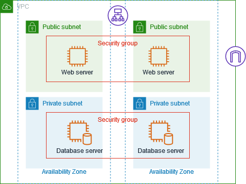
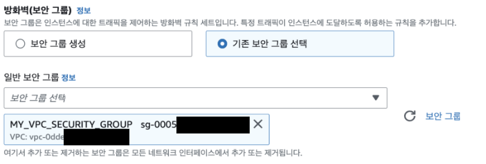
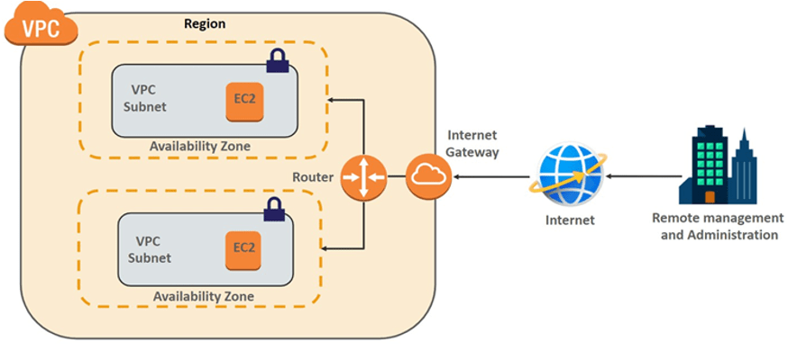
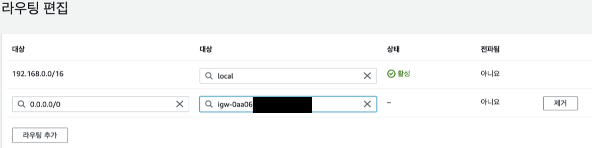

# AWS 로그인부터 시작하는 인프라 구축하기 2편 :
## 서브넷 / 보안그룹 / 퍼블릭vs프라이빗 인스턴스 / 라우팅 테이블과 인터넷 게이트웨이 

 

## 6. 서브넷 이해하기

인스턴스를 생성할 때, 설정한 VPC에 따라 선택할 수 있는 서브넷 목록이 바뀌는 것을 볼 수 있습니다. 서브넷은 VPC에 종속되는 것일까요? 
 
앞서, 네트워크 내의 IP주소를 효율적으로 할당하기 위해 서브넷이라는 용어가 나왔는데요. 

네트워크에서의 서브넷, AWS에서의 서브넷 개념을 이해하고, AWS에서 서브넷을 만들어봅시다.
  

### 6-(1).네트워크에서 서브넷 이해하기
- **네트워크에서 서브넷이란, 큰 네트워크를 더 작은 네트워크로 분할한 것**을 말합니다.

    더 큰 네트워크에서 호스트ID 영역을 줄여서 더 작은 네트워크(호스트 수가 더 적은)로 분할해 생긴 **작은 네트워크 대역**을 **서브넷**이라고 하는 것이죠.  
  서브넷은 독립적인 네트워크로 간주되며, **각 서브넷은 자체적으로 라우팅과 보안 설정을 가지고 있습니다.**

  #### 1. 자체적인 라우팅을 가진다. 
  서브넷은 독립적인 작은 네트워크이므로, _자신의 네트워크 주소범위_ 를 가지고 있습니다. 
  따라서, **자체적인 라우팅 테이블을 사용해, 서브넷 내부의 호스트(네트워크 장치)들 사이에서 통신과 다른 서브넷으로의 통신을 처리**합니다.
  (*라우팅 테이블 = 다른 호스트(네트워크장비)로 데이터 전송할 때 어떤 경로 선택해야 하는지 지시하는 경로표)
      
  #### 2. 자체적인 보안설정을 가진다
  서브넷은 독립적인 보안그룹을 구성하여, 원하는 _**트래픽을 허용하거나 차단**_ 합니다. 
  즉, **특정 포트나 프로토콜 통신을 제한하거나 허용할 수 있습니다**.

   

### 6-(2).AWS에서 서브넷 이해하기

VPC가 가상 네트워크이고 논리적인 IP대역을 의미한다면, 

서브넷은 VPC의 IP주소 범위를 나누어 **실제 리소스(예: EC2 인스턴스, S3가 서브넷에 설치됨)가 배치되는 물리적인 주소 범위**를 말합니다.

- 하나의 VPC에 여러개의 서브넷이 생길 수 있으며, VPC를 잘게 나눈 것이기 때문에 **VPC보다 대역폭(IP주소범위)이 낮아야 합니다**.
- **서브넷 한 개는 하나의 가용영역(Availability Zone: 데이터 센터 그룹)에만 속합니다.** (하나의 가용영역에 여러개의 서브넷은 가능합니다)
   
  
  *참고로, VPC를 생성할 때는 사용할 가용영역(AZ)의 개수만 선택하게 됩니다. 이후, 서브넷을 생성할 때, 어느 가용영역에 생성할지 선택하면 됩니다.
   

   

### 6-(3). 서브넷 생성하기 및 인스턴스에 적용하기
#### 첫째, 어떤 VPC의 서브넷인지 설정합니다.
#### 둘째, 서브넷이 상주할 데이터베이스 센터 그룹인 가용영역을 설정합니다.
(예시 : 서울 리전의 -2a)
 

#### 셋째, VPC의 IP주소 범위를 분할한, 서브넷 IPv4 CIDR 블록을 설정합니다.

- 설정한 VPC의 주소 범위가 192.168.0.0/16이기 때문에, **서브넷의 대역폭은 VPC의 대역폭보다 좁은 CIDR블록을 설정해야 합니다.** 
더 좁은 대역폭이란 IP 주소 범위에서 사용 가능한 IP 주소의 개수가 적다는 것을 의미합니다.

- "/16"이라는 것은 VPC의 서브넷 마스크의 길이가 네트워크ID가 16비트라는 말로, 65,536개의 IP 주소를 가집니다. 
따라서 **서브넷은 VPC보다 네트워크ID 영역의 비트수가 높은** “/17”부터 아마존의 정책에 따라 “/28”까지 **필요한 IP 개수에 따라 서브넷의 CIDR 블록을 설정**할 수 있습니다. 
- 생성 완료된 서브넷을 확인해봅시다!  
  - 생성한 VPC(vpc-0dde~ = 192.168.0.0/16)의 서브넷임을 확인할 수 있습니다.
  - 서브넷 **IPv4 CIDR 블록은 192.168.0.0/**24**로, VPC의 대역폭보다 좁은 CIDR블록**이 잘 생성되어있음을 볼 수 있습니다. 네트워크ID의 길이가 늘어남(16->24bit)에 따라 호스트ID의 수가 줄어들은 것이죠!
  - **가용영역(리전 내의 데이터 센터)도 우리가 설정한 ap-northeast-2a**로 잘 생성 된 것을 볼 수 있습니다.

#### 넷째, 인스턴스 생성시, 네트워크>서브넷에서 생성한 서브넷을 적용합니다.

 

> **지금까지 가이드**
> 1. 루트 사용자의 리소스에 접근할 수 있는 가상의 신분으로(IAM) 로그인 했습니다.
> 2. 인스턴스 생성 첫 번째 설정, 인스턴스의 운영체제와 사양을 설정했습니다.
> 3. 인스턴스 생성 두 번째 설정, 인스턴스의 VPC를 설정했습니다.
>     1. VPC 이해하기(1) : VPC는 인스턴스가 속한 가상 네트워크 망으로, 리전, IP주소 범위를 설정해야한다.
>     2. VPC 이해하기(2) : VPC의 IP주소범위는 CIDR방식으로 나타낸다.
>     3. VPC 생성하기 : 리전과 IP주소범위를 설정한 VPC를 생성한다.
>     4. 인스턴스 생성 시, 미리 생성된 VPC를 설정해 인스턴스가 속할 네트워크 망을 정한다.
> 4. 인스턴스 생성 세 번째 설정, 인스턴스의 Subnet을 설정했습니다.
>     1. 서브넷 이해하기(1) : 네트워크에서 서브넷은 큰 네트워크를 더 작은 네트워크로 분할한 것이다.
>     2. 서브넷 이해하기(2) : AWS에서 서브넷은 VPC의 IP주소 범위를 나눈 네트워크로, 실제 리소스가 배치된다.
>     3. 서브넷 생성하기 : VPC, 가용영역, IP주소 범위을 설정해, 서브넷을 생성한다.
>     4. 인스턴스 생성 시, 미리 생성된 서브넷을 설정해 인스턴스가 배치 될 네트워크 망을 정한다.

   

## 7. 보안그룹 이해하기

### 7-(1).보안그룹은 인바운드 아웃바운드 규칙을 통해 EC2 인스턴스의 트래픽 규칙을 설정한다
어떤 서브넷(네트워크, IP주소범위)에 인스턴스를 생성할지 결정하고 나면, _인스턴스의 보안 규칙_ 을 설정해야하는데요.  
**보안 그룹**은 _**연결된 리소스(인스턴스)에 도달하고 나갈 수 있는 트래픽을 제어하는 방화벽 규칙 세트**_ 라고 할 수 있습니다. 
예를 들어, 보안 그룹을 EC2 인스턴스와 연결하면 인스턴스에 대한 인바운드(도달하는 트래픽) 및 아웃바운드(나가는 트래픽) 트래픽을 제어하는 것입니다.

- **인바운드 규칙**은 외부에서 - > _인스턴스로 오는 트래픽에 관한 규칙_ 을 설정합니다.
- **아웃바운드 규칙**은 인스턴스에서 - > _외부로 가는 트래픽에 관한 규칙_ 을 설정합니다.

인바운드, 아웃바운드 규칙을 통해 **어떤 IP 주소, 포트 또는 프로토콜의 트래픽을 허용할지 또는 차단할지를 설정**하는 것입니다. 
  

### 7-(2).보안그룹은 AWS 리소스(EC2 등)에 직접 적용된다.
보안 그룹을 생성할 떄 어떤 VPC에 생성될지 지정함으로써, VPC에 여러 보안그룹을 생성하고 하나의 서브넷은 VPC에 생성된 여러 보안 그룹을 사용할 수 있습니다.

여러 보안 그룹을 사용하면 **같은 VPC 내에서도 서로 다른 리소스 또는 그룹에 대해 다른 보안 규칙을 적용**할 수 있는데요.  
예를 들어, **같은 VPC 내에 웹 서버 그룹과 데이터베이스 서버 그룹**이 있다면, 웹 서버 그룹에는 웹 트래픽을 허용하는 규칙을 설정하고 데이터베이스 서버 그룹에는 특정한 IP 주소만 데이터베이스 접근을 허용하는 규칙을 설정할 수 있습니다. 

 

이렇게 **여러 보안 그룹을 사용함으로써, 네트워크 리소스를 보다 세부적으로 제어하고 보호**할 수 있는 것이죠. 

 

### 7-(3). 보안그룹 생성하기 및 인스턴스 적용하기

아래와 같이, VPC(vpc-0dde~)에 보안그룹을 생성했습니다! 

 
인스턴스 생성 시, 인스턴스의 네트워크 설정>방화벽(보안그룹)에서 생성한 보안그룹(MY_VPC_SECURITY_GROUP)를 적용합니다. 

 

> **지금까지 가이드**
> 1. 루트 사용자의 리소스에 접근할 수 있는 가상의 신분으로(IAM) 로그인 했습니다.
> 2. 인스턴스 생성 첫 번째 설정, 인스턴스의 운영체제와 사양을 설정했습니다.
> 3. 인스턴스 생성 두 번째 설정, 인스턴스의 VPC를 설정했습니다.
>     1. VPC 이해하기(1) : VPC는 인스턴스가 속한 가상 네트워크 망으로, 리전, IP주소 범위를 설정해야한다.
>     2. VPC 이해하기(2) : VPC의 IP주소범위는 CIDR방식으로 나타낸다.
>     3. VPC 생성하기 : 리전과 IP주소범위를 설정한 VPC를 생성한다.
>     4. 인스턴스 생성 시, 미리 생성된 VPC를 설정해 인스턴스가 속할 네트워크 망을 정한다.
> 4. 인스턴스 생성 세 번째 설정, 인스턴스의 Subnet을 설정했습니다.
>     1. 서브넷 이해하기(1) : 네트워크에서 서브넷은 큰 네트워크를 더 작은 네트워크로 분할한 것이다.
>     2. 서브넷 이해하기(2) : AWS에서 서브넷은 VPC의 IP주소 범위를 나눈 네트워크로, 실제 리소스가 배치된다.
>     3. 서브넷 생성하기 : VPC, 가용영역, IP주소 범위을 설정해, 서브넷을 생성한다.
>     4. 인스턴스 생성 시, 미리 생성된 서브넷을 설정해 인스턴스가 배치 될 네트워크 망을 정한다.
> 5. 인스턴스 생성 네 번째 설정, 인스턴스의 보안그룹을 설정했습니다.

   

## 8. EC2 생성 완료하기 
### public IP 활성화 vs 비활성화
인스턴스의 마지막 네트워크 설정입니다. 바로 인스턴스에 퍼블릭 IP 주소를 줄 것인가 인데요.

퍼블릭 IP 주소란 외부 인터넷과 통신할 수 있는 공인 IP 주소입니다. EC2 인스턴스가 퍼블릭 IP 주소를 갖게 되면, 이 주소를 사용하여 외부에서 인스턴스에 접근할 수 있게 됩니다.

**"퍼블릭 IP 주소 활성화"** 옵션을 선택하면 **_해당 리전(Region)의 AWS에서 관리하는 퍼블릭IP 주소 풀에서_ 하나의 퍼블릭 IP 주소를 할당**받는데요. 이 주소는 EC2 인스턴스와 통신하는 외부 클라이언트들이 사용할 수 있게 됩니다. **주의해야 할 점은 퍼블릭 IP 주소는 고정되지 않고 인스턴스를 중지하고 다시 시작하면 변경될 수 있다**는 것입니다.

[퍼블릭 인스턴스가 생성된 예시] 

반면, **"퍼블릭 IP 주소 비활성화"** 옵션을 선택하면, **서브넷의 IP주소 범위 내에서 사설IP주소가 자동으로 할당**됩니다. 퍼블릭IP주소가 없기 때문에, 해당 인스턴스는 인터넷에서 또는 인터넷으로 직접 접근을 할 수 없는데요.

다만, **같은 VPC(내부 네트워크)에서는 _프라이빗 IP 주소를 통해_ 해당 인스턴스에 접근** 할 수 있습니다. 즉, **프라이빗 IP를 가진 인스턴스는 VPC 내의 리소스 간에 내부 네트워크 통신을 위해 사용**됩니다

[프라이빗 인스턴스가 생성된 예시] 

> **지금까지 가이드**
> 1. 루트 사용자의 리소스에 접근할 수 있는 가상의 신분으로(IAM) 로그인 했습니다.
> 2. 인스턴스 생성 첫 번째 설정, 인스턴스의 운영체제와 사양을 설정했습니다.
> 3. 인스턴스 생성 두 번째 설정, 인스턴스의 VPC를 설정했습니다.
>     1. VPC 이해하기(1) : VPC는 인스턴스가 속한 가상 네트워크 망으로, 리전, IP주소 범위를 설정해야한다.
>     2. VPC 이해하기(2) : VPC의 IP주소범위는 CIDR방식으로 나타낸다.
>     3. VPC 생성하기 : 리전과 IP주소범위를 설정한 VPC를 생성한다.
>     4. 인스턴스 생성 시, 미리 생성된 VPC를 설정해 인스턴스가 속할 네트워크 망을 정한다.
> 4. 인스턴스 생성 세 번째 설정, 인스턴스의 Subnet을 설정했습니다.
>     1. 서브넷 이해하기(1) : 네트워크에서 서브넷은 큰 네트워크를 더 작은 네트워크로 분할한 것이다.
>     2. 서브넷 이해하기(2) : AWS에서 서브넷은 VPC의 IP주소 범위를 나눈 네트워크로, 실제 리소스가 배치된다.
>     3. 서브넷 생성하기 : VPC, 가용영역, IP주소 범위을 설정해, 서브넷을 생성한다.
>     4. 인스턴스 생성 시, 미리 생성된 서브넷을 설정해 인스턴스가 배치 될 네트워크 망을 정한다.
> 5. 인스턴스 생성 네 번째 설정, 인스턴스의 보안그룹을 설정했습니다.
> 6. 인스턴스 생성 다섯 번째 설정, 인스턴스의 PUBLIC IP주소 활성화 옵션을 설정했습니다. 

 

### EC2 생성 이후, 새로운 의문점
인스턴스의 스토리지 용량까지 결정하고 나면 인스턴스 생성이 완료됩니다.  
이렇게 생성된 인스턴스를 사용하면서 아래와 같은 궁금점이 들지 않으셨나요?

**1. 같은 VPC 내의 서브넷들 사이에서 통신(= 각 서브넷에 배치된 인스턴스 간 통신)은 왜 프라이빗 IP주소로 실행되는 걸까요?**  

**2. VPC는 나만의, 내가 설정한 가상 네트워킹 환경(VPC)입니다.   VPC는 기본적으로 private 환경인데, 어떻게 인스턴스들이 인터넷에 접속할 수 있는 걸까요?**     

   

## 9. EC2 인스턴스와 인터넷의 통신 이해하기
설명에 앞서 결론부터 말하자면,

- 첫째, VPC에 **인터넷 게이트웨이**라는 것을 생성해, **VPC 내의 리소스가 인터넷에 액세스할 수 있게 됩니다**. 

- 둘째, **서브넷에 연결된 라우팅 테이블**에 **"0.0.0.0/0" 목적지를 인터넷 게이트웨이로 설정**합니다. 

  여기서, "0.0.0.0/0"은 모든 IP 주소로 아웃바운드 트래픽에 대한 설정이라고 이해하면 됩니다.  
  즉, **모든 IP 주소를 목적지로 하는 트래픽을 인터넷 게이트웨이를 통해 라우팅하도록 설정**하는 것을 의미합니다. 

- 셋째, 이로써 **_퍼블릭 서브넷_ 내의 모든 _"퍼블릭 인스턴스"_ 들이 외부 인터넷과 통신할 수 있게 되는 것**입니다. 
  아래 사진을 보면, 두 개의 서브넷에 연결된 각각의 EC2들은 **자신이 소속된 서브넷이 아닌 다른 네트워크로 요쳥을 보낼 때**, 
    
    1) VPC 라우터의 라우팅 테이블에 적힌 규칙에 따라 트래픽을 특정경로로 이동시키는데,  
    2) VPC 내의 서브넷 끼리는 내부적으로 통신하고 
    3) VPC 외부와의 통신은 인터넷 게이트웨이를 통해 인터넷과 연결합니다. 
 
  
퍼블릭 IP만 있으면 되는 것 아닌가? 퍼블릭 서브넷은 뭐고, 라우팅 테이블, 인터넷 게이트웨이는 뭘까? 하는 생각이 들 것입니다. 

다음 장을 읽으며 퍼블릭 서브넷의 개념과 라우팅 테이블, 게이트웨이에 대해 이해해 봅시다.  
   

## 10. 퍼블릭 서브넷 vs 프라이빗 서브넷
처음 서브넷을 생성할 때, 프라이빗 서브넷인지 퍼블릿 서브넷인지 설정하는 칸이 없지 않았나요?
따라서, **처음 서브넷을 생성하면 모두 프라이빗 서브넷이 됩니다**.

- **프라이빗 서브넷이란**, 
    생성되는 인스턴스들이 외부와 통신할 수 없는 서브넷을 말합니다. 
    
    프라이빗 서브넷의 트래픽 규칙을 적어둔 라우팅 테이블에는 "0.0.0.0", 모든 IP주소에 대한 인터넷 게이트웨이로의 라우팅 규칙이 없습니다.
    즉, 해당 서브넷 내의 인스턴스들은 직접적으로 인터넷에 접근할 수 없게 됩니다. 
    이로 인해 프라이빗 서브넷 내에 생성되는 인스턴스들은 기본적으로 퍼블릭 IP주소를 가질 수 없습니다.
    

    
- **퍼블릭 서브넷이란,**
    생성되는 인스턴스 퍼블릭 IP주소를 가질 수 있고, 퍼블릭 IP주소를 통해 외부 인터넷과 직접 통신할 수 있는 서브넷을 말합니다.  
    
    서브넷의 트래픽 규칙을 적어둔 라우팅 테이블에 "0.0.0.0", 모든 IP주소를 목적지로 하는 트래픽을 인터넷 게이트웨이로 라우팅하는 설정을하면, 퍼블릭 서브넷이 됩니다.
  
    퍼블릭 서브넷에서 인스턴스를 생성하면 해당 인스턴스에는 퍼블릭 IP 주소를 할당할 수 있게 되는 것입니다.

> **지금까지 가이드**
> 
> [ 인스턴스 생성 ]
> 1. 루트 사용자의 리소스에 접근할 수 있는 가상의 신분으로(IAM) 로그인 했습니다.
> 2. 인스턴스 생성 첫 번째 설정, 인스턴스의 운영체제와 사양을 설정했습니다.
> 3. 인스턴스 생성 두 번째 설정, 인스턴스의 VPC를 설정했습니다.
> 4. 인스턴스 생성 세 번째 설정, 인스턴스의 Subnet을 설정했습니다.
> 5. 인스턴스 생성 네 번째 설정, 인스턴스의 보안그룹을 설정했습니다.
> 6. 인스턴스 생성 다섯 번째 설정, 인스턴스의 PUBLIC IP주소 활성화 옵션을 설정했습니다. 
>
> [인스턴스의 인터넷 통신]
> 1. 프라이빗 서브넷에 연결된 라우팅 테이블에 인터넷 게이트웨이로 라우팅하는 트래픽 규칙을 더해, 퍼블릭 서브넷으로 만든다. 

   

## 11. 라우팅 테이블이란?
    
서브넷은 **서로 다른 네트워크 영역**을 가지고 있습니다. 
따라서, 한 서브넷에서 다른 서브넷으로 데이터를 전송하려면( = 다른 네트워크로 데이터를 전송하려면) 라우팅을 해야합니다.

(*라우팅이란, **네트워크에서 데이터를 출발지에서 목적지로 이동시키는 것**을 말합니다.)
 

즉, **VPC 안에서 네트워크 요청이 발생하면, 어떤 네트워크 경로를 통해 트래픽을 전송할지 결정**해야하는데요.

라우팅 테이블에는 네트워크 내에서 발생하는 트래픽의 이동 경로 규칙이 적혀져 있습니다. 
 다시말해, 목적지의 IP 주소 범위에 따라 어느 인터페이스로 데이터를 보낼 지에 대한 정보가 저장되있습니다. 일종의 표지판 역할을 하는 것이지요.  

### 라우팅 테이블 편집하기
   
1) 서브넷의 라우팅 테이블에 목적지를 0.0.0.0/0로하는 트래픽에 대한 인터넷 게이트웨이로 라우팅하겠다는 규칙을 추가합니다.
2) 이를 통해, 서브넷 인스턴스에서 발생한 트래픽 중 특정 목적지로의 트래픽을 특정 경로로 전송할 수 있게 되는 겁니다. 
3) 이 규칙을 적용함으로써 프라이빗 서브넷이 퍼블릭 서브넷이 됩니다.
 

### 서브넷의 라우팅 테이블 살펴보기
  
이 라우팅 테이블의 규칙들을 해석하자면, 

- 첫째 줄은, 대상(Destination)이 “0.0.0.0/0” 에 대해서 대상(Target, 트래픽을 전송할 때 사용할 게이트웨이, 네트워크 인터페이스)을 인터넷 게이트웨이로 설정한다는 말인데요. 
  서브넷에서 **모든 퍼블릭 IP주소를 대상(Destination)으로 하는 통신에 대해 인터넷 게이트웨이라는 특정 경로로 라우팅하게 하는 것** 입니다.  
  이로써 VPC 내의 모든 퍼블릭 IP를 가진 인스턴스가 외부 인터넷과 통신할 수 있게 됩니다. 
  
- 둘째 줄은, **VPC 내부 IP 주소 범위(192.168.0.0/16) 내의 리소스를 목적지로하는 모든 트래픽에 대해서 로컬 라우팅이 자동으로 설정**된 것인데요. 
  로컬 라우팅이란, VPC 내부 통신이 발생했을 때, 트래픽이 외부로 나가지 않고 네트워크 내부에서 트래픽을 라우팅하는 것을 의미합니다. 
  모든 서브넷에 동일한 로컬 라우팅이 적용됨으로써, VPC내의 자유로운 내부통신이 가능해진 것이죠! 

  
특정 IP 대역을 대상(Destination)으로 설정한 것에 **우선순위**가 있으므로,  
**로컬 라우팅에 의해 우리가 같은 VPC 내의 서브넷들 사이에서 통신(= 각 서브넷에 배치된 인스턴스 간 통신)은 왜 프라이빗 IP주소로 실행되게 됩니다.**

 

> **지금까지 가이드**
> 
> [ 인스턴스 생성 ]
> 1. 루트 사용자의 리소스에 접근할 수 있는 가상의 신분으로(IAM) 로그인 했습니다.
> 2. 인스턴스 생성 첫 번째 설정, 인스턴스의 운영체제와 사양을 설정했습니다.
> 3. 인스턴스 생성 두 번째 설정, 인스턴스의 VPC를 설정했습니다.
> 4. 인스턴스 생성 세 번째 설정, 인스턴스의 Subnet을 설정했습니다.
> 5. 인스턴스 생성 네 번째 설정, 인스턴스의 보안그룹을 설정했습니다.
> 6. 인스턴스 생성 다섯 번째 설정, 인스턴스의 PUBLIC IP주소 활성화 옵션을 설정했습니다. 
>
> [인스턴스의 인터넷 통신]
> 1. 프라이빗 서브넷에 연결된 라우팅 테이블에 인터넷 게이트웨이로 라우팅하는 트래픽 규칙을 더해, 퍼블릭 서브넷으로 만든다.
> 2. 서브넷에는 서브넷에서 발생하는 트래픽 경로 규칙이 담긴 라우팅 테이블이 있다.

   

## 12. 인터넷 게이트웨이란?
VPC는 나만의, 내가 설정한 가상 네트워킹 환경(VPC)입니다.
VPC는 기본적으로 private한 환경인데, 어떻게 인스턴스들이 인터넷에 접속할 수 있는 걸까요? 
바로, **라우팅 테이블에 규칙으로 설정해 놓은 “모든 IP주소에 대해서 인터넷 게이트 웨이로 연결한다”는 설정 때문입니다.**  
 
인터넷 게이트 웨이란, VPC에서 호스팅하는 리소스와 **인터넷 간의 통신을 가능하게 해주는 AWS 컴포넌트**인데요. 
**VPC의 리소스와 인터넷 간의 통신을 활성화**하기 **VPC에 연결된 통로**라고 할 수 있습니다.  

 

위의 그림 처럼 VPC 내부의 리소스(인스턴스 등)는 VPC에 연결된 인터넷 게이트웨이를 통해 외부 인터넷과 통신할 수 있는데요. 

- 이때, 리소스는 퍼블릭 IP주소를 가지고 있어야 합니다. 인터넷 상에서 퍼블릭 IP주소가 고유한 식별자 역할을 해주기 때문이죠.
- 또, 리소스(인스턴스)가 배치된 서브넷의 라우팅 테이블에 '0.0.0.0/0' 목적지는 인터넷 게이트 웨이로 라우팅한다는 설정이 있어야 합니다.
 
 

> **지금까지 가이드**
> 
> [ 인스턴스 생성 ]
> 1. 루트 사용자의 리소스에 접근할 수 있는 가상의 신분으로(IAM) 로그인 했습니다.
> 2. 인스턴스 생성 첫 번째 설정, 인스턴스의 운영체제와 사양을 설정했습니다.
> 3. 인스턴스 생성 두 번째 설정, 인스턴스의 VPC를 설정했습니다.
> 4. 인스턴스 생성 세 번째 설정, 인스턴스의 Subnet을 설정했습니다.
> 5. 인스턴스 생성 네 번째 설정, 인스턴스의 보안그룹을 설정했습니다.
> 6. 인스턴스 생성 다섯 번째 설정, 인스턴스의 PUBLIC IP주소 활성화 옵션을 설정했습니다. 
>
> [인스턴스의 인터넷 통신]
> 1. 프라이빗 서브넷에 연결된 라우팅 테이블에 인터넷 게이트웨이로 라우팅하는 트래픽 규칙을 더해, 퍼블릭 서브넷으로 만든다.
> 2. 서브넷에는 서브넷에서 발생하는 트래픽 경로 규칙이 담긴 라우팅 테이블이 있다.
> 3. 인터넷 게이트웨이란 인스턴스와 인터넷 간의 통신을 연결해주는 통로이다.

   

## 13.인스턴스의 네트워크 연결 총 정리하기

 
1) MY_VPC에는 퍼블릭 서브넷 2개와 프라이빗 서브넷 1개가 존재합니다.  

  - 인터넷 게이트 웨이에 대한 라우팅 규칙이 있는 라우팅 테이블(MY_ROUTING_TABLE)과 연결된 퍼블릭 서브넷 
  - VPC 내부 통신에 대한 규칙만 있는 기본 라우팅 테이블(rtb-04fe7cca6a359e13f) 프라이빗 서브넷 

2)**퍼블릭 서브넷 내에서 생성한 리소스(예: 인스턴스) 중 퍼블릭 IP를 가지고 있는 리소스만 외부 인터넷과 통신할 수 있습니다**

3)맵 상에는 나오지 않았지만 각각의 **인스턴스들은 MY_VPC에 등록된 보안그룹을 선택해 각각의 인바운드 규칙과 아웃바운드 규칙을 설정** 합니다.
    

---

## 정리
**지금까지 AWS의 인스턴스 생성을 위해서 아래와 같은 절차를 거쳤습니다.**

1. ami(os, 소프트웨어 설치 이미지)와 컴퓨서 사양 결정
2. 네트워크 설정 
   - vpc 생성 및 인스턴스에 적용 : vpc의 리전 설정, ip 주소 범위 설정, 가용영역(리전 내의 데이터 센터) 개수 설정
   - subnet 생성 및 인스턴스에 적용 : vpc 설정, 가용영역 선택, IPv4 CIDR(서브넷 네트워크 주소 범위) 설정
   - 보안 그룹 생성 및 인스턴스에 적용 : 어떤 VPC에 생성될 것인지 설정, 인바운드-아웃바운드 규칙 추가
   - 인스턴스의 퍼블릭 IP주소 활성화/ 비활성화 옵션 설정 : 퍼블릭 서브넷 내에서만 가능하며, 퍼블릭 IP주소 활성화하면 퍼블릭 인스턴스가 됨
3. 스토리지 설정
 

**그리고 한 서브넷 내의 인스턴스가 어떻게 다른 서브넷의 인스턴스와, 또는 외부 인터넷과 통신하는지 알아보았습니다.**

1. 프라이빗 서브넷 생성 : 동일 VPC 내부통신(인스턴스의 프라이빗 IP를 통한)의 로컬라우팅만 가능한 상태
2. 로컬 라우팅 : VPC 내부 통신이 발생했을 때, VPC 내부에서 서브넷 간의 트래픽을 라우팅하는 것
3. 퍼블릭 서브넷 생성 : 서브넷의 라우팅 테이블에 모든 IP주소(목적지)에 대해 인터넷 게이트웨이로의 라우팅 설정
4. 인터넷 게이트웨이를 통해, 퍼블릭 서브넷의 퍼블릭 인스턴스가 인터넷과 통신할 수 있다.

