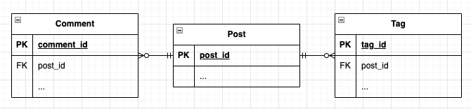

최근에 프로젝트에서 리팩토링과 동시에 쿼리 개선을 하고 있는데요. 조인 한 방 쿼리로 **한 번에 끝내는 게 여러 번 네트워크 타는 것보다 좋을 것** 같아서 한 방 쿼리로 수정하고 있다가 다음과 같이 모든 쿼리가 조인이 덕지 덕지 붙어있는 코드를 보고 뭔가 이상함을 감지했습니다.

​
```sql
select * from pet_food p1_0
join brand b1_0 on b1_0.id=p1_0.brand_id
join pet_food_primary_ingredient p2_0 on p1_0.id=p2_0.pet_food_id
join primary_ingredient p3_0 on p3_0.id=p2_0.primary_ingredient_id
where p1_0.id=1
```


```sql
select * from review r1_0
join pet p1_0 on p1_0.id=r1_0.pet_id
join breed b1_0 on b1_0.id=p1_0.breed_id
join pet_size p2_0 on p2_0.id=b1_0.pet_size_id
left join helpful_reaction h1_0 on r1_0.id=h1_0.review_id
join adverse_reaction a1_0 on r1_0.id=a1_0.review_id
where r1_0.id=?
```
​

`뭔가 아닌 거 같은데..?` 물론 한 방 쿼리가 좋을 때도 있지만 항상 한 방 쿼리가 좋진 않을 것인데 **언제 한 방 쿼리를 사용하고 언제 여러 개 쿼리를 사용**할 수 있을지 궁금증이 생겼습니다.
​

---
​
## 조인(Join)으로 한 방 쿼리 vs 쿼리 여러 개

​
> No Silver Bullet - 만병통치약은 없다.
​

**어떤 성능 시나리오에서든 어느 솔루션이 더 빠른지 확인하기 위해 직접 솔루션을 테스트하고 측정해야 합니다.** 즉, 최선의 경우는 없는데요. 하지만, 일반적으로 어떤 상황에서 쓰면 좋을지는 통계가 있을 것입니다. 테이블 관계를 기준으로 한번 살펴봅시다.
​

### 일대일 관계

​
일반적으로 일대일 관계 같은 **많은 외부 레코드를 가리키지 않는 경우** 다음과 같은 성능을 나타냅니다.

​


​
조인이 가장 빠른데 그 이유는 여러 개 쿼리가 발생하면 데이터베이스에 대한 각 쿼리에 **고정 비용**이 발생하기 때문입니다. 일대일 관계 같은 경우 중복도 발생하지 않아서 부담 없이 조인을 사용할 수 있을 것 같습니다.

​
그렇다고 해서, 일대다 관계에서는 절대 조인을 쓰지 말란 것이 아닙니다. 위에서 말한 것에 핵심 포인트는 일대일 관계뿐 아니라 일대다 관계에서도 많은 외부 레코드를 가리키지 않는 경우입니다. 한 방 조인으로 결괏값 주기 vs 여러 번 통신 + 애플리케이션에서 조합의 **트레이드오프**를 잘 고려해 봐야 됩니다.
​

### 일대다 관계

​
하지만, 참조된 레코드 중 다수가 동일할 수 있는 **일대다 관계** 같은 경우 조인 시에 중복이 엄청나게 발생할 수 있으니 잘 생각해 봐야 됩니다.
​

예를 들어봅시다.
​


​

위와 같은 관계에서 1개의 게시물이 있고 게시물에는 2개의 댓글과 2개의 태그가 있다고 가정해 봅시다.

​
```sql
SELECT post.id, comment.id, tag.id
FROM post
LEFT JOIN comment on post.id = comment.post_id
LEFT JOIN tag on tag.post_id = post.id;
​
-- post_id comment_id tag_id
-- 1        1           1
-- 1        1           2
-- 1        2           1
-- 1        2           2
```
​

위와 같은 쿼리를 실행하면 2 * 2로 4개의 결과가 나왔습니다. 여기서 댓글과 태그가 4개로 늘어난다면 어떻게 될까요?

​
```sql
SELECT post.id, comment.id, tag.id
FROM post
LEFT JOIN comment on post.id = comment.post_id
LEFT JOIN tag on tag.post_id = post.id;
​
-- post_id comment_id tag_id
-- 1        1           1
-- 1        1           2
-- 1        1           3
-- 1        1           4
-- 1        2           1
-- 1        2           2
-- 1        2           3
-- 1        2           4
-- 1        3           1
-- 1        3           2
-- 1        3           3
-- 1        3           4
-- 1        4           1
-- 1        4           2
-- 1        4           3
-- 1        4           4
```
​

각 행의 곱인 4 * 4 = 16개의 행이 나오게 됩니다. 그럼 만약에 각 데이터의 수가 1000개씩만 되어도 나오는 행의 수는 몇 개일까요..? 여기서 더 **많은 테이블과 레코드들을 추가하면 수많은 중복된 데이터가 생겨날 것입니다.**
​
실제 테스트를 해봅시다. 실험 환경은 다음과 같습니다.
- Mac M1 Pro 16G 512GB
- 실험 데이터 수는 게시글 1개, 댓글 1000개, 태그 1000개
​

먼저 조인을 이용하여 100만(1000 * 1000)개의 테이블을 생성해 결괏값 100만 개를 내어줄 때는 **12초**가 걸렸습니다.
​


​
하지만, 두 개의 쿼리(1000 + 1000)로 분리하여 결괏값 100만 개를 내어 줄 때는 고작 **0.2초**밖에 안 걸린 걸 볼 수 있습니다.

​

​
​
여러 개의 테이블을 조인하는 경우도 아래의 벤치마크를 한번 봅시다. 두 경우 모두 동일한 결과(6 x 50 x 7 x 12 x 90 = 2268000)를 얻지만 여러 개의 쿼리가 훨씬 더 빠릅니다.
​

1. **5개의 조인을 사용한 단일 쿼리**
    
    쿼리: **8.074508초**
    
    결과 크기: 2268000
    
2. **연속 쿼리 5개**
    
    결합된 쿼리 시간: **0.00262초**
    
    결과 크기: 165(6 + 50 + 7 + 12 + 90)
​

또한, 중복 데이터로 인해 더 많은 **메모리**를 사용합니다. 적은 테이블의 수를 조인하는 경우 메모리 사용량이 적겠지만, 테이블이 점점 늘어날수록 차지하는 메모리가 기하급수적으로 늘기 때문에 잘 고려하면 좋을 것 같습니다.

​
### 조인이 적합한 지 여부 판단

​
조인을 사용해야 하는지는 조인이 **적합한지**에 따라 판단해 볼 수도 있습니다. 위의 예시로 사용한 테이블에서 댓글과 태그는 게시글과는 관련이 있지만 서로는 관련이 없습니다. 이 경우 두 개의 별도 쿼리를 사용하는 것이 더 좋습니다. 태그와 댓글을 결합하려고 하면 둘 사이에는 직접적인 관계가 없는데도 각 테이블행의 곱만큼 가능한 모든 조합이 생성됩니다. 또한, 두 쿼리를 병렬로 수행하여 이득을 얻을 수도 있습니다.

​
하지만, 여기서 만약에 다음과 같은 상황을 생각해 봅시다.

​


​
게시물에 댓글을 달고 댓글 작성자의 이름까지 원한다면? 조인을 고려해 볼 수 있습니다. 훨씬 더 자연스러운 쿼리일 뿐 아니라 데이터베이스 시스템에서 이와 같은 쿼리를 [최적화](https://dev.mysql.com/doc/refman/8.0/en/optimization.html)하려고 노력하고 있다고 합니다.

​
## 서브쿼리(SubQuery)
​

조인 대신에 **서브 쿼리**를 이용하는 방법도 있습니다. 서브 쿼리와 조인의 성능을 비교해 봅시다. 우선 MySQL **5.5** 버전에서 서브 쿼리는 못쓸 정도라고 평할 정도로 제대로 수행되지 않았습니다.

​
테스트 데이터
- 메인 테이블 100만 건
- 서브 테이블1 (Index O) 1000건
- 서브 테이블2 (Index X) 1000건

​
수행 시간
- MySQL 5.5 + 서브 쿼리 + No Index에서 100만 건 & 1천 건 조회에 **3분**이 소요
- MySQL 5.5 + 서브 쿼리 + Index에서 100만 건 & 1천 건 조회에 **1.8초** 소요
- MySQL 5.5 + 조인 + No Index에서 100만 건 & 1천 건 조회에 **11초** 소요
- MySQL 5.5 + 조인 + Index에서 100만 건 & 1천 건 조회에 **0.139초** 소요
​
MySQL 특정 버전(5.5이하)에서는 서브 쿼리 대신 조인이 압도적으로 빠른 것을 볼 수 있습니다. 


MySQL에서는 무슨 일이 있었기에 5.5 버전에서는 서브 쿼리 성능이 좋지 않을까요?
1. 최적화 부재: 초기 버전의 MySQL에서는 서브 쿼리에 대한 충분한 최적화가 이루어지지 않았습니다. 그 결과 서브 쿼리는 복잡한 연산을 필요로 하는 경우에 매우 비효율적으로 동작하게 되었습니다.
2. 재귀적 처리: MySQL 5.5에서 서브 쿼리는 종종 재귀적으로 처리되었고, 이는 성능 문제를 야기했습니다. 특히, 상위 쿼리에서 서브 쿼리의 결과를 여러 번 재참조해야 할 때 이 문제가 두드러졌습니다.


**5.6**에서는 **서브 쿼리 성능 개선**이 많이 이루어졌습니다.
​

수행 시간
- MySQL 5.6 + 서브 쿼리 + No Index에서 100만 건 & 1천 건 조회에 **19초** 소요
- MySQL 5.6 + 서브 쿼리 + Index에서 100만 건 & 1천 건 조회에 **0.18초** 소요
​

3분에서 19초, 11초에서 0.18초 개선될 정도로 5.6에서는 최적화가 이루어졌지만 아직 **모든 서브 쿼리가 다 최적화가 된 것은 아니라고 합니다.**

​
즉, 웬만하면 **최대한 조인을 이용**하고 조인을 이용하기 어렵다면 5.6 이상은 서브 쿼리를 사용합니다. 5.5 이하는 절대 사용하지 않고 차라리 쿼리를 나눠서 2번(메인 쿼리, 서브 쿼리) 실행하고 애플리케이션에서 조립하면 좋을 것 같습니다. 물론, 스칼라 서브 쿼리 캐싱 등의 최적화 기술로 때때로 서브 쿼리가 조인보다 더 효율적일 때도 있습니다.

​
## 결론
​

사실 위의 내용은 어느 정도 통계에 기반에서 이렇다 할 뿐이지 자신의 상황에서는 전혀 다르게 동작(고려해야 할 변수가 많기 때문에)할 수도 있습니다. 그러므로 **참고만 하고** EXPLAIN 같은 실행 계획이나 **직접 테스트하여 측정해 사용**하도록 합시다.

​
> Don't guess, measure!
​
---
참고:
- [JOIN queries vs multiple queries](https://stackoverflow.com/questions/1067016/join-queries-vs-multiple-queries)
- [MySQL where in (서브쿼리) vs 조인 조회 성능 비교 (5.5 vs 5.6)](https://jojoldu.tistory.com/520)

