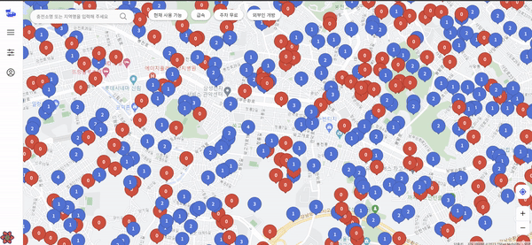
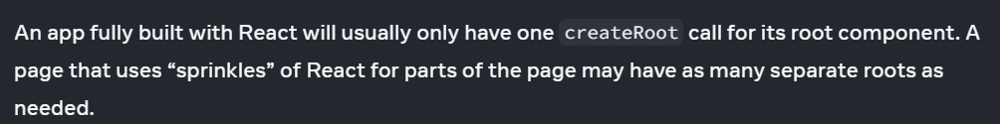
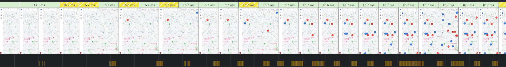
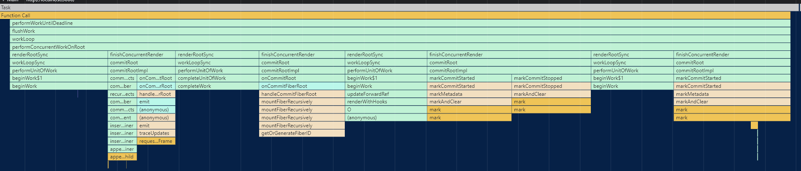
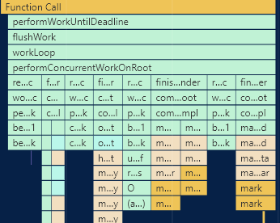
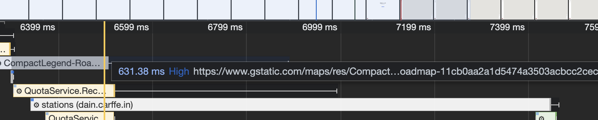
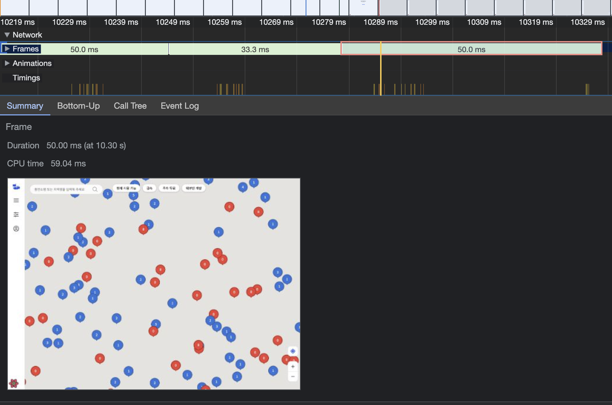
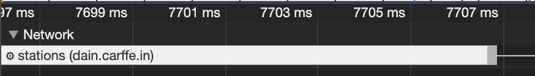
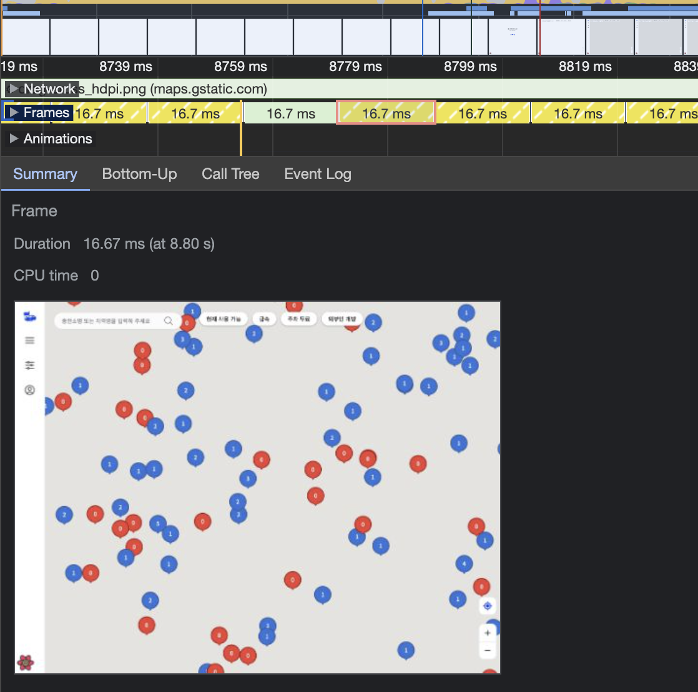
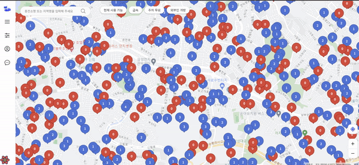

# 마커 렌더링 최적화

### 1. 개요

카페인 서비스의 기존 마커 컴포넌트 구조에서는 마커 하나를 렌더링하기 위해 다음과 같은 과정을 거쳤다.

1. StationMarkersContainer 컴포넌트에서 충전소 정보 요청
2. 충전소 정보를 props로 넘겨 Marker 컴포넌트 호출
3. 지도에 부착될 DOM요소 생성
4. createRoot를 통해 리액트 root 생성
5. **2**번에서 생성한 DOM 요소를 전달해 구글 지도 api의 Marker 생성자 함수 호출
6. **3**번에서 생성했던 root의 render 메서드 호출
7. 마커 인스턴스 전역 상태에 새로 생성한 마커 추가

위 과정을 거쳤을 때의 마커 렌더링 모습을 보면 다음과 같다.

마커들이 한번에 렌더링 되는 것이 아니라 산발적으로 렌더링 되는 모습을 확인할 수 있다.

 
 

### 2. 문제 원인 분석

마커를 렌더링 하기 위해 거치는 과정을 분석해 보았다.

1 ~ 3 과정에서는 성능에 크게 영향을 끼칠 요소가 없지만 4번 과정은 일반적인 리액트 프로젝트를 개발할 때 겪는 과정이 아니다. 따라서 createRoot를 통해 많은 개수의 루트를 생성했을 때의 영향에 대해 알아보았다.

리액트 공식 문서를 보니 페이지의 일부에 리액트를 뿌려서 사용하는 경우에는 루트를 필요한 만큼 생성해도 된다는 이야기가 포함되어 있었다. 따라서 4번 과정 또한 문제의 원인이라고 볼 수 없었다.

5번 과정은 구글 지도에 마커를 특정 위도 경도에 위치시키기 위해서 어쩔 수 없이 거쳐야 하는 과정이므로 이 과정은 문제가 있더라도 개선이 불가능해 일단 고려하지 않았다.

6번 과정은 4번 과정에서 생성했던 리액트 루트의 render 메서드를 호출해 실제로 화면에 리액트 컴포넌트를 그리도록 하는 과정이다. 이 과정 또한 리액트 컴포넌트를 화면에 렌더링하기 위해선 어쩔 수 없이 거쳐야 하는 과정이므로 고려하지 않았다.

> 하지만 6번 과정에서 리액트 컴포넌트를 직접 그리는 것이 아니라 구글 지도 api의 기본 마커를 사용하면 성능을 향상시킬 수 있지 않냐고 반문할 수도 있을 것이다. 이전에는 이러한 방식을 사용해 마커를 렌더링 했었다. 우리의 서비스는 현재 사용 가능한 충전소 개수를 마커를 통해서도 전달하기 때문에 이를 고려해 기본 마커를 사용할 때 다음의 두 가지 문제가 생긴다.
>
> 1. 사용 가능한 충전소 개수를 기본 마커에 렌더링 할 때 성능이 매우 좋지 않다.
> 2. 마커의 디자인을 바꾸고자 할 때 변경에 대응하기 어렵다.
>
> 따라서 마커는 리액트 루트의 render 메서드를 호출해 리액트 컴포넌트를 렌더링하는 것으로 결정했다.

마지막으로 남은 7번 과정에서는 useSyncExternalState 훅을 사용해 전역적으로 관리하고 있던 상태에 수정을 가하는 연산을 수행한다. 이 과정은 이전에도 성능 저하를 유발할 것으로 예상되던 부분이었다. (하단 링크 참고)

[useSyncExternalStore 훅을 통해 구독한 state가 한번에 업데이트 되는 이유](https://www.notion.so/useSyncExternalStore-state-67e686eead8b4750b3015a1f75ea3e76?pvs=21)

요청의 결과로 받아온 마커 정보의 개수가 100개라고 가정해보자. 우리는 이제 마커를 렌더링 할 것이다.

첫 번째 마커의 렌더링을 위해 1번 ~ 6번의 과정을 거친 후 7번 과정을 수행한다. 그러면 리액트 입장에서는 리액트 루트의 render 메서드 호출에 대한 동작을 수행해야 하고, 새로운 마커 인스턴스에 대한 전역 상태를 변경시키는 동작을 수행해야 한다.

리액트가 이 과정을 100번 반복하고 나면 우리는 비로소 모든 마커가 화면에 렌더링 된 모습을 볼 수 있을 것이다.

나는 이 부분에서 성능 저하의 요소가 있다고 생각했다. 리액트에서의 상태 변화는 곧 리액트 내부의 렌더링을 위한 로직이 수행되게 함을 의미하고, 이 과정을 개선 이전에는 마커의 개수만큼 반복하고 있었던 것이다.

여기까지 생각해보니 전역 상태 변화에 대해 리액트가 렌더링을 위한 연산을 진행할 동안에는 마커의 렌더링(render 메서드 호출)이 멈추는 것이 아닐까 하는 생각이 들었다.

그래서 크롬 개발자 도구의 퍼포먼스 탭을 들어가 보니 산발적으로 발생하던 마커 렌더링의 문제 원인이 짐작했던 그 원인임을 확인할 수 있었다.

프레임 이미지 하단을 보면 산발적인 마커 렌더링이 수행될 때마다 수반되는 어떤 함수 호출이 있음을 확인할 수 있다.

이 부분이 문제의 함수 호출 부분이다. 자세히 살펴보면 상단에 `performWorkUntilDeadline`이란 함수가 호출됨을 볼 수 있다.

이 `performWorkUntilDeadline` 라는 함수를 조금 알아보니 해당 함수는 간단히 말해 리액트에서 state의 변경이 한번에 많이 발생할 때 5ms의 데드라인 시간을 줄 때 사용하는 함수라는 것을 알게 되었다.

문제의 원인이라고 생각했던 마커 개수 만큼의 전역 상태 변화가 실제로 마커 렌더링을 잠시 중단하게 만들고 있음을 알게 되었다.

 
 

### 3. 문제 해결

앞서 분석한 문제를 개선해보고자 마커 렌더링에 필요한 충전소 정보 배열을 부모 컴포넌트에서 받아와 각 충전소 정보를 자식 컴포넌트에 넘겨주고, 자식 컴포넌트에서 마커 생성과 렌더링 로직을 수행하던 기존의 방식을 부수고 부모 컴포넌트에서 모든 것을 일괄 처리하는 방식으로 고쳐보았다.

고치는 과정에서 기존 방식에서는 리액트 생명 주기에 의존하여 화면에 보여지지 않는 마커를 지워주던 로직을 이제는 모두 직접 구현해야 했다.

이전의 영역과 겹치는 부분에 있는 충전소는 다시 그리지 않고, 영역 밖의 충전소를 나타내는 마커는 지워주고, 이전의 영역과 겹치지 않는 새로 받아온 충전소는 그리도록 다음과 같이 메서드를 분리해보았다.

- 기존과 겹치지 않는 새로운 영역에 대한 마커를 생성하는 메서드
- 기존과 겹쳐지는 영역에 대한 마커들을 반환하는 메서드
- 새로운 영역 밖에 있는 마커들을 지워주는 메서드
- 새롭게 생성된 마커를 화면에 렌더링하는 메서드

이 메서드들을 커스텀 훅으로 분리해 부모 컴포넌트에서 이를 활용하도록 하여 다소 복잡할 수 있는 마커 렌더링 로직을 선언적으로 구현할 수 있도록 했다.

결과적으로 기존에 사용되던 기능들을 그대로 사용할 수 있으면서 화면에 마커가 산발적으로 렌더링 되던 문제가 해결 되었고, 부가적인 효과로 전체 마커의 렌더링 시점도 앞당길 수 있게 되었다. + 기존에는 구조적인 문제로 연산량이 너무 많아 클러스터링이 늦어져 이를 도입할 수 없었던 문제를 구조 수정으로 인해 적용할 수 있게 되었다.

### 작업한 PR

https://github.com/woowacourse-teams/2023-car-ffeine/pull/737

 
 

## 결과 분석 (performance 탭 활용)

맥북 m2 모델 RAM 16GB 기준으로 개발자 도구의 performance 탭에서 cpu 6x slowdown을 걸어준 상태에서 개선 전과 후를 분석한 결과는 다음과 같다.

### before

마커 조회 요청이 종료된 시점: 약 `2499ms`

첫 마커 렌더링 시점: `3093ms`

모든 마커 렌더링 종료 시점: 약 `3611ms`

처음으로 마커가 렌더링 될 때까지 소요된 시간: `594ms`

모든 마커 렌더링에 소요된 시간: `1112ms`

 
 

### after

마커 조회 요청의 시작점: 약 `1875ms`

모든 마커 렌더링 종료 시점: `2395ms`

처음으로 마커가 렌더링 될 때까지 소요된 시간: `519ms`

모든 마커 렌더링에 소요된 시간: `519ms`

 
 

### 개선 결과

처음으로 마커가 렌더링 되는 시점은 두 방식 모두 비슷한 결과를 보인다. 하지만 개선 후 방식은 한번에 모든 마커가 렌더링 되는 방식이고, 개선 이전의 방식은 산발적으로 마커가 렌더링 되는 방식이므로 개선 후의 방식에서 전체 마커를 렌더링 하는 시점이 훨씬 빨라지게 되었다.

결과적으로 전체 마커가 렌더링 되는 속도 약 `55.6%` 단축하게 되었다. 이 결과는 마커가 늘어날 수록 더욱 차이가 극적으로 벌어질 것으로 예상된다.

before

after

