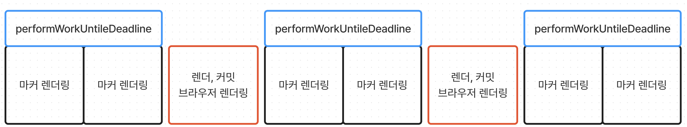

# 마커 렌더링 최적화

## 서비스 소개

마커 렌더링 최적화 설명에 앞서 잠시 저희 팀에서 진행했던 서비스에 대해 소개드리겠습니다.

저희 서비스의 출발점은 `전기차 충전의 불편함`이었습니다. 최근 들어 보조금과 저렴한 유지비용 등의 이유로 전기차의 수요는 점점 증가하고 있습니다. 하지만, 인프라는 그에 맞게 충분히 성장하지 못했습니다. 특히 충전에 관련된 불편함이 많이 대두되고 있습니다. 저희 서비스는 충전소 이용량 통계 정보를 제공함으로써 전기차 차주분들이 자발적으로 충전소를 분산 이용하는 것을 목표로 삼았습니다. 서비스의 주요 기능은 전국 6만개의 충전소와 그 내부 24만개의 충전기 정보 실시간 제공, 각 충전소 사용량 통계 정보 제공, 충전소 정보 불일치 신고 등이 있습니다.

저희는 이러한 기능을 지도를 기반으로 전달하고자 했습니다. 각 충전소의 위치를 지도상의 마커로 표현하고, 마커를 클릭할 시 해당하는 충전소의 세부 정보 및 사용량 통계를 볼 수 있도록 구성했습니다. 따라서 저희 서비스를 이용하는 사용자들이 가장 처음으로 접하는 중요 정보는 `마커`라고 할 수 있습니다. 프로젝트 초반에는 이렇게 중요한 마커가 산발적으로 렌더링되는 문제가 있었습니다. 저는 이를 개선하고자 했습니다.

이제 제가 어떻게 산발적 마커 렌더링을 개선했는지 살펴보도록 하겠습니다.

<br>

## 1. 개요

### 1-1. 마커 렌더링 방식 선택

제가 지도에 표현하고자 했던 마커는 다음과 같은 모양을 가지고 있는 마커였습니다.


디자인 유연성이나 기능 추가와 같은 확장성을 고려했을 때 위 마커를 구글 기본 마커로 구현하기보단 리액트 컴포넌트로 관리하는 것이 더 유리하다고 판단해 저는 마커를 리액트 컴포넌트로 관리해 보고자 했습니다.

하지만 지도는 리액트에서 제어하는 영역이 아니었기 때문에 리액트 컴포넌트로써 마커를 제어하기 위해 조금 특별한 방식이 필요했습니다.

1. DOM API인 createElement를 통해 DOM 요소를 생성한다.
2. 생성된 DOM 요소를 마커 생성자 함수에 전달해 지도에 해당 DOM 요소를 마커로써 사용한다.
3. 리액트 API인 createRoot를 이용해 전달한 DOM 요소를 리액트 root로 만든다.
4. root.render 호출에 원하는 마커 컴포넌트를 전달해 원하는 마커를 렌더링한다.

위와 같은 방식으로 저는 마커를 리액트 컴포넌트로써 제어할 수 있게 되었습니다.

<br>

### 1-2. 여러개의 마커를 제어하는 구조 설계

지도는 리액트를 기반으로 동작하지 않습니다. 그렇기 때문에 리액트의 기존 코드에 지도가 추가되면 자칫 코드 구조가 복잡하게 얽힐 가능성이 있습니다. 저는 최대한 기존에 리액트 코드를 작성하던 방식에서 크게 벗어나지 않게 지도를 제어하고자 했습니다.

리스트 컴포넌트를 만든다고 했을 때 대부분 다음과 같은 코드 구조를 떠올릴 것입니다.

```js
function List() {
  return (
    <>
      {
        list.map((item) => <Item key={item.id} item={item} />)
      }
    </ㅣ>
  )
}
```

지도에 찍히는 마커를 생각해 보면 이 또한 지도에 어느 좌표에 위치한다는 것만 빼면 위 컴포넌트와 크게 다르지 않은 동작을 한다는 것을 알 수 있습니다. 그래서 제가 선택한 마커 렌더링 방식은 다음과 같습니다.

```js
function MarkerContainer() {
  // station는 충전소 정보를 배열 형태로 저장하고 있습니다.
  const { stations } = useStations();

  return (
    <>
      {stations.map(station => (
        <Marker key={station.id} station={station} />
      ))}
    </>
  );
}

function Marker({ station }) {
  const { renderMarker } = useMarker();

  useEffect(() => {
    const unmountMarker = renderMarker(station);

    return unmountMarker;
  }, []);

  return <></>;
}
```

간단하게 설명해 드리자면 `MarkerContainer`에서 서버에서 받아온 충전소 정보를 통해 `Marker`를 호출하고, `Marker`에서 구글 지도 API를 통해 마커를 렌더링하는 구조입니다.

마커 컴포넌트에서 호출한 `renderMarker`에서는 구글 지도 API의 호출이 일어나 마커를 생성하고, 전역적으로 관리되고 있는 마커 인스턴스 배열에 생성한 마커를 추가하는 기능을 수행합니다. 또한 지도 내 불필요하게 남아있는 마커를 삭제하기 위해 `Marker`가 unmount 될 때 호출되는 `useEffect`내 클린업 함수에 지도에서 마커를 제거하는 함수를 등록했습니다.

<br>

### 1-3. 산발적 렌더링 발생

앞서 말씀드린 방식들을 활용해 서비스를 구현하던 와중 충전소가 몰려있는 지역에서 마커가 렌더링 될 때 산발적으로 마커가 렌더링 되는 모습을 확인할 수 있었습니다.


퍼포먼스 탭을 통해 CPU 성능을 저하시킨 후 테스트해 본 결과 디바이스의 성능이 낮을수록 마커의 산발적 렌더링이 더욱 심해지는 것을 확인할 수 있었습니다. 앞서 말씀드렸듯 마커는 저희 서비스에서 가장 처음으로 접하는 중요 정보이기 때문에 이 부분은 꼭 개선이 필요한 부분이라고 판단되었습니다.

<br>
<br>

## 2. 문제 원인 분석

### 2-1. 잦은 상태 변경

다수의 컴포넌트에서 마커 인스턴스에 접근해야 하는 상황이 생겼기 때문에 저희는 마커 인스턴스 배열을 전역 상태로써 관리하는 방식을 선택했습니다. 이 때문에 마커를 렌더링할 때 전역 상태에 생성한 마커를 추가하는 동작이 수반되어야 했습니다. 저는 이 부분이 산발적 마커 렌더링이 발생한 지점이라고 생각했습니다.

앞서 이야기했듯 마커 생성은 전역 상태의 변경을 야기합니다. 이 때문에 마커를 하나 렌더링할 때마다 전역 상태의 변경이 한번 일어나게 됩니다. 잦은 상태의 변경은 잦은 리렌더링을 발생시킬 것이고, 이 지점에서 마커의 산발적 렌더링이 발생했다고 판단하게 되었습니다.

이를 고쳐보고자 저는 기존의 구조를 과감히 버리고 다음과 같은 렌더링 방식을 선택하게 되었습니다.

```js
function MarkerContainer() {
  // station는 충전소 정보를 배열 형태로 저장하고 있습니다.
  const { stations } = useStations();

  // 마커 인스턴스를 다루는 커스텀 훅
  const { createMarkerInstances, getRemainedMarkers, removeUnmountMarkers, ... } = useMarker();

  // ... 마커 재생성 방지 및 영역 밖 마커 제거를 고려한 마커 렌더링 과정 구현 코드

  return <></>;
}
```

기존에는 `MarkerContainer`에서 `Marker`를 호출하고, `Marker`에서 마커 렌더링을 수행하는 방식이었습니다. 변경된 구조에서는 상태 변경을 최소화하기 위해 구글 지도 API 호출을 관리하는 커스텀 훅을 통해 `MarkerContainer`에서 모든 마커의 렌더링을 일괄적으로 처리하고, 모든 처리가 끝난 마커 인스턴스를 전역 상태에 한 번만 반영하는 방식을 채택했습니다.

위 구조로 리팩터링을 마치고 나니 예상했던 대로 마커의 산발적인 렌더링이 사라지게 되었습니다.


<br>

### 2-2. useEffect의 동작 원리

기존에는 마커를 한 가지 종류만 렌더링하면 됐었지만 클러스터링 기능이 추가됨에 따라 다음과 같이 여러 종류의 마커를 렌더링해야 했습니다.


마커 렌더링 최적화를 위해 만든 훅은 한 종류의 마커에 초점이 맞춰져 있어 마커의 종류만큼 훅이 필요하게 되었습니다. 또한 훅의 복잡도가 굉장히 높아 추후 유지보수를 위해선 개선이 필요한 상황이었습니다.

다른 기능의 개선이 대부분 완료된 시점에 가용할 수 있는 시간이 늘어남에 따라 유지보수성 향상을 위해 이전의 구조를 유지하되 산발적 렌더링이 발생하지 않게 하는 방법이 있을까 고민하는 시간을 가졌습니다.

일단 지난 마커 렌더링 최적화 이전 시점의 커밋으로 브랜치를 돌린 후 기존에 문제라고 생각했던 상태 변경을 일으키지 않으면서 전역 상태로 관리되는 마커 인스턴스 배열을 변화시키는 방법을 적용해 봤습니다. `(이 방법은 글 가장 하단부에 소개하도록 하겠습니다.)`

처음 생각과는 달리 전역 상태의 변경을 발생시키지 않았음에도 마커의 렌더링이 산발적으로 일어나는 모습을 확인할 수 있었습니다. 훅 분리를 통해 해결한 문제가 애초에 근본적인 문제의 해결을 했다고 볼 수 없는 상황이었습니다.

문제의 정확한 원인을 파악하고자 개발자 도구의 Performance 탭에서 함수의 호출 단위로 분석을 시도해 보았습니다.


위 이미지에서 performance 탭의 프레임 이미지 하단부를 보면 함수의 호출이 노란색 선으로 표시된 모습을 확인해 볼 수 있습니다. 이 부분이 마커의 렌더링에 관여하는 함수의 호출이 아닐까 싶어 해당 부분에 어떤 함수들의 호출이 있었는지 확인해 보았습니다.


자세히 보니 해당 부분에서 `CarFfeineMarker`의 렌더링이 이루어지는 것을 확인할 수 있었습니다. 또한 가장 상단을 보면 마커 렌더링 이전에 `performWorkUntilDeadline`이라는 메서드의 호출이 있는 것을 확인해 볼 수 있습니다. 저는 이 메서드가 마커의 산발적 렌더링의 원인일 것이라고 생각해 어떤 역할을 하는지 자세히 알아보았습니다.

자세히 알아보니 기존 코드의 문제점은 잦은 상태 변경이 아닌 `useEffect` 내부에서 호출되던 `root.render`에 있었습니다.


`useEffect`의 셋업함수는 리액트의 렌더, 커밋 단계를 거친 이후 브라우저에서의 렌더링이 완료된 시점에 처리됩니다.

<br>


등록된 셋업 함수들은 위와 같이 모두 한꺼번에 처리될 것 같지만 셋업 함수 내에서 리액트의 렌더링에 직접적으로 영향을 미치는 메서드 호출이 발생하게 된다면 위와 같이 동작하지 않습니다.



렌더링에 영향을 미치는 메서드 호출 시 리액트의 렌더, 커밋 단계를 거쳐 브라우저의 렌더링이 진행됩니다. 이 과정에서 리액트는 처리 시간이 오래 걸려 사용자에게 60프레임의 웹 페이지를 보여줄 수 없게 될 것을 고려해 메서드 처리에 5ms의 시간제한을 걸어주게 됩니다.

이것이 산발적인 마커 렌더링을 일으키는 원인이었습니다.

마커를 렌더링하기 위해 `root.render`를 호출하게 되면 리액트의 렌더링에 직접적으로 영향을 주기 때문에 해당 메서드의 처리 시간에 5ms의 시간제한을 걸어주게 되고, 그로 인해 한 번에 마커를 렌더링하지 못하고 몇 개씩 나누어 렌더링을 진행했기 때문에 산발적 렌더링이 발생했던 것이었습니다.

처음 해결했던 방식은 `MarkerContainer`에서 마커 렌더링을 일괄 처리하는 것을 위해 `useEffect` 내부에 있던 마커 렌더링 처리 로직을 외부로 꺼내서 수행했기 때문에 산발적 렌더링을 제어할 수 있던 것이었습니다. 애초에 잦은 상태 변경이 원인이 아니었던 것이었습니다.

<br>
<br>

## 3. 문제 해결

결국 원점으로 돌아와서 문제를 해결하기 위해선 브라우저 렌더링 이후 시점에 트리거 되는 셋업 함수들을 브라우저 렌더링 이전 시점에 모두 실행해야 했습니다.

리액트 공식 문서를 보면 이 같은 경우에 사용하는 훅이 존재합니다. 바로 `useLayoutEffect`입니다.

> useLayoutEffect is a version of useEffect that fires before the browser repaints the screen.

공식 문서상에서는 `useLayoutEffect`를 브라우저가 화면을 그리기 전에 실행되는 `useEffect`라고 소개하고 있습니다.

> The code inside useLayoutEffect and all state updates scheduled from it block the browser from repainting the screen. When used excessively, this makes your app slow. When possible, prefer useEffect.

공식 문서 하단부 주의 사항을 보면 `useLayoutEffect`는 모든 상태 업데이트가 완료될 때까지 브라우저의 렌더링을 막아 성능 저하의 여지가 있다는 문구가 적혀 있습니다.

저는 브라우저의 렌더링 이전 시점에 모든 마커 렌더링을 마치고 브라우저가 마커를 그리도록 하는 방법을 찾고 있었으므로 위 주의 사항이 제겐 꼭 필요한 기대 동작이었습니다. 어차피 화면에 렌더링 될 마커의 개수는 무한정 늘어나지 않고, 지도의 너무 넓은 영역을 보게 되면 클러스터링 마커가 기존 마커 대신 렌더링 되므로 마커의 개수가 너무 많아져 브라우저의 렌더링을 지연시킬 문제는 발생하지 않을 것이라 판단되었습니다. 그래서 저는 최종적으로 `useLayoutEffect`를 사용하기로 결정하게 되었습니다.

기존의 구조에서 `useEffect`가 사용되었던 부분을 `useLayoutEffect`로 수정하고, 훅의 내부 동작에서 상태 변경 또한 트리거 하지 않도록 수정해 보니 다음과 같이 산발적 렌더링이 개선된 모습을 확인해 볼 수 있었습니다.


<br>
<br>

## 4. 정리

1. 산발적인 마커 렌더링 발생
2. 잦은 상태 변경이 원인이라 판단, 상태를 한 번만 변경하는 구조로 수정
3. 구조 수정에 사용한 훅의 복잡도가 너무 높음 + 다른 마커를 렌더링해야 하는 요구사항 발생
4. 유지보수에 유리한 이전 구조로 돌아가고자 코드를 보다 보니 문제의 원인이 `useEffect` 동작에 있음을 인지
5. 산발적 렌더링 개선을 위해 `useLayoutEffect` 도입

<br>
<br>

## 5. useSyncExternalStore를 활용한 전역 상태 관리 유틸

앞서 글 가장 하단부에서 소개하기로 했던 전역 상태의 변경을 리렌더링 없이 하는 방법에 대해 짧게 말씀드리며 글을 마치도록 하겠습니다.

일단 간단히 말씀드리자면 상태로써의 변경이 아닌 일반 자바스크립트 객체로써의 변경으로 전역 상태를 변경하는 방법을 사용했기 때문에 리렌더링이 일어나지 않으면서도 전역 상태의 변경을 수행할 수 있었습니다. 이를 이해하기 위해선 `useSyncExternalStore`에 대해 알아야 합니다.

`useSyncExternalStore`는 리액트 외부 환경과 리액트를 연결해 주는 훅입니다. 이를 통해 모듈 분리된 일반 자바스크립트 객체를 리액트의 상태처럼 다룰 수 있습니다. 저희 팀은 이를 이용한 전역 상태 관리 유틸을 만들어서 사용해 왔습니다. 해당 유틸의 동작 방식은 다음 이미지와 같습니다.


`useSyncExternalStore`의 인터페이스에 맞게 자바스크립트 객체에 접근하게 된다면 리액트의 상태로써 자바스크립트 객체를 사용할 수 있게 됩니다. 이러한 동작 과정에서 이미지에서 보시다시피 옵저버 패턴과 유사하게 전역 상태로 사용될 수 있게 됩니다.

`useSyncExternalStore`훅을 통해 수정하는 것이 아닌 직접 수정을 가하게 된다면 리렌더링 없이도 전역 상태의 최신 값을 변경할 수 있게 됩니다. 앞서 마커 인스턴스 배열을 리렌더링 없이 수정할 때도 이와 같은 방식을 사용했습니다.

※ 하지만 이는 리액트의 불변성을 해치는 행위이므로 정말 특수한 경우가 아니라면 지양하는 것이 좋습니다.
