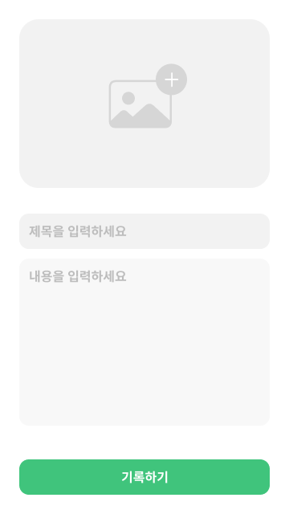
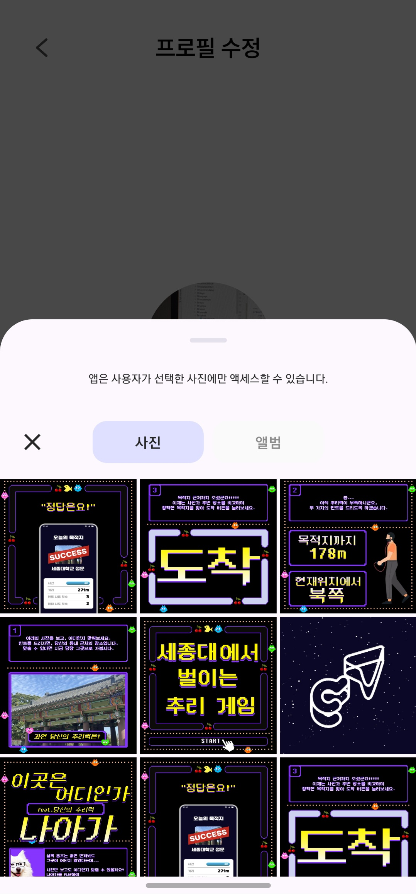
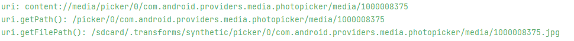
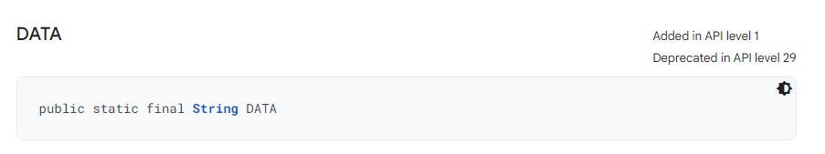
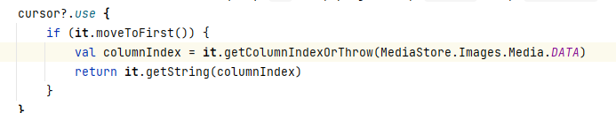
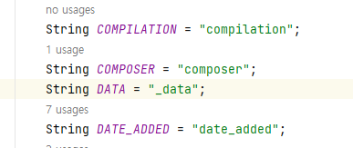

# [Android] 이미지 업로드 - Uri에서 서버로 보내기까지


## 배경

저는 현재 '나아가'라는 우테코 프로젝트와 'ZOOC'이라는 사이드 프로젝트에서 안드로이드 개발을 담당하고 있습니다. 두 프로젝트에서 모두 이미지 업로드를 위해 멀티파트 폼데이터를 사용하고 있는데요, 이 글에는 그 과정에서 한 생각들이 담겨있습니다.


그러나 아쉽게도 두 프로젝트에서 이미지 업로드 기능을 담당하지는 않았습니다. 다만 다른 팀원들이 구현한 내용을 보면서 이런 방식으로 하면 더 좋을 것 같은데? 하고 생각한 것들을 적어보려고 합니다. 단순한 이미지 업로드 기능 구현 방법에 더해, 해당 구현을 어디에서 하면 좋을 것 같다! 에 대해 이야기하고자 합니다.

<br/>

## 멀티파트 폼데이터란?

안드로이드 개발을 하다 보면 이미지 업로드 기능을 종종 마주치게 됩니다. 이미지 파일을 서버에 전송하는 방법은 여러 가지가 있지만, 그중에서 말씀드릴 내용은 멀티파트 폼데이터를 이용하는 것입니다.


안드로이드 개발을 하다보면, TCP/IP 기반의 HTTP 프로토콜 통신 과정에서 JSON 데이터를 주로 주고 받습니다. 클라이언트와 백엔드가 서로에게 필요한 데이터를 JSON 타입으로 주고받는 것이죠. 이때 주고받을 데이터의 타입을 (정확히는 MIME 타입을) HTTP 헤더에 `Content-type`으로 명시하게 되는데, JSON의 경우 `Content-type`이  `application/json`이 됩니다. 사진이나 mp3 같은 "파일"들의 `Content-type`은 어떻게 될까요? jpg나 jpeg 이미지 파일은 `image/jpeg`, mp3 파일은 `audio/mpeg` 형식으로 통신할 수 있습니다.


_그렇다면 멀티파트 폼데이터는 무엇일까요?_


<left>
	
</left>


예를 들어 위와 같이 일기를 작성하는 기능을 만든다고 생각해 봅시다. 해당 일기에는 사진, 제목, 내용 이렇게 세 가지가 들어갑니다. 일기를 "생성"해야 하므로 서버로 POST 요청을 보내야 합니다. POST 요청을 보내기 위해 바디에 사진, 제목, 내용을 함께 담으려고 하는데 잠깐..! `Content-type`을 무엇으로 지정해야 할까요?


이렇게 **여러 타입의 데이터를 한 번에 전송하고 싶을 때** 우리는 멀티파트 폼데이터 형식을 활용합니다. 멀티파트라는 말 그대로 바디에 해당하는 데이터가 여러 부분(타입)으로 이루어져 있다고 생각하시면 됩니다. 이럴 때 우리는 `Content-type`으로 `multipart/form-data`를 사용하게 됩니다.

<br/>

## 이미지 가져오기

지금까지는 멀티파트 폼데이터에 대해 간략하게 알아봤습니다. 그럼 이제 그 과정을 살펴볼 차롄데요, 이미지 파일을 서버에 전송하려면 우선 이미지가 있어야겠죠? 제가 진행 중인 두 프로젝트에선 다른 방식으로 이미지를 가져옵니다.

* 디바이스에서 저장되어 있는 이미지를 가져오는 것
* 사진을 바로 촬영해서 가져오는 것


### 디바이스에서 저장되어 있는 이미지 가져오기

존재하는 이미지를 가져올 때는 `ActivityResultContracts.PickVisualMedia()` 를 사용하고 있습니다. ([공식문서](https://developer.android.com/training/data-storage/shared/photopicker?hl=ko))

```kotlin
private val launcher = registerForActivityResult(ActivityResultContracts.PickVisualMedia()) { uri: Uri? ->
	uri?.let { // uri 사용하기 }                                                                  
}
                                                                                        
private fun selectImage() {
    launcher.launch(PickVisualMediaRequest(ActivityResultContracts.PickVisualMedia.ImageOnly))
}
```

위와 같이 `launcher` 를 선언하고 `launch` 함수를 호출하면 아래 화면과 같이 이미지를 가져올 수 있는 다이얼로그가 나옵니다. _(Android 13 / One UI 5.1)_


<left>
	
</left>
사진을 선택하면 `launcher`의 콜백에서 해당 사진의 `Uri`를 받을 수 있습니다. 안드로이드에서는 `Uri`를 통해 사진, 음성 파일 등의 디바이스 데이터에 접근할 수 있습니다.


넘어가기 전에 `Uri`가 무엇인지 잠깐 알아보도록 하겠습니다. URI는 'Uniform Resource Identifier'로 한글로 하면 '통합 자원 식별자'입니다. 즉, 자원(리소스)를 식별하는 고유한 아이디라고 볼 수 있습니다. URI의 개념 자체는 웹에서 출발했지만 인터넷 상의 자원에 국한되지는 않습니다. 이는 우리가 흔히 헷갈리는 URL과의 차이점인데 URL은 URI에 포함되는 개념으로 네트워크 상에서 자원의 위치를 나타냅니다.

안드로이드에서의 `Uri`는 `android.net` 패키지에 존재하며 안드로이드 프레임워크 내의 자원에 대한 식별자입니다. 특징으로는 불변하다는 것과 유효하지 않은 입력에 예외를 발생시키지 않고 쓰레기 값을 반환한다는 것이 있습니다.


### 사진을 바로 촬영해서 가져오기

앞선 방식이 디바이스에 이미 존재하는 사진을 가져온다면, 이번 방식은 사진을 직접 촬영하고 바로 가져옵니다. 다양한 방식이 존재하겠지만 해당 프로젝트에선 `ActivityResultContracts.TakePicture()`를 사용합니다.

```kotlin
private var imageUri: Uri? = null

private val launcher = registerForActivityResult(ActivityResultContracts.TakePicture()) { success: Boolean
    if(success) {
        // TODO: uri 사용하기
    }
}

private fun startCamera() {
    imageUri = createImageUri().getOrElse {
		// TODO: 오류 처리
       	return
    }
    launcher.launch(imageUri) // 매개변수로 전달한 Uri로 사진이 저장됩니다.
}

// uri 생성하기
private fun createImageUri(): Result<Uri> {
    val contentValues = getContentValues()
    val uri = contentResolver.insert(
            MediaStore.Images.Media.EXTERNAL_CONTENT_URI,
            contentValues,
        ) ?: return Result.failure(// TODO: 원하시는 Throwable을 담으시면 됩니다!)
        return Result.success(uri)
}

private fun getContentValues(): ContentValues {
    return ContentValues().apply {
        // TODO: 원하시는 칼럼을 추가하시면 됩니다!
    }
}
```

_권한과 관련한 코드 및 설명은 생략합니다_


`ActivityResultContracts.TakePicture()` 를 사용하게 되면 콜백 함수는 성공 여부를 반환하게 되고, `launcher.launch()` 함수에 우리가 직접 생성한 `Uri`를 담고 해당 `Uri`로 사진이 저장됩니다. 사진을 저장하지 않고 보여주고 싶다면 `ActivityResultContracts.TakePicturePreview()` 도 존재하지만, 다음의 설명처럼 화질이 저하된 비트맵을 콜백을 통해 받아보실 수 있습니다.

> An ActivityResultContract to take small a picture preview, returning it as a Bitmap.


_ _ _


프로젝트에 사용된 사진을 가져오는 두 가지 방법에 대해 알아보았습니다. 위 방법보다 좋은 방법들이 있을 수 있습니다. 다만 사진을 가져오는 것 자체가 글의 주제가 아니므로 넘어가도록 하겠습니다. 어찌 됐든 우리는 두 방식에서 모두 `Uri`를 얻었고 이제 `Uri`를 이용해서 이미지를 서버로 보내야 합니다!


두 프로젝트 모두 서버 통신에서 `Retrofit` 라이브러리를 사용 중입니다. 그래서 최종적으로 이미지 및 함께 전송할 데이터들을 `Retrofit`에서 지원하는 `RequestBody` 혹은  `MultipartBody.Part` 타입으로 만들어야 합니다.

<br/>

## Uri가 Part가 되는 과정

지금까지 보내고자 하는 이미지의 `Uri` 를 얻었습니다. 이제 이미지를 보내기만 하면 됩니다! 어떻게 하면 될까요? `imageUri.toPart()` 하면 우리가 원하는 형태가 나올까요? 아쉽게도 그런 함수는 없습니다. 그럼 어떤 과정을 거쳐야 할지 지금부터 알아보겠습니다!


우선 최종적으로 서버에 어떤 형태로 데이터를 전송할지 보고 시작하면 좋을 것 같습니다. 그래서 `Retrofit`을 통해 정의한 서비스 인터페이스를 먼저 보도록 하죠!

```kotlin
interface DiaryService {
    @Multipart
    @POST("diary")
    fun postDiary(
        @Part("title") title: RequestBody,
        @Part("content") content: RequestBody,
        @Part photo: MultipartBody.Part,
    ): Response<DiaryDto>
}
```


`postDiary()`를 보시면 `@Multipart` 어노테이션이 있습니다. 이 어노테이션을 달아주는 것은 해당 함수의 `Content-type`이 `multipart/form-data` 라고 명시하는 것입니다. 그럼 `Retrofit`이 내부적으로 어노테이션을 통해 `Content-type` 을 지정해 줍니다.


`@Part` 어노테이션으로 각 파트를 명시해 주고, 여러 파트가 모여 하나의 `multipart/form-data` 형식을 이룹니다. 초반에 멀티파트 폼데이터에 관해 설명했던 내용이 코드로 보이는 부분입니다. 파일은 `MultipartBody.Part`로, `title`, `content`와 같은 문자열은  `RequestBody`로 보내고 있습니다.


그럼 `MultipartBody.Part`와 `RequestBody` 객체를 생성하려면 어떻게 해야 할까요? 아래 코드를 보시면 `MultipartBody.Part`를 만드는 팩토리 메서드들이 존재합니다.

```kotlin
class Part private constructor(
    @get:JvmName("headers") val headers: Headers?,
    @get:JvmName("body") val body: RequestBody
  ) {
    
    // ...
    
    companion object {
        @JvmStatic
      	fun create(body: RequestBody): Part = create(null, body)

      	@JvmStatic
      	fun create(headers: Headers?, body: RequestBody): Part {
            // ...
        	return Part(headers, body)
      	}
        
        @JvmStatic
      	fun createFormData(name: String, value: String): Part =
          	createFormData(name, null, value.toRequestBody())

      	@JvmStatic
      	fun createFormData(name: String, filename: String?, body: RequestBody): Part {
            val disposition = buildString {
          		append("form-data; name=")
          		appendQuotedString(name)

          		if (filename != null) {
            		append("; filename=")
            		appendQuotedString(filename)
          		}
        	}

        	val headers = Headers.Builder()
            	.addUnsafeNonAscii("Content-Disposition", disposition)
            	.build()

        	return create(headers, body)
        }
    }
}
```

총 네 개의 팩토리 메서드가 존재하는데요, 저희 대신 많은 일을 해주는 마지막 메서드를 사용할 예정입니다. 마지막 메서드를 호출하기 위해 필요한 인자들을 봅시다. `String` 타입의 name과 filename, 그리고 `RequestBody` 형태의 body가 필요합니다.


우선 name과 filename에 대해 알아봅시다. 여기서 name은 key값입니다. 업로드된 데이터에서 백엔드가 원하는 값을 꺼내려면 key값이 있어야겠죠? 백엔드와 합의하신 key값을 적어 주시면 됩니다! filename은 말 그대로 파일명입니다. 전송하실 파일의 이름을 적어 주시면 됩니다.


이제 `RequestBody`를 생성하는 방법에 대해 알아봅시다. `RequestBody`는 추상 클래스이며 이를 구현하기 위해서는 두 개의 추상 메서드를 필수적으로 구현해야 합니다. 동반 객체를 보시면 아래와 같이 확장 함수로 `RequestBody`를 생성해 주는 메서드들이 구현되어 있습니다.

```kotlin
fun String.toRequestBody(contentType: MediaType? = null): RequestBody { ... }
fun ByteString.toRequestBody(contentType: MediaType? = null): RequestBody { ... }
fun ByteArray.toRequestBody(contentType: MediaType? = null,  offset: Int = 0,  byteCount: Int = size): RequestBody { ... }
fun File.asRequestBody(contentType: MediaType? = null): RequestBody { ... }
```

쭉 훑어보시면 다른 타입의 객체들을 `RequestBody`로 변환해 주는 함수들입니다. 이 중에 뭘 사용해야 할까요? 우선은 `File`에서 변환하는 마지막 메서드를 사용해 보겠습니다. 그렇다면 이제 남은 건 `File` 객체를 만드는 것입니다.


`File` 객체의 생성자들을 살펴보다 보면 아래와 같은 생성자를 발견할 수 있습니다!

```java
public File(URI uri) { ... }
```

그럼 이제 `File`을 만들 수 있겠군요! 하지만 이것은 틀렸습니다. 이미지로부터 얻어온 것은 `android.net` 패키지의 `Uri`이고 위에 보이는 것은 `java.net` 패키지의 `URI`입니다. 다른 생성자를 둘러보면 아래와 같이 `pathname`을 받는 생성자가 있습니다.

```java
public File(String pathname) { ... }
```

여기서 `pathname`이란 파일이 위치하는 절대 경로를 의미합니다. 우리에게 좀 더 익숙한 예시를 들자면 `C:\Program Files\Android\Android Studio`과 같은 것을 말합니다. 우리가 갖고 있던 `Uri`는 파일의 절대 경로가 아닌 안드로이드 프레임워크의 식별자이므로 `pathname`은 새로 얻어 와야 합니다.


그럼 우리가 가진 `Uri`로 `pathname`을 가져와야 합니다. `Uri` 객체를 살펴보면 `getPath()` 함수가 존재합니다. 하지만 해당 함수는 우리가 원하는 파일 경로를 주지 않습니다. (단순히 현재 식별자(URI)에서 path 부분만 떼어서 반환합니다) 그럼 파일 경로를 어떻게 가져올 수 있을까요? 프로젝트의 코드를 첨부합니다.

```kotlin
private fun Uri.getFilePath(): String? {
    val projection = arrayOf(MediaStore.Images.Media.DATA)
    val cursor = contentResolver.query(this, projection, null, null, null)
    cursor?.use {
        if (it.moveToFirst()) {
            val columnIndex = it.getColumnIndexOrThrow(MediaStore.Images.Media.DATA)
            return it.getString(columnIndex)
        }
    }
    return null
}
```

`contentResolver`를 통해서 `MediaStore.Images.Media.DATA`라는 칼럼을 읽어오면 파일 경로를 알 수 있습니다. `uri`, `uri.getPath()`, `uri.getFilePath()` 에 대해 로그를 찍어보면 다음과 같이 나옵니다. (예시로 제 프로젝트에서 로그를 찍어보았습니다)

<left>
	
</left>
첫 줄을 보시면 확실히 [URI](https://ko.wikipedia.org/wiki/%ED%86%B5%ED%95%A9_%EC%9E%90%EC%9B%90_%EC%8B%9D%EB%B3%84%EC%9E%90)의 형태임을 알 수 있습니다. content가 scheme, media가 authority, picker부터가 path입니다. `uri.getPath()`는 URI에서 path 부분만 잘라서 반환합니다. `uri.getFilePath`는 URI 형태가 아닌 파일의 절대 경로를 반환하고 있습니다. 그러므로 저희가 사용할 것은 마지막 줄입니다. 파일 경로를 알았으니 이제 `File` 객체를 만들 수 있습니다! `val file = File(uri.getFilePath())`


지금까지 살펴본 과정을 정리하면 이렇습니다.

>  `Uri` → `File` → `RequestBody` → `MutlipartBody.Part`

드디어 우리가 처음 받아왔던 `Uri`가 `MultipartBody.Part` 형식이 되었습니다. 이제 이미지를 업로드 하는 데는 문제가 없겠죠?


하지만 지금 부터가 이 글의 본격적인 내용입니다. 지금까지 본 일련의 과정을 과연 어디서 수행해주는게 맞을까요?

<br/>

## 프로젝트 구조와 구현 예시

제가 진행하는 두 프로젝트의 구조와 지금까지 설명한 내용들이 어떻게 구현되었는지 말씀드리겠습니다. 두 프로젝트의 구조는 상당히 유사하여 같다고 생각하고 설명 드리겠습니다.


구글 권장 아키텍처나 클린 아키텍처를 사용하고 있지 않습니다. 당시 아키텍처에 대해 깊게 학습한 상태는 아니기에 적용하지 않았습니다. 다만 적용된 패턴으로는 MVVM 패턴과 레포지토리 패턴이 있습니다.


레지토리 패턴을 사용하며 프레젠테이션, 도메인, 데이터 이렇게 세 가지 레이어가 존재합니다. (도메인은 순수 코틀린으로 작성되었습니다) 프레젠테이션 단에서는 `AAC ViewModel`을 사용하여 뷰모델을 구현하고 있습니다.

`domain`과 `app` 이렇게 두 개의 모듈로 구성되어 있고 `app` 모듈 내에 프레젠테이션과 데이터 레이어가 존재합니다. 도메인 레이어는 어떤 레이어도 참조하지 않으며 프레젠테이션과 데이터 레이어는 도메인 레이어를 참조합니다. (일부 클린 아키텍처를 따른다고 볼 수 있습니다)


이제 프로젝트 코드를 예시로 보여드리겠습니다. 두 프로젝트가 유사한 형태를 띄고 있어 적절히 섞은 예시입니다. (네이밍은 예시용으로 수정하였습니다. 오류 처리 로직은 제외했습니다)

```kotlin
class DiaryVieModel(
    private val application: Application,
    private val diaryRepository: DiaryRepository,
) : ViewModel() {
    // ...
    
    private var imageUri: Uri = Uri.Empty
    
    fun writeDiary() {
        viewModelScope.launch {
            diaryRepository.postDiary(
                title = title.value ?: "",
                content = content.value ?: "",
                image = imageUri.getFilePath() ?: ""
	        )
        }
    }
    
    private fun Uri.getFilePath(): String? {
        val projection = arrayOf(MediaStore.Images.Media.DATA)
        val cursor = application.applicationContext.contentResolver.query(this, projection, null, null, null)
        cursor?.use {
            if (it.moveToFirst()) {
                val columnIndex = it.getColumnIndexOrThrow(MediaStore.Images.Media.DATA)
                return it.getString(columnIndex)
            }
        }
        return null
    }
    
    // ...
}
```

제가 처음 마주쳤던 뷰모델 코드입니다. 보시면 뷰모델에서 `Application`을 받아 `applicationContext`를 사용하고 있었습니다. `ContentResolver`를 사용하려면 `Context`가 필수적이기 때문입니다. 또 `Uri` 객체를 `imageUri`라는 하나의 상태로 들고 있었습니다.


하지만 뷰모델에서 `Context`등 안드로이드 의존성을 참조하는 것은 그리 권장되지 않습니다. MVVM 안티패턴이라고도 볼 수 있습니다. 그 이유는 뷰모델에서 안드로이드 의존성을 가지지 않아야 테스트에 용이하기 때문입니다. (물론 `AAC ViewModel`과 `LiveData` 또한 안드로이드 의존성을 갖지만, 다행히 여기까지는 테스트가 가능합니다)


이번에는 뷰모델에 주입 받은 레퍼지토리의 구현체를 보겠습니다.

```kotlin
class DefaultDiaryRepository(private val service: diaryService) : DiaryRepository {
    // ...
    
    override suspend fun postDiary(
        title: String,
        content: String,
        image: String,
    ): Result<Unit> {
        val titleRequestBody = title.toRequestBody("text/plain".toMediaTypeOrNull())
        val titlePart = MultipartBody.Part.createFormData("title", null, requestBody)
        
        val contentRequestbody = content.toRequestBody("text/plain".toMediaTypeOrNull())
        val contentPart = MultipartBody.Part.createFormData("content", null, requestBody)
       
        val file = File(image)
        val imageRequestBody = file.asRequestBody("image/jpeg".toMediaTypeOrNull())
        val imagePart = MultipartBody.Part.createFormData("imageFile", file.name, requestBody)

        service.postDiary(titlePart, contentPart, imagePart)
    }
}
```

뷰모델에서 받은 파일 경로를 통해 `File` 객체를 만들고 `RequestBody`와 `MultipartBody.Part` 객체를 만듭니다. 여기엔 크게 문제 될 만한 부분이 보이진 않습니다. 이제 위 코드들을 어떻게 개선할 수 있을지 이야기해 보겠습니다!

<br/>

## 구현의 적절한 위치 찾기

이제부터 **이 글의 진짜 목적이** 시작됩니다. 앞서 보았던 변환 과정들을 어디서 수행할 지 알아봅시다!

우선 앞서 말했던 문제를 해결해 보겠습니다. 뷰모델에서 안드로이드 의존성을 분리합니다.

* `Uri`

* `context.contentResolver`


`contentResolver`를 먼저 보겠습니다. `contentResolver`가 필요한 행동은 `Uri`로부터 파일 경로를 가져오는 것입니다.  이 행동을 다른 곳으로 옮기기 위해 연관된 행동을 한번 살펴보겠습니다.

> 1. 액티비티가 뷰모델에게 `Uri`를 넘겨준다.
> 2. 뷰모델이 파일 경로를 레퍼지토리에게 넘겨준다.


연관된 행동들을 보니 `contentResolver`가 필요한 행동을 넘길 수 있는 곳이 보입니다.

>1. 액티비티에서 처리하여 파일 경로 혹은 `File` 객체를 뷰모델에게 넘긴다. (`File`은 자바 객체입니다)
>2. `Uri`를 레포지토리에 넘기고 레퍼지토리에서 파일 경로를 가져오도록 한다.


### 액티비티에서 처리하기

액티비티는 그 자체로 `Context`이므로 `contentResolver`를 사용할 수 있습니다. 뷰모델에 존재하던 `getFilePath` 함수의 로직을 (혹은 `File` 객체로의 변환까지) 액티비티로 옮기게 되면 아래와 같이 안드로이드 의존성으로부터 한결 깔끔해진 뷰모델을 만나볼 수 있습니다.

```kotlin
class DiaryVieModel(private val diaryRepository: DiaryRepository) : ViewModel() {
    // ...
    
    private lateinit var imageFilePath: String
    private lateinit var imageFile: File
    
    fun writeDiaryByPath() {
        viewModelScope.launch {
            diaryRepository.postDiaryByPath(
                title = title.value ?: "",
                content = content.value ?: "",
                imagePath = imageFilePath
	        )
        }
    }
    
    fun writeDiaryByFile() {
        viewModelScope.launch {
            diaryRepository.postDiaryByFile(
                title = title.value ?: "",
                content = content.value ?: "",
                imageFile = imageFile
	        )
        }
    }
    
    // ...
}

class DefaultDiaryRepository(private val service: DiaryService) : DiaryRepository {
    // ...
    
    override suspend fun postDiaryByPath(
        title: String,
        content: String,
        imagePath: String,
    ): Result<Unit> {
		// ...
       
        val file = File(image)
        val imageRequestBody = file.asRequestBody("image/jpeg".toMediaTypeOrNull())
        val imagePart = MultipartBody.Part.createFormData("imageFile", file.name, requestBody)

        service.postDiary(titlePart, contentPart, imagePart)
    }
    
    override suspend fun postDiaryByFile(
        title: String,
        content: String,
        imageFile: File,
    ): Result<Unit> {
		// ...
       
        val imageRequestBody = imageFile.asRequestBody("image/jpeg".toMediaTypeOrNull())
        val imagePart = MultipartBody.Part.createFormData("imageFile", file.name, requestBody)

        service.postDiary(titlePart, contentPart, imagePart)
    }
}
```

이제 앞선 뷰모델보다 훨씬 테스트에 용이한 뷰모델이 되었습니다. `getFilePath` 함수의 로직을 옮기면서 `Uri`도 자연스럽게 사라졌습니다. 그럼 이제 완성인 걸까요? 한 가지만 더 생각해 봅시다.


우리는 객체지향 프로그래밍을 할 때, 객체에 어떤 책임과 역할을 부여할지 고민합니다. 그럼 **`Uri`로부터 파일 경로 혹은 `File` 객체를 가져오는 행동은 과연 액티비티의 책임일까요?**


사람마다 생각이 다르겠지만 저는 아니라고 생각합니다. 제가 정의한 프레젠테이션 레이어는 뷰와 뷰의 상태에 관련된 일을 해야 합니다. 그런 의미에서 액티비티의 역할은 사진을 선택하는 것에서 끝났습니다.


그럼 `Uri`로부터 파일 경로 혹은 `File` 객체를 가져오는 행동은 어디서 수행해야 할까요? 앞서 두 가지 선택지가 있었던 것이 기억나시나요? 그 두 번째 선택지를 보겠습니다.


### 레퍼지토리에서 처리하기 (데이터 레이어에서 처리하기)

레퍼지토리에서 수행하게 된다면 원래의 뷰모델에서 `getFilePath` 함수만 레퍼지토리로 넘어가게 됩니다.

여기서 두 가지 문제가 생깁니다.

* 뷰모델에 `Uri`는 그대로 남아있다.

* 도메인에서 `Uri` 타입을 참조해야한다.


이 부분을 해결하기 위해 액티비티에서 `Uri`의 `toString` 함수를 사용해 `String` 타입으로 변환합니다. (ex. `viewModel.setImage(uri.toString())`)

```kotlin
class DiaryVieModel(private val diaryRepository: DiaryRepository) : ViewModel() {
    // ...
    private lateinit var imageUri: String
    
    fun wirteDiary() {
        viewModelScope.launch {
            diaryRepository.postDiaryByPath(
                title = title.value ?: "",
                content = content.value ?: "",
                imageUri = imageUri
	        )
        }
    }
    
    // ...
}

class DefaultDiaryRepository(
    private val contentResolver: ContentResolver,
    private val service: DiaryService,
) : DiaryRepository {
    // ...
    
    override suspend fun postDiary(
        title: String,
        content: String,
        imageUri: String,
    ): Result<Unit> {
		// ...
       
        val uri = Uri.parse(imageUri)
        val file = File(uri.getFilePath())
        val imageRequestBody = file.asRequestBody("image/jpeg".toMediaTypeOrNull())
        val imagePart = MultipartBody.Part.createFormData("imageFile", file.name, requestBody)

        service.postDiary(titlePart, contentPart, imagePart)
    }
    
    private fun Uri.getFilePath(): String? { ... }
}
```

`Uri`로부터 파일 경로와 `File` 객체를 가져오는 행동을 레퍼지토리에서 수행하였습니다. 이 행동을 수행하기 위해선 `Uri`라는 경로와 `contentResolver`를 통해 디바이스의 데이터에 접근해야 합니다. 이런 행동은 분명 데이터 레이어의 책임이라고 생각해 레퍼지토리로 옮겨보았습니다. _(데이터 소스가 있다면 데이터 소스의 역할이라고 생각합니다.  데이터 소스를 데이터의 출처라고 생각하며 `contentResolver`를 통해 디바이스의 데이터를 가져왔기 때문입니다. 그러나 현재 프로젝트에선 데이터 소스가 따로 존재하지 않아 레퍼지토리에서 수행하였습니다)_


레퍼지토리에서 `ContentResolver`를 참조하는 부분에서 고개를 갸우뚱 하시는 분들이 계실 수도 있습니다. 레퍼지토리는 "저장소"이고 (데이터 소스가 있다면) 데이터 소스는 저장소에서 필요한 데이터의 출처입니다. `ContentResolver`를 사용하여 디바이스의 데이터를 접근하는 행위는 레퍼지토리와 데이터 소스 즉, 데이터 레이어의 역할이라고 볼 수 있습니다. 그러므로 데이터 레이어의 어디선가 `ContentResolver`를 참조하는 것은 생소할 수 있지만 이상하지 않다고 말씀드릴 수 있습니다.


여전히 낯설다면 `Room`과 같다고 생각해보시면 좋습니다. `Room`은 안드로이드 프레임워크에서 제공하는 ORM으로 앱에서 로컬 데이터베이스가 필요할 때 많이 사용합니다. 데이터 소스에서 `Room`을 사용하는 것이 생소하지 않다면 `ContentResolver` 또한 마찬가지입니다. `Room`과 `ContentResolver` 모두 디바이스에 데이터를 읽고 쓰는 역할을 하기 때문입니다. (저장할 위치와 저장할 내용이 다릅니다)


하지만 이런 구조에서도 한 가지 문제가 존재합니다. 액티비티에서 `Uri`를 `String`으로 변환하고 뷰모델에서 도메인 레이어의 `DiaryRepository` 인터페이스의 `postDiary` 함수가 사용됩니다. 그리고 `DiaryRepository`의 구현체인 데이터 레이어의 `DefaultDiaryRepository`에서 `String`을 `Uri`로 파싱하게 됩니다.

```kotlin
interface DiaryRepository {
    //...
    
    suspend fun postDiary(
        title: String,
        content: String,
        imageUri: String,
    ): Result<Unit> 
}
```

그 과정에서 도메인에서 `postDiary` 함수의 `imageUri`라는 매개변수가 **`Uri`를 `String`으로 파싱한 것이라는 사실을 알고 있어야 합니다**. 이렇게 되면서 도메인이 간접적으로나마 안드로이드에 대해 알고 있다고 말할 수도 있을 것입니다. 더해서 프로젝트를 처음 보는 개발자가 해당 인자에 `Uri.toString()`을 담고, 레퍼지토리에서 `Uri.parse(imageUri)`를 수행해야 하는지 모를 수 있습니다.


결과적으로 말씀드린 두 가지 방식 모두 한 가지의 문제점을 안고 있습니다. 현재 두 프로젝트는 제가 뷰모델의 리팩터링을 제안한 뒤로 변화해 현재는 각각 다른 모습을 띠고 있습니다. 두 프로젝트가 각각 다른 방식을 채택하면서 두 방식 모두 사용되고 있는 것이죠.


이렇듯 정답은 없으며 이 글을 읽는 여러분이 더 적합하다고 판단되는 방식으로 진행하시기 바랍니다! 또한 더 좋은 방식이 있다면 추천해 주시면 감사합니다!

<br/>

## 추가 내용

이제 글에서 하고자 하는 주된 이야기는 끝났습니다. 하지만 몇 가지만 추가로 얘기해 보고자 합니다. 글을 예전에 구성되었던 프로젝트의 코드에 맞춰서 진행했는데, 몇 가지 개선할 수 있는 부분이 있었으나 글을 진행하느라 넘어갔습니다.


### MediaStore.Images.Media.DATA

우리가 파일 경로를 가져오기 위해 사용했던 이 컬럼은 사실 **Deprecate** 되었습니다.

[공식문서](https://developer.android.com/reference/android/provider/MediaStore.MediaColumns#DATA)

<left>
	
</left>


저도 글을 작성하면서 찾아보다가 이 부분에 대해 알게 되었습니다. 일반적으로 Deprecate 된 것들은 ide에서 취소선을 그려 주는데 프로젝트에서 작성한 코드에선 취소선을 볼 수 없었기 때문입니다.

<left>
    
    
</left>


다음은 공식문서의 내용입니다.

> From Android 11 onwards, this column is read-only for apps that target `R` and higher. On those devices, when creating or updating a uri, this column's value is not accepted. Instead, to update the filesystem location of a file, use the values of the `DISPLAY_NAME` and `RELATIVE_PATH` columns.

> Android 11부터, R 버전 이상을 대상으로 하는 앱의 경우 이 칼럼은 읽기 전용입니다. 이러한 디바이스에서는 uri를 생성하거나 업데이트할 때 이 칼럼의 값은 허용되지 않습니다. 대신 파일의 파일 시스템 위치를 업데이트하려면 DISPLAY_NAME과 RELATIVE_PATH 칼럼의 값을 사용하십시오.


Deprecate 된 것을 계속 사용할 수는 없으므로 새로운 방식을 알아봅시다. 다음 예시 코드처럼 캐시 파일을 통해 `Uri` 객체로 `File` 객체를 생성할 수 있습니다. ([캐시 파일](https://developer.android.com/training/data-storage/app-specific?hl=ko#internal-create-cache), [파일 스트림](https://developer.android.com/training/data-storage/shared/media?hl=ko#open-file-stream)) 임시로 사용할 캐시 파일을 생성하고 `Uri`로 `Bitmap`을 만들어 저장합니다. 그리고 해당 파일을 `MutlipartBody.Part`로 변환해서 전송하면 됩니다.  `Uri`만 알아도 `Bitmap`은 생성할 수 있으므로 절대 경로 없이 업로드할 파일을 생성할 수 있습니다!

```kotlin
private fun makeImageFile(uri: Uri): File {
    // 파일 스트림으로 uri로 접근해 비트맵을 디코딩
    val bitmap = contentResolver.openInputStream(uri).use {
        BitmapFactory.decodeStream(it)
    }

    // 캐시 파일 생성
    val tempFile = File.createTempFile("파일명", ".jpeg", cacheDir) ?: FILE_EMPTY

    // 파일 스트림을 통해 파일에 비트맵 저장
    FileOutputStream(tempFile).use {
        bitmap.compress(Bitmap.CompressFormat.JPEG, 100, it)
    }
    return tempFile
}
```


### File을 거치지 않고 RequestBody 만들기

글에서 내내 `Uri` → `File` → `RequestBody` 의 과정을 거쳤습니다. 그러나 `Uri` → `RequestBody`의 과정도 가능합니다. 직접 `RequestBody`를 구현하면 됩니다.

`RequestBody`를 상속 받으면 두 개의 추상 함수를 구현해야 합니다. 즉, 이것만 구현하면 `RequestBody`를 만들 수 있습니다.

```kotlin
class RequestBodyImpl : RequestBody() {
    override fun contentType(): MediaType? {
        TODO("Not yet implemented")
    }

    override fun writeTo(sink: BufferedSink) {
        TODO("Not yet implemented")
    }
}
```

바로 코드를 보겠습니다.

```kotlin
class ContentUriRequestBody(
    context: Context,
    private val uri: Uri,
) : RequestBody() {
    private val contentResolver = context.contentResolver

    private var fileName = ""
    private var size = -1L

    init {
        contentResolver.query(
            uri,
            arrayOf(MediaStore.Images.Media.SIZE, MediaStore.Images.Media.DISPLAY_NAME),
            null,
            null,
            null,
        )?.use { cursor ->
            if (cursor.moveToFirst()) {
                size = cursor.getLong(cursor.getColumnIndexOrThrow(MediaStore.Images.Media.SIZE))
                fileName =
                    cursor.getString(cursor.getColumnIndexOrThrow(MediaStore.Images.Media.DISPLAY_NAME))
            }
        }
    }

    fun getFileName() = fileName

    override fun contentLength(): Long = size

    override fun contentType(): MediaType? =
        contentResolver.getType(uri)?.toMediaTypeOrNull()

    override fun writeTo(sink: BufferedSink) {
        contentResolver.openInputStream(uri)?.source()?.use { source ->
            sink.writeAll(source)
        }
    }
}
```

이런 식으로 `Uri`로 `RequestBody`를 바로 구현하면 파일 경로도, `File` 객체도 만들 필요가 없습니다. 컨텐츠 길이, 미디어 타입을 넘기고 `Uri`로 `InputStream`열어 파일을 가져옵니다. 두 프로젝트 중 레퍼지토리에서 처리하는 방법을 선택한 프로젝트 'ZOOC'의 경우 위의 `ContentUriRequestBody` 객체를 다음과 같이 사용하고 있습니다.

```kotlin
class DefaultDiaryRepository(
    private val context: Context,
    private val service: DiaryService,
) : DiaryRepository {
    // ...
    
    override suspend fun postDiary(
        title: String,
        content: String,
        imageUri: String,
    ): Result<Unit> {
		// ...
       
        val uri = Uri.parse(imageUri)
        val imageRequestBody = ContentUriRequestBody(context, imageUri)
        val imagePart = MultipartBody.Part.createFormData("imageFile", file.name, requestBody)

        service.postDiary(titlePart, contentPart, imagePart)
    }
}
```

프로젝트의 구조가 `ContentUriRequestBody` 객체가 사용 가능한 상태라면 사용해보는 것을 추천 드립니다!


## 조금 더 개선된 구조

앞서 말씀드렸던 "레퍼지토리에서 처리하기 (데이터 레이어에서 처리하기)"에서 생각을 조금 더한 구조를 보여드리려고 합니다.

우선 `Uri`를 `String`으로 변환해서 옮기는 것에서 오는 혼동을 방지하기 위해 래핑 객체를 만들었습니다. (래핑 객체를 만들고 팀 내에서 약속하면 혼동을 방지할 수 있다고 생각합니다) 또 파일이나 `Uri`를 생성하는 역할을 분리하여 `ContentRepository`를 만들고 `DiaryRepository`에서 사용합니다. 또 `RequestBody`나 `MultipartBody.Part`로 변환하여 서버에 전송하는 행동은 `RemoteDiaryDataSource`로 옮겼습니다. `ContentRepository`는 다른 레퍼지토리에서도 사용 가능하게 되면서 재사용성도 증가했습니다.

```kotlin
data class TecobleUri(uri: String)

interface DiaryRepository() {
    // ...
    
    suspend fun postDiary(
        title: String,
        content: String,
        imageUri: TecobleUri,
    )
}

interface ContentRepository {
    fun getContent(uri: TecobleUri): File
}


class DefaultDiaryRepository(
    private val contentRepository: ContentRepository,
    private val remoteDiaryDataSource: RemoteDiaryDataSource,
): DiaryRepository {
    override suspend fun postDiary(
        title: String,
        content: String,
        imageUri: TecobleUri,
    ): Result<Unit> {
		// ...
       
        val imageFile = contentRepository.getContent(imageUri)
        remoteDiaryDataSource.postDiary(title, content, imageFile)
    }
}
```


<br/>

## 글을 마치며

이렇게 멀티파트 폼데이터를 통한 이미지 전송 방법과 그 과정들이 어느 위치에서 일어나는 것이 좋을 지에 대해 이야기해 보았습니다. 각각의 장단점이 있으니 더 적합하다고 생각하시는 방식을 사용해 주시면 될 것 같습니다. 저는 개인적으로 데이터 레이어에서 수행해 주는 후자가 더 적합하다고 생각합니다.

`ContentResolver`가 하는 모든 행동들이 프레젠테이션 레이어가 아닌 데이터 레이어에 어울린다고 생각하기 때문입니다. 또한 액티비티에서 작성한다고 한다면 사진을 다루는 여러 액티비티에서 중복 코드가 발생할 것입니다. (물론 다른 객체로 빼볼 수도 있습니다) 이 모든 것들은 제 개인적인 견해일뿐 다른 의견도 궁금하고 존중합니다! 읽어 주셔서 감사합니다!

