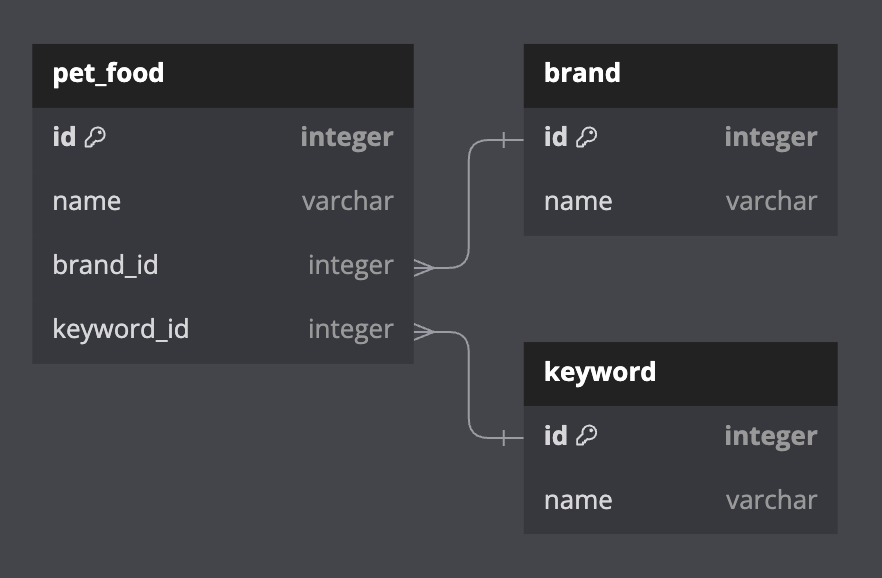
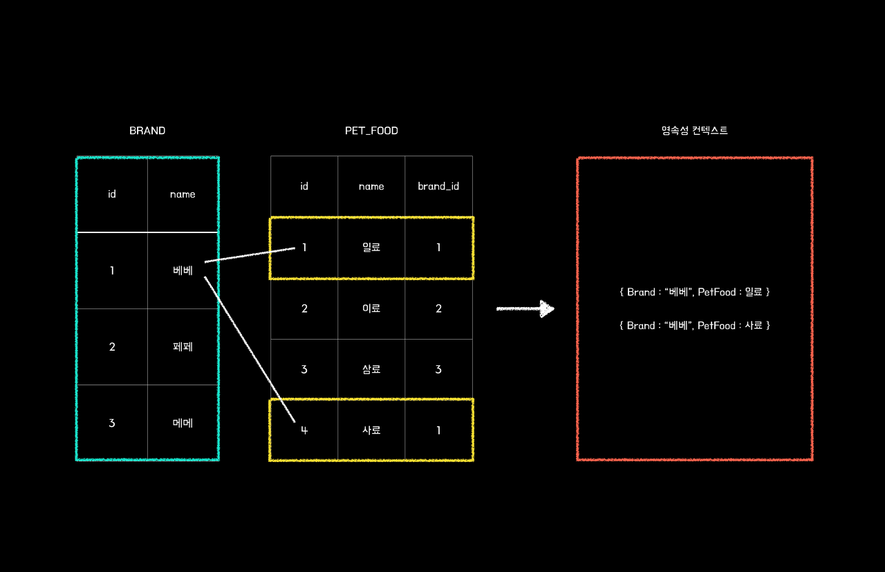
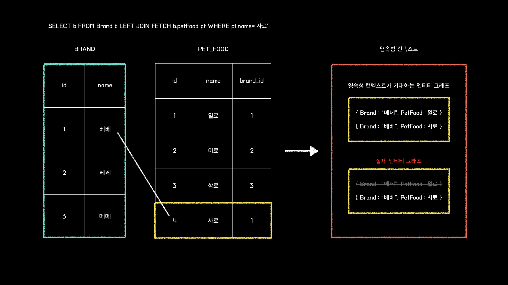

# JPA가 Fetch Join에 대한 On절을 지원하지 않는 이유

***

집사의고민 프로젝트에서 조회 쿼리가 발생할 때 데이터가 삭제되는 상황이 발생하였습니다.
그래서 이번 글에서는 간단한 JPA의 Fetch Join 동작 원리와 유의해야 하는 부분들에 관해서 기술해보려고 합니다.

### 참고 ERD
아래와 같은 테이블 구조에서 발생하는 문제입니다. 참고로 테이블의 모든 컬럼을 명시하지는 않았습니다.



우선 쿼리가 정상적으로 동작하는지와 어떤 쿼리가 발생하는지를 알아보기 위해 간단한 테스트 코드를 작성하는 것으로 시작해 보겠습니다.

```java
@DataJpaTest
@Import(QueryDslTestConfig.class)
@Sql(scripts = {"classpath:truncate.sql", "classpath:data.sql"})
@AutoConfigureTestDatabase(replace = AutoConfigureTestDatabase.Replace.NONE)
class PetFoodRepositoryImplTest {

    @Autowired
    private PetFoodQueryRepository petFoodQueryRepository;

    @Test
    void 키워드와_브랜드_이름으로_동적_조회한다() {
        // given
        final String keyword = "diet";
        final String brand = "베베";

        // when
        List<PetFood> petFoods = petFoodQueryRepository.searchPetFoodByDynamicValues(keyword, brand);

        // then
        assertAll(
                () -> assertThat(petFoods).extracting(petFood -> petFood.getKeyword().getName()).contains("diet"),
                () -> assertThat(petFoods).extracting(petFood -> petFood.getBrand().getName()).contains("퓨리나"),
                () -> assertThat(petFoods).hasSize(1)
        );
    }

}
```

### 쿼리 확인

``` sql
Hibernate: 
// 1번
    select
        p1_0.id,
        p1_0.brand_id,
        p1_0.image_url,
        p1_0.keyword_id,
        p1_0.name,
        p1_0.purchase_link 
    from
        pet_food p1_0 
    join
        brand b1_0 
            on b1_0.id=p1_0.brand_id 
    join
        keyword k1_0 
            on k1_0.id=p1_0.keyword_id 
    where
        k1_0.name=? 
        and b1_0.name=?
Hibernate: 
// 2번
    select
        k1_0.id,
        k1_0.name 
    from
        keyword k1_0 
    where
        k1_0.id=?
petFood.getKeyword().getName() = 다이어트
Hibernate: 
// 3번
    select
        b1_0.id,
        b1_0.founded_year,
        b1_0.has_research_center,
        b1_0.has_resident_vet,
        b1_0.name,
        b1_0.nation 
    from
        brand b1_0 
    where
        b1_0.id=?
petFood.getBrand().getName() = 베베
=================================
```

총 1 + N(2)가 발생하여 3번의 쿼리가 발생했습니다.
이렇게 조회한 엔티티가 한 번, 그와 연관된 엔티티가 N번 조회되는 문제를 N+1 문제라고 합니다.
Fetch Join 문법을 사용하여 이 문제를 해결할 수 있습니다.
이제 해당 쿼리를 개선해 보겠습니다.

## Fetch Join으로 개선하기
***
위 문제를 해결하기 위해 PetFoodQueryRepository의 searchPetFoodByDynamicValues 메서드를 수정해 보겠습니다.
```java
@Repository
@RequiredArgsConstructor
@Transactional(readOnly = true)
public class PetFoodQueryRepository {

    private final JPAQueryFactory queryFactory;

    public List<PetFood> searchPetFoodByDynamicValues(String keywordName, String brandName) {
        return queryFactory
                .selectFrom(petFood)
                .join(petFood.keyword, keyword).on(equalsKeyword(keywordName))
                .join(petFood.brand, brand).on(equalsBrand(brandName))
                .fetchJoin()
                .fetch();
    }

    private BooleanExpression equalsKeyword(String keywordName) {
        if (hasText(keywordName)) {
            return keyword.name.eq(keywordName);
        }
        return null;
    }

    private BooleanExpression equalsBrand(String brandName) {
        if (hasText(brandName)) {
            return brand.name.eq(brandName);
        }
        return null;
    }

}
```

위와 같이 on절로 필터링을 진행하고 Fetch Join을 사용했습니다. 조인 조건은 다음과 같습니다.

* 키워드가 일치한 데이터만 Join
* 브랜드가 일치한 데이터만 Join

하지만 테스트 코드를 실행시키면 아래와 같은 에러가 발생합니다.

```
java.lang.IllegalArgumentException: org.hibernate.query.SemanticException: with-clause not allowed on fetched associations; use filters
```

에러를 자세히 읽어보면 `not allowed on fetched associations`이 발생하는 것을 확인할 수 있는데,
이는 fetch 구문에서 on절을 지원하지 않는다는 뜻입니다.

실제로 하이버네이트 공식 문서에는 이런 말이 있습니다.
> "HQL(Hibernate Query Language)에서 Fetch Join에 별칭(Alias)이 필요한 유일한 이유는 추가 컬렉션(N방향)을 재귀적으로 조인하여 가져오는 경우밖에 없다."

이 말은 Fetch Join에 on절이 필요한 경우는 거의 없다시피 하지만,
역설적으로 하이버네이트 상에서는 Fetch Join을 지원하긴 한다는 뜻입니다.

하지만 JPQL로 Fetch Join + on절을 사용하면 런타임 에러가 발생합니다.

JPQL에서는 Fetch Join에 on절을 지원하지 않을까요?
이 이유는 생각보다 간단하지만, 많은 분들이 간과하고 있을 것 같습니다.

## Fetch Join의 한계
***
Fetch Join 문법은 N+1 문제를 방지하기 위해 연관관계가 맺어진 테이블의 모든 값들을 한 번에 가져옵니다.
Fetch Join은 너무나 필수적인 기능이기도 하지만 다음과 같이 명확한 한계가 존재합니다.

* **Fetch Join의 대상은 별칭을 줄 수 없다.**
  * select절, where절, 서브쿼리 등에서 Fetch Join 대상을 사용할 수 없다.
  * 하이버네이트 자체에서는 별칭을 지원하지만, 연관된 데이터 수에 대한 무결성이 깨질 수도 있다.(아래에서 자세하게 설명)
    JPQL과 querydsl에서 Fetch Join + on 문법을 지원하지 않는 이유도 위와 같다.
* (참고) 2개 이상의 xToMany 관계에서는 모든 연관 엔티티에 Fetch Join을 적용할 수 없다.
  * 대신 default_batch_fetch_size라는 차선책이 존재한다.
* (참고) 페이지네이션 사용이 불가능하다.
  * 컬렉션(xToMany) 관계에서 Fetch Join을 사용하면 페이징 처리가 불가능하다.

## On절 대신 Where절로 사용하기
***
Fetch Join에서 on절을 지원하진 않지만, where절은 사용할 수 있습니다.
다만, 잘못 사용하면 꽤나 골치 아픈 일이 일어날 수도 있기 때문에 확실히 짚고 넘어가야 합니다.

### Fetch Join의 On절을 지원하지 않는 이유는 무엇일까?
위에서 하이버네이트 자체에서는 별칭을 지원하지만, 연관된 데이터 수에 대한 무결성이 깨질 수도 있다고 했습니다.
이는 JPA에서 엔티티 객체 그래프와 DB의 데이터 일관성을 맞추어 주어야 하기 때문입니다.
예를 들어 아래와 같은 데이터가 있다고 가정해 보겠습니다.

* brand1 - petFood1
* brand1 - petFood2
* brand1 - petFood3

만약 조인 대상(petFood)을 필터링의 주체로 사용하여 petFood3을 제외하고 조인한다면,
JPA는 다음과 같은 결과를 반환해 줄 것입니다.

* brand1 - [petFood1, petFood2]

얼핏 보면 잘못된 게 없습니다. 저희가 바라던 대로 데이터가 반환되었으니까요.
하지만 위와 같은 결과가 나오면 Fetch Join을 한 JPA의 입장에서 상당히 난처해집니다.

Fetch Join은 단 한 번의 쿼리로 join 대상 테이블 데이터까지 한 번에 가져오고 영속성 컨텍스트에 반영합니다.
그래서 임의로 데이터를 빼고 조회하면 db에는 해당하는 데이터가 없다고 판단합니다.

엔티티 값을 변경하면 db에 쉽게 반영되는 걸 알 수 있듯이, 이렇게 되면 최악의 경우에는 petFood3이 db에서 삭제될 수도 있습니다.
위 상황들을 고려해서 JPA는 이 상황을 방지하기 위해 별칭에 대한 조건절을 제공해주지 않습니다.

이해를 돕기 위해 쿼리문을 직접 작성해 보겠습니다.
예를 들어 brand(1)과 연관관계가 맺어진 petFood(N)을 Fetch Join으로 조회한다고 가정해 보겠습니다.

```sql
// 1번 쿼리
SELECT b FROM Brand b JOIN fetch b.petFoods pf ON pf.name = '베베'
```

1번 쿼리는 Fetch Join에 별칭을 사용했기 때문에 런타임에서 에러가 발생합니다. 따라서 N+1을 해결할 수 없습니다.

```sql
// 2번 쿼리
SELECT b FROM Brand b JOIN fetch b.petFoods pf WHERE pf.name = '베베'
```

사실 1번 쿼리와 2번 쿼리는 동일하게 동작하는 쿼리입니다.
그리고 조인과 무관하게 Brand 자체 데이터를 필터링하는 것이기 때문에,
on절보다 where절을 사용하는 게 더 적절합니다.

## Fetch Join과 Where절의 함정 그리고 Outer Join
"Fetch Join은 on을 지원하지 않지만, where로 해결할 수 있다."라고 느껴질 수도 있는데, 반은 맞고 반은 틀린 말입니다. where절도 잘못 사용하게 된다면 on절과 똑같은 문제가 발생합니다.

우선 Brand와 PetFood 테이블에 대한 영속성 컨텍스트의 상황을 먼저 살펴보겠습니다.
우리가 Fetch Join을 사용할 때, 영속성 컨텍스트는 Fetch Join의 대상은 모두 존재한다고 가정합니다.
영속성 컨텍스트는 Fetch Join 실행 시 아래와 같이 베베 브랜드는 일료, 사료라는 데이터를 가지고 있죠.



그럼 여기에서 아래와 같은 Left Join Fetch 쿼리를 사용하게 되면 어떤 결과가 나올까요?

```sql
SELECT b FROM Brand b LEFT JOIN FETCH b.petFood pf WHERE pf.name='사료'
```

Fetch Join의 대상에 대한 조건을 걸었을 때 영속성 컨텍스트가 기대하는 객체 그래프의 상태와는 달라진 것을 볼 수 있습니다.



이로 인해 영속성 컨텍스트는 "원래는 베베 브랜드에는 일료, 사료라는 객체가 존재했는데, 일료 객체가 제거되었다."라는 판단을 내리게 됩니다.
우리는 실제로 일료 객체를 삭제한 적이 없는데 말이죠.


위 그림처럼 베베 브랜드의 일료 데이터가 사라진 상태이기 때문에 저 상태에서 db에 flush가 된다면 실제 데이터베이스의 데이터가 삭제됩니다.
이렇게 잘못된 where절로 해결하려고 하다가 런타임 예외로 막아둔 것 마저 무시해 버리고 db 데이터를 삭제하게 될 수도 있으니 꼭 주의해서 사용해야 합니다.

### 검증 - Outer Fetch Join과 Where절 필터링

```java
public interface BrandRepository extends JpaRepository<Brand, Long> {
  
    @Query("select b from Brand b left join fetch b.petFoods pf where pf.name = :petFoodName")
    Brand findBrandsByPetFoodName(@Param("petFoodName") final String petFoodName);
    
}
```

```java
@Test 
void outer_fetch_join_test() {
    Brand brand = brandRepository.findBrandsByPetFoodName("사료");
    for (PetFood petFood : brand.getPetFoods()) {
        System.out.println("petFood.getName() = " + petFood.getName());
    }
}
```

```java
petFood.getName() = 사료
```

위에서 봤던 그림처럼 brand는 데이터베이스 상에선 실제로 일료와 사료를 가지고 있지만, 조회해 보면 사료라는 데이터 단 하나만 가지고 있습니다. 그럼 여기서 좀 더 나가서 해당 영속성 컨텍스트를 데이터베이스에
flush 하게 되면 어떨까요?

```java
@Service
@Transactional
@RequiredArgsConstructor
public class BrandService {
    
    private final BrandRepository brandRepository;
    
    public void getBrandByPetFoodName(final String petFoodName) {
        Brand brand = brandRepository.findBrandsByPetFoodName(petFoodName);
        brandRepository.saveAndFlush(brand);
    }
    
}
```

```java
@Test
@Transactional
void outer_join_test() {
    brandRepository.findBrandsByPetFoodName("사료");
    List<Brand> brands = brandRepository.findAll();
    for (Brand brand : brands) {
        for (PetFood petFood : brand.getPetFoods()) {
            System.out.println(=======================);
            System.out.println("petFood.getName() = " + petFood.getName());
            System.out.println(=======================);
        }
    }
}
```

### 결과
```
=======================
petFood.getName() = 사료
=======================
petFood.getName() = 이료
=======================
petFood.getName() = 삼료
=======================
```

저희는 분명 값을 직접적으로 update 하거나 delete 하지 않았음에도 불구하고 데이터베이스에서 다시 조회했을 때 일료 데이터가 사라졌습니다.
실제 서비스에서 쿼리가 이렇게 나간다면, 유저들이 조회 쿼리 날릴 때마다 데이터가 사라집니다.

이런 문제를 방지하기 위한 몇 가지 방안이 있습니다.
1. outer Fetch Join에서 where절을 사용하지 않는다.
2. Fetch Join 대상에 where절을 사용하지 않는다.
3. 하나의 트랜잭션이 무조건 조회만 수행하도록 한다.(DB에 Flush 될 일이 절대로 없도록)

만약 JPA를 사용하는 중 이런 쿼리가 발생한다면 위 3가지 중 하나를 잘 고민해 보고 적용해야 할 것 같습니다.

## 요약
* JPA에서는 객체의 상태와 DB의 일관성 문제 때문에 다음과 같은 기능들을 제공하지 않는다.
  * Fetch Join의 on절을 지원하지 않는다.
  * Fetch Join 대상에 대해서는 별칭을 지원하지 않는다.
* 해당 문제를 해결하기 위해 where절을 사용하여 비즈니스를 풀어낼 수 있다.
  * 단, Fetch Join의 컬렉션 결과 다(N) 쪽을 필터링 기준으로 작성하면 안 된다.
  * 특히 Outer Join에 대해서는 더욱 조심해야 한다.

Fetch Join 문법은 JPA를 사용하는 개발자들에게 필수 문법인 만큼, Fetch Join의 side-effect도 간단하게 짚고 넘어가는게 좋아보입니다.

읽어주셔서 감사합니다.
